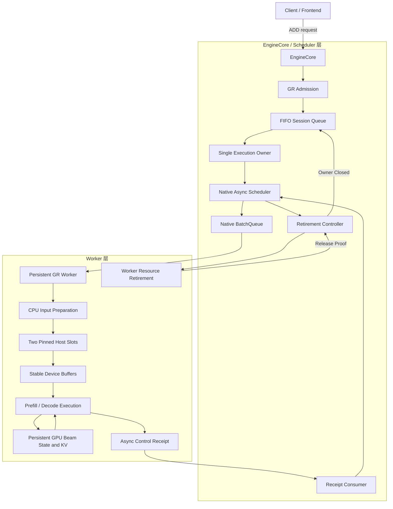
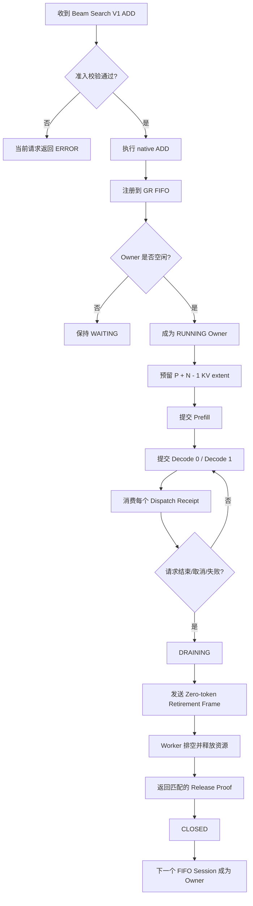
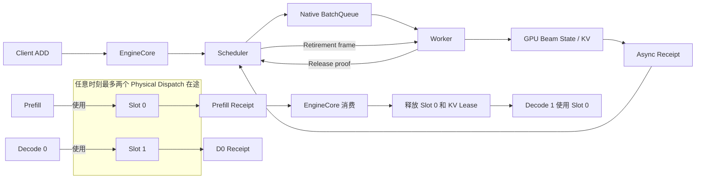
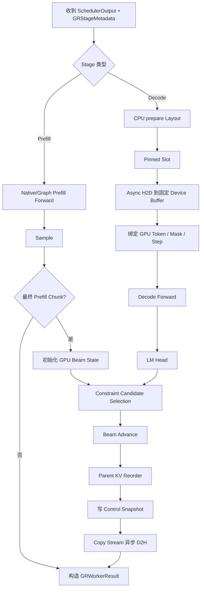
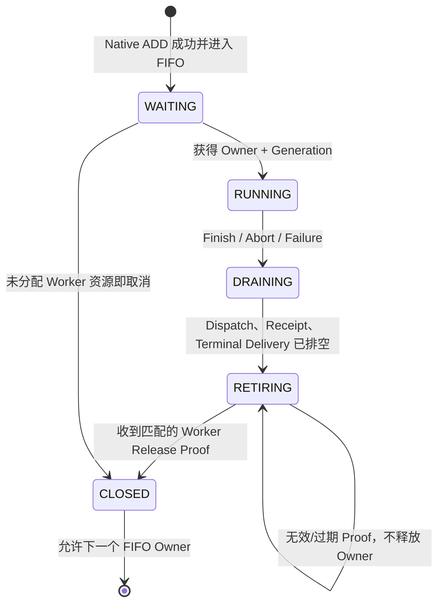
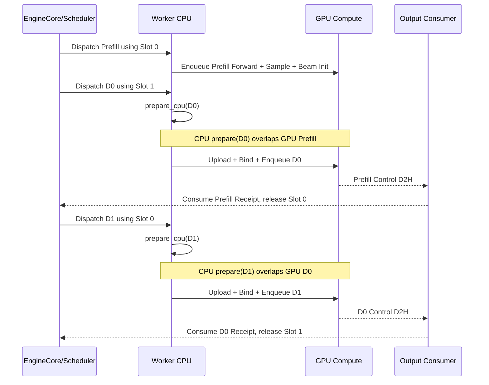
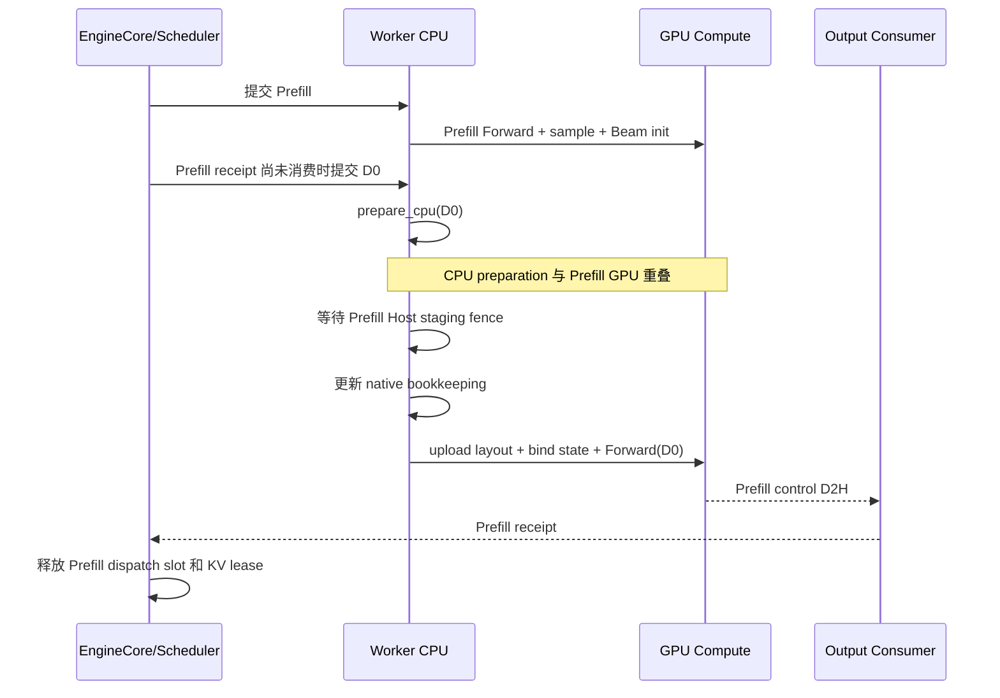
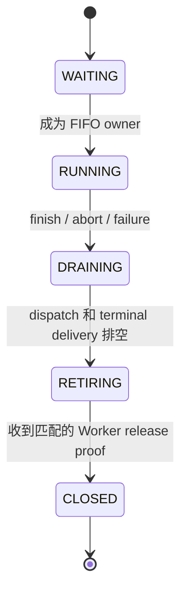

# Beam Search V1 异步调度设计方案

> 基于 PR #393，代码基线为 `decode_graph@6bca38c`，PR head 为 `ee3c712`。

## 1. 方案要解决什么问题

Beam Search V1 的一次请求包含一个 Prefill 和若干个 Decode：

```text
Prefill → Decode 0 → Decode 1
```

后一个阶段依赖前一个阶段产生的 Beam 状态，因此 GPU 计算本身必须保持顺序，不能真正并行。

异步调度要解决的是 GPU 阶段之间的 CPU 空洞：

```text
串行方式：
GPU Prefill → CPU 准备 D0 → GPU D0 → CPU 准备 D1 → GPU D1

异步方式：
GPU Prefill || CPU 准备 D0
GPU D0      || CPU 准备 D1
```

核心思想是：

1. Scheduler 允许同一个请求最多有两个 dispatch 在途。
2. Worker 在前一个 GPU 阶段运行时，提前准备下一个 Decode 的 CPU 输入。
3. Beam token、active mask、score、parent 和 KV 始终保留在 GPU，不回读到 CPU。
4. 一个请求完成后，必须由 Worker 明确证明资源已经释放，Scheduler 才能运行下一个请求。

## 2. 整体分层
## 2. 设计总览图

本节先用图展示完整设计。后续章节再分别解释 EngineCore/Scheduler 层和 Worker 层。

### 2.1 总体分层架构



分层职责：

- **EngineCore/Scheduler 层**：请求准入、FIFO owner、阶段调度、KV 生命周期、回执消费和资源退休。
- **Worker 层**：CPU 输入准备、H2D、设备状态绑定、Forward、Beam 更新、控制回执和资源释放。

### 2.2 一个请求的端到端主流程



### 2.3 Scheduler 双 Dispatch Slot 流程



整个方案分成两层：
两个 slot 表示单个 owner 的两级 look-ahead，不表示两个 session 可以并行占用共享 Beam scratch。

- **EngineCore/Scheduler 层**：负责请求准入、FIFO owner、阶段调度、KV 生命周期、回执消费和资源退休。
- **Worker 层**：负责 CPU 输入准备、H2D、设备状态绑定、Forward、Beam 更新和资源释放。
### 2.4 Worker 内部执行流水线



### 2.5 Owner 生命周期



生命周期的核心原则是：**逻辑请求结束不等于 Worker 资源已经释放。**

### 2.6 Prefill → D0 → D1 异步时序



## 3. EngineCore / Scheduler 层设计

### 3.1 请求准入

收到 Beam Search V1 请求后，Scheduler 先完成所有可预期校验：

- 必须启用 native async scheduling。
- 请求必须是 `B=1`。
- Beam width 必须等于启动时固定的 `W`。
- 有效生成长度 `N` 只能是 1、2、3。
- 不允许与普通请求或 Legacy Beam 混合。
- 不支持 LoRA、speculative decoding、量化、KV transfer 和多并行配置。
- 请求所需 KV 不能超过系统总容量。

准入顺序为：

```text
校验 GR 请求
    ↓
执行 native ADD
    ↓
native ADD 成功
    ↓
注册 GR session 到 FIFO
```

这样可以避免 native ADD 失败后，Scheduler 中残留不存在的 GR session 或 owner。

预期准入失败使用 `GRAdmissionError`。EngineCore 只让当前请求返回 ERROR，不影响正在运行的 owner。非预期内部异常仍然走 vLLM 原生 fatal failure 处理。

### 3.2 FIFO owner

系统允许多个 Beam 请求排队，但共享执行资源一次只能属于一个 session：

```text
Session A：RUNNING，当前 owner
Session B：WAITING
Session C：WAITING
```

owner 独占：

- Beam execution context；
- Beam workspace；
- selection/KV scratch；
- Decode Graph 输入 buffer；
- 两个 dispatch/control slot。

当前 owner 完成并成功退休后，FIFO 中的下一个 session 才能成为 owner。

每次分配 owner 都增加 `owner_generation`。即使复用了相同 session ID，旧请求的延迟回执也无法释放新请求资源。

### 3.3 两个 dispatch slot

每个 owner 最多允许两个 physical dispatch 在途。

例如：

```text
slot 0：Prefill 已执行，receipt 还没有被 EngineCore 消费
slot 1：Decode 0 已经提交给 Worker
```

EngineCore 消费 Prefill receipt 后，slot 0 释放，Scheduler 才能继续提交 Decode 1：

```text
T0：Prefill 使用 slot 0
T1：D0 使用 slot 1
T2：消费 Prefill receipt，释放 slot 0
T3：D1 使用 slot 0
```

两个 slot 的目的不是让两个 GPU 阶段并行，而是让后一个阶段在前一个 receipt 返回 EngineCore 之前进入 Worker，从而提前执行 CPU preparation。

### 3.4 Logical stage 与 physical dispatch

一次 logical stage 代表产生一个生成 token；一次 physical dispatch 代表一次 SchedulerOutput/Worker 调用。

普通情况下：

```text
Prefill：dispatch 0，stage 0，产生第一个 token
D0：dispatch 1，stage 1
D1：dispatch 2，stage 2
```

如果 Prefill 被 chunk：

```text
Prefill chunk 0：dispatch 0，stage 0，produced=0
Prefill chunk 1：dispatch 1，stage 0，produced=1
D0：dispatch 2，stage 1，produced=1
```

因此：

- `dispatch_id` 每次物理提交都递增。
- `stage_index` 只在真正产生 token 时递增。
- 非最终 Prefill chunk 不增加输出占位符。

### 3.5 KV 预留

Scheduler 第一次为 owner 分配 KV 时，直接预留完整生成过程需要的逻辑空间：

```text
KV extent = P + N - 1
```

其中 `P` 是 prompt 长度；Prefill 已经产生第一个 token，后面最多还有 `N-1` 个 Decode。

完整预留解决“执行到中途才发现后续 Decode 没有 KV 空间”的问题：

- 临时 KV 不足：请求等待，形成 backpressure。
- 请求永久超过总容量：准入阶段直接拒绝。
- 已经开始生成后预留容量丢失：视为内部错误。

### 3.6 Per-dispatch KV lease

完整预留保证未来容量，dispatch lease 保证已经提交的 GPU 工作安全。

每次 Scheduler 发出 physical dispatch 时，会对该 dispatch 使用的 prompt block 增加引用。只有对应 Worker receipt 被消费后才释放引用。

因此，即使 native request 因完成、取消或其他原因释放了自己的 block 引用，已经排队的 GPU 工作仍不会读到被其他请求复用的 block。

### 3.7 Scheduler 发出阶段

Scheduler 为每个 dispatch 附加 `GRStageMetadata`，包括：

- session ID 和 owner generation；
- dispatch ID 和 logical stage index；
- Prefill/Decode 类型和 decode step；
- prompt 长度和 Beam 参数；
- 输入/输出 device state reference；
- 是否产生逻辑输出。

Worker 必须在 receipt 中返回关键 identity。Scheduler 不接受缺失、错误 generation、错误 dispatch ID 或错误 stage index 的回执。

### 3.8 Scheduler 消费回执

Worker 每个 dispatch 返回：

```text
produced_token_count
finished
error_code
device_state_reference
```

Scheduler 消费回执时：

1. 校验 session、generation、dispatch 和 stage identity。
2. 从 in-flight dispatch 集合中移除该 dispatch。
3. 释放对应 KV lease。
4. 更新 logical stage 和输出占位符。
5. 如果请求结束、失败或取消，进入 `DRAINING`。

缺失 receipt 不能被当作成功，也不能靠 Scheduler 猜测 Worker 已经完成。

## 4. Worker 层设计

### 4.1 Worker 持久状态

Worker 为当前 owner 维护持久 GPU 状态：

- Beam token、active mask；
- cumulative score、parent relation；
- sequence/history；
- generated count、decode step；
- finished/error；
- Beam KV pool 和 candidate workspace。

每次 Decode 直接读取这些设备状态，不把完整 Beam 结果复制回 CPU。CPU 只接收很小的控制回执，用于告诉 Scheduler 当前 dispatch 是否产生 token、是否结束、是否出错。

### 4.2 Prefill 执行

Prefill 继续复用 native ModelRunner：

```text
native input preparation
    ↓
Prefill Forward
    ↓
LM Head / sample
    ↓
初始化 GPU Beam state
```

对于 chunked Prefill：

- 非最终 chunk 正常执行模型，但不初始化 Beam state。
- 最终 chunk 的 sampling 结果用于初始化 Beam state，并产生第一个逻辑 token。

### 4.3 Decode 输入拆分

Decode 输入被拆成两类。

#### 4.3.1 可以提前准备的 CPU layout

这些数据只依赖 Scheduler metadata 和 Host block IDs：

- positions、query offsets、sequence length；
- prefix length、prompt block table；
- logits row mapping；
- suffix lengths/offsets。

Worker 调用 `prepare_cpu()` 构造完整 layout，不读取 GPU Beam state。

例如：

```text
W = 4，P = 5，decode_step = 1
```

CPU 可以直接计算：

```text
positions       = [6, 6, 6, 6]
query           = [0, 4]
sequence        = [7]
prefix_lengths  = [5]
suffix_query    = [0, 1, 2, 3, 4]
suffix_lengths  = [2, 2, 2, 2]
suffix_offsets  = [0, 2, 4, 6, 8]
```

这些数据在前一个 GPU 阶段运行时就可以准备。

#### 4.3.2 必须等待前序 GPU 状态的 device binding

这些数据依赖前一个阶段真实产生的 Beam state：

- 下一步 input token；
- active Beam mask；
- generated count 和 decode step；
- constraint prefix；
- finished/error 状态。

layout 上传后，Worker 使用 PyTorch device tensor 操作绑定这些动态值。

假设前序 GPU state 为：

```text
tokens       = [101, 205, 88, 77]
active       = [T, T, F, T]
generated    = 2
actual_step  = 1
finished     = F
error        = 0
```

最终模型输入为：

```text
input_ids      = [101, 205, 0, 77]
positions      = [6, 6, 0, 6]
execution_mask = [T, T, F, T]
```

inactive Beam 被置为安全 dummy 输入，不能更新有效 Beam state 或 KV。

### 4.4 两个 pinned staging slot

Worker 有两个 pinned Host slot，分别对应两个在途 dispatch：

```text
CPU layout → pinned slot 0 ─┐
                            ├→ stable device storage
CPU layout → pinned slot 1 ─┘
```

每个 slot 记录对应的 session/generation/dispatch identity 和上一次 H2D completion event。

重新写入 slot 前，必须确认上一次 H2D 已完成，防止 DMA 仍在读取时 CPU 改写 pinned memory。

两个 Host slot 最终上传到同一组固定地址 device storage。固定地址是 Decode Graph 重复 replay 的前提。

### 4.5 删除 Triton `prepare_decode`

旧实现使用一个 Triton kernel 同时完成 layout 和动态 Beam state 绑定。融合度高，但所有工作都必须等待 GPU Beam state，CPU 无法提前准备。

当前实现改为：

```text
静态/结构性数据 → CPU prepare
动态 Beam 数据   → PyTorch device binding
三个控制字段     → 普通 tensor copy
```

主要收益是把 CPU preparation 移到前序 GPU 阶段期间，并去掉 Decode prepare 对 CUDA Triton kernel 的强依赖。

当前 V1 异步路径仍然要求 CUDA、CUDA event/stream 和 CUDA constraint backend，因此删除 Triton 是为 NPU 迁移消除障碍，不代表当前版本已经支持 NPU V1。

### 4.6 Decode 执行

Worker 中一次 Decode 的顺序为：

```text
prepare_cpu(next Decode)
    ↓
等待必要的 native Prefill staging fence（仅 Prefill→D0）
    ↓
更新 native Request/block bookkeeping
    ↓
异步上传 CPU layout
    ↓
绑定 GPU Beam token/mask/step
    ↓
Decode Forward
    ↓
LM Head
    ↓
Constraint candidate selection
    ↓
Beam advance
    ↓
Parent KV reorder
    ↓
生成 control receipt
```

所有 device 操作在有序 compute stream 上执行，因此 D0 不可能在 Prefill Beam state 初始化前读取状态，D1 也不可能在 D0 Beam update 前读取状态。

### 4.7 Decode Graph

Decode Graph 只捕获 Model Forward：

```text
Graph 内：Forward → hidden states
Graph 外：LM Head → candidate selection → Beam update → KV reorder
```

设计规则：

- engine 启动时 capture，请求执行期间不允许临时 capture；
- 固定 Beam width 和固定 buffer 地址；
- prompt 长度、block IDs 和 `N` 通过更新 buffer 内容变化；
- Legacy 和 V1 共用 `BeamDecodeGraph`，但使用独立 input adapter 和 buffer；
- Beam Graph registry 与普通 attention graph registry 隔离；
- V1 graph 模式 capture 失败直接报错，Legacy 可以 eager fallback。

### 4.8 Prefill Graph

V1 Prefill 复用已有 padded Prefill Graph。例如：

```text
scheduled tokens = 900
graph bucket      = 1024
```

执行时真实 attention length 仍为 900，多出的 KV slot 被 mask。

Worker 在 replay 前检查 input/position shape、adapter、slot mapping、block table、captured KV length bound 以及 graph 是否已经在启动阶段 capture。任意条件不满足都回退 native eager，不在请求期间创建新 graph。

### 4.9 Control receipt

每个 dispatch 的 control slot 只有三个 `int32`：

```text
[produced_token_count, finished_or_error, error_code]
```

例如正常产生一个 token：

```text
[1, 0, 0]
```

没有产生 token并出现 error 6：

```text
[0, 1, 6]
```

流程为：

1. compute stream 写 control tensor并记录 producer event。
2. copy stream 等待 event，异步 D2H 到 pinned control slot。
3. Executor output consumer 等待 copy 完成并构造 `GRWorkerResult`。

Worker 主执行线程不需要同步等待这 12 字节 D2H。

## 5. 关键流程一：Prefill → Decode 0



关键点：

- D0 的 CPU layout 可以在 Prefill GPU 执行期间准备。
- Prefill staging fence 只保护 native pinned Host buffer，不等待完整 Prefill GPU 结束。
- D0 的动态 token 和 mask 仍然通过 GPU stream 顺序等待 Prefill Beam init。

## 6. 关键流程二：Decode 0 → Decode 1

```text
D0 已提交到 GPU
    ↓
EngineCore 提交 D1 到另一个 slot
    ↓
Worker CPU prepare(D1)  ||  GPU 执行 D0 Forward/Beam update
    ↓
D1 upload + device binding
    ↓
GPU 按顺序执行 D1
```

D0→D1 不再需要 Prefill 特有的 Host staging fence，因为 Decode 不会重复使用 native Prefill 的 pinned input buffer。

只有前一个 receipt 被 EngineCore 消费后，Scheduler 才能继续发第三个 physical dispatch。

## 7. 关键流程三：完成与资源退休

### 7.1 为什么不能立即切换 owner

Scheduler 看到 `finished=True` 时，Worker 上可能仍然存在：

- 尚未消费的 control output；
- 已提交的 successor；
- GPU/copy stream event；
- session/context/workspace ownership；
- 后续 A5 final-output consumer 使用的 buffer。

所以“请求结果完成”和“Worker 资源释放”必须分开。

### 7.2 生命周期


完整生命周期见前文“2.5 Owner 生命周期”。这里重点说明两个边界：

- `RUNNING → DRAINING` 只表示不再产生新的有效业务阶段，已提交的 dispatch 和 terminal delivery 仍需排空。
- `RETIRING → CLOSED` 必须依赖 Worker 返回的匹配 proof，不能由 Scheduler 根据本地状态自行推断。

### 7.3 Retirement 流程

```text
Scheduler：确认 in-flight dispatch 已排空
    ↓
Scheduler：发送 zero-token retirement frame
    ↓
Worker：不执行 Forward，不执行 sampling
    ↓
Worker：等待 control consumer 和 GPU work
    ↓
Worker：释放 session/context/workspace owner
    ↓
Worker：返回 release proof
    ↓
Scheduler：校验 session_id + owner_generation + retire_id
    ↓
Scheduler：关闭旧 owner，允许 FIFO 下一个 session 运行
```

任何缺失、重复、过期或 identity 不匹配的 proof 都不能释放 owner。

## 8. Pause、取消和错误处理

### 8.1 Pause/Resume

- `keep`：排空已经提交的工作，保留未结束 session 和 KV。
- `wait`：完成当前 native running request，waiting request 保留到 resume。

terminal result 未交付、owner 处于 `DRAINING/RETIRING`、release proof 未返回或 cancel successor 未排空时，都仍然属于 cleanup work。

### 8.2 Cancel

已经提交到 Worker 的 successor 不能直接消失。它仍然返回独立 receipt，但 device binding 会看到 finished/cancelled 状态，将 execution mask 清空，避免继续修改有效 Beam state。

### 8.3 错误分类

| 错误 | 处理 |
| --- | --- |
| Beam width、模式、容量、混用等准入错误 | 只拒绝当前请求 |
| missing/malformed receipt | 当前请求失败并 drain/retire |
| device step/count mismatch | 写 device error，mask successor |
| execute/sample/CUDA 内部错误 | 进入原生 Executor failure channel |
| async D2H/output conversion 异常 | 转换为 Executor FAILURE，防止输出线程退出和 Future 永久等待 |
| retirement proof 不匹配 | 不释放 owner |

## 9. 关键设计不变量

1. 任意时刻只有一个 execution owner。
2. 一个 owner 最多两个 physical dispatch 在途。
3. CPU preparation 不读取 GPU Beam state。
4. 同一 pinned slot 在上次 H2D 完成前不能被重写。
5. 每个 dispatch 必须返回 identity 匹配的 receipt。
6. receipt 消费前不能释放该 dispatch 的 KV lease。
7. placeholder token 不能成为模型输入、prefix cache 或公开结果。
8. Decode Forward 必须排在前序 Beam update、layout upload 和 device binding 之后。
9. 请求执行期间不能临时 capture Graph。
10. 收到匹配的 Worker release proof 前不能切换 owner。

## 10. 当前支持边界

- CUDA GPU ModelRunner V1；FP16/BF16。
- `B=1`，固定 `1 <= W <= 256`，`N ∈ {1,2,3}`。
- `TP/PP/DP/DCP/PCP = 1`。
- uniform text decoder、full attention、unquantized KV。
- canonical CUDA constraint table。
- 不支持 LoRA、speculative decoding、KV transfer、量化和 microbatching。

Beam 执行模式必须在 engine 启动时显式选择：

```yaml
beam:
  execution_mode: v1
```

仅设置 `async_scheduling=True` 不会自动选择 V1。

## 11. 与 PR #386 最终输出的关系

PR #393 负责 Scheduler/Worker 的异步执行和资源退休，本身仍保留 public output readiness guard。

接入 PR #386 的 GPU final output 时：

- final-output consumer 必须先完成；
- terminal receipt 和全部 dispatch 必须排空；
- Worker retirement 必须等待 final-output consumer event；
- 最终只能由 #393 retirement proof 触发 owner 切换。

不能同时保留 #386 原有的独立 release 触发和 #393 retirement 触发，否则可能提前或重复释放资源。

## 12. 一句话总结

> EngineCore/Scheduler 通过 FIFO 单 owner、双 dispatch、完整 KV 预留和 retirement proof 控制全局生命周期；Worker 通过 CPU 提前构造 Decode layout、双 pinned slot、设备端 Beam state 绑定和启动期 Graph replay 执行阶段流水线，从而在不回读中间 Beam 状态的情况下减少阶段间 CPU 空洞，并保证资源安全交接。
