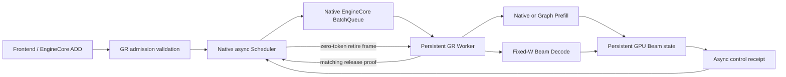
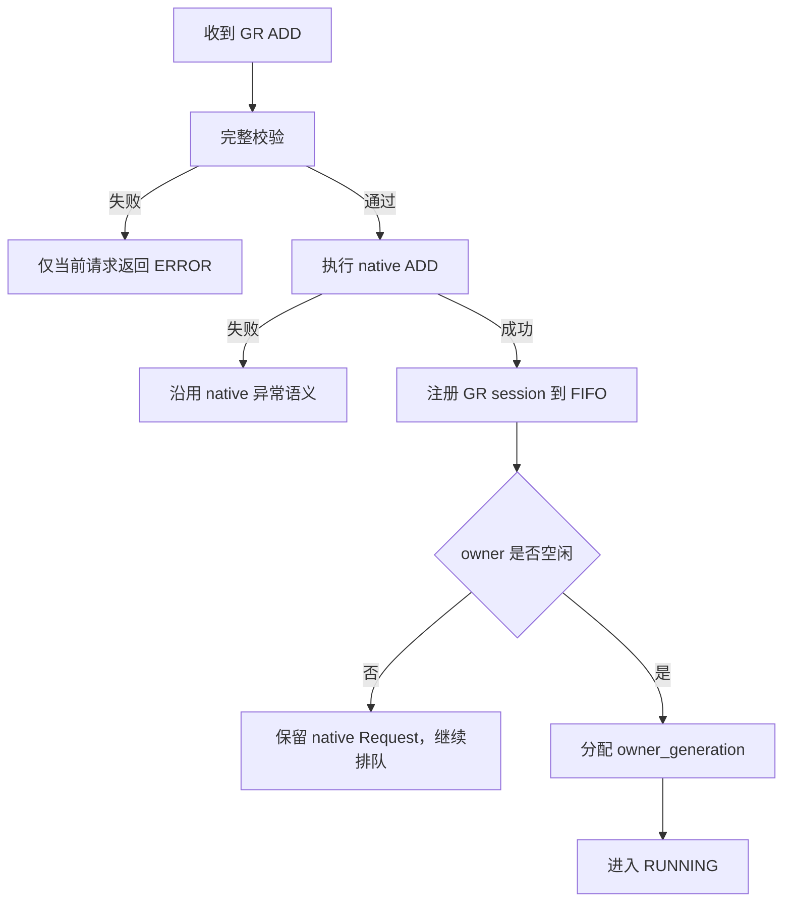
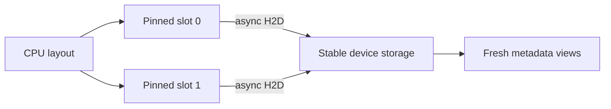
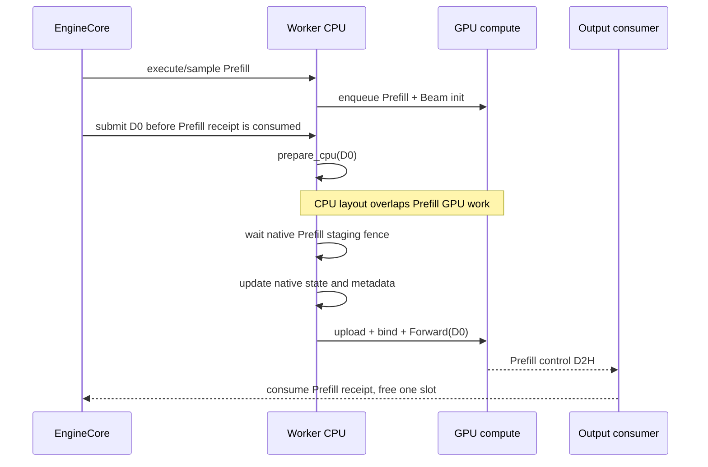
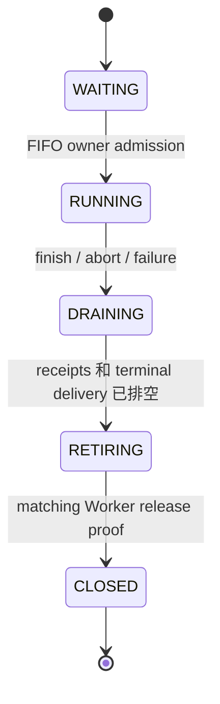

# Beam Search V1 异步调度设计方案

> 文档基线：`decode_graph@6bca38c`（已合入 A4 / PR #385）+ PR #393 `ee3c712`。  
> 本文描述 Scheduler/EngineCore/Worker 内部执行方案。PR #386 的 A5 最终结果整理与公开 API 转换属于后续集成边界，不包含在 PR #393 本身。

## 1. 文档目的

当前 Beam Search V1 已经具备持久化 GPU Beam 状态、原生 Prefill、固定宽度 Decode、异步控制回执以及 KV 生命周期保护。异步调度方案在此基础上进一步解决以下问题：

1. 让下一次 Decode 的 CPU 输入准备与前一个阶段的 GPU 计算真正重叠，减少 Prefill→Decode 和 Decode→Decode 之间的 Host bubble。
2. 在多个请求排队、两个 dispatch 在途的情况下，明确唯一执行 owner、KV 容量和共享 buffer 的所有权。
3. 将“请求已经结束”和“Worker 资源已经释放”分离，通过可验证的 retirement 协议安全交接 owner。
4. 统一 Legacy/V1 Decode Graph，实现启动期捕获、稳定地址复用，并让 V1 Prefill 复用已有 padded Graph。
5. 保持 vLLM 原生 Scheduler、BatchQueue、Executor/Future、paged KV 和错误通道，不另建一套执行引擎。

本文既可作为设计评审材料，也可作为实现讲解提纲。

## 2. 设计结论

异步调度的核心不是让有依赖关系的 Prefill、D0、D1 同时在 GPU 上计算。GPU 顺序仍然是：

```text
Prefill GPU → D0 GPU → D1 GPU
```

真正发生重叠的是：

```text
CPU prepare(D0)  ||  GPU Prefill
CPU prepare(D1)  ||  GPU D0
```

系统允许一个 Beam session 独占执行资源，并允许该 session 最多有两个 physical dispatch 在途。GPU Beam state 不回读到 CPU；CPU 只根据 Host metadata 提前构造与 Beam 结果无关的 attention layout，依赖前序结果的 token、active mask、generated count 和 decode step 在设备端按流顺序绑定。

## 3. 基线能力与本次增强

### 3.1 A4 基线已经具备的能力

A4 已经完成以下基础设施：

- 一个 native logical request 串联 Prefill 和后续 Decode stage。
- Beam token、score、parent、history、完成候选和计数器保留在 GPU。
- Decode 使用固定 `W` 个物理模型行，直接消费持久 GPU Beam state。
- 最多两个独立 control slot，每个 dispatch 异步返回 produced/finished/error 三个 `int32`。
- control D2H 使用独立 copy stream，Executor output consumer 延迟等待。
- 每个 dispatch 持有独立 KV block lease，防止尚未完成的 GPU 工作遇到 block 被复用。
- prefix cache 只缓存完整 prompt block，不缓存生成阶段的占位 token。
- 已有 Beam update、候选选择、parent KV reorder 和显式 release hook。

### 3.2 PR #393 的主要增强

| 领域 | 增强内容 |
| --- | --- |
| 输入流水线 | 删除 Triton `prepare_decode/latch_*`，改为 CPU layout、两个 pinned slot、固定 device view 和 PyTorch device binding |
| 调度准入 | FIFO owner、generation-tagged ownership、统一容量校验、完整 KV extent 预留 |
| 生命周期 | `DRAINING/RETIRING` 状态和 Worker release proof |
| Decode Graph | Legacy/V1 共用 Forward-only `BeamDecodeGraph`，Beam registry 与普通 attention graph 隔离 |
| Prefill Graph | V1 复用已有 padded Prefill Graph，并保留实时输入与 KV bound 检查 |
| 接口选择 | engine 生命周期内显式选择 `legacy` 或 `v1` |
| 可靠性 | request 级准入错误、pause/resume 清理、异步输出异常进入原生 Executor failure channel |

## 4. 术语和执行模型

| 符号/术语 | 含义 |
| --- | --- |
| `P` | Prompt token 数量 |
| `W` | 启动时固定的 Beam width |
| `N` | 有效生成预算，包含 Prefill 采样产生的第一个 token |
| logical stage | 真正产生一个输出 token 的逻辑阶段 |
| physical dispatch | 一次 native SchedulerOutput/Worker 调用；chunked Prefill 的非最终 chunk 也是 dispatch，但不产生逻辑 token |
| owner | 当前独占 Beam state、workspace、selection/KV scratch 和执行 buffer 的 session |
| receipt | Worker 返回的 per-dispatch 控制结果 |
| retirement proof | Worker 证明指定 owner 的共享资源已完成释放的结果 |

例如 `N=3`：

```text
最终 Prefill chunk：产生 token #1
D0（decode_step=0）：产生 token #2
D1（decode_step=1）：产生 token #3
```

如果 Prefill 被分成两个 chunk，则可能出现：

```text
P0：physical dispatch，produced=0
P1：physical dispatch，produced=1，完成 Beam 初始化
D0：physical dispatch，produced=1
D1：physical dispatch，produced=1
```

因此 `dispatch_id` 每次物理提交都递增，而 `stage_index` 只在产生逻辑输出时推进。

## 5. 总体架构



设计坚持以下原则：

- native Scheduler 仍负责请求选择、paged KV 和 Request 生命周期。
- native BatchQueue/Future 仍负责异步 execute/output 关联。
- Worker 只维护一个持久执行 owner，不在 Worker 内另建多步循环。
- Scheduler receipt 控制逻辑进度，GPU Beam state 控制真实模型输入。
- native placeholder token 只用于 Scheduler 记账，不能成为模型输入，也不能成为用户可见 Beam token。

## 6. 请求准入与所有权

### 6.1 准入顺序



必须先校验，再执行 native ADD；只有 native ADD 成功后才能发布 GR session。这样可以避免 Beam 参数或 native 插入失败后留下 ghost session、ghost owner 或被错误消耗的 generation number。

预期准入失败使用 `GRAdmissionError`，例如：

- 普通请求、Legacy Beam 与 V1 Beam 混用；
- 重复 request/session identity；
- Beam width 或 `N` 不符合启动容量；
- 请求所需 KV 永久超过总容量；
- runtime、模型、并行或 backend 不符合支持范围。

Multiprocess ADD consumer 只隔离 `GRAdmissionError`。其他内部异常继续进入 vLLM 原生 fatal/shutdown 通道，避免把真实引擎错误误降级成普通请求失败。

### 6.2 FIFO owner

系统可以保留多个排队 session，但一次只有一个 owner：

```text
session A：RUNNING，当前 owner
session B：WAITING
session C：WAITING
```

等待请求保留原始 native Request 对象和队列位置。Scheduler 临时使用 owner-only queue view，让 native Scheduler 只能选择当前 owner，同时不破坏原始队列。

### 6.3 两个 dispatch slot

两个 slot 允许以下合法窗口：

```text
slot 0：Prefill 已提交，receipt 尚未消费
slot 1：D0 已提交
```

或：

```text
slot 0：D0 receipt 尚未消费
slot 1：D1 已提交
```

第三次提交必须等待前面的 receipt 被消费并释放 slot。两个 slot 是单 session 的 look-ahead 深度，不代表两个 session 可以共享 scratch 并行执行。

## 7. KV 容量和 Prefix Cache

### 7.1 完整逻辑 KV 预留

第一次为 owner 分配 KV 时，通过 native `allocate_slots(num_lookahead_tokens=...)` 预留：

```text
完整 extent = P + N - 1
```

原因是 Prefill 已经覆盖 prompt，后续最多还有 `N-1` 个 Decode 位置。完整预留保证 Beam generation 开始后不会因为下一阶段容量不足而丢失已经建立的持久状态。

- 临时容量不足：请求保留并 backpressure。
- 永久超过总容量：准入阶段直接拒绝。
- generation 已开始后预留容量丢失：视为调度错误，而不是静默重试。

### 7.2 Per-dispatch KV lease

完整预留解决未来容量问题；per-dispatch lease 解决已经排队的 GPU 工作问题。每次 physical dispatch 对相关 prompt block 增加引用，直到对应 receipt 被消费才释放。

即使 native request 因完成、abort 或 preemption 释放自身引用，dispatch lease 仍可保证 Worker 尚未完成的 GPU 工作不会读取已复用的 block。

### 7.3 Prefix Cache 规则

- 只缓存完整 prompt block。
- 生成阶段的 placeholder token 不代表真实 native KV，不能公布为 prefix cache。
- block 释放保留 native group 顺序和尾到头顺序，尽量保留共享 prefix。

## 8. CPU/GPU 输入流水线

### 8.1 为什么拆分输入准备

旧实现把以下操作合并在一个 CUDA Triton `prepare_decode` kernel 中：

- 读取 Beam token、active mask、generated count 和 decode step；
- 生成 input token、position、execution mask；
- 复制 constraint prefix；
- 计算 suffix length/offset。

这种实现 CUDA 上融合度高，但可提前计算的结构信息和必须等待前序 GPU state 的动态信息混在一起，无法充分利用前序 GPU 执行时间；同时 Triton kernel 也构成 NPU 迁移障碍。

当前实现拆成两个阶段。

### 8.2 CPU layout 准备

`GRInputBuffers.prepare_cpu()` 每一步都根据 Host metadata 重建：

- positions；
- common query offsets；
- sequence length；
- prompt prefix length；
- prompt block table；
- logits row mapping；
- suffix query offsets；
- suffix lengths/offsets。

它不查询 layout cache，不读取设备，不依赖上一阶段输出。缺少 CPU mirror 或 Host block ID 时直接报错，禁止通过 D2H 偷偷补数据。

示例：`W=4, P=5, decode_step=1`：

```text
positions       = [6, 6, 6, 6]
query           = [0, 4]
sequence        = [7]
prefix_lengths  = [5]
logits          = [0, 1, 2, 3]
suffix_query    = [0, 1, 2, 3, 4]
suffix_lengths  = [2, 2, 2, 2]
suffix_offsets  = [0, 2, 4, 6, 8]
```

### 8.3 两个 pinned Host slot



每个 physical dispatch 绑定一个 slot。slot 在 output consumption 前保持所有权；同一 slot 再次写入前，还必须确认它上一次 H2D event 已完成。这同时保护：

- dispatch identity 不被覆盖；
- pinned source 不会在 DMA 尚未读取完成时被 CPU 改写。

### 8.4 Device binding

layout 上传后，`bind_device_inputs()` 在 compute stream 上读取 GPU Beam state：

- 验证 `initialized/finished/error`；
- 验证实际 decode step 和 generated count；
- 生成 execution mask；
- 绑定每个 active Beam 的 token 和 position；
- 复制 constraint prefix；
- 对 finished/error 后已经排队的 successor 做 mask；
- step 不匹配时写 device error 6。

假设设备状态为：

```text
tokens       = [101, 205, 88, 77]
active       = [T, T, F, T]
initialized  = T
finished     = F
error        = 0
count        = 2
actual_step  = 1
```

最终模型输入为：

```text
input_ids      = [101, 205, 0, 77]
positions      = [6, 6, 0, 6]
execution_mask = [T, T, F, T]
```

整个过程没有将 token、active mask 或 Beam sequence 回读到 CPU。

### 8.5 Prefill→D0 的时序



Prefill staging fence 只保护 native pinned input buffer，确保 `_update_states()` 不会过早改写仍在 H2D 的 Host 数据；它不等待整个 Prefill Forward 完成。真实 Beam state 依赖由同一 compute stream 上的 GPU 顺序保证。

## 9. Control receipt

每个 dispatch 使用一个独立 control slot，保存三个 `int32`：

```text
[produced_token_count, finished_or_error, error_code]
```

旧版 `latch_entry/latch_result` Triton kernel 被普通 PyTorch tensor 操作替代。

示例：dispatch 前 generated count 为 1，完成后为 2，无结束、无错误：

```text
control = [1, 0, 0]
```

如果未产生 token，但出现 error 6：

```text
control = [0, 1, 6]
```

控制 snapshot 由 compute stream 产生，copy stream 等待 producer event 后异步拷贝到 pinned Host slot。`AsyncGPUBeamOutput.get_output()` 只在 Executor output consumer 中等待 copy 完成，并组装普通 `ModelRunnerOutput + GRWorkerResult`。

## 10. Decode Graph 设计

### 10.1 捕获边界

当前 `BeamDecodeGraph` 只捕获 Model Forward：

```text
固定输入/Attention metadata
        ↓
Captured Forward
        ↓ hidden states
LM Head
        ↓ logits
Constraint selection
        ↓
Beam update / KV reorder
```

LM Head、constraint Top-K、Beam update 和 KV reorder 保持图外的有序 launch。

### 10.2 Legacy/V1 共用实现

- Legacy 和 V1 共用 `BeamDecodeGraph` 组件。
- 两者使用各自的输入 adapter、固定 buffer 和 engine context。
- Beam 有独立的 `CUDAGraphWrapper` registry，不允许复用同 token 数的 ordinary-attention graph。
- 非 Beam forward 委托给原 native model wrapper。

### 10.3 Capture 与复用规则

- engine startup 时 capture；请求执行过程中不得创建或 capture graph。
- V1 graph 模式下 startup capture 失败是错误。
- Legacy 保留 eager fallback。
- 固定 `W` 和地址不变时，不同 prompt length、不同 `N` 可以更新内容并复用同一个 graph。
- request ID 不是 graph 地址；兼容请求可在资源安全退休后复用 graph storage。

## 11. Prefill Graph 设计

V1 复用项目已有的 `GPUPrefillGraphRunner`，选择能够容纳当前 scheduled extent 的最小 bucket。

示例：

```text
scheduled tokens = 900
matched bucket   = 1024
```

执行时：

- Attention 保留真实长度 900；
- padded KV slot 使用无效 slot mapping 屏蔽；
- 当前 input、position、query length、sequence length 和 block table 被刷新到固定 buffer；
- 仍检查 slot mapping、输入 shape、adapter、block table 和 captured KV length bound；
- 不满足条件时回退 native eager；
- 请求执行期间不会临时创建或 capture Prefill runner。

需要特别区分两类数值比较：

1. Legacy padded Graph 与 V1 padded Graph 在相同 padded geometry 下的差异。
2. padded Graph 与 unpadded eager 因矩阵形状/BF16 rounding 产生的差异。

允许 padded replay 不等于承诺与 unpadded eager bitwise 一致。

## 12. 生命周期与 retirement proof

### 12.1 状态机



请求结果完成和共享资源释放是两个不同事件：

- terminal result 表示逻辑请求已经完成；
- retirement proof 表示 Worker 的 session、workspace、control consumer 和 GPU work 已经真正排空。

### 12.2 Zero-token retirement frame

进入 `RETIRING` 前必须满足：

- 没有 in-flight dispatch；
- terminal result 已处理；
- SchedulerOutput 没有普通 scheduled token。

Scheduler 发送携带以下信息的控制帧：

```text
GRRetireMetadata(session_id, owner_generation, retire_id)
```

Worker：

1. 等待 control consumer 排空；
2. 等待相关 GPU work/event；
3. 清除 session/context/workspace execution owner；
4. 保留兼容的固定 graph buffer 供后续请求复用；
5. 返回 `GRRetireResult(..., released=True)`。

Scheduler 只接受完全匹配的 proof。重复、延迟或属于旧 generation 的 proof 不能释放当前 owner。

## 13. Pause/Resume 与取消

| native policy | GR 行为 |
| --- | --- |
| `keep` | 排空已提交 work；保留未终止 active/waiting session 及其 KV |
| `wait` | 完成 native running request；waiting request 保留至 resume |

注意：拥有 GR 共享资源不代表请求在 pause `wait` 下可继续运行。native pause policy 决定 runnable 状态。

以下项目仍然属于必须完成的 cleanup work：

- pending terminal delivery；
- `DRAINING/RETIRING` owner；
- outstanding Worker release proof；
- cancel 后已经提交的 successor receipt。

已经取消但已提交的 successor 仍可在 GPU 上执行，不过 device binding 会 mask finished/error state，防止继续修改有效 Beam state。

## 14. 错误模型

| 错误类型 | 处理方式 |
| --- | --- |
| 预期准入错误 | 当前请求返回 native ERROR；现有 owner 和服务继续运行 |
| malformed/missing GR receipt | request-scoped worker output failure，进入 drain/retire |
| device step mismatch | 写设备错误码，successor 被 mask |
| execute/sample 内部失败 | 保留 vLLM 原生 Executor fatal failure 语义 |
| async D2H/output conversion 异常 | 在 multiprocess output consumer 中转换为 Executor FAILURE，避免死线程和永不完成的 Future |
| retirement proof 不匹配 | 不释放 owner，按 Worker protocol failure 处理 |

设计上只隔离可预期的用户/部署准入错误，不吞掉内部引擎错误。

## 15. Execution mode

Beam 接口在 engine 初始化时选择，并固定到 engine 生命周期结束：

```yaml
beam:
  execution_mode: v1
```

也可通过：

```text
beam_execution_mode="v1"
--beam-execution-mode v1
```

规则：

- 默认 `legacy`。
- `async_scheduling=True` 不自动选择 V1，因为 Legacy 也可能使用 native async scheduling。
- V1 必须启用 native async scheduling。
- frontend、EngineCore、Scheduler 和 Worker 都校验同一 mode。
- 通过错误接口提交的请求在分配 Worker 资源前拒绝。

## 16. 支持范围与非目标

### 16.1 当前支持范围

- GPU ModelRunner V1；CUDA；FP16/BF16。
- `B=1`，多个请求可排队，但只有一个 active owner。
- 固定 `1 <= W <= 256`。
- 有效 `N ∈ {1,2,3}`。
- `TP/PP/DP/DCP/PCP = 1`。
- uniform text decoder、full attention、power-of-two head size。
- uniform、unquantized KV。
- canonical CUDA constraint table。
- native Prefix Cache 和 initial chunked Prefill。

### 16.2 当前不支持

- speculative decoding；
- LoRA；
- KV/EC transfer；
- quantization；
- microbatching；
- multimodal、encoder-decoder、hybrid model；
- ordinary/Legacy request 与 V1 owner 混合；
- `B>1` 并行执行。

### 16.3 NPU 边界

删除 Triton `prepare_decode/latch_*` 后，Host layout 和 PyTorch device binding 更容易迁移到 NPU，但当前实现仍使用 CUDA event/stream、CUDA constraint backend，并显式要求 CUDA GPU ModelRunner V1。因此这次改动是移除 NPU 适配障碍，不代表已经完成 NPU V1 异步调度支持。

## 17. 与 A5 / PR #386 的集成边界

PR #393 覆盖 Scheduler/Worker 内部执行和资源退休，但仍保留 `BeamSearchOutputProcessor.ensure_available()` guard；完整 offline/online result conversion 不在该 PR 内。

接入 PR #386 的 GPU final output 时，需要遵守新的 retirement 协议：

1. 最后一次 sample 可以提前 enqueue final Top-K、lineage reconstruction 和紧凑 D2H。
2. terminal receipt 持有 final-output buffer，直到 Host consumer 完成。
3. Scheduler 只有在 terminal result 已交付、dispatch receipt 已排空后才能发送 retirement frame。
4. Worker 生成 release proof 前必须等待 final-output consumer event。
5. 不能同时保留 #386 基于 `finished_req_ids` 的独立释放触发和 #393 的 retirement 释放，否则可能重复释放或提前交接 owner。

推荐的集成关系是：

```text
#393 Scheduler/Worker/Graph/retirement
                  +
#386 final GPU compaction/public output conversion
                  ↓
完整服务端到端 Beam Search V1
```

## 18. 关键不变量

设计和代码评审应重点检查以下不变量：

1. 任意时刻最多一个 execution owner。
2. 一个 owner 最多两个 physical dispatch 在途。
3. 每个 dispatch 必须收到 identity 完全匹配的 Worker receipt。
4. 已提交 dispatch 的 KV lease 在 receipt 消费前不能释放。
5. native placeholder token 不能进入模型，也不能进入 prefix cache 或公开结果。
6. CPU preparation 不能读取 device Beam state。
7. 同一 pinned slot 在上次 H2D 完成前不能重写。
8. Device Forward 必须排在 upload、state binding 和前序 Beam update 之后。
9. V1 请求期间不得临时 capture Decode/Prefill Graph。
10. 未收到 matching retirement proof 前不能切换 owner。
11. pause/cancel/error 不能绕过 terminal delivery 和 retirement cleanup。
12. final-output consumer 未完成时不能释放其依赖的 GPU/Host buffer。

## 19. 验证重点

当前设计需要覆盖：

- FIFO owner 和第二个 slot；
- chunked Prefill 的 physical/logical 计数；
- temporary/permanent KV shortage；
- prefix-cache hit 仅复用完整 prompt block；
- successor 在 predecessor receipt 消费前提交；
- pinned slot H2D 延迟与安全复用；
- missing CPU mirror、step mismatch、partial EOS；
- cancel、延迟 receipt、重复/过期 retirement proof；
- pause `keep/wait` 与 resume；
- Decode Graph registry 隔离、稳定地址、跨 P/N 复用；
- Prefill padded bucket、实时输入刷新、KV bound 和 eager fallback；
- execute/sample/D2H/output conversion 异常通道。

PR 作者记录的验证结果为 435 passed、3 skipped，并包含 L20 OneRec BF16 检查；Wheel 构建成功。当前 PR CI 的 single-commit/pre-commit gate 失败，后续 benchmark/accuracy job 被跳过。因此这些结果应理解为作者提供的实现证据，而不是已完成的最终服务验收。

性能验收应固定模型、输入分布、`W/N`、cache 状态、dtype、executor 和 graph 配置，分别观察：

- Prefill→D0 的 CPU preparation overlap；
- D0→D1 的 CPU preparation overlap；
- Prefill Graph replay/fallback 比例；
- eager serial / eager async / graph serial / graph async；
- Worker retirement 边界延迟；
- 接入 A5 后的公开 API 端到端延迟和尾延迟。

## 20. 讲解提纲

对外讲解时可以按以下五句话展开：

1. **状态不回 Host**：Beam token、score、parent、history 和 KV 持续保留在 GPU。
2. **CPU 提前准备**：下一步 Decode 的 attention layout 在前一个 GPU 阶段运行时构造。
3. **单 owner、双 slot**：多请求 FIFO 排队，一个请求独占共享资源，最多两次 dispatch 在途。
4. **结果完成不等于资源释放**：必须经过 drain 和 Worker retirement proof 才能交接 owner。
5. **Graph 启动期捕获**：Decode 复用固定 Forward graph，Prefill 复用安全的 padded bucket，运行期不 capture。

一句话总结：

> 当前异步调度设计以 vLLM 原生队列和 paged KV 为基础，通过 Host 提前准备、设备端 Beam state 绑定、两级 look-ahead、启动期 Graph 复用和可验证的资源退休协议，在不回读中间 Beam 状态的前提下缩短阶段间 CPU bubble，并保证多请求、取消、暂停和失败场景下的资源安全。

## 21. 资料与代码入口

- [PR #385：A4 Persistent GPU Beam Worker adapter](https://github.com/JiusiServe/vllm-gr/pull/385)
- [PR #393：Async scheduler](https://github.com/JiusiServe/vllm-gr/pull/393)
- `vllm_gr/v1/engine/gr_async_scheduler.py`：owner、KV reservation、receipt、retirement。
- `vllm_gr/v1/engine/engine_core_patch.py`：ADD 错误隔离、native Scheduler 集成。
- `vllm_gr/v1/worker/gr_inputs.py`：CPU layout、pinned slot、H2D 和 device binding。
- `vllm_gr/v1/worker/gpu_beam_stage_runner.py`：Prefill/Decode 执行、control receipt 和 Worker release。
- `vllm_gr/v1/worker/beam_decode_graph.py`：Legacy/V1 共享 Decode Forward Graph。
- `vllm_gr/v1/worker/gr_startup.py`：V1 启动期 capture。
- `vllm_gr/v1/worker/gpu_model_runner_patch.py`：Prefill Graph dispatch/fallback。
- `vllm_gr/v1/worker/gr_async_output.py`：异步输出异常进入原生 failure channel。

> 说明：仓库中的部分中间文档仍描述 exact-bucket-only Prefill 或旧 Triton `prepare_decode`。本文以 PR #393 最终 head `ee3c712` 的代码和 PR 主说明为准：当前方案允许安全的 padded Prefill bucket，并已删除旧 Triton input/control-snapshot 模块。
