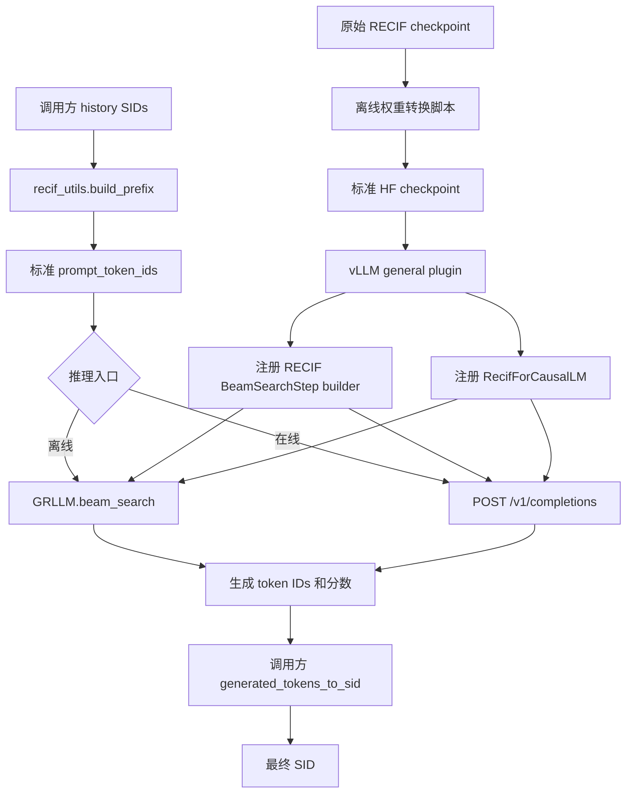
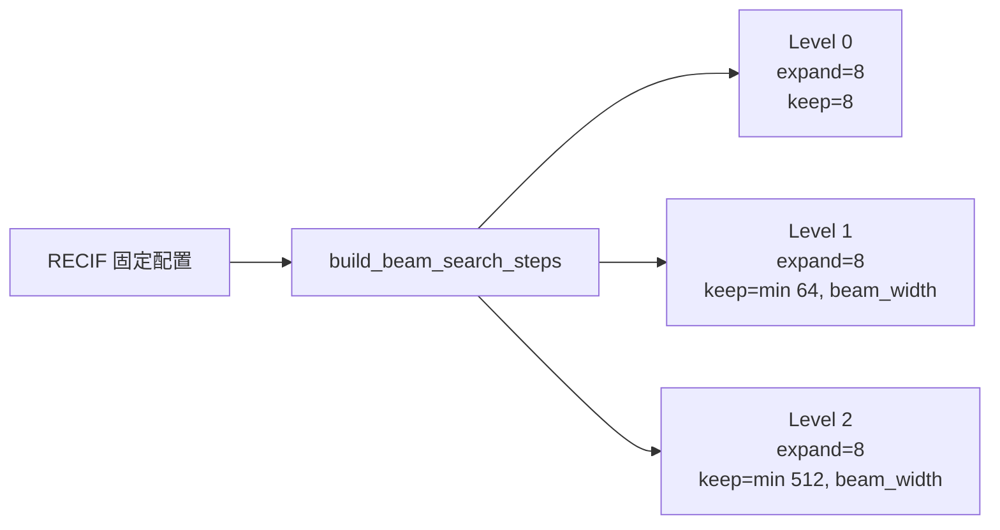
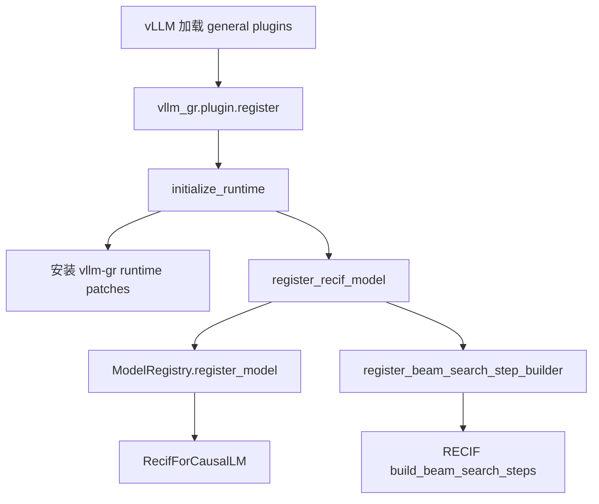
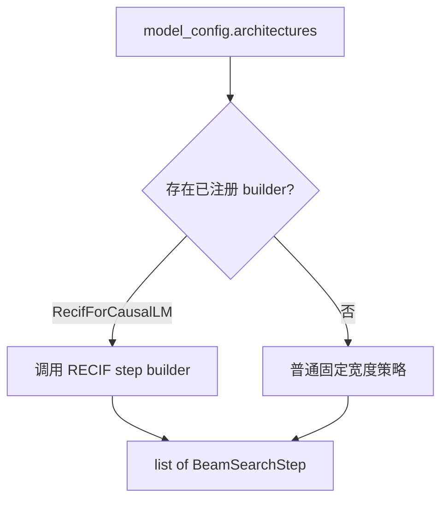
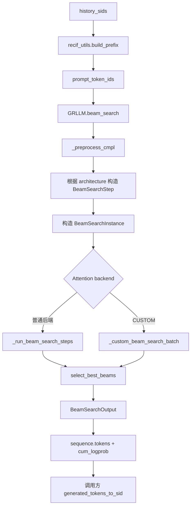
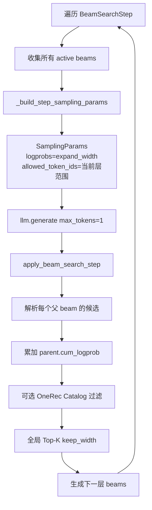
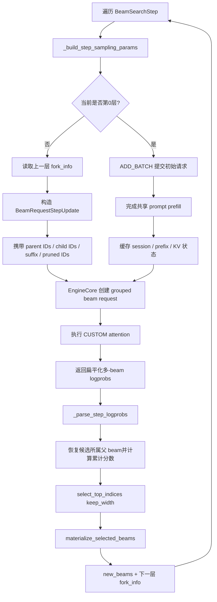
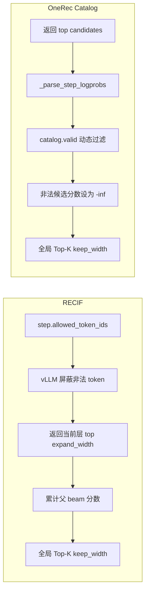
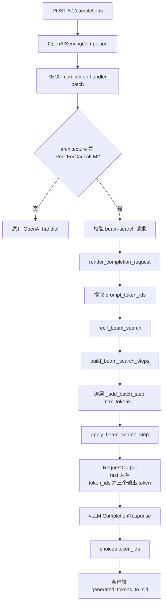
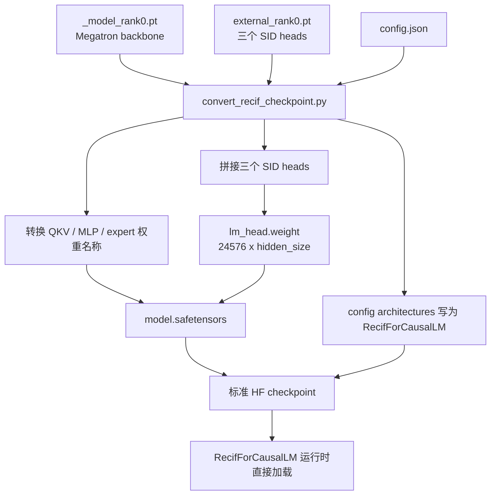

# RECIF Model and Shared Beam Search Design

## 1. 文档目的

当前改动主要解决两个问题：

1. 支持 RECIF 模型加载、离线 beam search 和在线推理。
2. 整理 `GRLLM.beam_search()`，让普通模型和 RECIF 复用公共搜索主干，
   同时让 CUSTOM 后端支持 RECIF 的分层搜索。

设计边界如下：

- vllm-gr 负责模型执行、候选计算、全局剪枝和 KV Cache 优化。
- RECIF 的层数、分支数和 token 范围属于模型内在搜索策略。
- SID 与 token ID 的转换属于调用方。
- 原始 checkpoint 转换属于部署前离线工具，不在模型加载时执行。

---

## 2. 总体架构



框架不再接收 `history_sids`，也不在输出阶段生成 SID。离线和在线的输入都已经是
标准 token IDs，最终都把生成 token IDs 交给调用方处理。

---

## 3. RECIF 强相关配置

配置按照生命周期分为四类：checkpoint 配置、模型内在策略、引擎启动配置和
单次请求配置。

### 3.1 Checkpoint 配置

这些参数位于转换后 checkpoint 的 `config.json`，在加载模型时确定。

| 参数 | RECIF 含义 | 设置时机 |
| --- | --- | --- |
| `architectures` | 必须包含 `RecifForCausalLM`，用于选择模型类和搜索策略 | 权重转换时写入 |
| `vocab_size` | 必须为 `24576`，即三个 level 各8192个 token | 模型加载时校验 |
| `tie_word_embeddings` | 必须为 `false`，三个 SID head 不与 embedding 共享 | 模型加载时校验 |
| Qwen3-MoE 结构参数 | `hidden_size`、层数、attention heads、experts 等 | 由原始模型配置提供 |

`RecifForCausalLM` 继承 vLLM 的 `Qwen3MoeForCausalLM`。运行时只校验 RECIF
必须满足的配置，不执行权重格式转换。

### 3.2 模型内在搜索策略

这些配置位于 `vllm_gr/models/recif.py`，不允许单次请求修改。

| 配置 | 当前值 | 含义 |
| --- | --- | --- |
| `VOCAB` | `8192` | 每个 SID level 的类别数 |
| `NUM_SID_LEVELS` | `3` | 固定生成三个 level |
| `FULL_VOCAB` | `24576` | 三个 level 的总词表大小 |
| `_RECIF_BRANCH_FACTORS` | `(8, 8, 8)` | 每个父 beam 每层扩展8个候选 |
| `_RECIF_ALLOWED_TOKEN_RANGES` | 三个互不重叠的8192区间 | 每层允许参与排序的 token |

三个 token 区间为：

```text
Level 0: [0, 8192)
Level 1: [8192, 16384)
Level 2: [16384, 24576)
```

`build_beam_search_steps()` 把以上模型配置转换成公共 `BeamSearchStep`。



当 `beam_width=64` 时，实际策略是：

| 层 | 父 beam 数 | 总候选数 | 保留数 |
| --- | ---: | ---: | ---: |
| Level 0 | 1 | 8 | 8 |
| Level 1 | 8 | 64 | 64 |
| Level 2 | 64 | 512 | 64 |

`branch_factors` 保留了 keyword-only 接口，供未来接入启动级配置。目前生产路径
固定使用 `(8, 8, 8)`，没有新增 CLI、`GRLLM` 或 request 参数。

### 3.3 引擎启动配置

这些参数在创建 `GRLLM` 或启动 API Server 时传入，同一模型实例内保持不变。

| 参数 | RECIF 推荐值 | 含义 |
| --- | --- | --- |
| `model` | 转换后的 `checkpoint_hf` | 标准 HF checkpoint 路径 |
| `skip_tokenizer_init` | `True` | 调用方直接传 token IDs |
| `max_logprobs` | 至少 `8` | 引擎单步允许返回的候选数上限 |
| `max_num_seqs` | 例如 `64` | 引擎调度容量，不是 RECIF 分支数 |
| `logprobs_mode` | `processed_logprobs` | 返回 token 约束处理后的分数 |
| attention backend | 默认或 `CUSTOM` | 是否启用 grouped beam/KV Cache 优化 |

这里要区分：

- `max_logprobs=8` 是引擎容量。
- `branch_factors=(8,8,8)` 是模型策略。
- `max_num_seqs=64` 是调度容量。

三者数值相关，但含义不同。

### 3.4 单次请求配置

这些参数可以在同一模型实例的不同请求之间变化。

| 参数 | 示例 | 含义 |
| --- | --- | --- |
| `beam_width` / 在线 `n` | `64` | 最终最多保留和返回多少条序列 |
| `max_tokens` | `3` | RECIF 固定生成三层，因此必须为3 |
| `temperature` | `0.0` | 当前请求的分数生成温度 |
| `ignore_eos` | `True` | 固定执行完三个 SID level |
| `return_token_ids` | 在线为 `true` | 在响应中返回 `choices[].token_ids` |

`beam_width` 不改变 `(8,8,8)`。例如 `beam_width=20` 时，三个 step 的
`keep_width` 是 `8、20、20`。

### 3.5 调用方 SID 转换

`examples/offline_inference/beam_search/recif_utils.py` 包含示例 codec：

| 函数 | 作用 |
| --- | --- |
| `sid_to_levels()` | SID 拆成三个 level |
| `levels_to_sid()` | 三个 level 恢复为 SID |
| `build_prefix()` | 历史 SID 转成 `prompt_token_ids` |
| `generated_tokens_to_sid()` | 三个输出 token 转成 SID |

这部分不在 `vllm_gr` package 内。真实调用方可以使用该实现，也可以提供自己的
tokenizer 或 codec。

---

## 4. 模型和搜索策略注册



`GRLLM.beam_search()` 不再接收：

```python
beam_search_model=BeamSearchModel.RECIF
```

它从 `model_config.architectures` 获取当前模型架构，再查询已注册的 step builder。



普通模型默认每层：

```python
BeamSearchStep(
    expand_width=beam_width,
    keep_width=beam_width,
)
```

---

## 5. 离线 beam search 调用流程

### 5.1 完整入口流程



调用方传入的是标准 vLLM token prompt：

```python
outputs = llm.beam_search(
    [{"prompt_token_ids": prompt_token_ids}],
    params,
)
```

### 5.2 普通后端流程



对于 RECIF，`allowed_token_ids` 被放进 vLLM 原生 `SamplingParams`。引擎先屏蔽
其他 level 的 token，再返回当前层 top-8，最后才执行全局 beam 剪枝。

### 5.3 CUSTOM 后端流程



CUSTOM 的主要优化是：

- 多个 beam 作为一个逻辑请求，减少通信和 scheduler 管理开销。
- 显式记录父子关系，复用共享 prefix 和父 beam KV Cache。
- 每层只返回 `step.expand_width` 个候选。
- 每层按 `step.keep_width` 剪枝，支持 RECIF 的 `8 → 64 → 64`。
- 不依赖 tokenizer，普通和 CUSTOM 后端共用相同的 SamplingParams 构造。

---

## 6. RECIF 与 OneRec 过滤和剪枝顺序



二者都是先完成约束或过滤，再做全局剪枝；区别是 RECIF 在引擎返回候选前约束，
OneRec Catalog 在候选返回后按父 beam 动态过滤。

---

## 7. 在线调用流程

RECIF 复用标准 `POST /v1/completions`，没有新增 `/v1/recif/...` 路由。



在线和离线入口不同：

- 离线使用同步 `GRLLM.beam_search()`。
- 在线使用 async engine 的 `recif_beam_search()`。

但两者复用同一个 RECIF step builder、`BeamSearchStep` 和
`apply_beam_search_step()`，并且都只输出 token IDs。

当前在线请求要求：

| 参数 | 要求 |
| --- | --- |
| `use_beam_search` | `true` |
| `max_tokens` | `3` |
| `return_token_ids` | `true` |
| `stream` | `false` |
| `echo` | `false` |

---

## 8. 权重转换与运行时加载



原始训练 checkpoint：

```text
config.json
_model_rank0.pt
external_rank0.pt
```

转换后运行时 checkpoint：

```text
config.json
model.safetensors
```

转换脚本位于 `tools/`，不属于 `vllm_gr` Python package。模型运行时不会导入
该脚本，也不会再次读取原始两份 PyTorch checkpoint。

---

## 9. 主要代码结构

```text
vllm_gr/
├── entrypoints/
│   ├── gr.py                         公共离线 beam search
│   ├── beam_search_config.py         BeamSearchStep 与策略注册表
│   └── recif/
│       ├── completion_handler.py     标准 completions 内的 RECIF 分派
│       └── serving_engine.py         RECIF async 在线编排
├── models/
│   └── recif.py                      模型类与内在搜索策略
├── beam_search_step.py               公共单层候选累计和剪枝
└── plugin.py                          模型、策略和 runtime patch 注册

examples/offline_inference/beam_search/
├── offline_recif_beam_search.py      离线示例
└── recif_utils.py                    调用方 SID codec 示例

tools/
└── convert_recif_checkpoint.py       离线权重转换

tests/
├── test_recif_model_support.py
├── test_shared_beam_step.py
└── system/
    ├── run_recif_e2e.sh
    └── verify_recif_e2e.py
```

当前已经移除：

- `ModelAdapter`、`OneRecModelAdapter` 和 `RecifModelAdapter`。
- `beam_search_model=BeamSearchModel.RECIF` 显式模型选择。
- `GRLLM.beam_search()` 中的 `history_sids` 特殊输入。
- 模型加载阶段的动态权重转换。
- vllm-gr 框架内部的 SID 编解码。

---

## 10. 本地测试方法

以下命令默认在仓库根目录执行。

### 10.1 安装环境

```bash
uv venv --seed .venv
source .venv/bin/activate
uv pip install vllm==0.22.1
VLLM_GR_TARGET_DEVICE=cuda uv pip install -e ".[dev]"
uv pip install -r requirements/recif.txt
```

NPU 环境使用：

```bash
VLLM_GR_TARGET_DEVICE=npu uv pip install -e ".[dev]" --no-build-isolation
```

### 10.2 代码检查和单元测试

```bash
pre-commit run --all-files

pytest \
  tests/test_recif_model_support.py \
  tests/test_shared_beam_step.py
```

主要覆盖：

- RECIF 三层、8/8/8 和 allowed-token 范围。
- 普通模型固定宽度回归。
- 共享 beam step 的累计分数、父 beam 归属和全局 Top-K。
- SamplingParams 携带 `expand_width` 和 `allowed_token_ids`。
- SID head 合并与错误处理。
- 示例侧 SID codec 和 prefix 构造。

### 10.3 转换 checkpoint

```bash
python tools/convert_recif_checkpoint.py \
  --input ../checkpoint \
  --output ../checkpoint_hf
```

### 10.4 离线测试

```bash
python ./examples/offline_inference/beam_search/offline_recif_beam_search.py \
  --model_path ../checkpoint_hf \
  --history 598080194427,628177754964,755993681678 \
  --beam 64
```

输出格式：

```text
rank sid cumulative_logprob
```

示例：

```text
0 755993681678 -2.9582809917628765
1 1574911709347 -4.561697155237198
2 741270118158 -4.69528728723526
```

SID 是离线示例收到生成 token 后转换得到的，不是框架内部输出的文本。

### 10.5 在线测试

启动服务：

```bash
vllm-gr serve ../checkpoint_hf \
  --host 0.0.0.0 \
  --port 8000 \
  --skip-tokenizer-init \
  --max-logprobs 8 \
  --max-num-seqs 64 \
  --logprobs-mode processed_logprobs
```

发起请求：

```bash
curl -sS -X POST http://127.0.0.1:8000/v1/completions \
  -H "Content-Type: application/json" \
  -d '{
    "prompt": [0,1915,8558,18612,0,6996,10559,18724,0,7950,13040,19200,0],
    "use_beam_search": true,
    "n": 64,
    "max_tokens": 3,
    "return_token_ids": true
  }'
```

服务返回：

```json
{
  "text": "",
  "token_ids": [1915, 8558, 18612]
}
```

调用方通过 `generated_tokens_to_sid(choice["token_ids"])` 转换最终 SID。

### 10.6 完整 E2E

E2E 接收原始 checkpoint，自动转换并执行离线、在线验证：

```bash
RECIF_MODEL_PATH=/path/to/original/checkpoint \
  bash ./tests/system/run_recif_e2e.sh
```


验证器比较前20个 SID 的集合和近似排名，允许少量相邻位置变化。

---

## 11. CI 接入

当前 GitHub Actions 使用 self-hosted runner，RECIF 原始 checkpoint 位于：

```text
/data/datasets/recif_beam_search/checkpoint
```

CI 执行：

```bash
pytest tests/test_recif_model_support.py tests/test_shared_beam_step.py

RECIF_MODEL_PATH=/data/datasets/recif_beam_search/checkpoint \
  bash ./tests/system/run_recif_e2e.sh
```

模型不提交到 GitHub，也不通过公网下载，只从 self-hosted runner 的本地目录读取。

---

## 12. 设计结论

| 组件 | 当前职责 |
| --- | --- |
| `RecifForCausalLM` | 复用 Qwen3-MoE 执行并校验 RECIF 模型配置 |
| RECIF step builder | 提供三层、8/8/8 和 allowed-token 范围 |
| `GRLLM.beam_search()` | 标准输入、实例管理和公共离线搜索编排 |
| `apply_beam_search_step()` | 累计候选分数、全局剪枝并生成下一层 beam |
| CUSTOM backend | grouped request、beam fork、KV Cache 和 attention 优化 |
| `recif_utils.py` | 调用方 SID/token 转换示例 |
| checkpoint converter | 部署前生成标准 HF checkpoint |

最终公共接口保持接近 vLLM：调用方传文本或 token IDs，框架执行 beam search 并返回
token IDs 和分数；模型特有的层次策略放在模型文件，业务 SID 语义放在调用方。
