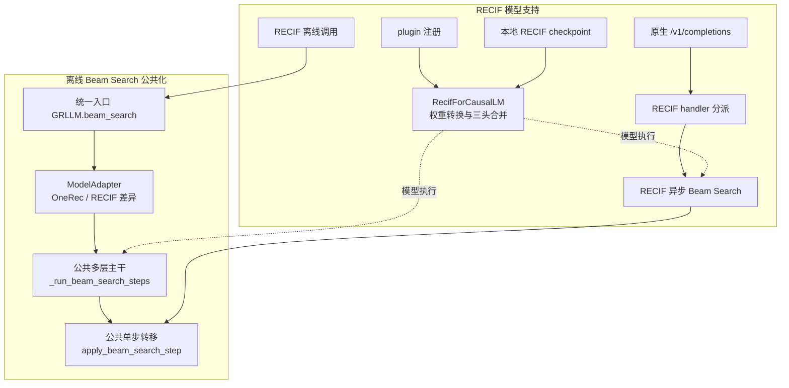
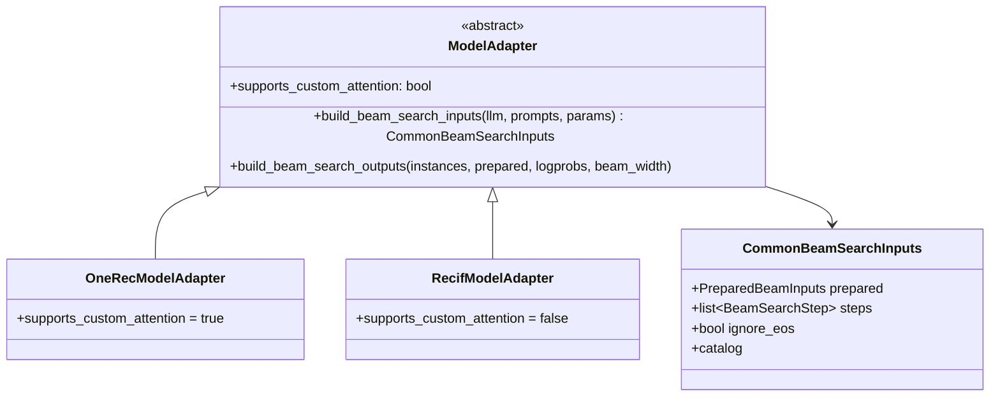
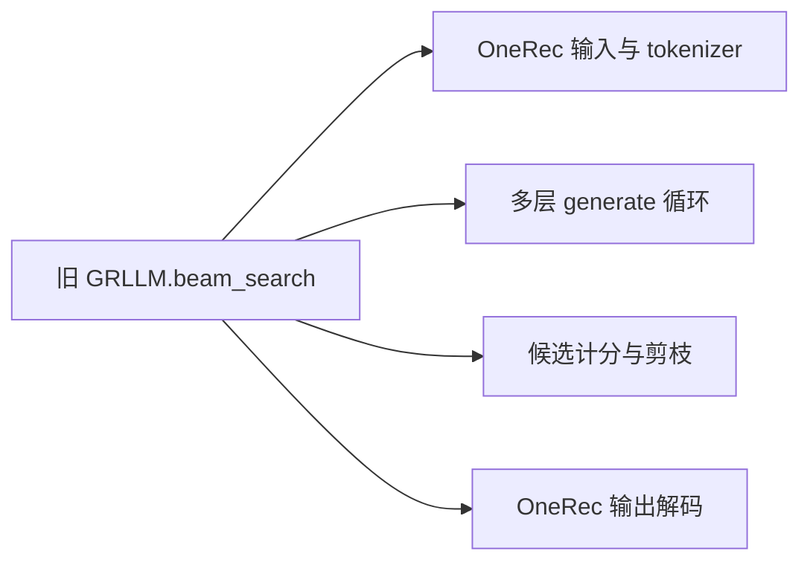
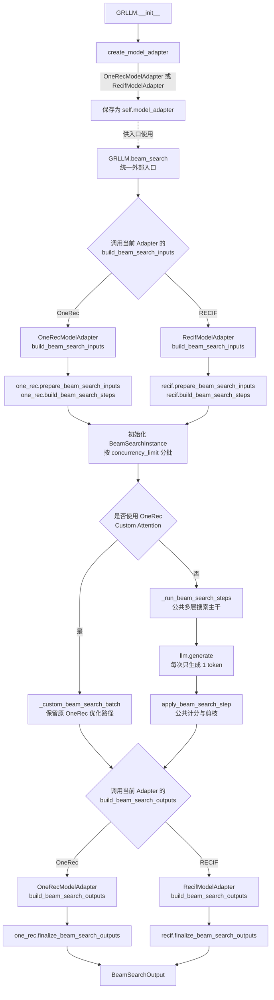
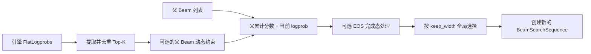
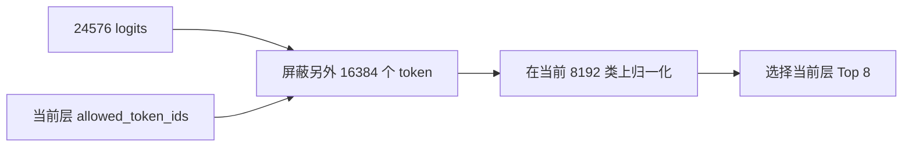
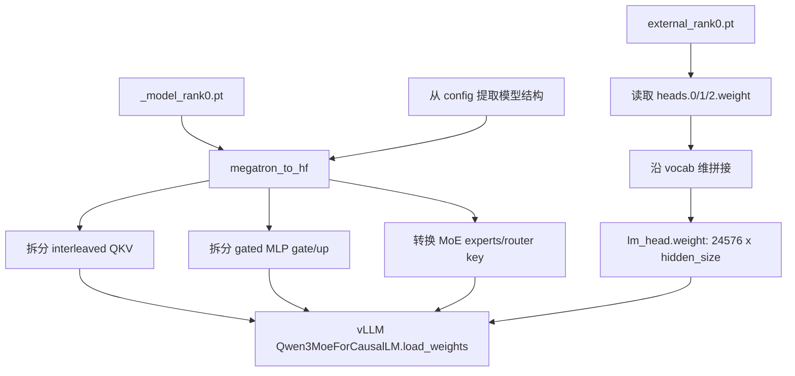
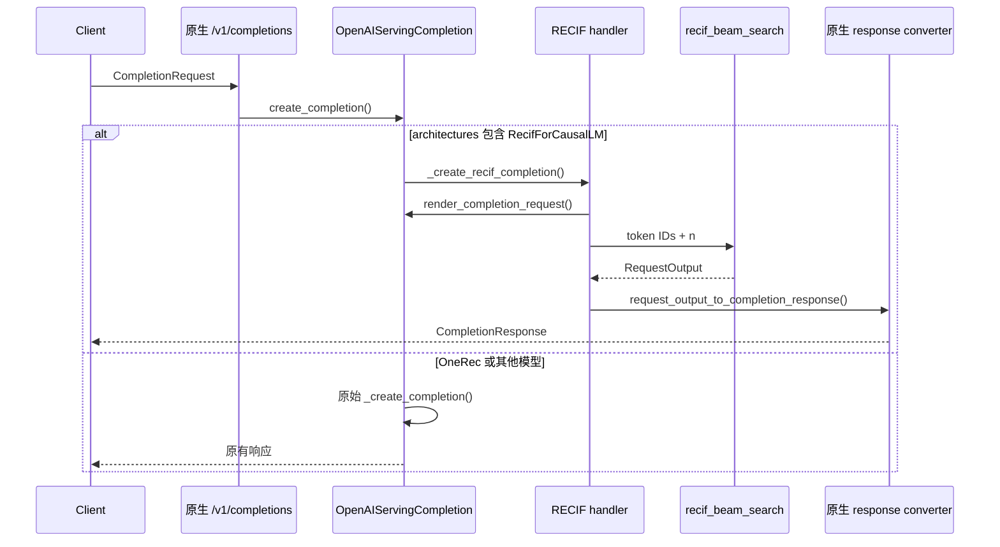
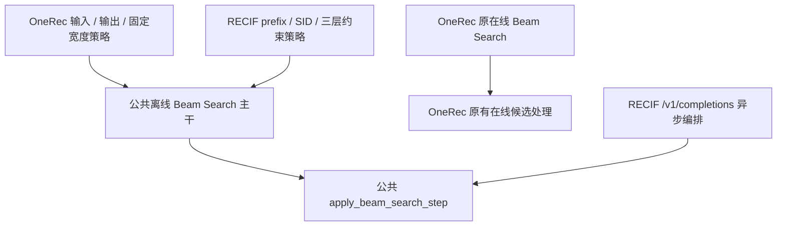

# RECIF 模型支持与离线 Beam Search 公共化设计说明

## 1. PR 概述

本 PR 主要完成两件事情：

1. 为 vllm-gr 增加 RECIF 模型支持，包括模型注册、检查点校验、Megatron
   权重转换、SID 编解码、离线推理、在线推理以及端到端测试。
2. 整理 `GRLLM.beam_search()` 的离线实现，将模型无关的搜索主干与
   OneRec、RECIF 各自的输入、分层配置和输出处理分离，使两个模型复用同一套
   Beam Search 调度与候选选择逻辑。

本次改造遵循以下原则：

- 保留 OneRec 原有行为和 Custom Attention 优化路径。
- RECIF 的层数、每层扩展数和 token 范围属于模型结构，不暴露在
  `BeamSearchParams` 中。
- RECIF 必须先通过 `allowed_token_ids` 约束当前层词表，再由引擎计算该范围内的
  processed logprobs。
- 在线服务复用 vLLM 原生 `/v1/completions` 路由、协议和响应转换，不新增专用
  HTTP 端点。
- 模型无关的一步 Beam 转移同时被离线和 RECIF 在线推理复用。

## 2. 总体架构

总体架构对应本 PR 的两个目标：第一部分是离线 Beam Search 公共化，第二部分是
RECIF 从模型加载到离线、在线推理的完整接入。



图中需要关注四个边界：

- `GRLLM.beam_search()` 是 OneRec 和 RECIF 的统一离线入口。
- `ModelAdapter` 只处理搜索前后的模型差异，公共主干不判断模型类型。
- RECIF 在线请求复用原生 `/v1/completions`，不会增加新的 HTTP 路由。
- 离线普通路径和 RECIF 在线路径复用 `apply_beam_search_step()` 的候选选择逻辑。

## 3. 离线 Beam Search 公共化

### 3.1 改造前的问题

原来的 `GRLLM.beam_search()` 同时负责：

- tokenizer 和特殊 token 处理；
- prompt 预处理；
- Beam 实例初始化；
- 每一步调用 `generate()`；
- catalog 约束；
- EOS 处理；
- 候选排序与剪枝；
- 最终文本解码。

这些逻辑直接围绕 OneRec 编写，RECIF 存在以下差异，无法直接复用：

- RECIF 不使用 tokenizer，而是直接接收 SID 历史。
- RECIF 固定生成三个层级 token。
- 每层只扩展 8 个候选，但全局最多保留 `beam_width` 个 Beam。
- 每层使用不同的词表区间。
- 输出需要从三个 token 还原为一个 int64 SID，而不是 tokenizer decode。

### 3.2 公共数据结构

`vllm_gr/entrypoints/beam_search_config.py` 增加三个核心结构。

#### `BeamSearchModel`

用于在构造 `GRLLM` 时选择模型策略：

```python
class BeamSearchModel(StrEnum):
    ONE_REC = "one_rec"
    RECIF = "recif"
```

#### `BeamSearchStep`

描述某一层搜索策略：

```python
@dataclass(frozen=True)
class BeamSearchStep:
    expand_width: int
    keep_width: int
    allowed_token_ids: list[int] | None = None
```

字段含义：

| 字段 | 作用 |
| --- | --- |
| `expand_width` | 每个父 Beam 请求多少个候选 logprobs |
| `keep_width` | 当前层全局剪枝后保留多少个 Beam |
| `allowed_token_ids` | 引擎计算 logprobs 前允许参与当前层计算的 token |

这里将“扩展宽度”和“保留宽度”分开，是 RECIF 能够表达 `8, 8, 8` 分层扩展、
最终保留 64 个结果的关键。

#### `PreparedBeamInputs`

统一保存已经转换成 vLLM engine input 的 prompt，以及输出切片和模型相关状态：

- `engine_inputs`：传给 vLLM 的输入；
- `generated_starts`：Beam 搜索生成部分在 token 序列中的起点；
- `output_starts`：最终输出切片起点；
- `prompt_texts`：OneRec 最终拼接输出时使用；
- `tokenizer`、`begin_token_id`、`end_token_id`：OneRec 可选状态。

### 3.3 ModelAdapter 边界



Adapter 只抽取公共主干真正需要的两类差异：

1. 搜索前：把调用者输入转换成公共输入，并提供逐层搜索策略。
2. 搜索后：把公共 Beam 状态转换成模型最终输出。

约束本身仍保留在各模型文件中，没有继续拆成大量细粒度策略类。

### 3.4 `GRLLM.beam_search()` 调用流程

改造前，输入处理、搜索循环、候选剪枝和输出解码全部写在一个
`GRLLM.beam_search()` 中：



改造后，调用关系变为下面这棵函数调用树：



按照实际执行顺序，可以归纳为四步：

1. `GRLLM.__init__()` 根据 `beam_search_model` 创建
   `OneRecModelAdapter` 或 `RecifModelAdapter`。
2. 外部统一调用 `GRLLM.beam_search()`，入口首先调用当前 Adapter 的
   `build_beam_search_inputs()`：
   - OneRec Adapter 调用 `models/one_rec.py` 的输入准备和固定宽度步骤函数；
   - RECIF Adapter 调用 `models/recif.py` 的 prefix 准备和三层步骤函数。
3. `GRLLM.beam_search()` 初始化 Beam 后进入搜索：
   - OneRec 且 Custom Attention 可用时保留 `_custom_beam_search_batch()`；
   - 其他情况调用新抽出的 `_run_beam_search_steps()`；
   - `_run_beam_search_steps()` 每层调用一次 `llm.generate()`，随后调用
     `apply_beam_search_step()` 完成公共候选计分和剪枝。
4. 搜索完成后，入口调用 Adapter 的 `build_beam_search_outputs()`，再分别进入
   OneRec 或 RECIF 的 `finalize_beam_search_outputs()`。

因此，`GRLLM.beam_search()` 现在只保留公共控制流程：

- 调用 Adapter 准备输入和分层配置；
- 创建 `BeamSearchInstance`；
- 处理并发批次；
- 选择 Custom Attention 或普通 `LLM.generate()` 路径；
- 调用 Adapter 构建最终输出。

### 3.5 公共多步循环 `_run_beam_search_steps()`

每个 `BeamSearchStep` 的执行过程如下：

1. 汇总当前批次所有实例的 active beams。
2. 记录每个实例在扁平 Beam 数组中的区间。
3. 创建一步 `SamplingParams`：
   - `max_tokens=1`；
   - `logprobs=step.expand_width`；
   - `allowed_token_ids=step.allowed_token_ids`；
   - `detokenize=False`；
   - `flat_logprobs=True`。
4. 对所有父 Beam 批量调用 `LLM.generate()`。
5. OneRec 存在 catalog 时，为每个父 Beam 计算动态允许集合。
6. 调用 `apply_beam_search_step()` 完成一次公共状态转移。

### 3.6 公共单步转移 `apply_beam_search_step()`



该函数复用已有的 `beam_search_decision_utils`：

- `extract_and_dedup_flat_logprobs()`；
- `complete_eos_candidates()`；
- `select_top_indices()`；
- `materialize_selected_beams()`。

返回值 `BeamSearchStepResult` 只包含：

- `active`：进入下一层的 Beam；
- `completed`：因 stop/EOS 已完成的 Beam。

## 4. OneRec 行为保持

OneRec 的模型差异被移动到 `vllm_gr/models/one_rec.py`，而不是改变其语义。

### 输入

- 继续通过 tokenizer 处理文本或 token prompt。
- 继续支持 `begin_token` 和 `end_token`。
- 继续缓存 prompt 文本，最终使用 tokenizer decode。

### 分层策略

OneRec 每一步仍然是固定宽度：

```python
BeamSearchStep(
    expand_width=beam_width,
    keep_width=beam_width,
)
```

### 约束和优化路径

- catalog 约束仍按父 Beam 动态计算，并在候选选择阶段屏蔽非法 token。
- 当后端为 Custom Attention 时，仍走原有 `_custom_beam_search_batch()`。
- OneRec 在线逻辑仍由已有 `OpenAIServing.beam_search()` 补丁处理，本 PR 的 RECIF
  completion 分派不会覆盖它。

## 5. RECIF 模型结构

### 5.1 SID 表示

一个 int64 SID 被拆成三个取值范围为 `[0, 8191]` 的分量：

```text
sid = sa | (sb << 14) | (sc << 28)
```

模型词表被划分为三个不重叠区间：

| 层级 | 原始分量 | 模型 token 区间 |
| --- | --- | --- |
| level 0 | `sa` | `[0, 8192)` |
| level 1 | `sb` | `[8192, 16384)`，token 为 `sb + 8192` |
| level 2 | `sc` | `[16384, 24576)`，token 为 `sc + 16384` |

因此完整模型词表大小为：

```text
FULL_VOCAB = 3 * 8192 = 24576
```

### 5.2 历史 prefix

每个历史 item 编码为四个 token：

```text
[context=0, sa, sb + 8192, sc + 16384]
```

在历史末尾追加一个目标 context token `0`：

```text
[history item 1] [history item 2] ... [0]
```

离线调用者只提供 `history_sids`，`RecifModelAdapter` 内部调用 `build_prefix()`，无需
调用者了解 token 区间。

### 5.3 模型内置分层搜索配置

RECIF 将以下配置保留在 `vllm_gr/models/recif.py`：

```python
_RECIF_BRANCH_FACTORS = (8, 8, 8)
NUM_SID_LEVELS = 3
```

当全局 `beam_width=64` 时：

| 层级 | 父 Beam 数 | 每个父 Beam 扩展 | 候选总数 | 剪枝后保留 |
| --- | ---: | ---: | ---: | ---: |
| level 0 | 1 | 8 | 8 | 8 |
| level 1 | 8 | 8 | 64 | 64 |
| level 2 | 64 | 8 | 512 | 64 |

也就是每层保留：

```text
min(当前全部候选数, beam_width)
```

`branch_factors`、层数和 allowed-token 范围不再由调用者通过
`BeamSearchParams` 传入，避免把模型结构泄漏到公共接口。

### 5.4 为什么 allowed token 必须在引擎计分前生效

RECIF 每一层对应一个独立的 8192 类输出头。三个头在 vLLM 中合并为一个
24576 类 `lm_head` 后，必须先屏蔽其他两层 token，再计算 processed logprobs。



因此 RECIF 使用：

```python
SamplingParams(
    allowed_token_ids=step.allowed_token_ids,
    logprobs=8,
)
```

该约束发生在引擎 logits processor 阶段。公共 `apply_beam_search_step()` 收到的已经
是当前层范围内的分数。OneRec 的动态 catalog 约束则仍可在引擎返回候选后按父 Beam
处理，两者最终复用相同的全局排序和剪枝函数。

## 6. RECIF 检查点与权重转换

### 6.1 检查点布局

RECIF 当前仅支持本地目录，不直接支持 Hugging Face model ID。目录必须包含：

```text
checkpoint/
├── config.json
├── _model_rank0.pt
└── external_rank0.pt
```

- `_model_rank0.pt`：Megatron 格式的 headless Qwen3-MoE backbone。
- `external_rank0.pt`：三个独立的 SID heads，位于 `lm_heads` mapping 中。

`validate_recif_checkpoint()` 在模型构造开始时检查本地目录和必要文件，避免模型
初始化到中途才因缺失权重失败。

### 6.2 模型继承与注册

`RecifForCausalLM` 继承 vLLM 原生 `Qwen3MoeForCausalLM`：

- Paged Attention、KV Cache、Tensor Parallel 和 fused MoE 继续使用 vLLM 实现。
- RECIF 只负责检查配置、转换 backbone 权重并合并输出头。
- 要求 `vocab_size=24576`。
- 要求 `tie_word_embeddings=false`，因为三个 SID head 独立于输入 embedding。

`plugin.py` 在运行时调用 `register_recif_model()`：

```text
RecifForCausalLM -> vllm_gr.models.recif:RecifForCausalLM
```

### 6.3 权重转换流程



`prepare_vllm_weights()` 还处理以下错误：

- `lm_heads` 不是 mapping；
- head value 不是 tensor；
- 三个 head 任意一个缺失；
- head shape 不是 `[8192, hidden_size]`；
- 同时存在合并后的 `lm_head.weight` 和独立 heads；
- 既没有合并 head，也没有独立 heads。

## 7. RECIF 离线推理

离线示例位于：

```text
examples/offline_inference/beam_search/offline_recif_beam_search.py
```

调用方式：

```bash
python ./examples/offline_inference/beam_search/offline_recif_beam_search.py \
  --model_path /path/to/checkpoint \
  --history 598080194427,628177754964,755993681678 \
  --beam 64
```

关键初始化参数：

```python
GRLLM(
    model=model_path,
    beam_search_model=BeamSearchModel.RECIF,
    max_logprobs=8,
    skip_tokenizer_init=True,
    max_num_seqs=beam_width,
    logprobs_mode="processed_logprobs",
)
```

调用者只提供历史 SID 和最终 `beam_width`，RECIF Adapter 自动完成 prefix、三层步骤
和 SID 输出还原。

## 8. RECIF 在线推理

### 8.1 路由设计

RECIF 不再注册 `/v1/recif/beam_search`，也不抢先注册另一个同路径路由，而是复用：

```text
POST /v1/completions
```

`plugin.py` 仅给 vLLM 原生 `OpenAIServingCompletion._create_completion()` 安装一个
模型分派：



这样可以复用 vLLM 的：

- FastAPI 路由；
- `CompletionRequest` 参数解析；
- 模型名称校验；
- request ID 和 metadata；
- LoRA、trace headers、priority 和 data-parallel rank 获取；
- `RequestOutput -> CompletionResponse` 转换；
- usage 统计。

### 8.2 在线请求约束

当前 RECIF 在线请求要求：

- `use_beam_search=true`；
- `stream=false`；
- `max_tokens=3`；
- `echo=false`；
- 暂不支持 completion logprobs 返回；
- 每个 HTTP 请求只接受一个 token-ID prompt；
- `n` 表示最终返回数量，不强制为 64。

请求示例：

```json
{
  "model": "/path/to/recif-checkpoint",
  "prompt": [0, 1, 8194, 16387, 0],
  "use_beam_search": true,
  "n": 64,
  "max_tokens": 3
}
```

### 8.3 异步搜索编排

`entrypoints/recif/serving_engine.py`：

1. 校验 prompt 是否符合 `[0, sa, sb+8192, sc+16384] * N + [0]`。
2. 调用模型的 `build_beam_search_steps(beam_width)`。
3. 每层构造带 `allowed_token_ids` 的 `SamplingParams`。
4. 复用现有在线 `_add_batch_step()` 向异步引擎发送请求。
5. 复用公共 `apply_beam_search_step()` 做候选选择。
6. 将三个生成 token 还原为 SID。
7. 返回 vLLM 原生 `RequestOutput` 和 `CompletionOutput`。

在线和离线没有强行共享同步/异步引擎编排，但共享以下模型语义：

- `BeamSearchStep`；
- RECIF 的三层搜索配置；
- `apply_beam_search_step()`；
- SID 编解码。

## 9. 测试与 CI

### 9.1 单元测试

`tests/test_recif_model_support.py` 覆盖：

- SID encode/decode round trip；
- prefix 构造及三层 offset；
- 在线 token prompt 格式校验；
- RECIF 固定 `8, 8, 8` 分层策略；
- OneRec 固定宽度回归；
- completion handler 只对 RECIF 架构分派；
- 本地检查点文件校验；
- 模型 config 必要字段校验；
- 三个 SID head 合并；
- 缺失 head、错误 shape 和重复 lm_head 错误处理。

`tests/test_shared_beam_step.py` 覆盖：

- 多个父 Beam 的候选全局排序；
- 父 Beam 动态 token 约束；
- engine outputs 数量错误；
- 缺少 logprobs 的错误处理。

### 9.2 模型 E2E

`tests/system/run_recif_e2e.sh` 执行：

1. 检查模型目录与三个必要文件。
2. 执行离线 RECIF Beam Search。
3. 验证离线输出。
4. 启动 tokenizer-free `vllm-gr serve`。
5. 等待 `/health` 就绪。
6. 调用原生 `/v1/completions`。
7. 验证在线输出。
8. 退出时停止服务并清理临时目录。

`verify_recif_e2e.py` 的判定规则：

- 必须返回 64 个 SID；
- 前 20 个 SID 集合必须一致；
- 每个预期 SID 的名次漂移不能超过 2；
- 不使用浮点累计分数作为门禁判定，减少硬件数值差异导致的误报。

### 9.3 CI 接入

`.github/workflows/pre-commit.yml` 增加两个步骤：

1. 运行 RECIF 与公共 Beam Step 单元测试。
2. 使用 self-hosted Runner 上的固定模型目录执行离线和在线 E2E。

当前门禁模型路径为：

```text
/data/datasets/recif_beam_search/checkpoint
```

工作流会先检查 `config.json`、`_model_rank0.pt` 和 `external_rank0.pt`，然后安装
`requirements/recif.txt` 并执行系统测试。权重不进入 Git 仓库，也不需要在 PR 中
配置 SSH 凭据。

## 10. 代码结构

代码按职责分为五部分：

| 模块 | 主要文件 | 职责 |
| --- | --- | --- |
| 离线入口 | `entrypoints/gr.py` | Beam 实例初始化、分批和多层搜索编排 |
| 公共搜索 | `beam_search_config.py`、`beam_search_step.py` | 分层配置和单步候选选择 |
| 模型策略 | `models/model_adapter.py`、`models/one_rec.py` | 隔离 OneRec/RECIF 离线差异 |
| RECIF 模型 | `models/recif.py` | 权重转换、SID、prefix 和三层约束 |
| RECIF 在线 | `entrypoints/recif/` | 原生 completion 分派及异步搜索 |
| 测试门禁 | `tests/`、`.github/workflows/pre-commit.yml` | 单测、离线/在线 E2E 和 CI |

原先 RECIF 专用的 `api_router.py` 和 `protocol.py` 已删除，在线请求统一复用 vLLM
原生 `/v1/completions` 路由与协议。

## 11. 文件变更说明

| 文件 | 作用 |
| --- | --- |
| `vllm_gr/entrypoints/gr.py` | 将离线 Beam Search 改为 Adapter + 公共步骤主干 |
| `vllm_gr/entrypoints/beam_search_config.py` | 新增公共模型枚举、步骤配置和输入状态 |
| `vllm_gr/beam_search_step.py` | 新增模型无关的单步 Beam 转移 |
| `vllm_gr/models/model_adapter.py` | 定义 OneRec/RECIF 离线适配边界 |
| `vllm_gr/models/one_rec.py` | 承接原来位于 `gr.py` 的 OneRec 输入输出逻辑 |
| `vllm_gr/models/recif.py` | RECIF 模型、权重转换、SID 和搜索策略 |
| `vllm_gr/entrypoints/recif/completion_handler.py` | 原生 completion handler 内的 RECIF 分派 |
| `vllm_gr/entrypoints/recif/serving_engine.py` | RECIF 异步在线 Beam Search |
| `vllm_gr/entrypoints/recif/__init__.py` | 显式声明 RECIF package |
| `vllm_gr/plugin.py` | 注册模型并安装在线 handler 分派 |
| `examples/.../offline_recif_beam_search.py` | 离线调用示例 |
| `requirements/recif.txt` | RECIF 依赖版本 |
| `requirements/cuda.txt` | CUDA 安装链引入 RECIF 依赖 |
| `README.md` | 说明本地检查点限制 |
| `examples/.../README.md` | 离线与在线使用说明 |
| `tests/test_recif_model_support.py` | RECIF 与 OneRec 回归单测 |
| `tests/test_shared_beam_step.py` | 公共候选选择单测 |
| `tests/system/run_recif_e2e.sh` | 离线/在线模型 E2E 编排 |
| `tests/system/verify_recif_e2e.py` | SID 数量和排序验证 |
| `.github/workflows/pre-commit.yml` | 将单测和模型 E2E 接入门禁 |

## 12. 兼容性与限制

- `beam_search_model` 默认仍是 `BeamSearchModel.ONE_REC`，现有离线调用不需要修改。
- OneRec 的 Custom Attention、catalog、begin/end token 和在线 Beam Search 保持原路径。
- RECIF 当前只支持本地检查点目录。
- RECIF 当前固定三个 SID 层级，每层扩展数固定为 8。
- RECIF 在线不支持 streaming、echo 和 completion logprobs。
- RECIF 在线当前只支持单个 token-ID prompt，不支持一个请求内批量 prompts。
- 在线与离线共享候选选择和模型分层配置，但分别保留异步和同步引擎编排，以避免
  为追求形式统一而引入额外抽象。

## 13. 最终效果

改造后，公共离线 Beam Search 不再了解 RECIF 的 8192 词表分段，也不直接处理
OneRec tokenizer；它只消费统一的 `PreparedBeamInputs` 和 `BeamSearchStep`。

RECIF 的模型固有信息集中在模型模块中：

```text
层数 = 3
每层扩展 = 8
每层 allowed-token 范围 = 模型词表的对应 8192 区间
```

OneRec 与 RECIF 的关系最终变为：



其中 OneRec 在线路径主要继续使用已有在线实现；RECIF 在线明确复用了公共单步转移。
整体实现既复用了关键搜索逻辑，也保留了两个模型各自必要的输入、约束、引擎调用和
输出差异。
