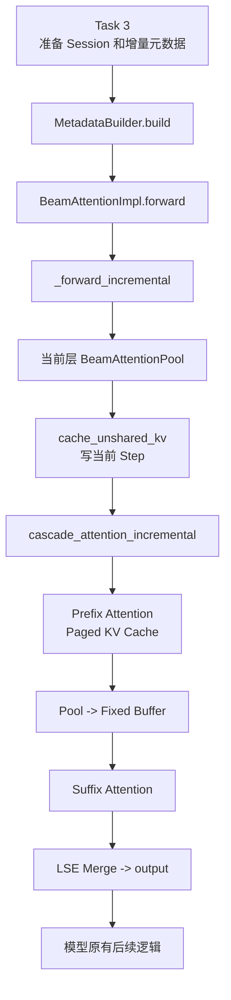
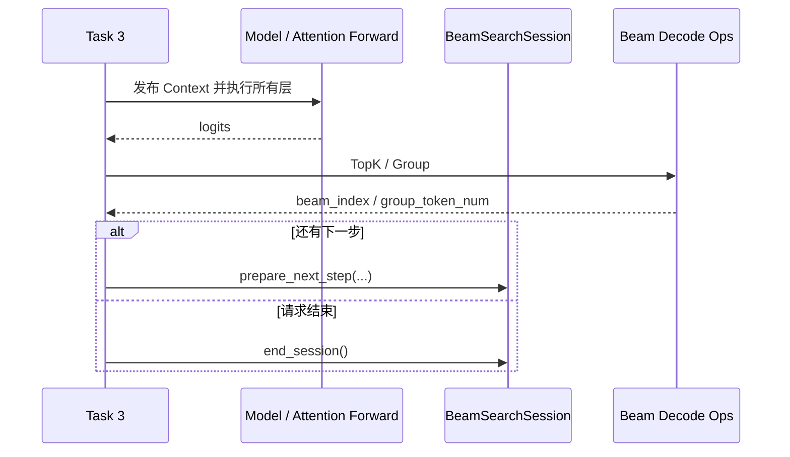

# [RFC][Task 2] 增量 Beam Attention 计算路径

- 代码基线：`decode_graph@1a8320a`
- 范围：Beam Attention Backend
- 状态：核心代码已完成，等待 Task 3 端到端接入

## 1. 简介

Task 2 没有修改完整 Transformer，只是在现有 `BeamAttentionImpl.forward()` 中增加了一条 Incremental 路径。

Legacy 路径继续使用 Paged KV Cache 和 `extract_suffix_kv()`。Incremental 路径改为：

1. 将当前 Step 的 Unshared K/V 写入 Task 1 提供的当前层 Pool；
2. 使用原有 Paged KV Cache 计算共享 Prefix Attention；
3. 将 Pool 中的有效 Suffix K/V 复制到 Session 预分配的连续 Buffer；
4. 计算 Suffix Attention；
5. 使用 LSE Merge 合并两段 Attention 结果。

Attention 返回后，模型继续执行原有的输出投影、残差、Norm、MLP 和后续层，Task 2 不修改这些逻辑。

## 2. 代码改动

### `beam_attn_metadata.py`

`BeamAttentionMetadata` 新增：

```python
is_incremental_decode: bool = False
incremental_beam_width: int = 0
incremental_suffix_kv_len: int = 0
beam_session: BeamSearchSession | None = None
```

新增 `_build_incremental_metadata()`，为 Prefix/Suffix FlashAttention 构造长度、索引和 Block Table。原有 Legacy Builder 算法不变。

### `beam_attn.py`

`BeamAttentionImpl.forward()` 增加显式分流：

```python
if attn_metadata.is_incremental_decode:
    return self._forward_incremental(...)
```

新增 `_forward_incremental()`，主要负责：

- 校验平台、Session、Shape、dtype、device 和容量；
- 通过 `session.pool_for_layer(layer.layer_name)` 找到当前层 Pool；
- 调用 Task 1 的 `cache_unshared_kv()` 写入当前 Step K/V；
- 调用当前平台的 `cascade_attention_incremental()`。

新增 `BeamAttentionImpl.cascade_attention_incremental()` 作为平台委托接口。

### `beam_attn_gpu.py`

新增：

- `_copy_pool_suffix_to_buffer()`：将 Pool 有效区整理为 FlashAttention 使用的连续 K/V；
- `_fixup_single_token_gqa_lse()`：修正 FA2 单 Token GQA 场景的 LSE 布局；
- `cascade_attention_incremental()`：执行 Prefix Attention、Suffix Attention 和 LSE Merge。

### `beam_attn_npu.py`

增加同名接口并明确报不支持。当前 Incremental 路径仅支持 CUDA。

## 3. 调用流程



`_forward_incremental()` 负责准备数据和组织调用；`cascade_attention_incremental()` 负责实际 Attention 计算。

## 4. Pool 与 Buffer

Task 1 Pool：

```text
[1, max_beams, kv_heads, max_decode_steps, head_dim]
```

当前 `W` 条 Beam、Suffix 长度为 `L` 时，有效区为：

```text
pool[0, :W, :, :L, :] -> [W, H, L, D]
```

复制到固定 Buffer 后，FlashAttention 读取：

```text
[W, L, H, D] -> [W * L, H, D]
```

Buffer 由 `BeamSearchSession` 预分配。当前实现仍有一次 Pool-to-Buffer 复制，但不在每次调用中重新申请整块 Suffix K/V Storage。

## 5. 与 Task 1 的接口

Task 2 使用 Task 1 提供的：

```python
session.pool_for_layer(layer_name)
cache_unshared_kv(...)
session.suffix_k_buf
session.suffix_v_buf
```

Task 2 不负责 Parent Beam 重排和 Step 推进。所有 Attention 层完成当前 Step 后，由 Task 3 调用：

```python
session.prepare_next_step(beam_index, group_token_num)
```

## 6. Task 3 接入方式

请求开始时：

```python
session.begin_session(beam_width=W, prefix_len=P)
```

每次 Forward 前，Task 3 需要在 Worker 本地发布：

```python
{
    "beam_data": {
        req_id: {
            "is_incremental_decode": True,
            "beam_width": W,
            "decode_step": session.current_step,
            "prefix_len": P,
            "cache_len": P,
        }
    },
    "req_ids": [req_id],
    "beam_session": session,
}
```

然后继续调用现有模型 Forward，不需要直接调用 Task 2 的内部函数。

每个 Step 的顺序是：



## 7. 当前限制

Incremental MVP 当前要求：

- CUDA、FP16/BF16；
- 一个逻辑请求和一个 Active Session；
- 每条 Beam 每次 Forward 一个 Token；
- 非空 Shared Prefix；
- 不支持 KV Sharing、量化 KV、NPU 和动态 Beam Width。

不支持的请求应在 Session 激活前继续走 Legacy。Task 3 接入后还需要完成多层多 Step、CUDA 数值等价、CUDA Graph、分配和 Legacy 回归测试。
