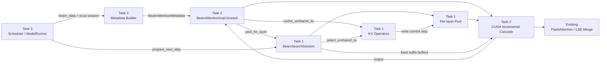
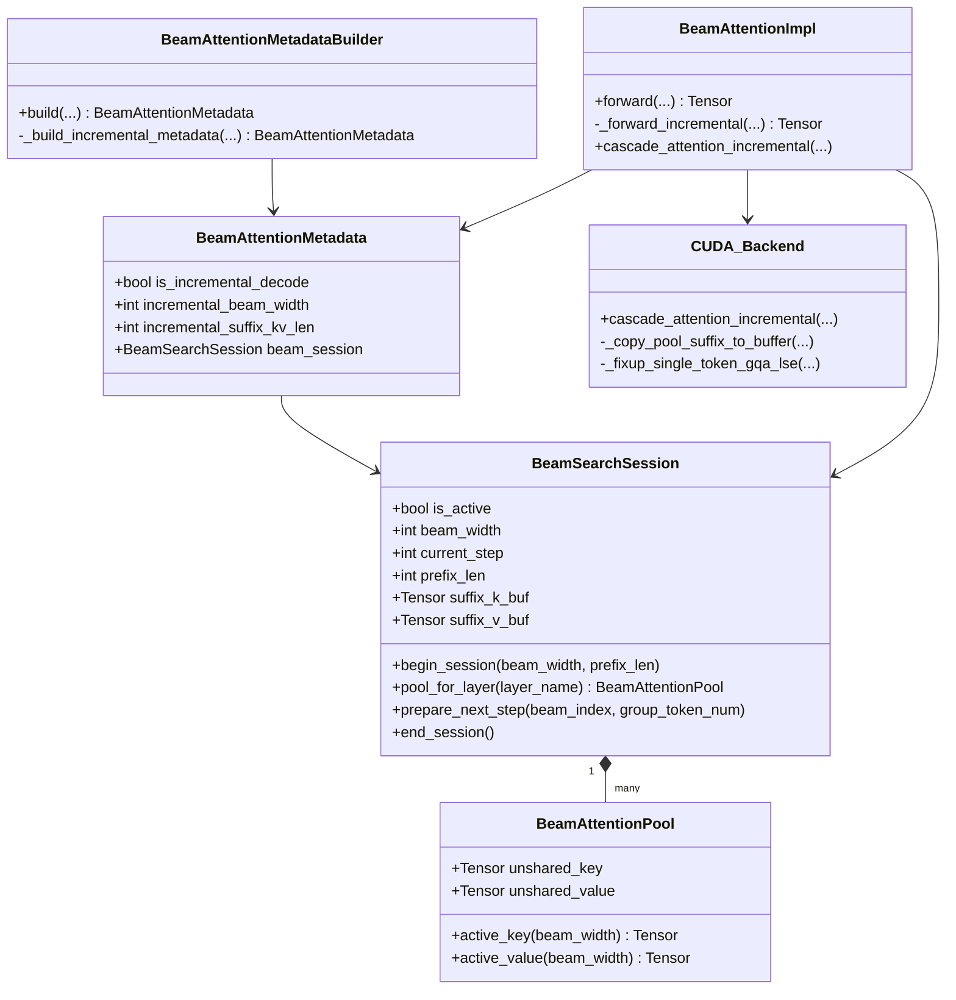
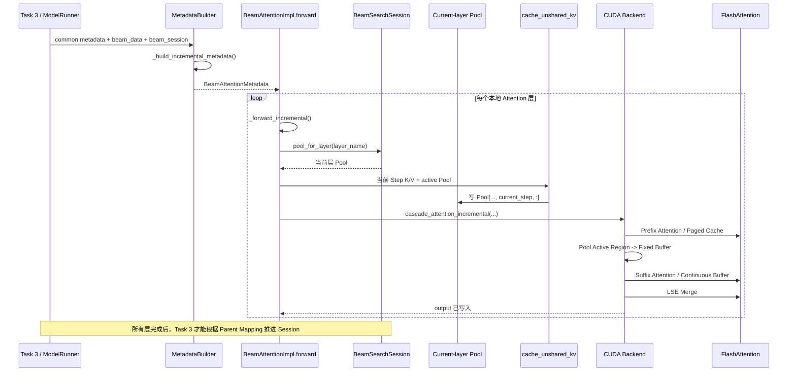
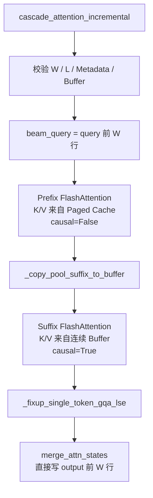
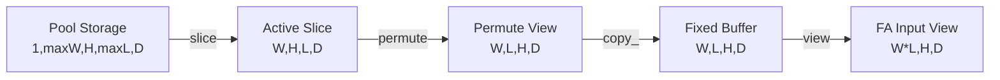
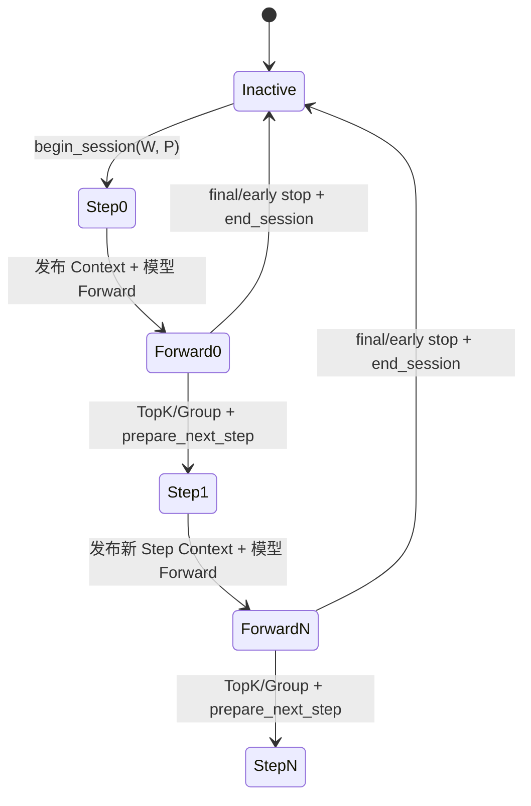
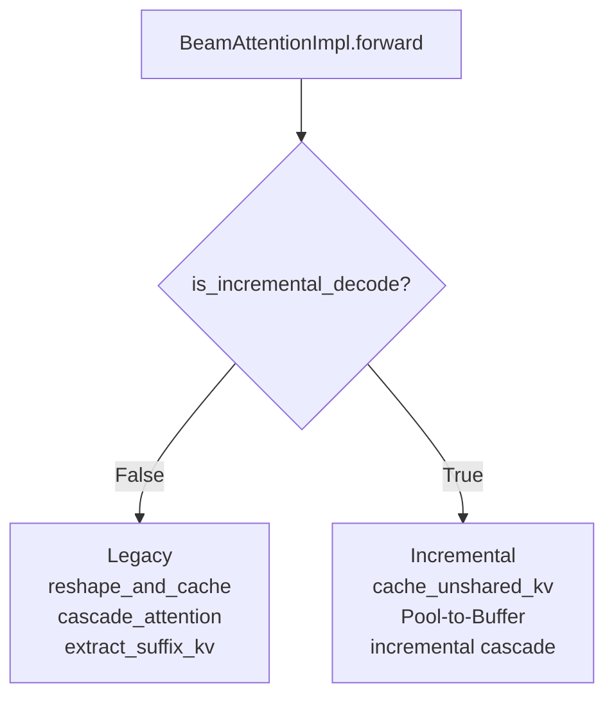

# [RFC][Task 2] 增量解码 Beam Attention 计算路径：实现结果与接入说明

- Parent RFC：#249
- Related design：#248
- Sibling RFC：Task 1 / #250
- 代码基线：`decode_graph@1a8320a`
- 范围：增量 Beam Search 的 Attention 计算层
- 日期：2026-08-10
- 状态：Task 2 核心计算路径已实现，端到端启用等待 Task 3 接入

## 1. 结论

Task 2 已经在现有 `BeamAttention` 中增加一条显式的 Incremental 路径。该路径复用 Task 1 提供的 `BeamSearchSession`、每层 `BeamAttentionPool`、固定 Suffix Buffer 和 KV 算子，完成以下工作：

1. 为 Incremental 模式单独构造 Attention Metadata；
2. 在 `BeamAttentionImpl.forward()` 中显式区分 Legacy 和 Incremental；
3. 将当前层、当前 Step 的 K/V 写入该层的 Unshared KV Pool；
4. 从 Paged KV Cache 计算 Shared Prefix Attention；
5. 将 Pool 有效区整理到 FlashAttention 可读取的固定连续 Buffer；
6. 计算 Unshared Suffix Attention；
7. 使用 LSE Merge 合并 Prefix/Suffix 两段结果，直接写入调用方 `output`。

Task 2 的核心不是 Beam TopK 或 KV 重排，而是把 Task 1 保存的 Unshared KV 历史转成 Attention 可以消费的计算路径。

当前实现不自动启用。Task 3 需要负责创建 Session、发布 Incremental 元数据、准备每个 Beam 的单 Token 输入，并在 Parent 选择完成后推进 Session。

## 2. 实现范围与任务边界

| 模块 | 责任 |
| --- | --- |
| Task 1 `BeamAttentionPool` | 为每个本地 Attention 层保存固定地址的 Unshared K/V 历史 |
| Task 1 `BeamSearchSession` | 管理所有层 Pool、当前 Step、Prefix 长度和固定 Suffix Buffer |
| Task 1 KV Operators | 写入当前 Step，以及根据 Parent Mapping 重排所有层的历史 KV |
| Task 2 Metadata Builder | 构造 Prefix/Suffix Attention 所需的索引、长度和 Block Table |
| Task 2 Forward | 选择 Legacy/Incremental，找到当前层 Pool并写入当前 Step K/V |
| Task 2 CUDA Backend | Pool-to-Buffer、Prefix FA、Suffix FA 和 LSE Merge |
| Task 3 | Session 生命周期、输入重映射、模式开关、TopK 后的 Step 推进 |

Task 2 明确不负责：

- Beam TopK 和 Parent 分组；
- 调用 `select_unshared_kv()` 重排历史；
- `begin_session()`、`prepare_next_step()`、`end_session()` 的调用时机；
- Scheduler/ModelRunner 中的请求生命周期；
- NPU、KV Sharing、量化 KV 的 Incremental 实现。

## 3. 当前实现的总体结构



## 4. 关键类和函数关系



接口层级说明：

- `BeamAttentionImpl.forward()` 是现有生产调用入口，调用方不需要改成直接调用 GPU 函数；
- `BeamAttentionImpl.cascade_attention_incremental()` 是 Attention 层与平台后端之间的委托接口；
- GPU `cascade_attention_incremental()` 是 CUDA 平台计算接口；
- `_forward_incremental()`、`_build_incremental_metadata()`、`_copy_pool_suffix_to_buffer()` 和 `_fixup_single_token_gqa_lse()` 都是内部函数；
- `BeamSearchSession` 和 `cache_unshared_kv()` 由 Task 1 提供，Task 2 只消费它们。

## 5. 当前新增和修改的代码

### 5.1 `beam_attn_metadata.py`

`BeamAttentionMetadata` 新增字段：

```python
is_incremental_decode: bool = False
incremental_beam_width: int = 0
incremental_suffix_kv_len: int = 0
beam_session: BeamSearchSession | None = None
```

新增 `_build_incremental_metadata()`：

- 只处理 CUDA Incremental 请求；
- 当前只允许一个逻辑请求；
- 要求每个 Beam 当前只有一个 Query Token；
- 校验 Scheduler 元数据与 Session 的 Beam Width、Step 和 Prefix 长度一致；
- 为 Prefix 构造共享 Paged Cache 的 FA Metadata；
- 为 Suffix 构造 `W` 条独立序列的 FA Metadata；
- 不生成 Legacy 使用的 `suffix_slot_mapping_out`；
- 将 Worker 本地 `beam_session` 附加到返回的 Metadata。

现有 `build()` 增加早期分流：

```text
存在 is_incremental_decode=True
    -> _build_incremental_metadata()
否则
    -> 保持原来的 Legacy Builder 算法
```

### 5.2 `beam_attn.py`

`BeamAttentionImpl.forward()` 增加显式模式分流：

```python
if attn_metadata.is_incremental_decode:
    return self._forward_incremental(...)
```

新增 `_forward_incremental()`，负责：

1. 校验平台、Session、dtype、device、Shape 和容量；
2. 拒绝 NPU、KV Sharing 和量化 KV；
3. 通过 `session.pool_for_layer(layer.layer_name)` 获取当前层 Pool；
4. 获取当前层的 Active Beam View；
5. 调用 Task 1 `cache_unshared_kv()` 写当前 Step；
6. 调用当前平台的 `cascade_attention_incremental()`；
7. 返回原调用方提供的 `output`。

Incremental Forward 不调用：

- `reshape_and_cache()` 写入 Paged Suffix；
- `extract_suffix_kv()` 从 Paged Cache Gather Suffix；
- `prepare_next_step()` 推进 Session。

新增 `BeamAttentionImpl.cascade_attention_incremental()` 作为平台委托接口，使 Attention 主文件不直接依赖 CUDA 实现细节。

### 5.3 `beam_attn_gpu.py`

新增 `_copy_pool_suffix_to_buffer()`：

- 从 Pool 读取 `[1, W, H, max_steps, D]`；
- 截取当前有效区 `[W, H, L, D]`；
- 调整为 `[W, L, H, D]`；
- 复制到 Session 预分配的固定 Buffer；
- 返回 FlashAttention 使用的 `[W * L, H, D]` View。

新增 `_fixup_single_token_gqa_lse()`：

- 统一处理 FA2 单 Token GQA 场景的 LSE 布局；
- 供 Legacy Cascade 和 Incremental Cascade 复用；
- 不改变原有 Legacy 数学逻辑。

新增 `cascade_attention_incremental()`：

1. 校验 Incremental Metadata；
2. 使用 Paged KV Cache 执行 Prefix FlashAttention；
3. 将当前层 Pool 的有效 Suffix 复制到固定 Buffer；
4. 使用连续 Buffer 执行 Suffix FlashAttention；
5. 修正需要兼容的 LSE 布局；
6. 调用 `merge_attn_states()`，直接写入 `output[:W]`。

### 5.4 `beam_attn_npu.py`

增加同名 `cascade_attention_incremental()` 平台接口，但当前明确抛出 `NotImplementedError`。这可以防止 Incremental 请求错误进入 NPU Legacy 路径。

### 5.5 测试

当前新增或修改的测试覆盖：

- Pool 到固定 Buffer 的布局和 FP16/BF16；
- Buffer 容量不足时在写入前失败；
- Incremental Metadata 的关键长度和索引；
- CUDA Cascade 的 Prefix/Suffix 路由和输出写入；
- `BeamAttentionImpl` 平台委托；
- Forward 写入当前层 Pool；
- Incremental Forward 不调用 Paged `reshape_and_cache()`。

仍需在具备项目 GPU 依赖的环境中完成数值等价、CUDA Graph、分配和完整 Legacy 回归测试。

## 6. 单个 Step 的真实调用流程



## 7. CUDA Cascade 内部数据流



Prefix 和 Suffix 的含义：

- Prefix KV：所有 Beam 共享的 Prompt/Prefix，继续保存在原有 Paged KV Cache；
- Suffix KV：Beam Search 开始后每条 Beam 独立产生的 KV，保存在 Task 1 的 Pool；
- Prefix/Suffix 分别计算后不能直接相加，必须根据两侧 LSE 重新计算全局 Softmax 权重，再做加权合并；
- 合并结果在数学上等价于将 Prefix KV 和 Suffix KV 拼接后执行一次完整 Attention。

## 8. Pool 到 FlashAttention Buffer 的布局

Task 1 Pool 的固定 Storage：

```text
[1, max_beams, kv_heads, max_decode_steps, head_dim]
```

当前 Step 为 `t` 时：

```text
W = session.beam_width
L = t + 1
有效区 = pool[0, :W, :, :L, :]
```

布局转换：



Buffer 中的顺序固定为：

```text
beam 0 step 0
beam 0 step 1
...
beam 1 step 0
beam 1 step 1
...
```

对应关系：

```python
buffer[beam * L + step, head, dim]
    == pool[0, beam, head, step, dim]
```

当前实现仍然存在一次 `W * L` 的 Pool-to-Buffer 复制，但目标 Buffer 在 Session 创建时已经分配，地址固定；Task 2 不为每次 Cascade 新建一整块 Suffix K/V Storage。

## 9. Metadata 结果

定义：

```text
W = session.beam_width
P = session.prefix_len
t = session.current_step
L = t + 1
```

Prefix 是一个共享序列，一次处理 `W` 个 Query：

```text
prefix_indices             = [0, 1, ..., W-1]
prefix_cu_seqlens_q        = [0, W]
prefix_seqlens_kv          = [P]
prefix_max_q_len           = W
prefix_max_seq_len         = P
```

Suffix 是 `W` 条独立序列，每条一个 Query、`L` 个 KV：

```text
suffix_cu_seqlens_q        = [0, 1, 2, ..., W]
suffix_cu_seqlens_k        = [0, L, 2L, ..., W*L]
suffix_seqlens_kv          = [L, L, ..., L]
suffix_max_q_len           = 1
suffix_max_seq_len         = L
suffix_total_tokens        = W * L
suffix_slot_mapping_out    = None
```

## 10. Task 3 如何接入

Task 3 不需要直接调用 `_forward_incremental()` 或 GPU Backend。它只需要准备 Session 和 Context，然后继续走现有模型 Forward。

### 10.1 请求开始

在 Worker 本地为请求准备 `BeamSearchSession`，并调用：

```python
session.begin_session(beam_width=W, prefix_len=P)
```

Session 必须与执行模型的 Worker 位于同一进程和设备，不能把 Tensor/Session 对象跨 Scheduler 进程序列化。

### 10.2 每次 Forward 前发布 Context

当前 Builder 从 `BEAM_DATA_VAR` 读取以下结构：

```python
{
    "beam_data": {
        req_id: {
            "is_incremental_decode": True,
            "beam_width": W,
            "decode_step": session.current_step,
            "prefix_len": P,
            "cache_len": P,
        }
    },
    "req_ids": [req_id],
    "beam_session": session,
}
```

其中：

- `is_incremental_decode=True` 是进入 Task 2 分支的显式开关；
- `decode_step` 是 Host 侧 0-based Step，必须等于 `session.current_step`；
- `cache_len == prefix_len`，表示 Paged KV Cache 只提供 Shared Prefix；
- `beam_session` 是 Worker 本地对象；
- 当前 `CommonAttentionMetadata` 必须呈现一个逻辑请求、连续 `W` 行 Query，即 `query_start_loc_cpu == [0, W]`；
- 每条 Beam 每次 Forward 只允许一个新 Token。

### 10.3 正常执行模型

Task 3 继续调用现有模型执行入口。Metadata Builder 和 `BeamAttentionImpl.forward()` 会根据 `is_incremental_decode` 自动进入新增路径。

不要直接调用：

```python
_build_incremental_metadata(...)
_forward_incremental(...)
_copy_pool_suffix_to_buffer(...)
beam_attn_gpu.cascade_attention_incremental(...)
```

### 10.4 当前 Step 完成后

所有 Attention 层 Forward 完成，并且 Decode 算子得到新的 Parent Mapping 后，Task 3 调用：

```python
session.prepare_next_step(beam_index, group_token_num)
```

该调用会：

1. 通过 Task 1 `select_unshared_kv()` 重排所有层的历史；
2. 更新设备侧 1-based `decode_step_buf`；
3. 将 Host 侧 `current_step` 推进到下一步。

注意：必须在所有 Attention 层都完成当前 Step 后调用，不能在单个 Attention 层内部推进 Session。

### 10.5 请求结束

最后一个 Step 或提前结束时调用：

```python
session.end_session()
```

最后一个 Step 不需要为了下一轮再调用 `prepare_next_step()`。

### 10.6 Task 3 生命周期流程



## 11. Legacy 与 Incremental 的关系



Legacy Builder 和 Legacy Forward 的主要算法保持不变。Task 3 必须在 Session 激活前完成 Feature Gate：不支持的请求继续使用 Legacy。

一旦 Incremental Session 已激活，发生契约错误时必须快速失败，不能在执行中静默回退 Legacy，因为 Paged KV Cache 中没有完整的 Beam Suffix 历史。

## 12. MVP 限制

当前 Incremental 路径只支持：

- CUDA；
- 一个逻辑请求和一个 Active Session；
- 每个 Beam 每次 Forward 一个 Query Token；
- FP16/BF16；
- 非量化 Paged Prefix Cache；
- 固定 Beam Width 和最大 Decode Step；
- 非空 Shared Prefix；
- 单 Stream 顺序执行。

以下情况必须在激活 Session 前 Gate 到 Legacy：

- NPU；
- FP8 或其他量化 KV；
- KV Sharing；
- 多请求混批或多个 Active Session；
- Regrow、Recombination 或动态 Beam Width；
- 超出 Pool/Buffer 容量；
- 多 Stream 共享同一组固定 Buffer。

## 13. 当前对外契约总结

普通模型调用方继续使用现有接口：

```python
BeamAttentionImpl.forward(...)
```

Task 3 需要使用 Task 1 的生命周期接口：

```python
session.begin_session(W, P)
session.prepare_next_step(beam_index, group_token_num)
session.end_session()
```

Task 3 需要向 Task 2 提供：

- `is_incremental_decode`；
- `beam_width`；
- 0-based `decode_step`；
- `prefix_len` 和 `cache_len`；
- Worker 本地 `beam_session`；
- 一个逻辑请求、连续 `W` 行、每 Beam 一个 Token 的 Query/K/V。

Task 2 向 Task 3 保证：

- 每个 Attention 层将当前 Step K/V 写入正确的层 Pool；
- Prefix 从 Paged KV Cache 读取；
- Suffix 从当前层 Pool 读取；
- Incremental 路径不调用 `extract_suffix_kv()`；
- Prefix/Suffix 通过 LSE 得到等价的完整 Attention 输出；
- Task 2 不执行 TopK、Parent 重排或 Session Step 推进；
- Legacy 请求仍走原有路径。

## 14. 完成状态与后续验证

当前代码已经完成：

- 独立 Incremental Metadata Builder；
- `BeamAttentionImpl.forward()` 显式分流；
- 当前层 Pool 查找与当前 Step K/V 写入；
- CUDA Pool-to-Buffer；
- Prefix FA、Suffix FA 和 LSE Merge；
- 平台委托接口及 NPU 明确拒绝；
- 第一阶段 Metadata、Buffer、Cascade 和 Forward 单元测试。

端到端完成仍需要：

- Task 3 创建、发布和销毁 Session；
- Task 3 完成增量输入行布局；
- Task 3 在 TopK/Group 后调用 `prepare_next_step()`；
- 多层、多 Step 联调；
- CUDA FP16/BF16 与 Legacy Baseline 数值等价测试；
- CUDA Graph Capture/Replay 和无额外分配测试；
- CUDA/NPU Legacy 回归和性能测试。

后续优化项包括直接消费 5-D Pool 的 CUDA/Triton Kernel，以消除 Pool-to-Buffer 复制；该优化不属于当前 MVP。
