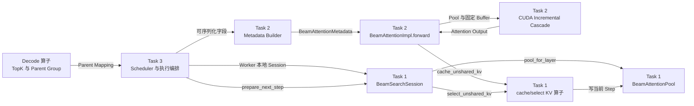
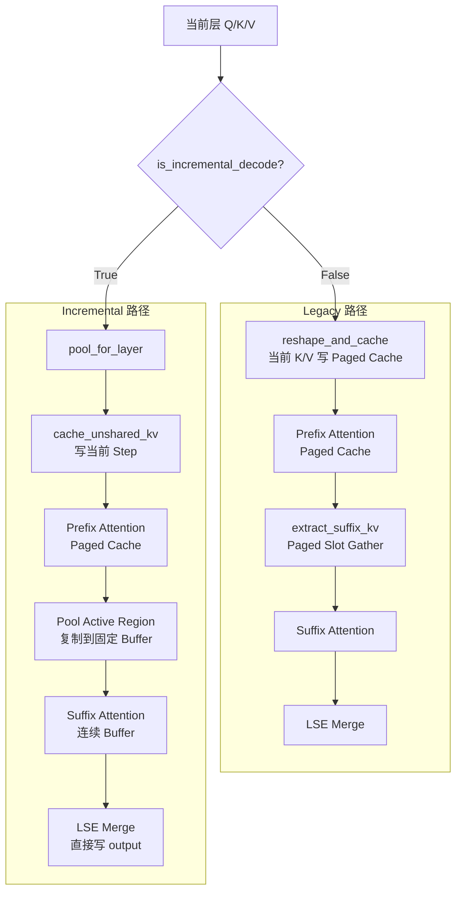
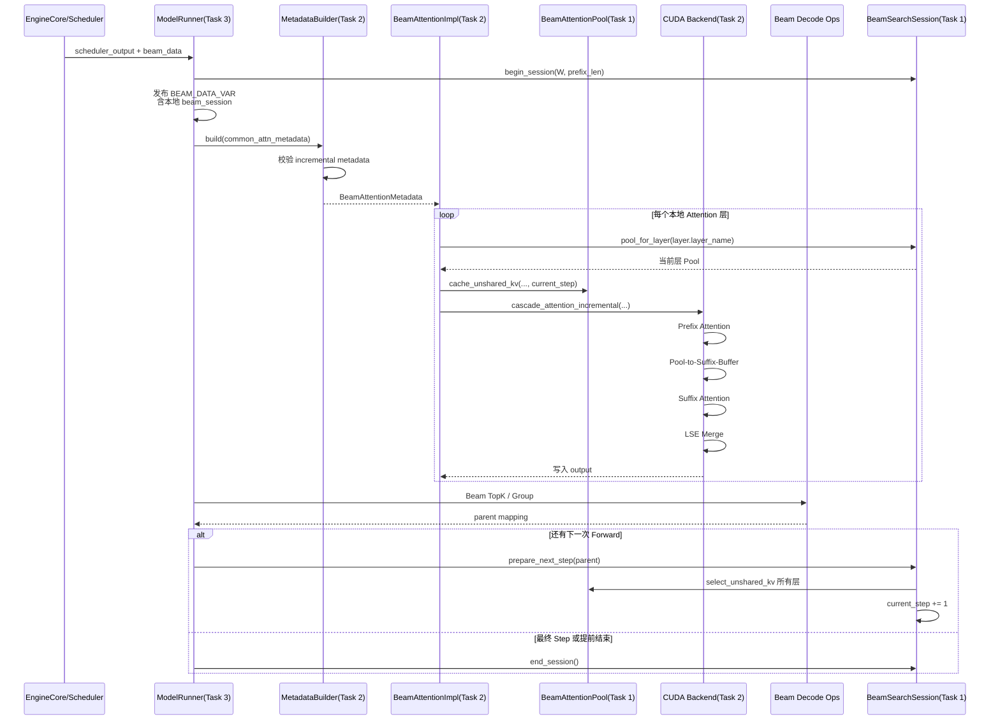
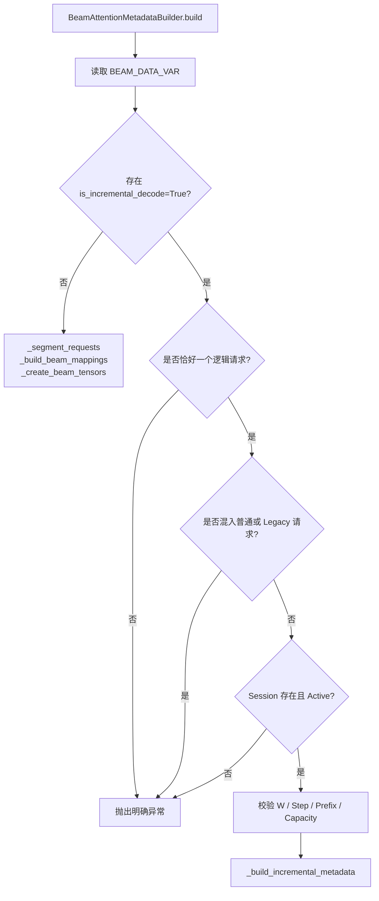
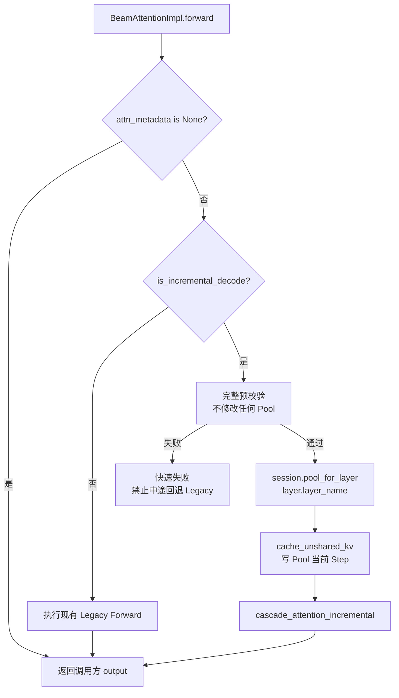
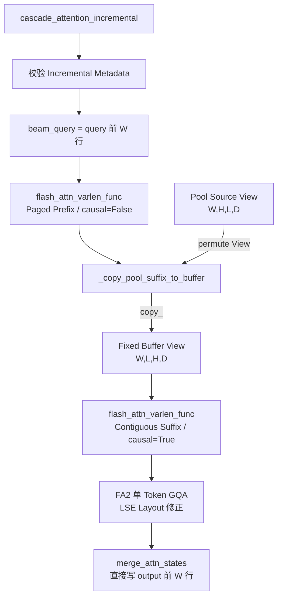
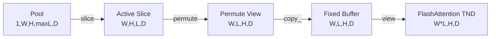
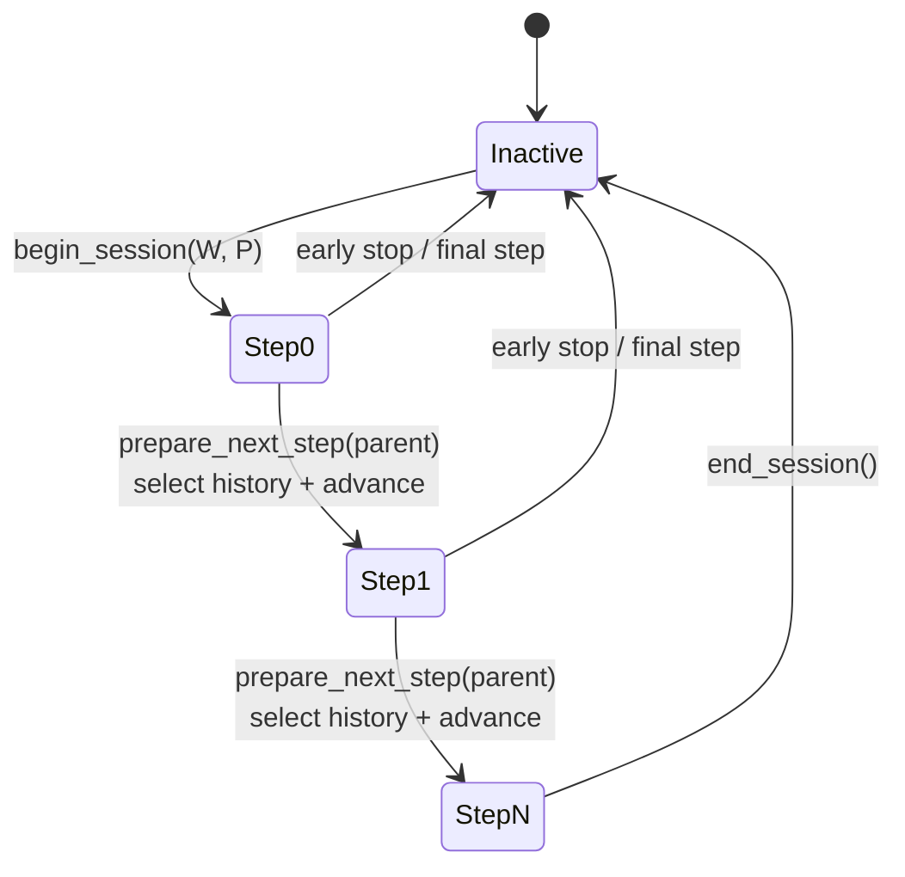
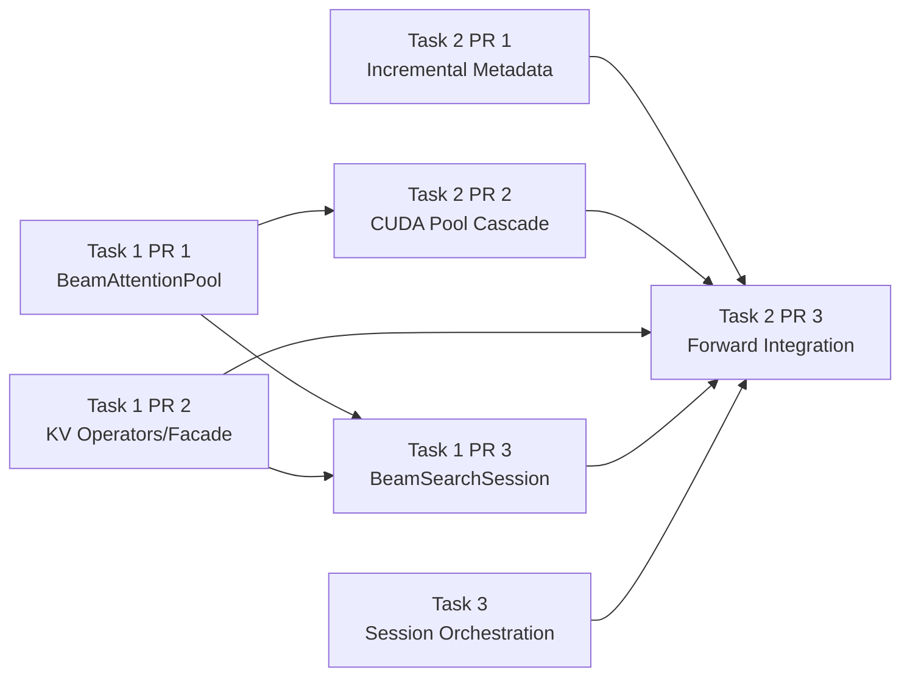

# [RFC][Task 2] 增量解码 Attention 计算路径设计

- Parent RFC：#249
- Related design：#248
- Sibling RFC：Task 1 / #250
- 代码基线：`decode_graph@1a8320a`
- 范围：增量 Beam Search 的 Attention 计算层
- 日期：2026-08-10
- 状态：分阶段实现中，生产路径默认未启用

## 1. 文档目的

Task 2 要解决的问题是：增量 Beam Search 每个 Step 只产生一组新的 Beam K/V，但当前 Legacy 路径会把 Beam Suffix 写入 Paged KV Cache，并在每一步通过 `extract_suffix_kv` 重新 Gather 完整历史。

Task 2 将增加一条显式 Incremental 路径：

1. 当前层、当前 Step 的 K/V 写入 Task 1 提供的固定地址 `BeamAttentionPool`；
2. 共享 Prefix 继续从 Paged KV Cache 读取；
3. 独立 Suffix 从当前层 Pool 的有效历史读取；
4. Pool 有效区复制到预分配的连续 Suffix K/V Buffer；
5. 分别执行 Prefix Attention 和 Suffix Attention；
6. 使用 LSE Merge 合并两段 Attention；
7. Legacy 路径保持不变，未支持场景在 Session 激活前 Gate 到 Legacy。

Task 2 不负责 Beam TopK、Parent 分组、KV 重排和 Session 生命周期推进。

## 2. 总体架构与任务边界



边界如下：

| 模块 | 责任 |
| --- | --- |
| Task 1 Pool | 保存每个本地 Attention 层的 Unshared K/V 历史 |
| Task 1 Session | 管理所有层 Pool、Step、Prefix 长度、固定 Suffix Buffer 和生命周期 |
| Task 1 KV 算子 | 写入当前 Step、按照 Parent 重排所有层历史 |
| Task 2 Metadata | 为 Prefix/Suffix Attention 构造长度、索引和 Block Table |
| Task 2 Forward | 显式选择 Legacy/Incremental，定位当前层 Pool 并写入当前 K/V |
| Task 2 CUDA Cascade | Pool-to-Buffer、Prefix FA、Suffix FA、LSE Merge |
| Task 3 | Session 创建/结束、输入重映射、Step 校验、Parent 决策后的推进 |
| Decode 算子 | 稳定 TopK、Parent 分组、最终序列选择 |

## 3. 当前代码状态

### 3.1 Task 1 已合入

当前上游已经包含：

```text
vllm_gr/v1/beam/beam_attention_pool.py
vllm_gr/ops/cache_unshared_kv.py
vllm_gr/ops/onerec_decode.py
```

其中：

- `BeamAttentionPool` 提供固定地址 5-D K/V Storage；
- `cache_unshared_kv_torch` 提供通用 xllm-ops ABI 的当前 Step 写入；
- `beam_search_group` 执行稳定 TopK 后按 Parent 稳定分组；
- `select_unshared_kv` 当前使用 `clone + gather + 写回`，保证覆盖安全；
- `beam_search_rec_final_select` 执行最终稳定 TopK。

### 3.2 Task 1 尚未合入

当前代码还没有：

```text
vllm_gr/v1/beam/beam_search_session.py
vllm_gr/v1/attention/backends/beam_kernels.py
```

Task 2 最终 Forward 接线依赖以下接口：

```python
class BeamSearchSession:
    suffix_k_buf: torch.Tensor
    suffix_v_buf: torch.Tensor

    @property
    def is_active(self) -> bool: ...

    @property
    def beam_width(self) -> int: ...

    @property
    def current_step(self) -> int: ...

    @property
    def prefix_len(self) -> int: ...

    def pool_for_layer(self, layer_name: str) -> BeamAttentionPool: ...
    def prepare_next_step(self, parent: torch.Tensor) -> None: ...
```

以及面向 Session 的 0-based facade：

```python
def cache_unshared_kv(
    unshared_key: torch.Tensor,
    unshared_value: torch.Tensor,
    curr_key: torch.Tensor,
    curr_value: torch.Tensor,
    step: int,
) -> None: ...
```

不能直接使用通用 `cache_unshared_kv_torch` 代替，因为通用算子使用 `block_table` 和设备上的 1-based `decode_step` Tensor，两者 ABI 不同。

### 3.3 Task 2 当前工作区已完成的第一阶段

当前 Task 2 工作区已经增加：

- `BeamAttentionMetadata.is_incremental_decode`；
- `incremental_beam_width`；
- `incremental_suffix_kv_len`；
- CUDA `_copy_pool_suffix_to_buffer`；
- CUDA `cascade_attention_incremental`；
- `BeamAttentionImpl.cascade_attention_incremental` 平台委托入口；
- NPU Incremental 明确拒绝入口；
- Pool 布局、容量失败原子性、Cascade 路由和平台委托测试。

当前没有修改生产 `BeamAttentionImpl.forward()` 的分流，Feature 尚未接通。

## 4. Legacy 与 Incremental 路径对比



Incremental 路径消除的是：

- Paged Slot Mapping 驱动的不规则 Gather；
- `extract_suffix_kv` 创建的临时连续 K/V Storage；
- Incremental Merge 的额外 `torch.empty_like` Output。

Incremental MVP 仍然会把 `W × L` 的 Pool 有效区复制到连续 Buffer。完全移除该复制需要后续自定义 CUDA/Triton Kernel 直接消费 5-D Pool，不属于本 RFC。

## 5. 端到端调用流程



关键约束：

- `prepare_next_step(parent)` 必须发生在所有 Attention 层完成之后；
- 单个 Attention 层不能推进 Session；
- 最终 Step 不需要重排，直接 `end_session()`；
- Session/Tensor 引用只能存在于 Worker 本地 Context，不能跨 Scheduler 进程序列化。

## 6. Metadata Builder 调用流程

### 6.1 模式分类



Legacy Builder 的现有函数和算法保持不变。Incremental 分支使用独立函数，避免把两套不同的 Beam 几何规则塞入 `_build_beam_mappings()`。

### 6.2 Incremental Metadata 数值

设：

```text
W = session.beam_width
P = session.prefix_len
t = session.current_step
L = t + 1
```

每条 Beam 当前只有一个 Query Token。

Prefix 是一个共享 Group：

```text
prefix_indices               = [0, 1, ..., W-1]
prefix_seqlens_q_cpu         = [W]
prefix_cu_seqlens_q_device   = [0, W]
prefix_seqlens_kv            = [P]
prefix_max_q_len             = W
prefix_max_seq_len           = P
```

Suffix 是 W 条独立序列：

```text
suffix_seqlens_q_cpu         = [1, 1, ..., 1]
suffix_cu_seqlens_q_device   = [0, 1, 2, ..., W]
suffix_seqlens_kv_cpu        = [L, L, ..., L]
suffix_cu_seqlens_k_device   = [0, L, 2L, ..., W*L]
suffix_max_q_len             = 1
suffix_max_seq_len           = L
suffix_total_tokens          = W * L
suffix_slot_mapping_out      = None
```

示例：

```text
W = 4, P = 17, current_step = 1, L = 2

Prefix cu_q = [0, 4]
Suffix cu_q = [0, 1, 2, 3, 4]
Suffix cu_k = [0, 2, 4, 6, 8]
Suffix total tokens = 8
```

## 7. 单层 Forward 调用流程



Incremental Forward 在写 Pool 前必须完成：

- CUDA 平台校验；
- Session 存在且 Active；
- `key` / `value` 非空；
- KV Sharing 未启用；
- 非 FP8/量化 KV；
- Metadata Step 与 Session Step 一致；
- Beam Width、Prefix、dtype、device 一致；
- Pool 和 Buffer 容量足够；
- `layer_name` 能唯一找到 Pool；
- 当前有效 Token 数等于 W。

如果校验失败，Pool 必须保持不变。

## 8. CUDA Incremental Cascade 内部流程



函数调用关系：

```text
cascade_attention_incremental
    ├── flash_attn_varlen_func                 # Prefix
    ├── _copy_pool_suffix_to_buffer
    │     ├── source.permute(...)              # 仅 View
    │     └── target.view(...).copy_(source)   # 写固定 Buffer
    ├── flash_attn_varlen_func                 # Suffix
    ├── _fixup_single_token_gqa_lse
    └── merge_attn_states
```

## 9. Pool 与 Suffix Buffer 布局

Task 1 Pool：

```text
[1, max_beams, kv_heads, max_steps, head_dim]
```

当前有效区：

```text
[0, :W, :, :L, :]
```

逻辑源布局：

```text
[W, H, L, D]
```

通过 `permute(0, 2, 1, 3)` 得到 View：

```text
[W, L, H, D]
```

复制到固定 Buffer 后 Flatten：

```text
[W * L, H, D]
```



Token 顺序固定为：

```text
beam 0 step 0
beam 0 step 1
...
beam 1 step 0
beam 1 step 1
...
```

即：

```python
buffer[(beam * L) + step, head, dim]
    == pool[0, beam, head, step, dim]
```

## 10. 跨 Step 状态推进



在 Step `t`：

```text
Forward 写入：Pool[..., t, :]
Attention 读取：Pool[..., :t+1, :]
Forward 后重排：只处理 [0, t]
推进后：current_step = t + 1
```

Parent 定义：

```text
parent[dst] = src
```

例如：

```text
parent = [3, 1, 1, 1]
```

表示新 Beam 0 继承旧 Beam 3，其余三个新 Beam 继承旧 Beam 1。该重排属于 Task 1，不属于 Task 2。

## 11. 关键函数清单

### 11.1 当前已经存在

| 文件 | 函数/类型 | 当前作用 |
| --- | --- | --- |
| `beam_attention_pool.py` | `BeamAttentionPool` | 每层固定地址 Pool |
| `cache_unshared_kv.py` | `cache_unshared_kv_torch` | 通用 1-based、Block Table KV 写入 |
| `onerec_decode.py` | `beam_search_group` | 稳定 TopK 与 Parent 分组 |
| `onerec_decode.py` | `select_unshared_kv` | 快照式 KV 重排 |
| `beam_attn_metadata.py` | `BeamAttentionMetadataBuilder.build` | 当前 Legacy Metadata 构造入口 |
| `beam_attn.py` | `BeamAttentionImpl.forward` | 当前生产 Attention Forward |
| `beam_attn_gpu.py` | `cascade_attention` | 当前 CUDA Legacy Cascade |
| `beam_attn_triton.py` | `extract_suffix_kv` | 当前 Paged Suffix Gather |

### 11.2 Task 2 当前工作区新增

| 文件 | 函数/字段 | 作用 |
| --- | --- | --- |
| `beam_attn_metadata.py` | `is_incremental_decode` | 显式模式开关 |
| `beam_attn_metadata.py` | `incremental_beam_width` | Active Beam 数 |
| `beam_attn_metadata.py` | `incremental_suffix_kv_len` | 当前有效 Suffix 长度 |
| `beam_attn_gpu.py` | `_copy_pool_suffix_to_buffer` | Pool 到固定 TND Buffer |
| `beam_attn_gpu.py` | `_fixup_single_token_gqa_lse` | 复用 FA2/GQA LSE 修正 |
| `beam_attn_gpu.py` | `cascade_attention_incremental` | CUDA Prefix/Suffix/Merge |
| `beam_attn.py` | `cascade_attention_incremental` | 平台委托入口 |
| `beam_attn_npu.py` | `cascade_attention_incremental` | NPU 显式拒绝 |

### 11.3 后续待实现

| 所属 | 函数/类型 | 作用 |
| --- | --- | --- |
| Task 1 | `BeamSearchSession` | 管理所有层 Pool 和状态 |
| Task 1 | Session `cache_unshared_kv` facade | 0-based Host Step 写入 |
| Task 1 | `prepare_next_step(parent)` | 所有层重排后推进 Step |
| Task 2 | `_build_incremental_metadata` | 独立 Incremental Metadata 构造 |
| Task 2 | `_validate_incremental_forward` | 写 Pool 前完整校验 |
| Task 2 | `_forward_incremental` | 生产 Forward 增量分支 |
| Task 3 | Session Context 发布 | 将本地 Session 提供给 Builder/Forward |

## 12. PR 拆分与依赖



### Task 2 PR 1：Incremental Metadata

- 新增独立 Incremental Builder；
- 校验单请求、单 Token-per-Beam、Step、Prefix 和容量；
- 构造 Prefix/Suffix `cu_seqlens`；
- 不生成 `suffix_slot_mapping_out`；
- Legacy Builder 保持不变。

### Task 2 PR 2：CUDA Pool Cascade

- Pool-to-Buffer；
- Prefix FA；
- Suffix FA；
- LSE Merge；
- FA2/GQA 修正；
- CUDA 等价和分配测试。

当前工作区的第一阶段代码主要属于这个 PR。

### Task 2 PR 3：Forward Integration

- `BeamAttentionImpl.forward` 显式分流；
- `pool_for_layer(layer.layer_name)`；
- 调用 Task 1 facade 写当前 Step；
- 消费 Task 3 本地 Session Context；
- Unsupported Gate；
- 多层、多 Step 联调。

## 13. MVP Gate

首版只支持：

- CUDA；
- `max_batch = 1`；
- 一个 Active Session；
- 每 Beam 每次 Forward 一个 Token；
- FP16/BF16；
- 非量化 Paged Prefix Cache；
- 固定 Beam Width；
- 固定最大 Decode Step；
- 单 Stream 顺序执行。

以下情况在 Session 激活前进入 Legacy：

- NPU Incremental；
- FP8/量化 KV；
- KV Sharing；
- 多请求混批；
- 多 Active Session；
- Regrow/Recombination；
- 超出 Pool 容量；
- CUDA Graph Capture/Replay；
- 多 Stream 共享一个 Suffix Buffer。

已经进入 Active Incremental Session 后发生契约错误时，必须快速失败，不能静默切回 Legacy，因为 Paged Cache 中没有完整的 Beam Suffix。

## 14. 测试计划

### Metadata

- W 为 1、普通值和最大值；
- Step 为 0 和最大合法 Step；
- Prefix 跨一个或多个 Block；
- 精确验证 Prefix/Suffix 长度和 `cu_seqlens`；
- Session 缺失、Step/W/Prefix 不一致；
- Incremental 混批拒绝；
- Legacy Metadata 逐字段回归。

### Pool-to-Buffer

构造：

```text
pool[b,h,t,d] = encode(b,h,t,d)
```

验证：

```text
buffer[b*L+t,h,d] == pool[0,b,h,t,d]
```

同时验证 Inactive Beam、Future Step 不进入有效区，Buffer 地址不变，容量错误发生在写入前。

### CUDA Cascade

比较：

```text
Legacy:      Paged Cache + extract_suffix_kv + Legacy Cascade
Incremental: Pool + Fixed Buffer + Incremental Cascade
```

逐层、逐 Step 比较：

- Prefix output/LSE；
- Suffix output/LSE；
- Merge Output；
- Parent 重排后的下一 Step 输出。

### Forward

- Legacy 仍调用 `reshape_and_cache + cascade_attention`；
- Incremental 不写 Paged Suffix；
- 每层调用一次 `cache_unshared_kv`；
- 使用 canonical `layer_name`；
- Step 使用 Host `int`，不调用 `.item()`；
- Task 2 不推进 Session；
- 失败前 Pool 保持不变。

## 15. 完成标准

Task 2 完成需要满足：

- Incremental Metadata Builder 完成；
- 生产 Forward 显式分流完成；
- 当前层 K/V 正确写入当前层 Pool；
- Prefix 从 Paged Cache 读取；
- Suffix 从 Pool 有效历史读取；
- Incremental 路径不调用 `extract_suffix_kv`；
- Pool-to-Buffer 不产生新的 K/V Storage；
- Merge 直接写调用方 Output；
- CUDA FP16/BF16 与 Legacy Baseline 等价；
- Legacy CUDA/NPU/FP8/KV-Sharing 路径不变；
- Task 2 不执行 TopK、Parent 分组、KV 重排或 Step 推进；
- Task 1/Task 3 多层、多 Step 联调通过；
- Feature Gate 默认关闭。

## 16. 后续工作

以下内容不属于本 RFC MVP：

- CUDA Graph；
- 多 Session 和 `max_batch > 1`；
- Incremental 与普通请求 Continuous Batching；
- NPU Incremental Cascade；
- FP8 Pool；
- KV Sharing；
- 多 Stream Buffer 生命周期；
- 无缓冲区 Parent 原地重排优化；
- 直接消费 5-D Pool 的 CUDA/Triton Kernel；
- Regrow、Recombination 和可变 Beam Width。
