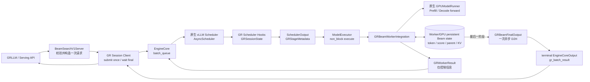
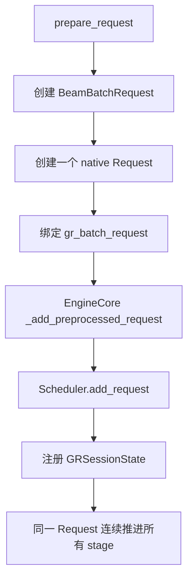
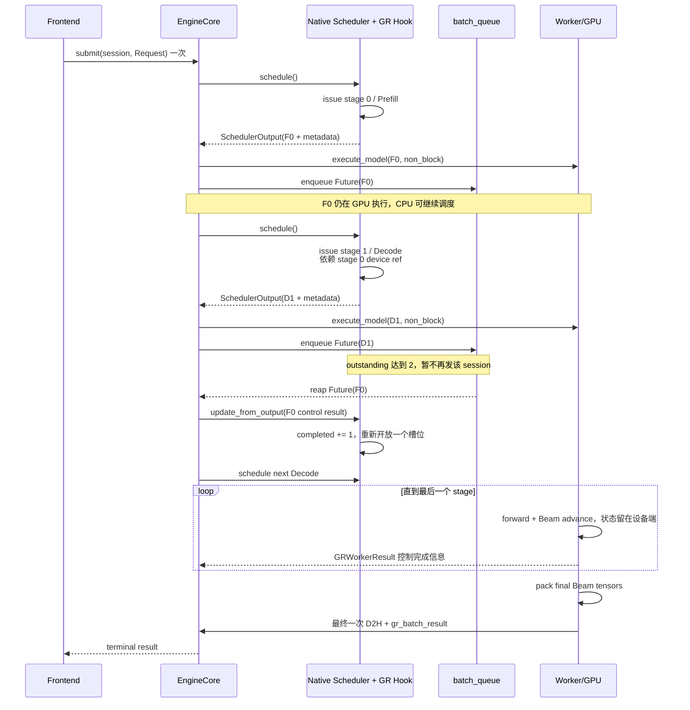
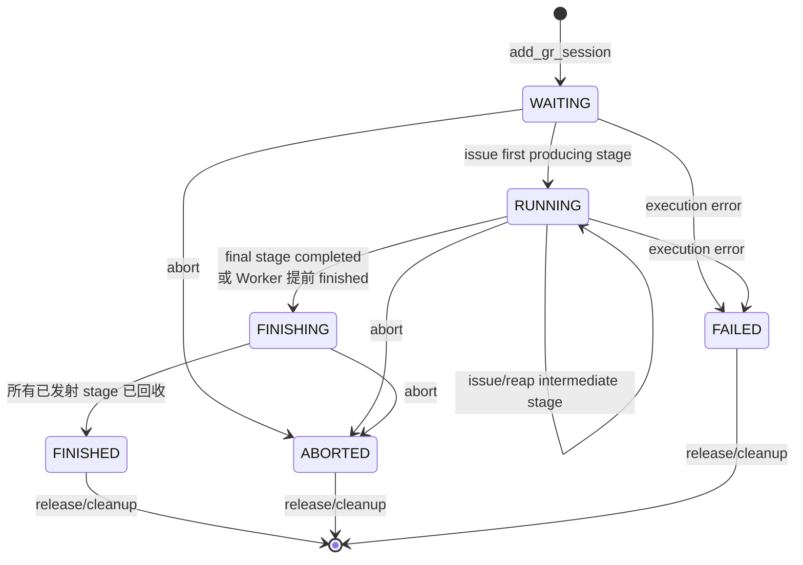
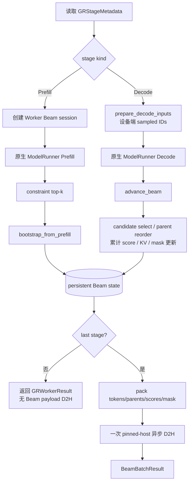

# Beam Search V1 异步调度设计

> 分析基线：`phase-a-beam-search-v1-a3` / `30db26b`（2026-09-11）  
> 需求来源：[JiusiServe/vllm-gr#339](https://github.com/JiusiServe/vllm-gr/issues/339)  
> 参考架构：`/home/z00980960/vllm-gr-a1-framework/docs/async-scheduling-reproduction.md`

## 1. 设计结论

当前 `beam_search_v1` 的核心设计是：**前端只提交一次原生 vLLM Request，后续 Prefill 和各 Decode stage 由同一个 Scheduler session 持续推进；CPU 只传递 stage 控制元数据，Beam token、score、parent 和 KV 状态留在 Worker/GPU；最后一个 stage 才进行一次 Beam 结果 D2H。**

它没有另起一套调度器，而是在 vLLM 原生 `AsyncScheduler + EngineCore batch_queue + non_block Worker` 链路上增加三层状态：

1. Scheduler 侧 `GRSessionState`：决定 stage 是否可发射，并记录 issued/completed。
2. SchedulerOutput 侧 `GRStageMetadata`：描述本次是 Prefill 还是 Decode，以及 GPU 状态的逻辑依赖。
3. Worker 侧 persistent Beam session：保存 Beam token、累计分数、parent、有效掩码及相关设备缓冲区。

因此它与 vLLM 原生异步调度的关系是：**原生机制负责 Request 生命周期、KV 调度、batch queue 和 CPU/GPU 重叠；GR 扩展负责固定步 Beam 的 stage 生命周期及 GPU 常驻 Beam 状态。**

## 2. 总体架构



组件职责如下：

| 层 | 主要对象 | 职责 |
|---|---|---|
| API/Server | `BeamSearchV1Server` | 校验 V1 限制，生成稳定 `session_id`，构造一个 native Request 和一个 `BeamBatchRequest` |
| Frontend client | `gr_session_client.py` | 将 Request 提交一次，等待 terminal output，提取 `gr_batch_result` |
| EngineCore | `core.py`、`engine_core_patch.py` | 接入原生请求队列和 batch queue；把 GR 控制信息挂到原生调度输出/完成输出上 |
| Scheduler | `gr_async_scheduler.py` | 维护 session/stage 状态、限制 outstanding stage、生成 `GRStageMetadata` |
| Worker | `gr_beam_integration.py` | 将 stage 转换成 Prefill/Decode 执行，调用持久化 Beam backend |
| GPU state | `gr_persistent_beam.py` | 初始化、推进、重排并保存 Beam 状态，避免中间状态回传 CPU |
| Final output | `gr_beam_output.py` | 最终一次打包和 D2H，物化 `BeamBatchResult`，完成清理 |

## 3. 请求与 Stage 模型

### 3.1 一次提交

一个 V1 Beam 请求只走一次 native add-request：



稳定标识关系为：

```text
session_id == batch_id == native request_id
```

这避免了旧式 Beam 循环中每步重建 Request、重新进入 Scheduler、重新组装 Beam 历史的开销。

### 3.2 Stage 定义

若请求 `max_tokens=M`，V1 共执行 `M` 个产生 token 的 stage：

| Stage | 类型 | 含义 |
|---|---|---|
| `0` | Prefill | 消费 prompt，并产生第 1 个生成 token |
| `1 ... M-1` | Decode | 每个 stage 产生后续 1 个 token |

代码中的 `max_decode_steps=M-1`，`total_stages=1+max_decode_steps=M`。若原生 Scheduler 对长 prompt 做 chunked prefill，中间 prompt chunk 标记为 `produces_output=False`，不递增 GR 的 issued/completed stage；只有真正产出首 token 的 Prefill 才是 stage 0。

`GRStageMetadata` 携带：

- `session_id`、`stage_index`、`kind`、`decode_step`、`is_last_stage`；
- Beam 参数及输出选项；
- `input_device_state` 和 `output_device_state`，表达 Worker/GPU 状态依赖；
- 首 stage 所需的 session 初始化信息。

这里的 device state ref 是逻辑引用，不包含 Beam tensor 数据。

## 4. 异步流水线

原生 vLLM 的异步模式通过 `batch_queue` 保存 `(Future, SchedulerOutput)`：CPU 调度一个 batch 后，以 `non_block=True` 发给 Worker；在队列未满时继续准备下一 batch，队列达到容量后再回收最老 Future。当前 GR V1 复用这条链路。



### 4.1 发射窗口

当前代码常量为：

```text
GR_LOOKAHEAD_DEPTH = 2
can_issue := status 可运行
             and 尚有 next stage
             and issued_stages - completed_stages < 2
```

它表示同一 session 最多有两个未被 EngineCore 回收的 stage：**一个正在执行，另一个已预排/排队**。这正是 Prefill 与首个 Decode、或相邻 Decode 之间形成 CPU/GPU overlap 的窗口。

当窗口已满时，patch 会在调用原生 `Scheduler.schedule()` 前暂时将该 native Request 的 `max_tokens` 设为 0，使原生 Scheduler 本轮跳过它；调用结束后恢复。这只阻塞已饱和的 GR session，不阻塞其他可调度请求。

### 4.2 与原生 output placeholder 的关系

参考文档中的 vLLM 原生 AsyncScheduler 使用 output placeholder 提前推进逻辑 token 位置：schedule 时预留，output 回收时再确认，避免异步调度把“已安排”误当成“已完成”。

GR V1 没有用 Beam tensor 替换这套原生记账，而是：

- native Request 的 placeholder 继续作为原生 Scheduler 的权威位置记账；
- `GRSessionState.output_placeholders` 镜像 native 值，用于 GR invariant/诊断；
- Worker 给 native output 返回控制占位 token，真实 Beam token 仍留在 GPU session；
- stage issued/completed 是额外的 GR 粒度状态，不等价于 token placeholder。

## 5. Session 状态机与不变量



核心计数关系：

```text
0 <= completed_stages <= issued_stages <= total_stages
in_flight_stages = issued_stages - completed_stages
in_flight_stages <= 2                 # 当前实现
pending_device_token_count <= output_placeholders
```

如果 Worker 报告提前结束，session 转为 `FINISHING`，停止发射新 stage，但已进入 batch queue 的 stage 仍需被回收；只有 `completed_stages >= issued_stages` 后才能进入 `FINISHED` 并释放状态。

## 6. Worker/GPU 持久化 Beam 状态

Worker 收到带 `GRStageMetadata` 的 `SchedulerOutput` 后走 persistent path：



Prefill 建立 session，Decode 在同一 session 上调用 `advance_beam`。中间 stage 返回的 `GRWorkerResult` 只包含 stage 完成、产生 token 数和 device state ref 等控制信息；Beam tokens、累计 scores、parents、有效掩码不随每步输出返回 Scheduler。

最后一阶段由 `GRBeamFinalOutput.enqueue_final()` 将结果打包到一个 device payload，再发起一次到 pinned host 的异步拷贝。`get_result(wait=True)` 只在 terminal 路径等待该事件并物化最终结果。

## 7. 完成、输出与清理

最终结果通过现有 EngineCore output 通道返回，而不是新建旁路 RPC：

```text
Worker gr_batch_results
  -> EngineCoreOutput.kv_transfer_params["gr_batch_result"]
  -> GR session client
  -> BeamSearchV1Server
  -> BeamBatchResult
```

正常完成、提前结束、abort 和异常都必须收敛到 session/backend/output cleanup。清理要求是幂等的，并且不能在 outstanding stage 尚未回收时释放它所引用的设备状态。

## 8. 与 issue #339 阶段目标的对应关系

| Issue 阶段 | 当前实现落点 | 结论 |
|---|---|---|
| A1 公共框架 | `GRSessionState`、stage metadata、EngineCore/Scheduler/Worker 挂点 | 已形成统一 session/stage 控制面 |
| A2 Persistent Native Request | `_handle_submit_gr_session` 只添加一个 native Request | Decode 不再逐步重建 Request |
| A3 一步异步 | 原生 batch queue + `GR_LOOKAHEAD_DEPTH=2` | 当前实现为“执行中 1 个 + 预排 1 个” |
| A4 Beam state stays GPU | `GRBeamWorkerIntegration` + persistent backend | 中间 Beam 数据留在 Worker/GPU |
| A5 final-only D2H | `GRBeamFinalOutput` | 最终阶段集中一次 D2H；中间仅控制结果 |
| A6 集成 | server/client/engine patch 及 profiling 入口 | 已贯通离线调用主链路，仍受下述边界约束 |

## 9. 与异步调度参考设计的关系

| 参考设计中的机制 | 当前 GR V1 的使用方式 |
|---|---|
| EngineCore busy loop | 继续作为调度和结果回收的驱动循环 |
| `batch_queue` | 保存未完成 Future，使 CPU 在 GPU 执行期间继续 schedule |
| `non_block=True` | Worker 执行与 EngineCore 调度重叠的基础 |
| native output placeholder | 保持原生 Request/token/KV 位置记账正确 |
| GPU sampled-token cache | GR 扩展为完整 persistent Beam state 和设备状态依赖 |
| SchedulerOutput / ModelRunnerOutput | 挂载 `GRStageMetadata`、`GRWorkerResult` 和 terminal result |

最重要的区别是：原生设计主要解决单路径生成中“下一个 token 尚未回到 CPU，但下一次 GPU 调用可以准备”的问题；GR V1 还必须维护 beam expansion、parent reorder、累计 score 和多 beam KV 对齐，因此增加了 Worker session 和明确的 stage/device dependency。

## 10. 当前实现边界

当前 server/runtime 明确限制：

- 仅 CUDA；
- `async_scheduling=True` 且 `batch_queue_size>=2`；
- `max_num_seqs=1`，单 prompt、单 GR session；
- TP/PP/DP 均为 1；
- 固定步生成，要求 `ignore_eos=True`；
- 使用固定配置的 Beam width，请求 width 必须匹配；
- canonical SID 场景当前限制 `max_tokens=3`；
- 不支持 speculative decode 和 hybrid KV cache；
- precision baseline 要求 `compilation_config.mode=0`。这不等于关闭 CUDA Graph；图模式由独立的 CUDA Graph 配置决定。

这些限制使当前设计先验证单 session、固定步、persistent Beam 的正确性和流水效果，尚不能直接视作通用多请求 continuous batching 方案。

## 11. 需要明确的实现差异与风险

### 11.1 “一步 ahead”的计数口径

Issue #339 写的是：

```text
completed <= issued <= completed + 1
```

但当前实现和单测采用 `GR_LOOKAHEAD_DEPTH=2`，允许 Prefill 尚未被 CPU 回收时再发射 Decode 1，即：

```text
issued <= completed + 2
```

两者的差异来自口径：当前代码把“当前正在执行的 stage”和“ahead 的下一个 stage”都算作 issued-but-not-completed，因此真正实现一个预排 stage 需要窗口 2。若严格改为窗口 1，将只剩一个 outstanding stage，Prefill 完成被 CPU 回收前不能发 Decode，核心 overlap 会消失。建议在 RFC 中把不变量改写为“queued-ahead <= 1，outstanding <= 2”，避免误解。

### 11.2 调度饱和门控依赖 monkey patch

当前通过临时设置 `request.max_tokens=0` 让原生 Scheduler 跳过已饱和 session。这种方式复用了原生调度器，但依赖其内部判断方式；上游 Scheduler 改动后需要重点回归。

### 11.3 两套 placeholder 计数

主路径以 native Request 的 `num_output_placeholders` 为准，GR session 中的字段是镜像状态；`reserve_gr_output_placeholder()` 不是主运行时的唯一入口。后续应避免让两套计数分别演进，否则诊断值与真实 token/KV 位置可能分叉。

### 11.4 控制输出不等于完全无 CPU 交互

中间阶段没有 Beam tensor D2H，但仍有 Future 完成、`GRWorkerResult`、原生控制 token 和 Scheduler 状态更新。准确表述应是“中间 Beam payload 无 D2H”，不是“中间阶段 CPU 完全不参与”。

### 11.5 V1 与 legacy 路径并存

`engine_core_patch.py` 中仍包含 legacy Beam 链式处理逻辑。V1 的权威路径应以 `gr_stage_metadata`、persistent Worker backend 和 final-only output 为准；维护时需避免把 legacy 的逐步结果/重建行为混入 V1。

## 12. 验收指标的代码口径

| 指标 | 期望口径 |
|---|---|
| native Request add 次数 | 每 session 为 1 |
| Decode Request rebuild 次数 | 0 |
| 预排深度 | queued-ahead 最大 1；outstanding 最大 2 |
| 中间 Beam payload D2H | 0 |
| 最终 Beam payload D2H | 每个正常完成 session 为 1 |
| 中间 SchedulerOutput | 每个产生 token 的 stage 恰好 1 个 metadata |
| 清理后 active state | Scheduler、Worker backend、final-output registry 均为 0 |
| 正确性 | token、score、parent、长度惩罚及 constraint 结果与 baseline 一致 |

## 13. 关键代码索引

- `vllm_gr/entrypoints/beam_search_v1_server.py`：请求校验与 server 生命周期。
- `vllm_gr/v1/engine/gr_session_client.py`：一次提交与 terminal result 等待。
- `vllm_gr/v1/engine/core.py`：EngineCore 的 GR submit handler。
- `vllm_gr/v1/engine/beam_search_v1.py`：session、stage、device ref 数据模型。
- `vllm_gr/v1/engine/gr_async_scheduler.py`：stage 发射窗口与完成更新。
- `vllm_gr/v1/engine/engine_core_patch.py`：原生 Scheduler/EngineCore 接入。
- `vllm_gr/v1/worker/gr_beam_integration.py`：Worker 执行桥接。
- `vllm_gr/v1/worker/gr_persistent_beam.py`：GPU 常驻 Beam session。
- `vllm_gr/v1/worker/gr_beam_output.py`：最终结果打包与单次 D2H。
- `tests/test_gr_async_scheduler.py`：Prefill/Decode lookahead、提前结束和 chunked prefill 的状态机断言。

