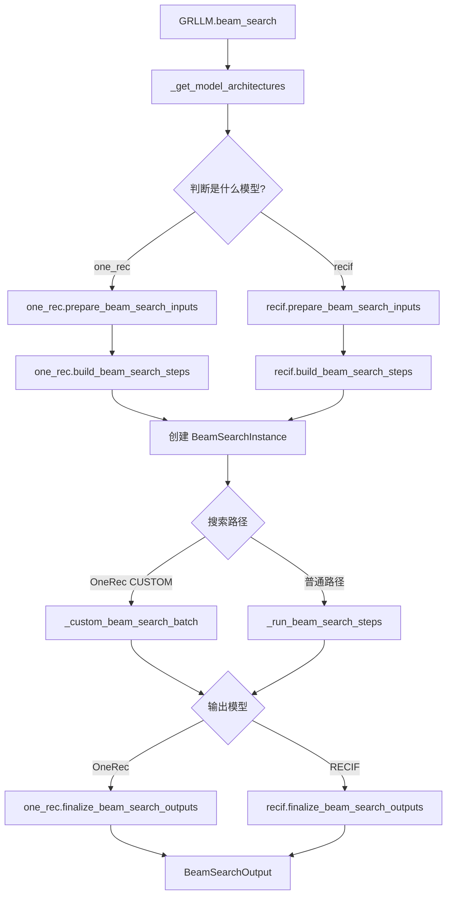

# OneRec 与 RECIF Beam Search 代码整合计划

## 1. 改造目标

本文档以代码改造开始前的视角编写。

- OneRec 和 RECIF 统一调用 `GRLLM.beam_search()`；
- 两个模型共用 Beam Search 的扩展、打分和裁剪主干；
- 两个模型的输入和输出逻辑分别放在各自模型文件中；
- OneRec 原有调用方式和结果保持不变。

两个模型需要共用的逻辑是：

```text
扩展当前 beams -> 获取候选 token -> 累加分数 -> 保留最高分 beams
```

两个模型不能共用的逻辑是：

| 项目 | OneRec | RECIF |
| --- | --- | --- |
| 输入 | text 或 token IDs | int64 `history_sids` 序列 |
| tokenizer | 需要 | 不需要 |
| 搜索层数 | `max_tokens` 决定 | 固定 3 层 |
| 每层扩展数 | `beam_width` | `branch_factors` |
| 合法 token | 可选 catalog | 每层固定 8192 个 token |
| 输出 | token 解码为 text | 三个 token 转为一个 SID |

## 2. 文件调整

| 文件 | 计划内容 |
| --- | --- |
| `vllm_gr/entrypoints/gr.py` | 统一入口、模型判断、公共搜索主干 |
| `vllm_gr/entrypoints/beam_search_config.py` | 公共数据结构 |
| `vllm_gr/models/one_rec.py` | OneRec 输入、搜索步骤、输出转换 |
| `vllm_gr/models/recif.py` | RECIF 输入、搜索步骤、输出转换 |
| `vllm_gr/sampling_params.py` | 增加 `branch_factors` |
| `examples/offline_inference/beam_search/offline_recif_beam_search.py` | RECIF 统一入口示例 |
| `tests/test_recif_gr_beam_search.py` | OneRec 和 RECIF 回归测试 |

## 3. 函数调用顺序



RECIF 第一版只走 `_run_beam_search_steps()`。OneRec 保留原有 CUSTOM 加速路径。

## 4. 新增公共数据

### 4.1 `BeamSearchStep`

文件：`vllm_gr/entrypoints/beam_search_config.py`

表示某一层 Beam Search 的执行参数。

```python
@dataclass(frozen=True)
class BeamSearchStep:
    expand_width: int
    keep_width: int
    allowed_token_ids: list[int] | None = None
```

| 字段 | 含义 |
| --- | --- |
| `expand_width` | 每个父 beam 扩展多少个候选 |
| `keep_width` | 本层合并后保留多少个 beam |
| `allowed_token_ids` | 本层允许生成的 token，`None` 表示不限制 |

### 4.2 `PreparedBeamInputs`

文件：`vllm_gr/entrypoints/beam_search_config.py`

保存模型完成输入处理后，公共搜索代码需要的数据。

```python
@dataclass
class PreparedBeamInputs:
    engine_inputs: list[Any]
    generated_starts: list[int]
    output_starts: list[int]
    prompt_texts: list[str]
    tokenizer: Any | None = None
    begin_token_id: int | None = None
    end_token_id: int | None = None
```

| 字段 | 含义 |
| --- | --- |
| `engine_inputs` | 传给 vLLM 的 prompt |
| `generated_starts` | 搜索路径开始位置，供 catalog 使用 |
| `output_starts` | 最终生成结果开始位置 |
| `prompt_texts` | OneRec 最终输出使用的 prompt text |
| `tokenizer` | OneRec 使用，RECIF 为 `None` |
| `begin_token_id` | OneRec 可选 begin token |
| `end_token_id` | OneRec 可选 end token |

`generated_starts` 和 `output_starts` 分开保存，是为了防止 OneRec 的 begin token 影响 catalog 判断或被重复输出。

## 5. 新增和调整的函数

### 5.1 公共函数

| 函数 | 文件 | 作用 |
| --- | --- | --- |
| `select_best_beams(instance, beam_width)` | `beam_search_config.py` | 合并 active/completed beams，按累计分数返回前 N 个 |
| `_get_model_architectures(llm_engine)` | `gr.py` | 从 vLLM config 读取模型的 `architectures` |
| `_run_beam_search_steps(...)` | `gr.py` | 按 `BeamSearchStep` 执行公共的扩展、打分和裁剪 |
| `GRLLM.beam_search(...)` | `gr.py` | 判断模型，调用模型函数和公共搜索主干 |

`_run_beam_search_steps()` 每层只做以下事情：

1. 收集当前 beams；
2. 请求每个 beam 的 top-k token；
3. 应用 `allowed_token_ids` 和可选 catalog；
4. 累加父 beam 分数；
5. 处理 EOS；
6. 按 `keep_width` 保留最高分 beams。

它不处理 tokenizer，也不负责 token 转 text 或 SID。

### 5.2 OneRec 函数

文件：`vllm_gr/models/one_rec.py`

| 函数 | 输入 | 返回 | 作用 |
| --- | --- | --- | --- |
| `prepare_beam_search_inputs(llm, prompts, params)` | text/token prompt、begin/end token | `PreparedBeamInputs` | tokenizer 处理、追加 begin token、计算 offset、缓存 prompt text |
| `build_beam_search_steps(num_steps, beam_width)` | 搜索层数、beam 宽度 | `list[BeamSearchStep]` | 创建每层相同宽度的搜索步骤 |
| `finalize_beam_search_outputs(...)` | 搜索完成的 instances | `list[BeamSearchOutput]` | 追加 end token、选择最佳 beams、重建 logprobs、decode text |

OneRec step 示例：

```text
num_steps=3, beam_width=32

step 0: expand=32, keep=32, allowed=None
step 1: expand=32, keep=32, allowed=None
step 2: expand=32, keep=32, allowed=None
```

### 5.3 RECIF 函数和数据

文件：`vllm_gr/models/recif.py`

| 名称 | 输入 | 返回 | 作用 |
| --- | --- | --- | --- |
| `RECIF_ARCHITECTURE` | 无 | `"RecifForCausalLM"` | 供 `GRLLM` 判断模型类型 |
| `prepare_beam_search_inputs(llm, prompts)` | `[{"history_sids": [...]}]` | `PreparedBeamInputs` | 校验 SID 序列、调用 `build_prefix()`、构造 `TokensPrompt` |
| `build_beam_search_steps(params)` | `branch_factors`、`beam_width` | 三个 `BeamSearchStep` | 设置三层扩展数和 token 范围 |
| `finalize_beam_search_outputs(...)` | 搜索完成的 instances | `list[BeamSearchOutput]` | 将三个输出 token 转成 SID，重建 logprobs |

RECIF step 示例：

```text
branch_factors=(8, 8, 8), beam_width=64

step 0: expand=8, keep=8,  allowed=[0, 8192)
step 1: expand=8, keep=64, allowed=[8192, 16384)
step 2: expand=8, keep=64, allowed=[16384, 24576)
```

最终三个 token 的转换方式：

```text
byte_0 = token_0
byte_1 = token_1 - 8192
byte_2 = token_2 - 16384
sid = bytes_to_sid(byte_0, byte_1, byte_2)
```

返回 sequence 中计划设置：

```python
sequence.sid = sid
sequence.text = str(sid)
```

## 6. 新增参数

文件：`vllm_gr/sampling_params.py`

```python
branch_factors: tuple[int, int, int] | None = None
```

作用：控制 RECIF 三层分别扩展多少个候选。

- OneRec 不使用，默认值 `None` 保证旧调用不变；
- RECIF 未设置时使用 `(8, 8, 8)`；
- RECIF 必须提供三个 `[1, 8192]` 范围内的值。

## 7. RECIF 离线调用

初始化：

```python
llm = GRLLM(
    model=model_path,
    max_logprobs=max(branch_factors),
    skip_tokenizer_init=True,
    max_num_seqs=max(beam_width, branch_factors[0]),
    logprobs_mode="processed_logprobs",
)
```

调用：

```python
params = BeamSearchParams(
    beam_width=64,
    max_tokens=3,
    ignore_eos=True,
    branch_factors=(8, 8, 8),
)

outputs = llm.beam_search(
    [{"history_sids": history_sids}],
    params,
)
```

`processed_logprobs` 保证每层先应用 `allowed_token_ids`，再计算归一化 logprob。它属于 RECIF 的 `GRLLM` 初始化要求，不放进公共搜索主干。

## 8. 兼容要求

- OneRec 继续使用 `GRLLM.beam_search(prompts, params)`；
- OneRec 不传 `branch_factors`；
- OneRec begin/end token、catalog 和 CUSTOM 路径不变；
- RECIF 固定生成三层，不使用 tokenizer、catalog 和 EOS；
- RECIF 第一版不修改 CUSTOM BeamRequest。

## 9. 测试计划

`tests/test_recif_gr_beam_search.py` 计划覆盖：

- OneRec 固定宽度 steps；
- OneRec begin token 的两个 offset；
- RECIF 三层扩展数和 token 范围；
- 非法 `branch_factors`；
- `RecifForCausalLM` 架构识别；
- 三个 RECIF token 转 SID；
- 新入口与原 RECIF 离线结果对拍。

测试文件放在 `tests/` 下后，现有 GitHub `pre-commit` workflow 会通过 `tools/pre_commit/run_tests.sh` 自动执行，无需单独增加一套 CPU workflow。

## 10. 后续工作

本次先完成离线整合，以下内容后续单独处理：

- 在线接口支持 `history_sids` 和 `branch_factors`；
- 在线 tokenizer-free RECIF 请求；
- 验证现有 Beam Search metrics；
- 根据性能测试决定是否支持 RECIF CUSTOM BeamRequest。

## 11. 实施顺序

- [ ] 新增 `BeamSearchStep` 和 `PreparedBeamInputs`；
- [ ] 抽取 OneRec 的输入、step 和输出函数；
- [ ] 抽取公共 `_run_beam_search_steps()`；
- [ ] 增加 RECIF 的输入、step 和输出函数；
- [ ] 在 `GRLLM.beam_search()` 中增加模型分发；
- [ ] 增加 `branch_factors` 和 RECIF 离线示例；
- [ ] 增加单元测试并对拍结果；
- [ ] 后续增加在线支持。
