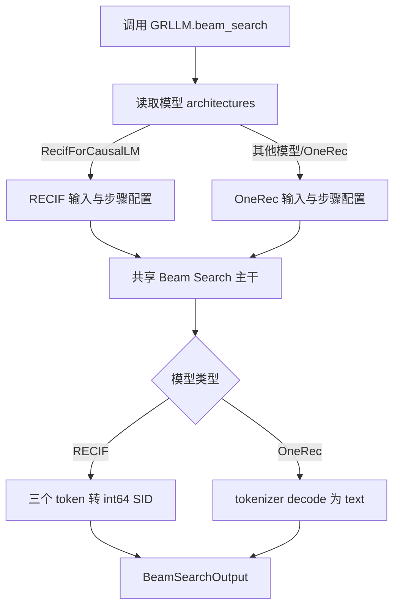

# OneRec 与 RECIF Beam Search 代码整合计划

## 1. 文档定位

本文档用于描述代码改造开始前的设计方案和实施计划。文中的文件、函数和测试均表示拟新增或拟调整的内容，不表示相关工作已经完成。

计划目标是在不破坏现有 OneRec 调用方式和搜索行为的前提下，让 RECIF 通过统一的 `GRLLM.beam_search()` 入口复用 Beam Search 公共主干，并为后续在线推理、指标和 CI 看护预留清晰的扩展位置。

## 2. 背景与现状问题

当前 `GRLLM.beam_search()` 的实现主要围绕 OneRec 编写，搜索循环中同时包含以下几类职责：

- prompt tokenizer 处理；
- SID begin/end token 处理；
- catalog 合法路径约束；
- beam 扩展、累计打分和裁剪；
- token 解码为 text；
- CUSTOM attention 的 BeamRequest 加速路径。

RECIF 与 OneRec 的 Beam Search 主体都是“逐层扩展候选、累计 logprob、保留最高分 beam”，但输入、每层 token 范围和输出转换不同。如果直接在原函数内部不断增加 `if is_recif`，`gr.py` 会同时承载多个模型的细节，后续增加第三个模型时会继续膨胀。

因此计划把代码分成两层：

1. `GRLLM` 保留统一入口和模型无关的 Beam Search 主干；
2. 每个模型在自己的文件中实现输入准备、搜索步骤配置和输出转换。

## 3. 模型差异

| 项目 | OneRec | RECIF |
| --- | --- | --- |
| 输入 | text 或 tokenizer token IDs | int64 SID 历史序列 `history_sids` |
| tokenizer | 需要 | Beam Search 路径不需要 |
| prefix | tokenizer prompt，可追加 begin token | `build_prefix(history_sids)` |
| 搜索层数 | 由 `max_tokens` 决定 | 固定 3 层 |
| 每层扩展数 | 默认等于 `beam_width` | `branch_factors`，默认 `(8, 8, 8)` |
| 合法 token | tokenizer vocabulary，可选 catalog 约束 | 第 0/1/2 层分别限制到三个 8192 token 区间 |
| 输出 | token 解码后的 text | 三个层级 token 合成为一个 int64 SID |
| end token | 可选 | 不使用 |
| CUSTOM BeamRequest | 保持现有逻辑 | 第一阶段暂不接入 |

RECIF 的三个输出层拟使用以下 token 区间：

| 层级 | 合法 token ID | 转换后的字节值 |
| --- | --- | --- |
| level 0 | `[0, 8192)` | `token_id` |
| level 1 | `[8192, 16384)` | `token_id - 8192` |
| level 2 | `[16384, 24576)` | `token_id - 16384` |

## 4. 总体设计



本次不计划引入复杂的抽象基类或完整策略注册框架。第一阶段只支持两个模型，采用少量模型函数加架构判断即可，减少改动范围。将来模型数量继续增加时，再考虑将函数集合升级为显式 policy registry。

## 5. 文件规划

| 文件 | 计划职责 |
| --- | --- |
| `vllm_gr/entrypoints/gr.py` | 保留 `GRLLM.beam_search()` 公共入口、模型识别、Beam 初始化、普通搜索主干和既有 CUSTOM 路径 |
| `vllm_gr/entrypoints/beam_search_config.py` | 定义模型之间共享的小型数据结构，不包含模型逻辑 |
| `vllm_gr/models/one_rec.py` | OneRec prompt/tokenizer、固定宽度步骤和 text 输出转换 |
| `vllm_gr/models/recif.py` | RECIF prefix、三层 token 范围、分支配置和 SID 输出转换 |
| `vllm_gr/sampling_params.py` | 增加可选的 `branch_factors` 参数，同时保持 OneRec 默认行为 |
| `examples/offline_inference/beam_search/offline_recif_beam_search.py` | 展示 RECIF 通过 `GRLLM.beam_search()` 进行离线推理 |
| `tests/test_recif_gr_beam_search.py` | 无设备依赖的配置、兼容性和分发单元测试 |

## 6. 公共数据结构规划

计划在 `beam_search_config.py` 中增加以下结构。

### 6.1 `BeamSearchStep`

```python
@dataclass(frozen=True)
class BeamSearchStep:
    expand_width: int
    keep_width: int
    allowed_token_ids: list[int] | None = None
```

字段含义：

- `expand_width`：每个父 beam 在当前层请求多少个候选 token；
- `keep_width`：当前层所有候选合并后最多保留多少个 beam；
- `allowed_token_ids`：当前层允许参与 softmax 和 top-k 的 token ID，`None` 表示不额外限制。

通过逐层传入 `BeamSearchStep`，共享主干不需要理解“这是 OneRec 第几层”或“这是 RECIF 哪个 SID head”。

### 6.2 `PreparedBeamInputs`

```python
@dataclass
class PreparedBeamInputs:
    engine_inputs: list[Any]
    generated_starts: list[int]
    output_starts: list[int]
    prompt_texts: list[str]
    tokenizer: Any | None = None
    begin_token_id: int | None = None
    end_token_id: int | None = None
```

需要区分两个 offset：

- `generated_starts` 用于搜索期间提取已生成路径，例如 OneRec catalog 判断需要包含 begin token；
- `output_starts` 用于最终输出切片，避免 begin token 被重复解码。

## 7. 函数拆分规划

### 7.1 `gr.py`：统一入口和共享主干

#### `_get_model_architectures(llm_engine)`

从 `vllm_config.model_config.hf_config.architectures` 或 `hf_text_config.architectures` 获取模型架构名称。

第一阶段的分发规则拟定为：

- 包含 `RecifForCausalLM`：使用 RECIF 路径；
- 其他情况：走原有 OneRec 路径，保证旧模型和旧调用默认不变。

#### `_run_beam_search_steps(...)`

拟作为普通 `LLM.generate()` 路径的共享搜索主干：

```python
def _run_beam_search_steps(
    llm,
    instances_batch,
    steps,
    *,
    temperature,
    initial_logprobs,
    eos_token_id,
    ignore_eos,
    catalog,
    use_tqdm,
) -> None:
    ...
```

每一层统一执行：

1. 汇总当前所有 active beams；
2. 使用当前 `BeamSearchStep` 构造单步 `SamplingParams`；
3. 调用 `llm.generate(..., max_tokens=1)`；
4. 提取每个父 beam 的 top-k token 和 logprob；
5. 如提供 catalog，则屏蔽不合法候选；
6. 处理 EOS completed beams；
7. 累加父路径分数；
8. 根据 `keep_width` 保留最高分候选；
9. 记录 logprob 父指针，最终只为胜出 beam 重建完整 logprobs。

共享主干只读取步骤配置，不执行 tokenizer、SID 编解码或模型架构判断。

#### `GRLLM.beam_search(...)`

公开入口名称和 OneRec 原调用方式必须保持不变：

```python
outputs = llm.beam_search(prompts, params)
```

内部计划调整为：

```python
architectures = _get_model_architectures(self.llm_engine)

if "RecifForCausalLM" in architectures:
    prepared = prepare_recif_inputs(self, prompts)
    steps = build_recif_steps(params)
else:
    prepared = prepare_onerec_inputs(self, prompts, params)
    steps = build_onerec_steps(...)

initialize_beam_instances(prepared)
run_shared_or_custom_beam_search(...)
return finalize_model_outputs(...)
```

这里的 `if` 只做分发，不在分支中展开具体模型算法。

### 7.2 `models/one_rec.py`：OneRec 策略

计划提供三个主要函数：

```python
prepare_beam_search_inputs(llm, prompts, params)
build_beam_search_steps(num_steps, beam_width)
finalize_beam_search_outputs(instances, prepared, initial_logprobs, beam_width)
```

职责分别是：

- 调用 tokenizer 和 `_preprocess_cmpl()`，处理可选 begin/end token；
- 为每一层生成相同 `expand_width` 和 `keep_width`；
- 追加可选 end token、重建 logprobs，并把生成 token 解码成 text。

OneRec 的 catalog 判断仍由共享搜索主干执行，因为 catalog 本质上是候选过滤；但 catalog 如何取得、是否启用由 OneRec 分支决定。

### 7.3 `models/recif.py`：RECIF 策略

计划在已有 RECIF 模型文件中增加：

```python
RECIF_ARCHITECTURE = "RecifForCausalLM"

prepare_beam_search_inputs(llm, prompts)
build_beam_search_steps(params)
finalize_beam_search_outputs(instances, prepared, initial_logprobs, beam_width)
```

具体职责：

- 校验每个 prompt 都包含 `history_sids`；
- 调用 `build_prefix()` 生成模型输入 token IDs；
- 固定生成三个 Beam Search step；
- 按层设置 `allowed_token_ids`；
- 校验 `branch_factors` 恰好包含三个 `[1, 8192]` 范围内的值；
- 将最终三个 token 转回一个 SID，并以 int64 语义返回。

RECIF 不使用 catalog。其合法 token 已由每层 `allowed_token_ids` 精确限定。

## 8. 参数与初始化计划

### 8.1 `BeamSearchParams`

计划增加：

```python
branch_factors: tuple[int, int, int] | None = None
```

兼容规则：

- OneRec 不传该参数，行为与当前版本一致；
- RECIF 不传时使用 `(8, 8, 8)`；
- RECIF 可显式设置每层扩展数；
- `beam_width` 继续表示跨父节点合并后最终保留的 beam 数。

### 8.2 RECIF 的 `GRLLM` 初始化

离线推理计划使用：

```python
llm = GRLLM(
    model=model_path,
    max_logprobs=max(branch_factors),
    skip_tokenizer_init=True,
    max_num_seqs=max(beam_width, branch_factors[0]),
    logprobs_mode="processed_logprobs",
)
```

`processed_logprobs` 是 RECIF 初始化要求，不进入 Beam Search 主干。它保证 `allowed_token_ids` mask 生效后再计算归一化 logprob，使每一层的结果等价于在独立的 8192 类 SID head 上计算概率。

## 9. 兼容性约束

改造过程中必须满足以下约束：

- OneRec 仍使用 `GRLLM.beam_search(prompts, params)`；
- `branch_factors` 默认值为 `None`，不改变旧参数序列化结果；
- OneRec 的 begin/end token 行为不变；
- OneRec catalog 的合法路径过滤行为不变；
- OneRec 普通 `LLM.generate()` 路径行为不变；
- OneRec CUSTOM BeamRequest 加速路径第一阶段不重写；
- RECIF 第一阶段只走普通调度路径；
- RECIF 固定只生成三个 SID 层，不使用 EOS 和 catalog；
- 不修改已有 RECIF 权重转换和模型注册逻辑。

## 10. CUSTOM BeamRequest 处理计划

现有 CUSTOM attention 路径是一套固定参数的 KV-cache/beam fork 优化。它默认每层使用相同的 `SamplingParams`，适合当前 OneRec 行为。

第一阶段计划：

- OneRec 继续使用原 CUSTOM 路径；
- RECIF 暂时禁用该路径，走共享的普通搜索主干；
- 不在本次最小改造中修改 BeamRequest 协议。

第二阶段如果性能测试证明有必要，再让 BeamRequest 每步接收不同的 `allowed_token_ids` 和 `expand_width`。RECIF 当前默认分支数虽然也是 `(8, 8, 8)`，但三层合法 token 区间仍不同，因此不能只凭分支数相同直接复用固定参数路径。

## 11. 离线推理接入计划

RECIF 示例脚本将不再直接导入独立的 `beam_search(llm, ...)` 辅助函数，而是统一调用：

```python
params = BeamSearchParams(
    beam_width=beam,
    max_tokens=3,
    ignore_eos=True,
    branch_factors=(8, 8, 8),
)

outputs = llm.beam_search(
    [{"history_sids": history_sids}],
    params,
)
```

验收时需要将该结果与原 RECIF 离线函数进行对拍，包括 SID 排名、SID 值和累计分数。

## 12. 在线推理接入计划

在线 Beam Search 当前依赖 tokenizer，并会拒绝 `skip_tokenizer_init=True`。因此在线支持不与第一阶段的离线主干抽取混在同一个最小改造中，计划作为后续独立阶段处理。

在线阶段需要完成：

1. 确定请求协议，在 `vllm_xargs` 或独立字段中传入 `history_sids` 和 `branch_factors`；
2. 在 `protocol.py` 中将 `branch_factors` 转为 `BeamSearchParams`；
3. 在 `serving_engine.py` 中使用与离线相同的模型识别和步骤配置；
4. 允许 RECIF tokenizer-free token prompt，不再统一拒绝 `skip_tokenizer_init=True`；
5. 保持 OneRec 的 OpenAI text/chat 请求行为不变；
6. 增加在线请求、并发请求和错误参数测试。

长期方案应让离线与在线复用相同的 `BeamSearchStep` 和模型策略函数，避免维护两套 RECIF 分层规则。

## 13. Metrics 计划

现有 Beam Search 的 prefill、decode、sort、overhead、请求数和 beam 数指标应继续复用。第一阶段不增加 RECIF 专属 Prometheus 指标，避免重复统计和标签基数膨胀。

在线接入时计划确认：

- RECIF 请求能够进入现有 `record_beam_search_metrics()`；
- `model_name` 标签能够区分 RECIF 与 OneRec；
- tokenizer-free 路径不会遗漏 prefill/decode 时间；
- 三层生成的 beam 数统计符合实际保留数量。

如后续需要分析分层开销，可再评估新增 step duration 或 candidates counter，但不作为第一阶段阻塞项。

## 14. 测试与 GitHub Check 计划

### 14.1 CPU 单元测试

计划新增 `tests/test_recif_gr_beam_search.py`，至少覆盖：

- OneRec 未传 `branch_factors` 时仍生成固定宽度步骤；
- OneRec begin token 的 catalog offset 与输出 offset 不混用；
- RECIF 默认和自定义 `branch_factors`；
- RECIF 三层 `allowed_token_ids` 范围；
- 非法层数、零分支数和超过 8192 的分支数；
- 从 vLLM config 中识别 `RecifForCausalLM`；
- RECIF 三个输出 token 到 int64 SID 的转换。

### 14.2 回归与设备测试

计划增加或保留以下测试层次：

- OneRec 现有 Beam Search 测试全部通过；
- RECIF 原离线脚本与统一入口结果对拍；
- 有 GPU/NPU 环境时加载小规模或真实 checkpoint 做 smoke test；
- 后续在线阶段增加 HTTP/API smoke test。

### 14.3 GitHub Check

仓库的 `.github/workflows/pre-commit.yml` 会执行 pre-commit，其中 `run-tests` hook 调用 `tools/pre_commit/run_tests.sh`，递归运行 `tests/`。因此只要新的 CPU 看护测试放在 `tests/test_recif_gr_beam_search.py`，就会自动进入现有 GitHub Check。

设备相关测试不能直接放入普通 CPU check，计划使用 marker 或独立 self-hosted job，避免没有模型权重或设备时阻塞所有 PR。

## 15. 分阶段实施清单

### 阶段一：建立基线

- [ ] 固定 OneRec 代表性输入和输出结果；
- [ ] 固定 RECIF 原离线函数的 SID、排序和 score 结果；
- [ ] 记录普通路径与 CUSTOM 路径的现有行为。

### 阶段二：抽取公共结构和 OneRec 逻辑

- [ ] 新增 `beam_search_config.py`；
- [ ] 抽取 OneRec 输入准备函数；
- [ ] 抽取 OneRec step 构造函数；
- [ ] 抽取 OneRec 输出转换函数；
- [ ] 确认原调用和 catalog 行为不变。

### 阶段三：抽取共享搜索主干

- [ ] 将普通路径的扩展、累计打分和裁剪提取为 `_run_beam_search_steps()`；
- [ ] 使用 `BeamSearchStep` 替代主干中的固定层参数；
- [ ] 保持 OneRec CUSTOM 路径原样；
- [ ] 完成 OneRec 回归测试。

### 阶段四：接入 RECIF

- [ ] 在 `models/recif.py` 中增加输入、步骤和输出函数；
- [ ] 根据 `RecifForCausalLM` 完成入口分发；
- [ ] 增加 `branch_factors`；
- [ ] 更新离线示例为 `GRLLM.beam_search()`；
- [ ] 与原离线实现进行结果对拍。

### 阶段五：测试和 CI 看护

- [ ] 增加无设备依赖单元测试；
- [ ] 验证测试被现有 GitHub Check 自动收集；
- [ ] 增加设备 smoke test 的运行方式；
- [ ] 检查格式、类型、语法和完整测试集。

### 阶段六：在线推理和指标

- [ ] 确定在线 `history_sids` 请求协议；
- [ ] 让在线引擎复用相同模型步骤配置；
- [ ] 支持 RECIF tokenizer-free 在线请求；
- [ ] 验证现有 Beam Search metrics；
- [ ] 增加在线回归测试和使用文档。

## 16. 风险与应对

| 风险 | 影响 | 计划应对 |
| --- | --- | --- |
| begin token offset 改错 | OneRec catalog 或输出 text 变化 | 分离 `generated_starts` 和 `output_starts`，增加回归测试 |
| RECIF 未使用 processed logprobs | 每层 score 与原模型不等价 | 在示例和文档中明确初始化要求，并增加范围检查 |
| RECIF token mask 配错层 | 输出 SID 错误 | 单元测试验证三个区间边界和最终 SID 转换 |
| 架构识别失败 | RECIF 被当作 OneRec | 同时检查 `hf_config` 与 `hf_text_config`，增加 config 测试 |
| 为 RECIF 强行复用 CUSTOM 路径 | 每层合法 token 无法切换 | 第一阶段明确禁用，后续单独扩展协议 |
| 在线和离线再次复制逻辑 | 后续修改不一致 | 两条入口共同复用 step 配置和模型转换函数 |
| 设备测试进入普通 CI | PR 因环境不足失败 | CPU 规则测试与设备 smoke test 分层运行 |

## 17. 验收标准

本计划完成时应同时满足：

- OneRec 的公开调用方式、输出、catalog 和 CUSTOM 路径没有回归；
- RECIF 可通过 `GRLLM.beam_search()` 接收 SID 历史并输出 SID；
- RECIF 三层 token mask、分支数和累计分数与原离线实现一致；
- `gr.py` 不包含 OneRec/RECIF 的 tokenizer、SID 编解码等具体实现；
- 两个模型共享同一套普通 Beam Search 扩展与裁剪主干；
- CPU 看护测试进入 GitHub Check；
- 在线支持、metrics 和设备 smoke test 有独立的后续实施和验收记录。
