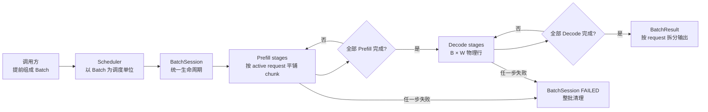
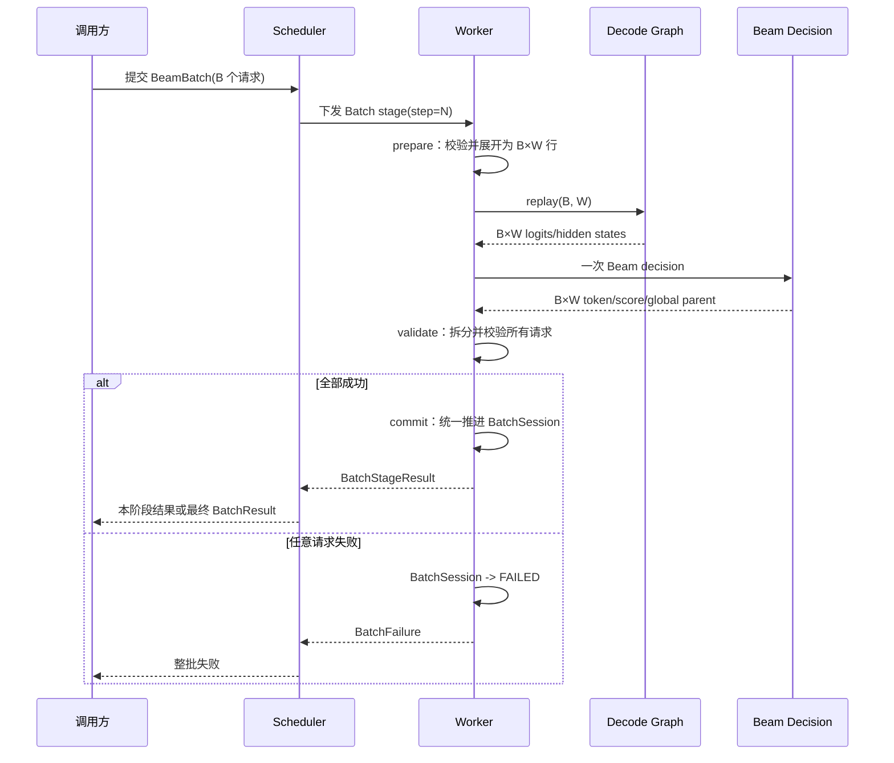
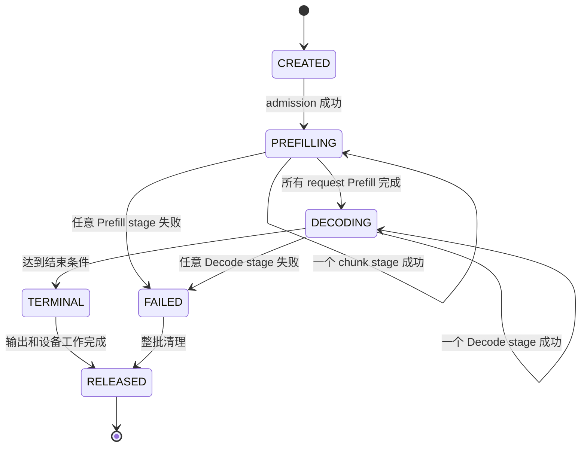
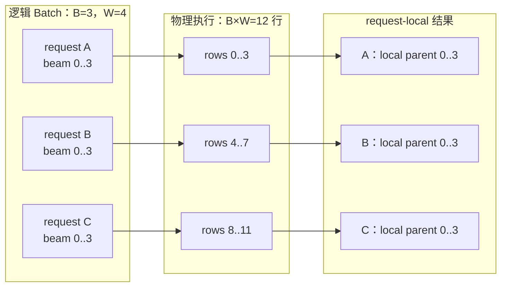
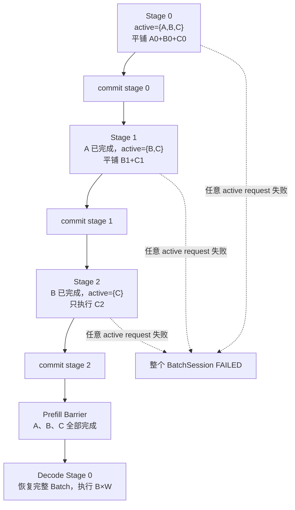
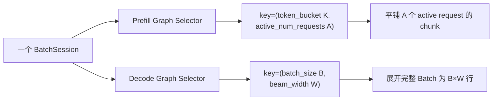
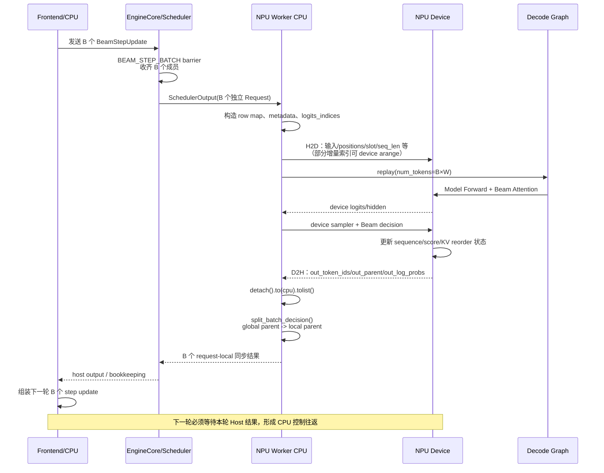
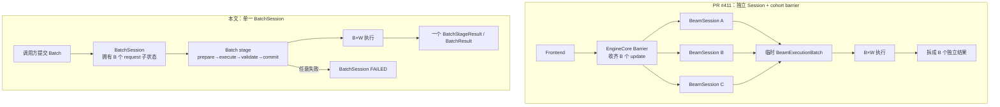

# Decode Graph 多 Batch 设计方案

## 1. 目标

调用方已经把多个 Beam 请求组成一个 batch 后再提交。运行时不负责动态组
batch，也不负责把不同请求重新配对；运行时只需要把当前 decode-graph 的
“单个 Request 调度一次”改成“整个 Batch 调度一次”。

本方案的目标是：

```text
一个输入 Batch
    -> 一次 Scheduler 调度
    -> 一次 Worker/ModelRunner 执行
    -> 一次 Decode Graph / Attention / Beam Decision
    -> 一个按请求拆分的 Batch 结果
```

这不是通用的动态 Continuous Batching 方案。Batch 的成员、顺序和 Beam
宽度由调用方在提交时确定，并在整个 Beam Decode 生命周期内保持不变。

整体架构如下：



## 2. 基本术语

- `B`：调用方提交的逻辑请求数。
- `W`：每个请求的 Beam width。
- `B * W`：Worker 和 NPU 实际看到的物理 Beam 行数。
- `batch_id`：一次用户 Batch 的唯一标识。
- `BatchSession`：一个 Batch 的完整运行时 session，拥有 Batch 内所有 request
  子状态和本次执行的共享资源。
- `request_id`：Batch 内单个请求的标识。
- `decode_step`：Batch 当前共同执行的 Decode step。

本方案要求一个 Batch 内所有请求使用相同的 `W` 和 `decode_step`。

## 3. 外部调用契约

调用方提交一个 Batch，而不是分别提交多个独立 Beam 请求：

```python
batch = BeamBatch(
    batch_id="batch-001",
    requests=[request_a, request_b, request_c],
    beam_width=128,
    max_decode_steps=3,
)

llm_engine.beam_search(batch)
```

运行时不在 Batch 内做以下操作：

- 动态增加请求；
- 动态移除请求并补入新请求；
- 修改请求顺序；
- 为不同请求选择不同 Beam width；
- 为不同请求执行不同 Decode step。

如果调用方需要新的 Batch，应提交新的 `batch_id`。

## 4. 一次 Decode 的执行流程

### Prefill

Batch 内的请求通过一次 `ADD_BATCH` 进入 EngineCore：

```text
ADD_BATCH
  ├── request A
  ├── request B
  └── request C
```

Prefill 阶段为每个请求建立自己的：

- Request/session 状态；
- prefix KV；
- Beam score/sequence 状态；
- suffix KV 所属 slot。

如果启用 chunked Prefill，`ADD_BATCH` 之后可能有多个 Prefill stage。每个
stage 包含当前仍未完成 Prefill 的 active request；已经完成的 request 保留在
BatchSession 中但不再重复执行。不能让 request A 先完成 Prefill、request B
还在等待时就进入 Decode。

### Decode

每个 Decode step 只产生一个 Batch 级调度事件：

```text
BEAM_BATCH_STEP(batch_id, decode_step)
```

Scheduler 选出这个 Batch 的全部请求后，整体生成一个
`SchedulerOutput`。Worker 不再按单个 Request 进入 decode，而是直接取出
整个 Batch 的 metadata 和输入。

执行流程如下：

```text
SchedulerOutput(B 个请求)
        |
        v
校验 batch_id / 请求顺序 / W / decode_step
        |
        v
展开为 B * W 个物理 Beam 行
        |
        v
一次 Model Forward / Attention / Beam Decision
        |
        v
按 request_id 拆分结果
        |
        v
更新 Batch 内每个请求的状态
```

从调度到返回的完整时序如下：



## 5. 物理数据布局

逻辑请求到物理 Beam 行的映射固定为：

```text
physical_row = request_index * W + beam_index
```

例如 `B=2, W=4`：

```text
request A -> rows 0, 1, 2, 3
request B -> rows 4, 5, 6, 7
```

以下数据都必须采用同一映射：

- `input_ids`；
- `positions`；
- `logits_indices`；
- sampling metadata；
- Beam parent index；
- suffix KV；
- sequence/score buffer。

NPU 可以使用展平后的 `[B * W, ...]` 视图，但逻辑状态仍然按
`[B, W, ...]` 归属到每个请求。

## 6. Scheduler 层改动

当前单请求逻辑大致是：

```text
选择一个 Request
    -> 生成单请求 SchedulerOutput
    -> Worker 执行
```

多 Batch 版本改为：

```text
取出一个已提交的 BeamBatch
    -> 验证 Batch 内请求均可执行
    -> 一次生成整个 Batch 的 SchedulerOutput
    -> Worker 一次执行整个 Batch
```

Scheduler 需要保证：

1. Batch 内请求在同一个 Decode step 被调度；
2. Batch 内请求顺序稳定；
3. Batch 不被拆成多个独立的 Beam decode；
4. 不把普通请求混入 Beam Batch；
5. Batch 未准备好时整体等待，而不是先执行其中一部分。

建议把 Batch 信息放在 `SchedulerOutput` 的独立字段中：

```python
BeamBatchMetadata(
    batch_id=batch_id,
    request_ids=(request_a, request_b, request_c),
    batch_size=B,
    beam_width=W,
    decode_step=step,
)
```

单个请求 metadata 继续保存 request-local 信息，例如 prefix 长度、parent
映射和 suffix 状态，不要把所有 Batch 状态复制到每个请求中。

## 7. Worker/ModelRunner 层改动

Worker 侧增加一个 Batch 入口：

```python
execute_beam_batch(scheduler_output, beam_batch_metadata)
```

该入口负责：

1. 根据 `request_ids` 找到对应 session；
2. 检查实际请求数是否等于 `B`；
3. 检查所有请求的 `W` 和 `decode_step` 是否一致；
4. 将每个请求的输入展开为 `B * W` 行；
5. 生成一次 attention metadata；
6. 调用一次 Model Forward 和 Beam Decision；
7. 将全局 parent index 转换为 request-local parent index；
8. 把结果按 `request_id` 拆分并更新各自 session。

### 7.1 Batch Session 是唯一执行 session

本方案采用更简单的生命周期：**Session 以 Batch 为单位，而不是以单个
Request 为单位**。

```text
BatchSession
  ├── request A 的 Beam 状态
  ├── request B 的 Beam 状态
  ├── request C 的 Beam 状态
  ├── 共享的 execution buffer
  ├── 共享的 graph/stream 执行上下文
  └── Batch 级生命周期和错误状态
```

Request 仍保留各自的 `request_id`、Beam score、sequence 和 KV 区域，但这些
都是 `BatchSession` 内部的子状态。外部只管理一个 Batch session：

```text
CREATED -> PREFILLING -> DECODING -> TERMINAL -> RELEASED
                              \\-> FAILED    -> RELEASED
```

Worker 不暴露“某个 request 单独成功、某个 request 单独失败”的执行语义。
Request 结果只是最终输出拆分，不是独立的 Worker 生命周期。

BatchSession 状态机如下：



### 7.2 每个 Worker stage 都是 Batch 事务

每个 stage 都遵循 all-or-nothing 规则：

```text
Batch stage 开始
    -> 准备整批输入
    -> 执行整批 Forward / Attention / Beam Decision
    -> 完成整批状态更新
    -> 提交整批结果

全部成功：提交本 stage
任意失败：丢弃本 stage 的临时状态，Batch 整体失败
```

不能出现 request A 已更新到 step 3、request B 仍停留在 step 2 的半提交状态。
如果设备执行、KV reorder、Beam decision 或结果拆分任一步失败，整个
`BatchSession` 进入 `FAILED`，统一释放所有 request 的 session、slot、KV
和 graph 相关资源。

Worker 应区分本 stage 的临时状态和已提交状态：只有整批 stage 完成后，才
推进 `decode_step` 以及所有 request 子状态。设备侧如果无法真正回滚，至少
要保证失败后的 BatchSession 不会再次执行，并统一释放相关资源。

### 7.3 当前单请求路径的改造点

当前单请求路径通常可以概括为：

```text
SchedulerOutput
    -> 找到一个 Beam request
    -> 构造该 request 的 input_ids / positions / logits_indices
    -> 构造 attention metadata
    -> Model Forward
    -> Beam Decision
    -> 更新一个 session
```

多 Batch 版本不应复制一份新的 Beam 算法，而应把上述路径拆成三个层次：

```text
Batch 校验与排序
    -> Batch 输入展开
    -> 复用现有 Forward / Beam Decision
```

建议的职责划分如下：

| 层次 | 主要职责 |
| --- | --- |
| `BeamBatchAdapter` | 校验 Batch、固定 request 顺序、构造 request 到物理行的映射 |
| `BeamInputBuilder` | 将 B 个 request-local 输入展开成 B*W 行 |
| 现有 ModelRunner/Attention | 消费批量输入，执行一次 Forward |
| 现有 Beam Decision | 在 B*W 行上执行一次选择 |
| `BeamResultSplitter` | 将全局结果转换为 request-local 结果 |

这样可以尽量保持现有单请求 Beam decision 和 KV kernel 不变，把主要变化限制
在输入/输出边界。

### 7.4 Worker 每次执行的具体步骤

Worker 收到 `SchedulerOutput` 后，建议按以下顺序处理：

1. **识别 Batch**：确认当前执行的是 Beam Batch，而不是普通请求或单请求兼容路径。
2. **固定顺序**：从 `beam_batch.request_ids` 获取顺序，不使用临时 dict 的遍历顺序。
3. **校验几何**：检查 `B`、`W`、`decode_step`、scheduled token 数和 terminal 状态。
4. **加载 session**：按照 request ID 找到各自的 Beam session 和 KV slot。
5. **构造物理布局**：建立 `request_index -> row_offset`，其中
   `row_offset = request_index * W`。
6. **展开输入**：复制/映射 input IDs、位置、logits index 和 sampling metadata，
   使其对应 B*W 行。
7. **构造 attention metadata**：prefix KV 仍按 request 绑定，suffix KV 使用
   当前 request 的 W 个 Beam 行。
8. **执行一次模型计算**：一次 Forward 和一次 Beam decision，不在循环中逐请求调用。
9. **更新 KV 和设备状态**：按每个 request 的 parent 进行本地 suffix KV reorder。
10. **拆分结果**：为每个 request 生成独立的 decision/output，并更新各自 session。

关键点是：第 8 步是 Batch 级别的；第 9、10 步虽然按 request 拆分数据，
但必须在 Batch 级事务中统一提交，不能让某个 request 单独推进生命周期。

### 7.5 输入 buffer 的设计

第一版建议使用固定容量 buffer：

```text
input_ids       [B * W]
positions       [B * W]
logits_indices  [B * W]
sampling data   [B * W, ...]
```

逻辑上每个 request 的 W 行连续存放。Worker 只更新本轮有效内容，不在每个
Decode step 重新分配 Tensor。

如果 Decode Graph 需要固定容量，可以使用：

```text
allocated rows = configured_B * W
valid rows     = actual_B * W
```

不过第一版更建议要求 `actual_B == configured_B`，先避免 padding 行被错误地
参与 attention 或 Beam selection。

### 7.6 session 和 buffer 的所有权

建议明确以下所有权：

- Scheduler：拥有 Batch 成员、顺序和 Decode step；
- Worker：拥有 BatchSession 到 session/slot 的映射和执行 buffer；
- Attention context：拥有 prefix/suffix KV 的物理存储；
- Beam decision：拥有设备端 sequence、score 和 parent 状态；
- Frontend：拥有最终输出组装和用户 request 生命周期。

BatchSession 统一拥有 Batch 内的 request 子状态。只有 Batch 完整 terminal
或明确失败时，才由 Worker 统一释放所有 request 子状态、slot 和共享资源。

## 8. KV 和 Beam 状态

Prefix KV 继续使用现有 paged KV 机制。Beam 分叉后的 suffix KV 必须按请求
隔离：

```text
logical layout: [B, W, max_decode_steps, ...]
kernel view:    [B * W, max_decode_steps, ...]
```

NPU 返回的 parent index 如果是全局物理行索引，需要先转换：

```python
local_parent = global_parent - request_index * W
```

如果转换后 parent 不在 `[0, W)` 范围内，说明出现跨请求 parent，必须直接
报错，不能继续执行。

Decode 的逻辑请求、物理行和结果拆分关系如下：



## 9. Decode Graph 设计

Decode Graph 以固定执行几何进行捕获。需要区分 Decode 和 Prefill：

```text
Prefill：输入是 prompt chunk，物理行数约等于 token 总数 T
Decode ：输入是每个请求的 W 个 Beam，物理行数是 B * W
```

### 9.1 Decode Graph

Decode 图的逻辑 key 应该是：

```text
(batch_size=B, beam_width=W)
```

底层 vLLM `BatchDescriptor` 可以映射为：

```python
BatchDescriptor(
    num_tokens=B * W,
    num_reqs=B,
    uniform=True,
)
```

如果准备支持 3 种 Batch size 和 3 种 Beam width，例如：

```text
B ∈ {1, 2, 4}
W ∈ {64, 128, 256}
```

那么最多需要捕获：

```text
3 种 B × 3 种 W = 9 张 Decode Graph
```

这 9 张图不是 9 个 Decode step，而是 9 种固定执行几何。每一张图可以在
自己的 BatchSession 内复用多个 Decode step。

Decode 图固定：

```text
B 固定
W 固定
B * W 固定
模型和 KV buffer 地址固定
```

每个 Decode step 只更新 graph 输入 buffer 的内容，不重新构建 graph。

如果需要支持多个 Batch size，可以选择：

1. 为常用的 `B` 建立多个 graph bucket；或
2. 将较小 Batch padding 到固定容量，并额外传入有效行数。

对于你当前的 BatchSession 设计，建议第一版直接使用 `(B, W)` 精确匹配，
不做 padding。这样 BatchSession 从创建开始就绑定一张 Decode Graph，整个
session 的每个 stage 都复用同一张图。

### 9.2 Prefill Graph 和 chunk

Prefill 的输入不是 `B * W`，而是当前调度轮每个 request 的 prompt chunk：

```text
request A 本轮 chunk：c1 个 token
request B 本轮 chunk：c2 个 token
request C 本轮 chunk：c3 个 token

平铺后的 input_ids：
[A 的 c1 个 token][B 的 c2 个 token][C 的 c3 个 token]

总 token 数 T = c1 + c2 + c3
```

因此 Prefill graph 的逻辑 key 不是 `(B, W)`，而是：

```text
(token_bucket=K, num_requests=B)
```

其中 `K` 是大于等于本轮总 token 数 `T` 的最小 graph bucket。`c1/c2/c3`
可以不同，不需要为每一种 chunk 分配一张图；它们通过运行时 metadata 表达：

```text
query_start_loc = [0, c1, c1+c2, c1+c2+c3]
seq_lens        = [A 的 KV 长度, B 的 KV 长度, C 的 KV 长度]
slot_mapping    = 当前 B 个 request 的 KV 写入位置
```

Prefill replay 的流程是：

```text
SchedulerOutput
  -> 读取每个 request 的 num_scheduled_tokens
  -> 按固定 request 顺序平铺 input_ids / positions / slot_mapping
  -> 计算总 token 数 T
  -> 选择最小 bucket K >= T
  -> 将 query_start_loc / seq_lens / block table 写入静态 buffer
  -> replay (K, B) 对应的 Prefill Graph
```

这里要注意两点：

1. graph 的输入 buffer 按 `K` 分配，实际只有前 `T` 个 token 有效，剩余位置
   必须 padding 并屏蔽 KV 写入；
2. 不同 request 的 chunk 不能只简单拼接而丢失边界，`query_start_loc` 是
   attention 正确区分 request 的关键。

当前代码的 GPU Prefill runner 已经按 `(bucket, num_reqs)` 保存图；NPU runner
当前主要按 bucket 保存图，再在 replay 时更新 request 数和 task metadata。对
统一的多 Batch 设计，建议在上层仍把 Prefill graph 视为 `(K, B)`，这样 graph
选择、容量检查和 BatchSession 语义一致。

### 9.3 Prefill 和 Decode 的 BatchSession 关系

如果一个 Batch 的 Prefill 需要多个 chunk，不能把每个 chunk 当成一个新的
BatchSession。正确关系是：

```text
一个 BatchSession
  ├── Prefill chunk 0：B 个 request，平铺后 replay (K0, B)
  ├── Prefill chunk 1：B 个 request，平铺后 replay (K1, B)
  ├── ...
  └── Prefill 完成后进入 Decode：replay (B, W)
```

需要区分 **BatchSession 的固定成员** 和 **当前 Prefill stage 的 active 成员**。
一个 Batch 内可能出现：

```text
request A：Prefill 已完成
request B：还剩 200 个 prompt token
request C：还剩 80 个 prompt token
```

这时不能让 A 再次执行 Prefill，也不能给 A 填一个假 token。正确处理是：

```text
BatchSession 固定成员：A、B、C
当前 Prefill stage active 成员：B、C
```

Worker 只把 B/C 的 chunk 平铺到本轮 Prefill 输入中，A 保持已提交状态并
等待。当前 stage 成功后只推进 B/C 的 Prefill progress；A 的状态不变。

因此 Prefill graph 的实际 key 应该使用当前 active 数：

```text
(token_bucket=K, active_num_requests=A)
```

这里的 `A` 不一定等于 BatchSession 的总请求数 `B`。只有当所有请求都完成
Prefill 后，BatchSession 才切换到 Decode：

```text
Prefill stage 0: active={A,B,C}
Prefill stage 1: active={B,C}
Prefill stage 2: active={C}
全部完成
       ↓
Decode: 固定使用 BatchSession 全部 B 个请求，物理行数 B * W
```

Prefill 阶段如果当前 active request 中任意一个失败，整个 BatchSession 失败；
不能让部分 request 提前进入 Decode。已完成 Prefill 的 request 只是等待，
不是一个新的独立 session。

如果产品要求每个 Prefill graph 每轮都必须保持总 B 的固定形状，则需要支持
zero-query request（`query_start_loc` 中允许相邻边界相同，并且该 request 不写
KV）。这是额外的 attention/kernel 语义，第一版不建议采用；优先使用
`active_num_requests` 选择 Prefill graph。

以三个不同长度的 prompt 为例，chunked Prefill 的推进过程如下：



Prefill 与 Decode 使用不同的 graph 选择维度：



Prefill 和 Decode 的 graph 数量也因此不同：

```text
Decode：由 B × W 组合决定
Prefill：由 token bucket K × request 数 B 决定
```

## 10. 结果返回

NPU 完成一次 Batch Decode 后，结果按请求拆分：

```python
BatchDecision(
    batch_id="batch-001",
    decode_step=step,
    results={
        request_a: RequestDecision(...),
        request_b: RequestDecision(...),
        request_c: RequestDecision(...),
    },
)
```

每个 `RequestDecision` 只包含本请求范围内的：

- token；
- score；
- local parent index；
- terminal 标志；
- 下一步需要的 Beam 状态。

非 terminal step 可以只返回轻量的控制结果；terminal step 再返回完整序列
和最终 score。

## 11. 第一版明确不支持的能力

为了保持实现简单，第一版不支持：

- 动态 continuous batching；
- Batch 内请求中途加入或退出；
- 不同请求不同 Beam width；
- 不同请求不同 Decode step；
- 单请求提前 EOS 后立即补入新请求；
- Batch 内混入普通请求；
- 多个 Batch 同时复用同一套固定 Beam graph；
- 动态调整 `B * W` 的 graph shape。

如果一个请求失败或取消，第一版直接让整个 Batch 失败并统一清理，先不要做
动态压缩和 slot 重排。

## 12. Worker 层主要风险

### 12.1 请求顺序错位

最危险的问题是 input、KV、parent 和 request ID 使用了不同的排序。结果可能
看起来合法，但实际上把请求 A 的 KV 配给了请求 B。

必须保留一个 Batch 内唯一的有序 request 列表，并在输入构造、attention
metadata、结果拆分三个位置复用它。

### 12.2 全局 parent 没有转换为本地 parent

NPU 使用 `B*W` 行后，parent index 可能是全局行号。直接把它用于单请求 KV
reorder 会越界，或者把一个请求的 Beam 重排到另一个请求中。所有 parent 在
进入 request-local KV 操作前都必须减去对应的 `row_offset` 并校验范围。

### 12.3 单请求逻辑中的隐式 batch=1 假设

需要重点检查：

- `tensor[0]`、`slot=0`、`batch_size=1`；
- 只取第一个 request 的 prefix/cache_len；
- 只生成一份 logits index；
- 只更新一个 session 的 decode step；
- 只返回一个 terminal payload；
- 以 `len(scheduler_output.requests) == 1` 为前提的断言。

这些假设通常不会在 Python 层立即报错，而会在 graph 或 NPU kernel 中表现为
错误结果。

### 12.4 Graph shape 和 buffer 地址不匹配

Graph capture 绑定了输入 shape、buffer 地址和部分 attention metadata。不能在
graph 已捕获后动态扩大 Batch buffer，也不能让下一轮使用不同的 B*W shape。

建议：

- 启动时一次性分配最大容量；
- graph 只绑定固定容量；
- 运行中只修改 buffer 内容；
- 超过容量直接拒绝；
- 不在请求路径中重新 capture graph。

Prefill 还要额外检查 `(token_bucket, num_requests)`：不能只用总 token 数
作为 key。两个 Batch 即使总 token 数相同，如果 request 数不同，
`query_start_loc`、`seq_lens`、block table 和 attention metadata 的形状也
可能不同。

### 12.5 Prefix KV 和 suffix KV 混用

Prefix KV 可以共享 paged cache，但 suffix KV 已经按 Beam 分叉，必须使用
request-local 的 pool slice。若 Batch 适配层错误地把所有 suffix 拼成一个普通
连续 cache，Beam 之间的历史会互相污染。

### 12.6 不对称 EOS、取消和异常

如果 Batch 内只有一个请求完成，而其它请求仍需 Decode，第一版不能直接复用
该物理行给新请求。否则旧请求的 KV、sequence 或 score 可能残留。

第一版建议采用最简单策略：

```text
任一 request 失败/取消/提前结束
    -> 标记整个 Batch 失败或进入统一 terminal
    -> 释放所有 session/slot
```

### 12.7 普通请求混入 Batch

普通请求的 token 数、attention metadata 和采样语义可能与 Beam 请求不同。不要
在 Worker 内把普通请求和 Beam B*W 行简单拼接。第一版可以要求 Beam Batch 独占
一次执行，后续再设计异构 SchedulerOutput 的分区执行。

### 12.8 Batch stage 部分成功

不能先更新 request A 的 session，再处理 request B；否则 BatchSession 会进入
不可恢复的半提交状态。

建议每个 stage 使用明确的四步提交协议：

```text
prepare -> execute -> validate -> commit
```

- `prepare` 只写本 stage 的临时 input/output buffer；
- `execute` 只产生临时 device output；
- `validate` 检查所有 request 的 shape、parent、token 和 terminal 状态；
- `commit` 一次性推进 BatchSession 的 `decode_step` 和所有 request 子状态。

如果底层设备无法真正回滚，失败后也必须将 BatchSession 标记为不可重试，
直接进入统一清理流程。

### 12.9 结果拆分和资源释放不同步

不能因为某个 request 的结果已经拆出，就立即释放整个 BatchSession 的共享执行资源。
必须等：

1. 所有 request 的 terminal 结果都已生成；
2. 设备端 KV reorder/写入完成；
3. graph/stream 上的相关工作完成；
4. BatchSession 的所有 request 子状态和 slot 都释放。

## 13. 验证重点

Worker 多 Batch 最少需要验证以下等价关系：

```text
Batch(A, B) 的 A 结果
    == 单独执行 A 的结果

Batch(A, B) 的 B 结果
    == 单独执行 B 的结果
```

验证时要覆盖：

- B=1 与 B>1；
- W=1 与实际 Beam width；
- 多个 Decode step；
- prefix KV 命中和未命中；
- terminal step；
- 不同 prompt 长度；
- parent reorder；
- graph 和 eager 两种执行模式。

## 14. 推荐实现顺序

1. 增加 `BeamBatchMetadata` 和固定的 `request_index -> physical_row` 映射；
2. 将 Scheduler 的单请求 Decode 输出改成 Batch 级输出；
3. 在 Worker 增加 `execute_beam_batch()`，先完成输入展开、顺序校验和结果拆分；
4. 将现有单请求 attention/Beam decision 改为消费 `B * W` 行；
5. 固定一个 `B` 做 Decode Graph capture；
6. 验证 Batch 结果与逐请求独立执行结果一致；
7. 后续再考虑多 graph bucket、padding、EOS 压缩和动态 Batch。

最终目标不是把多个请求合并成一个逻辑请求，而是：

> Scheduler 以 Batch 为调度单位，Worker/NPU 以 `B * W` 为执行单位，结果仍然以单个 request 为归属单位。

## 15. PR #411 的独立设计方案

本节单独描述 [PR #411](https://github.com/JiusiServe/vllm-gr/pull/411) 的方案，
并与本文前面的 BatchSession 方案对比。两者不是同一个设计，也不把 PR #411
作为本文方案的实现参考。

### 15.1 PR #411 的目标和范围

PR #411 从 PR #395 中只拆出了同步 Multi-Batch 部分。它扩展的是现有同步
`GRLLM.beam_search()`，支持 Ascend NPU/xllm 上固定成员的 B>1 Beam cohort。

它明确不包含：

- resident Request；
- native async scheduling；
- `beam_async` 或 `async_beam_search()`；
- dynamic continuous batching；
- Prefill/Decode 混合 cohort；
- 请求中途加入、替换或独立退出；
- TP、PP、DP 大于 1。

### 15.2 PR #411 的 Session 模型

PR #411 保留 B 个独立的逻辑 Request 和 Beam Session：

```text
request A -> BeamSession A -> slot 0
request B -> BeamSession B -> slot 1
request C -> BeamSession C -> slot 2
```

它没有把这三个 Session 合成一个 BatchSession。Worker 执行时临时创建一个
`BeamExecutionBatch`：

```text
BeamExecutionBatch
  ├── BeamSession A
  ├── BeamSession B
  └── BeamSession C
```

`BeamExecutionBatch` 是零拷贝执行视图，不拥有这些 Session 的生命周期。它
只把 B 个独立 Session 暴露成连续的 `B * W` 物理行。

### 15.3 PR #411 的调度方式

Prefill 继续通过现有 `ADD_BATCH` 提交。Decode 时，Frontend 为同一步的 B 个
Request 分别生成 `BeamRequestStepUpdate`，再一起发送：

```text
BEAM_STEP_BATCH
  ├── update(request A, step=N)
  ├── update(request B, step=N)
  └── update(request C, step=N)
```

每个 update 携带相同的 cohort key。EngineCore 维护：

```text
expected[cohort_key] = B
pending[cohort_key] = 已到达的 Request
```

只有 pending 数量达到 B，才将这些独立 Request 全部放入 Scheduler。这个
barrier 防止其中一个 Request 提前进入 Worker，但 Scheduler 看到的仍然是 B
个独立 Request，不是一个 Batch Request。

### 15.4 PR #411 的 Worker 执行方式

Worker 收到同一个 cohort 的 B 个 Request 后：

1. 按 Scheduler 顺序找到 B 个 Beam Session；
2. 检查 slot 必须连续为 `0..B-1`；
3. 检查 Beam width、Decode step 和 terminal 状态一致；
4. 创建 `BeamExecutionBatch`；
5. 将输入、positions、logits indices 和 sampling metadata 展开成 `B * W`；
6. 用一次 xllm attention 和一次 NPU Beam decision 执行整个 cohort；
7. 将全局 parent index 转换成每个 Request 的本地 `0..W-1`；
8. 将结果拆成 B 个 request-local payload，通过原有结果通道分别返回。

PR #411 的物理行布局也是：

```text
request i -> [i * W, (i + 1) * W)
```

但状态所有权仍属于每个独立 Session。

### 15.5 PR #411 的 KV 设计

每个 Request 保留自己的 prefix KV 和 suffix KV。执行时，
`BeamExecutionBatch` 将 suffix KV 临时展平为 `B * W` 视图，供 xllm 使用；
写回时恢复 request-local 的 `[B, W, ...]` 所有权布局。

Beam decision 返回的是 cohort 全局 parent index。对于第 `i` 个 Request：

```text
local_parent = global_parent - i * W
```

转换后不在 `[0, W)` 范围内，说明出现跨 Request parent，整个 cohort 失败。

这里包含两种不同性质的操作：

1. suffix KV 的 `[B, W, ...] -> [B * W, ...]` 使用 `view/reshape` 建立零拷贝
   Tensor 视图，只修改 Host 侧 Tensor metadata，不搬运设备数据，也不启动
   NPU kernel；只要底层存储连续，这部分延迟通常可以忽略；
2. PR #411 的 `global_parent -> local_parent` 在最终结果已经搬到 Host 后，由
   `split_batch_decision()` 对 Python 列表做减法和范围校验。计算本身很小，但
   其前面的 D2H 同步和 Tensor `tolist()` 不属于零成本操作。

对于本文方案，如果单个 Decode stage 的额外预算要求小于 0.5 ms，应采用：

- steady Decode step 只创建/复用固定视图，不复制 suffix KV；
- parent offset 在已有 Beam decision/KV reorder kernel 内融合完成，或继续保留
  global parent 供设备侧消费；
- 非 terminal step 不做完整 parent/sequence D2H 和 Python `tolist()`；
- terminal step 才拆分 Host 结果；
- `(B, W)` graph 不匹配时不能静默回退 eager，因为 graph fallback 的额外延迟
  通常比 layout view 更值得关注；
- 对 layout、parent localization、KV reorder、D2H 和 Host split 分别打点，
  用设备 event 与 Host 单调时钟验证 0.5 ms 预算。

因此 0.5 ms 的主要风险不是 `[B, W]` 与 `[B * W]` 的视图转换，而是额外的
同步、拷贝、Host materialization 和 graph fallback。

### 15.6 PR #411 的 Decode Graph

PR #411 启动时按配置的最大容量构造 dummy cohort：

```text
B = beam_max_batch_size
W = beam_max_width
physical_width = B * W
```

捕获的 NPU Decode Graph key 实际按总物理行数记录：

```python
BatchDescriptor(
    num_tokens=beam_max_batch_size * beam_max_width,
    uniform=True,
)
```

同时在 `_beam_graph_keys` 中记录这个总物理宽度。运行时只有实际
`num_tokens` 与捕获宽度精确相等才走 FULL graph，否则回退 eager。

因此 PR #411 当前不是按 3 种 B × 3 种 W 捕获 9 张图，而是按启动配置捕获
一张最大 `B * W` 图。较小的实际 B 不会自动选择另一张 `(B, W)` 图。

这个 key 只记录总物理宽度，不能区分以下两种逻辑几何：

```text
B=1, W=128
B=2, W=64
```

PR #411 依靠启动配置和固定 cohort 约束避免混用，而本文 BatchSession 方案
则将 `(B, W)` 明确作为 Decode graph 的逻辑 key。

### 15.7 PR #411 对 Prefill 的处理

PR #411 的主要设计对象是同步 Decode cohort。Prefill 沿用当前
`ADD_BATCH`、Scheduler 和现有 Prefill graph 路径，没有定义一个贯穿
chunked Prefill 的 BatchSession，也没有定义“所有 Request Prefill 完成后统一
切换 Decode”的 Batch 级状态机。

其 RFC 明确把 mixed Prefill/Decode cohort、continuous batching 和独立成员进度
排除在范围之外。因此下面这种状态不是 PR #411 本次重点解决的问题：

```text
request A：Prefill 已完成
request B：仍在执行 Prefill chunk
```

它的同步保证主要从 Decode cohort barrier 开始。本文方案则从 Prefill 开始就
由同一个 BatchSession 管理，并显式记录 `active_prefill_requests`，全部完成后
才整体进入 Decode。

### 15.8 PR #411 的完整同步 Decode 数据流

下面这张图按 PR #411 当前 NPU 路径标出了主要 Host/Device 边界：



按阶段展开，PR #411 的数据流是：

1. **Batch update 是 Host 控制消息**：Frontend 为 B 个 Request 生成各自的
   `BeamRequestStepUpdate`，通过 `BEAM_STEP_BATCH` 发送到 EngineCore；
2. **EngineCore 只做 barrier，不把 batch 变成一个设备 session**：它记录
   expected/pending 成员，收齐后仍向 Scheduler 注册 B 个独立 Request；
3. **Worker 准备输入**：`_beam_remap_inputs()` 生成 B×W 的 row mapping、
   positions、logits indices 和 sampling metadata。增量 Decode 的 position
   可以直接写 device buffer，连续 logits index 可以用 device `arange`；非连续
   index、普通输入和部分 metadata 仍可能走 Host→Device copy；
4. **图内执行**：Decode Graph 只覆盖 Model Forward/Beam Attention。它读取
   固定地址的 device input、KV 和 metadata，图本身不把 Beam 结果返回 Host；
5. **图外 Beam decision**：采样和 `run_beam_decision()` 在 device 上执行，
   更新 device sequence、score 和 KV 相关状态；
6. **同步结果回传**：当前 PR 的 NPU 兼容路径会对 decision tensor 执行
   `value.detach().to("cpu").tolist()`，至少把 `out_token_ids`、
   `out_token_index`、`out_log_probs` 搬回 Host，terminal step 还包括
   `out_sequence`；
7. **Host 拆分和路由**：`split_batch_decision()` 在 CPU 上做 global parent
   到 local parent 的转换，并生成 B 个 request-local payload；
8. **下一轮重新下发**：同步 bookkeeping 和 Frontend 消费 Host 结果，重新组装
   下一轮 B 个 step update，再回到 EngineCore barrier。

数据搬运边界可以直接看成下面这条链路：

```text
Frontend 发送 B 个 update
    ↓
EngineCore 收齐 cohort
    ↓
Scheduler 管理 B 个独立 Request
    ↓
Worker 构造 B×W 输入
    ↓
H2D：输入、positions、slot、seq_len 等
    ↓
Decode Graph：Model Forward + Beam Attention
    ↓
Device sampler + Beam decision
    ↓
D2H：token、parent、score
    ↓
CPU tolist()
    ↓
CPU split_batch_decision()
    ↓
返回 B 个 request-local 结果
    ↓
Frontend 重新构造下一轮 update
```

简单说：

- Graph 和 Beam decision 中间主要在 device 上执行；
- 每轮 decision 之后，PR #411 会把结果 D2H 到 CPU；
- CPU 做 `tolist()`、parent 拆分和结果路由；
- 下一轮必须等 CPU 结果回来后才能继续下发。

所以 PR #411 虽然有 device-resident Beam state，但控制链路仍是同步的：

```text
Device → Host → CPU 处理 → 下一轮下发
```

这就是它和当前“Device 持久化、Host 只收 ACK、CPU 不等待完整结果”设计的
根本区别。

这里的关键不是有没有 device-resident Beam buffer，而是每个 Decode step 都有
一条强制的：

```text
Device decision -> D2H -> CPU split/bookkeeping -> Host protocol -> 下一轮
```

所以 PR #411 属于“设备上保存 Beam 状态、Host 上驱动同步 step”的方案，不是
“设备状态自推进、Host 只收 ACK”的异步方案。

### 15.9 PR #411 与当前 device-persistent 异步模型的冲突

你们当前模型要求：

```text
CPU 下发 stage N
    -> 不等待完整结果
    -> CPU 准备 stage N+1
    -> Device 依赖和 stream/event 保证顺序
    -> Host 只接收轻量 ACK/terminal proof
```

而 PR #411 是：

```text
CPU 下发 stage N
    -> 等待 sampler/decision 结果回到 Host
    -> CPU 做 parent/result 拆分
    -> CPU 重新构造 stage N+1 的 Request update
    -> 再下发 stage N+1
```

因此，PR #411 不能直接作为当前异步 device-persistent 路径的实现。即使它
复用了 device Beam context，下面几处仍然会打破无 bubble 逻辑：

- NPU decision 后的每步 D2H；
- NPU 路径上的 `tolist()` 和 Host result materialization；
- Frontend/EngineCore 对下一轮 Request update 的重新注册；
- Host 侧 global/local parent 处理；
- 同步 bookkeeping 对 sampled/logprob 的 Host 复制；
- 下一轮 Decode 依赖上一轮 Host 消费完成。

如果要把 PR #411 的 `B×W` 执行布局迁移到当前异步模型，只能提取这些部分：

```text
Batch capacity
BeamExecutionBatch 的 row mapping
suffix KV 的 B×W view
一次 batch Beam decision
request-local 结果映射规则
```

不能直接提取它的同步控制链路和每步 Host result transport。当前异步版本应
改为：

```text
device sequence/score/parent 持久化
    -> device 侧直接生成下一步 input_ids
    -> 下一阶段只传 batch ACK / terminal proof
    -> terminal 时才做一次 compact D2H
```

### 15.10 PR #411 与本文 BatchSession 方案的区别

| 维度 | PR #411 | 本文 BatchSession 方案 |
| --- | --- | --- |
| 生命周期单位 | B 个独立 Request/BeamSession | 一个 BatchSession，内部包含 B 个 request 子状态 |
| Scheduler 看到的对象 | B 个独立 Request | 一个 Batch 调度单元 |
| 同步机制 | EngineCore cohort barrier 收齐 B 个 update | BatchSession 自身按 stage 推进 |
| Worker 执行对象 | 临时 `BeamExecutionBatch` 视图 | 持久 BatchSession |
| Stage 原子性 | barrier + fail-closed 校验，但 Session 分别存在 | 明确 `prepare -> execute -> validate -> commit`，整批提交 |
| Prefill | 复用现有 `ADD_BATCH`，主要设计 Decode 同步 | BatchSession 管理 chunk、active 子集和 Prefill 完成 barrier |
| Decode | B 个独立 Request 同步进入 `B * W` 执行 | 整个 BatchSession 直接执行 `B * W` |
| 结果 | 拆成 B 个 request-local 结果分别返回 | 先形成 BatchResult，再按用户接口拆分 |
| 失败 | 任一成员错误使 cohort 无效，清理各 Session | 任一 stage 错误使 BatchSession 整体失败并统一清理 |
| Decode graph key | 启动配置下的总物理宽度 `B * W` | 显式 `(B, W)`，可形成 B/W graph 矩阵 |
| 较小 Batch | graph 不匹配时通常回退 eager | 选择对应 `(B, W)` graph |
| 动态成员 | 不支持 | 第一版同样不支持 |
| B=1 兼容性 | 默认 B=1，尽量保留现有路径 | 需要让 B=1 也进入统一 BatchSession 抽象或保留兼容适配层 |

两种方案的结构差异如下：



### 15.11 两种方案的主要取舍

PR #411 的优点是改动相对局部：保留现有 Request、Scheduler 和 Session 模型，
只在 Decode 入口增加 cohort barrier，并在 Worker 增加执行视图。B=1 兼容成本
较低。

它的复杂度在于必须持续证明 B 个独立 Session 没有发生顺序、step、slot、
terminal 或 KV 状态漂移；Prefill chunk 和 Batch 级生命周期也没有被一个统一
对象覆盖。

本文 BatchSession 方案的优点是生命周期和失败语义简单：Scheduler、Worker
和每个 stage 都以 Batch 为单位，全成或全败。Prefill chunk、Decode 和 terminal
可以放在同一个状态机内。

它的代价是需要更深地改造 Scheduler 和 Worker 接口，并需要管理 `(B, W)`
Decode graph 矩阵以及 `(token_bucket, active_num_requests)` Prefill graph 选择。
