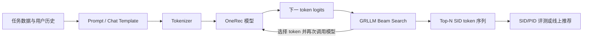
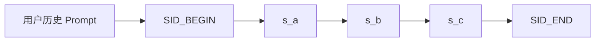
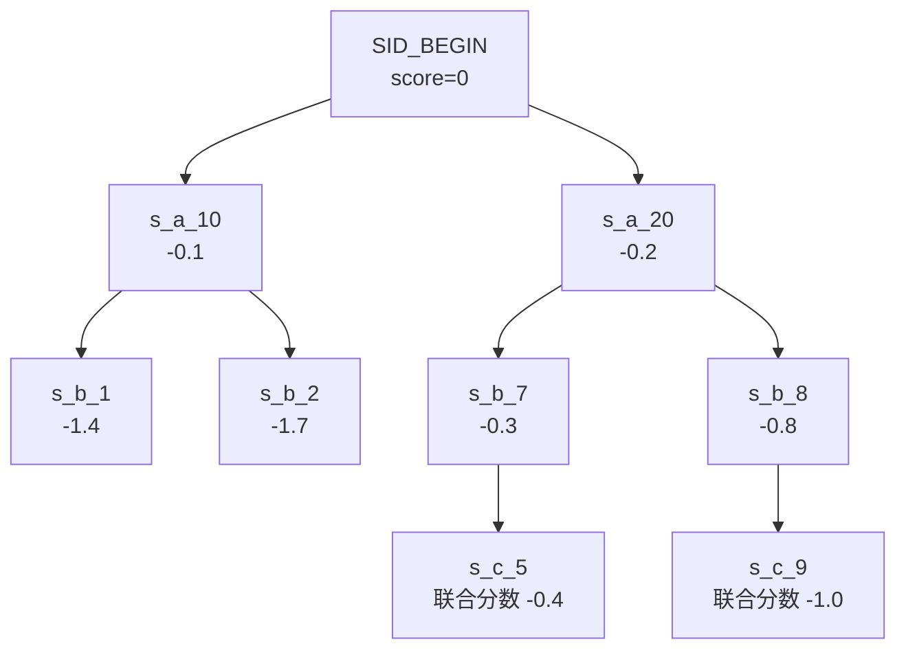
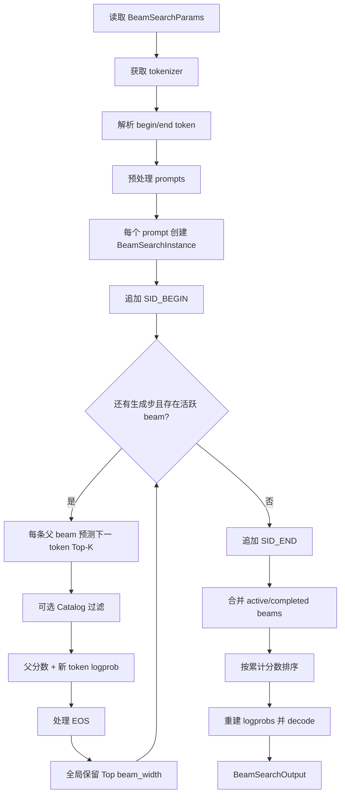
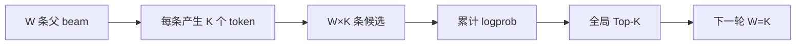
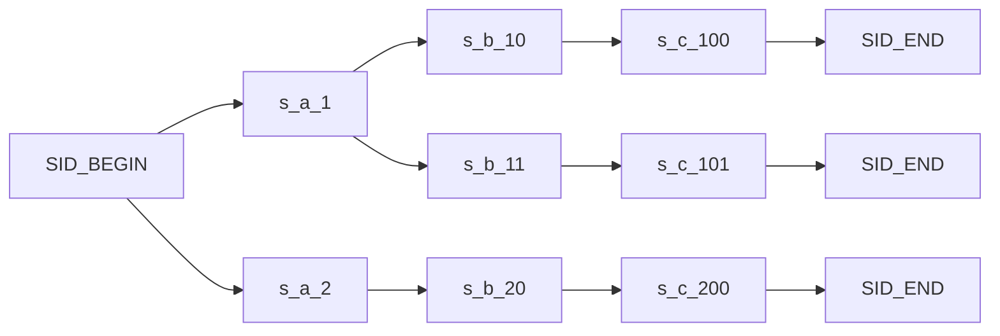
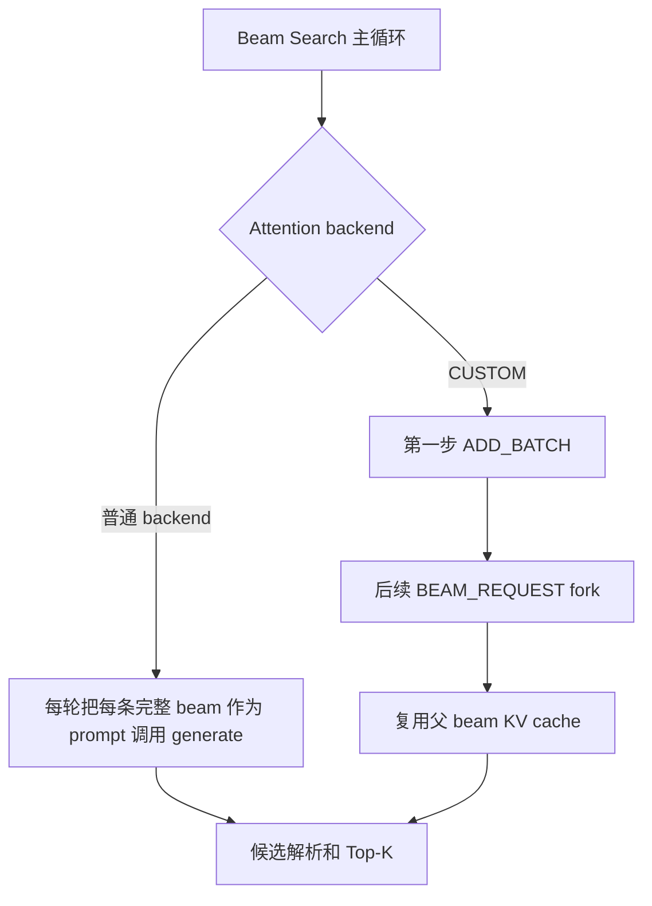
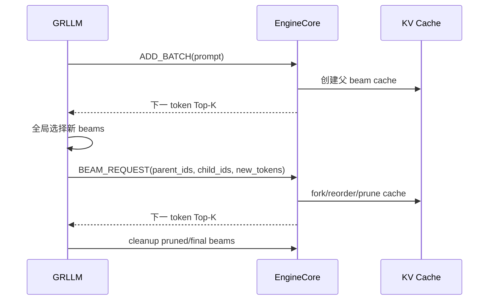
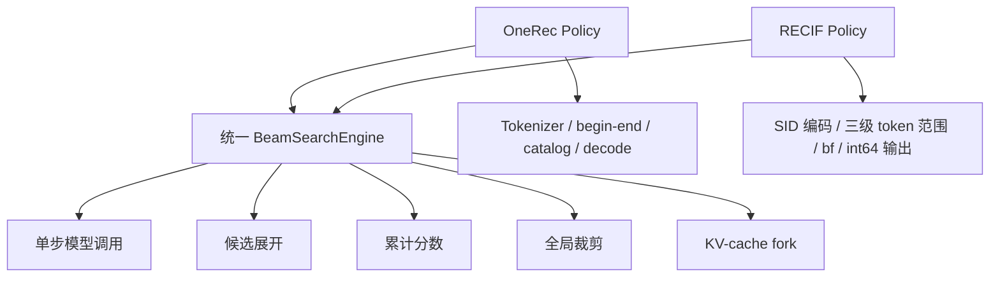

# OneRec 模型与 vLLM-GR Beam Search 详解

本文从当前仓库的实际代码出发，解释两个容易混在一起的概念：

1. OneRec 模型接收什么、生成什么；
2. `GRLLM.beam_search()` 如何调用模型并搜索多个候选。

本文只描述仓库代码能够确认的行为。OneRec 的训练流程、Semantic ID
聚类方法和具体网络层配置由模型 checkpoint 提供，不在本仓库中重新实现。

## 1. 一句话概括

OneRec 把推荐问题转化为自回归 token 生成问题：将用户历史和任务描述组织成
prompt，让语言模型生成代表目标物品的 Semantic ID token 序列。

```text
用户历史和任务描述
        ↓
OneRec 自回归模型
        ↓
<|sid_begin|><s_a_4113><s_b_7330><s_c_2009><|sid_end|>
        ↓
解析为一个推荐物品的 Semantic ID
```

vLLM-GR 的 `beam_search()` 不修改模型本身。它反复让模型预测“下一个 token”，
保留累计概率最高的若干条 token 序列，从而一次得到多个候选物品。

## 2. 模型与搜索器的职责边界



各部分职责如下：

| 部分 | 主要职责 |
| --- | --- |
| OneRec 模型 | 根据已有 prompt 和已生成 token，计算下一个 token 的 logits |
| Tokenizer | 在文本、SID 特殊 token 和 token ID 之间转换 |
| `GRLLM.beam_search()` | 展开候选、累计 logprob、全局排序和裁剪 |
| Catalog | 根据当前 SID 前缀，限制下一步允许出现的 token |
| Evaluator | 将生成 SID 与 ground truth 对比并计算指标 |

重要结论：模型负责“打分”，beam search 负责“搜索”。模型并不知道最终要保留多少
条 beam；beam search 也不负责学习 SID 的含义。

## 3. OneRec 在本仓库中的加载方式

本仓库没有定义一个单独的 `OneRecForCausalLM` Python 模型类。`GRLLM` 继承 vLLM
的 `LLM`，把模型路径和其他参数交给标准 vLLM 加载流程：

```python
class GRLLM(LLM):
    def __init__(self, model: str = "", **kwargs):
        super().__init__(model=model, **kwargs)
```

因此，模型架构、权重、词表和 tokenizer 主要来自
`OpenOneRec/OneRec-1.7B` 或用户指定的本地 checkpoint。vLLM-GR 增加的是：

- 离线 `GRLLM.beam_search()`；
- 在线 beam-search 请求处理；
- 可选 catalog 约束；
- CUSTOM attention 和 beam KV-cache fork；
- benchmark、accuracy evaluator 和 Prometheus metrics。

这意味着 OneRec 的“模型支持”和“搜索支持”是两层能力，不应把它们看成一个大模型类。

## 4. OneRec 的输入

### 4.1 逻辑输入

推荐任务的输入通常包含：

- 系统或任务指令；
- 用户已经观看、点击或交互的物品历史；
- 要预测的目标行为，例如下一个视频、商品或广告。

仓库中的 benchmark loader 使用 chat template 将数据格式化为 prompt，相关实现位于：

- `benchmarks/open_one_rec/open_one_rec_loader.py`
- `benchmarks/open_one_rec/qwen3_soft_switch.jinja2`

### 4.2 历史物品的表示

OneRec prompt 中的物品使用 SID 特殊 token 表示。例如：

```text
<|sid_begin|><s_a_1613><s_b_7297><s_c_2063><|sid_end|>
```

一个物品由五个 token 组成：

| 位置 | 示例 | 含义 |
| --- | --- | --- |
| 1 | `<|sid_begin|>` | 一个 SID 的开始 |
| 2 | `<s_a_1613>` | 第一层 Semantic ID |
| 3 | `<s_b_7297>` | 第二层 Semantic ID |
| 4 | `<s_c_2063>` | 第三层 Semantic ID |
| 5 | `<|sid_end|>` | 一个 SID 的结束 |

这里的 `a/b/c` 是有顺序的层级 token。模型按照自回归顺序预测：



对应的联合概率可以写成：

```text
P(SID | prompt)
= P(s_a | prompt, begin)
× P(s_b | prompt, begin, s_a)
× P(s_c | prompt, begin, s_a, s_b)
```

`sid_begin` 在调用 beam search 前追加，`sid_end` 在最终结果整理时追加，所以模型搜索
主要执行 `s_a`、`s_b`、`s_c` 三步。

## 5. OneRec 的输出

推荐任务默认配置位于：

```text
benchmarks/open_one_rec/tasks/recommendation/config.py
```

当前配置中的关键值包括：

```python
{
    "num_beams": 128,
    "num_return_sequences": 128,
    "max_new_tokens": 5,
    "prompt_token": "<|sid_begin|>",
}
```

一条典型输出为：

```text
<|sid_begin|><s_a_4113><s_b_7330><s_c_2009><|sid_end|>
```

beam width 为 128 时，搜索器最多返回 128 条这样的候选序列。评测器再从文本中解析
SID，与 ground truth SID/PID 对比，计算：

- `pass@k`；
- `position1_pass@k`；
- `recall@k`；
- 对应的 PID 指标。

## 6. 为什么需要 Beam Search

Greedy decoding 每一步只选择概率最高的 token：

```text
第一步选最优 s_a
→ 第二步选最优 s_b
→ 第三步选最优 s_c
```

局部最优不保证整个 SID 的联合概率最高。例如：

```text
s_a=10 的第一步概率最高，但后续 s_b/s_c 都很差；
s_a=20 的第一步略低，但后续组合概率很高。
```

Beam search 会暂时保留多条前缀，最后比较完整序列的累计分数。



每条路径的分数是各步 logprob 之和：

```text
score(sequence) = Σ log P(token_t | prefix, token_<t)
```

使用 logprob 相加，等价于将每一步概率相乘，但数值更稳定。

## 7. `GRLLM.beam_search()` 的完整流程

入口位于 `vllm_gr/entrypoints/gr.py`。整体流程如下：



### 7.1 参数读取

函数读取：

```python
beam_width = params.beam_width
max_tokens = params.max_tokens
temperature = params.temperature
ignore_eos = params.ignore_eos
begin_token = params.begin_token
end_token = params.end_token
```

其中：

- `beam_width` 是每轮全局保留的 beam 数；
- `max_tokens` 是包含 begin/end token 的最大生成长度；
- `ignore_eos` 控制普通 EOS 是否能提前结束 beam；
- `begin_token/end_token` 是 vLLM-GR 为 OneRec 类 SID 输出增加的参数。

### 7.2 构造单步生成参数

内部调用模型时，每轮只生成一个 token：

```python
SamplingParams(
    logprobs=beam_width,
    max_tokens=1,
    temperature=temperature,
    detokenize=False,
    flat_logprobs=True,
)
```

模型返回每条父 beam 的 Top `beam_width` token 及其 logprob。外层函数负责组合和裁剪，
所以这里不能一次生成完整 SID。

### 7.3 初始化 BeamSearchInstance

每个输入 prompt 对应一个 `BeamSearchInstance`：

```text
BeamSearchInstance
├── beams       当前仍可继续扩展的 beam
└── completed   已经遇到 EOS 的 beam
```

初始只有一条 beam：

```text
tokens = prompt tokens + SID_BEGIN
cum_logprob = 0
```

### 7.4 每轮候选展开

假设当前有 `W` 条 beam，`beam_width=K`：

```text
W 条父 beam × 每条 K 个下一 token = W×K 个候选
```

对每个候选计算：

```python
candidate_score = parent.cum_logprob + token_logprob
```

然后从所有 `W×K` 个候选中全局选出分数最高的 K 条，而不是每个父 beam 各保留 K 条。



### 7.5 Catalog 约束

如果加载了 catalog，代码根据当前已生成前缀查询 trie：

```python
valid_tokens = catalog.valid(generated_tokens)
```

不合法 token 的分数被设置为负无穷：

```python
logprob = -float("inf")
```

Catalog 的结构可以理解为：



这样可以避免生成 catalog 中不存在的 SID 组合。

### 7.6 EOS 处理

当某个候选 token 是 tokenizer 的 EOS 时：

1. 将该 beam 放入 `completed`；
2. 设置 `finish_reason="stop"`；
3. 将它从活跃候选中屏蔽；
4. 其他 beam 继续扩展。

如果 `ignore_eos=True`，则不执行提前结束。

### 7.7 父子关系与 logprob 重建

搜索过程中，新 beam 不复制整段历史 logprob，而只保存：

```python
new_beam._lp_parent = current_beam
new_beam._lp_step_data = current_step_data
```

最终只为胜出的 beam 反向重建完整 logprobs。这可以避免每一步为所有临时候选复制完整
历史，减少 beam 较宽时的内存和 Python 开销。

### 7.8 最终结果

循环结束后：

1. 给仍然活跃的 SID beam 追加 `sid_end_token_id`；
2. 合并 active 和 completed beam；
3. 按 `cum_logprob` 降序排序；
4. 保留前 `beam_width` 条；
5. tokenizer decode；
6. 返回 `BeamSearchOutput`。

## 8. 普通路径与 CUSTOM attention 路径

`GRLLM.beam_search()` 有两条执行路径，二者搜索语义相同，执行方式不同。



### 8.1 普通路径

普通路径把每条活跃 beam 的完整 token 序列再次提交给 `self.generate()`。vLLM 可以利用
prefix cache，但从调用层看，每条 beam 是一个完整 prompt。

优点是逻辑直接，适用于普通 attention backend。

### 8.2 CUSTOM 路径

CUSTOM 路径通过 `BeamRequestStepUpdate` 告诉 engine：

- 哪些子 beam 来自哪个父 beam；
- 子 beam 新增了哪些 token；
- 哪些父 beam 已被裁剪；
- 哪些 KV cache 可以继续复用。



这部分是 vLLM-GR 的性能优化，不是 OneRec 模型结构的一部分，也不是另一种 beam-search
数学算法。

## 9. 哪些逻辑是通用的，哪些偏向 OneRec

| 逻辑 | 性质 |
| --- | --- |
| 单步模型调用 | 通用 beam search |
| Top-K token 展开 | 通用 beam search |
| 累加 logprob | 通用 beam search |
| 全局裁剪到 beam width | 通用 beam search |
| 父子 beam/KV-cache fork | 通用性能优化 |
| batch 和 concurrency | 通用调度能力 |
| EOS 处理 | 通用文本生成机制 |
| catalog trie | 通用可选约束机制 |
| tokenizer 强依赖 | 文本/token 模型假设 |
| SID begin/end token | OneRec 类模型特化 |
| 五 token SID 输出 | OneRec 输出协议 |
| tokenizer decode 成文本 | 文本模型输出假设 |
| 每一步候选数等于 beam width | 当前实现的固定策略 |

所以，当前函数更准确的定位是：

> 带 SID begin/end 和 catalog 扩展的通用自回归 token beam search。

它不是 OneRec 私有算法，但也还不是不带任何模型假设的统一搜索内核。

## 10. 与 RECIF 的关键差异

OneRec 与 RECIF 都能共享“展开、累计、排序、裁剪”主循环，但搜索策略不同：

| 项目 | OneRec | RECIF |
| --- | --- | --- |
| 公开输入 | 文本/token prompt | int64 SID 历史序列 |
| Tokenizer | 必需 | 不需要 |
| 搜索步数 | 由 `max_tokens` 和停止条件控制 | 固定三层 |
| 每步候选数 | 固定为 `beam_width` | `bf[0]`、`bf[1]`、`bf[2]` |
| 合法 token | 全词表或 catalog | 每层对应的 8192 token 区间 |
| 停止方式 | EOS/max tokens/end token | 完成第三层 |
| 公开输出 | SID token 文本 | 一个或多个 int64 SID |

因此，如果项目目标是让所有模型共享同一个 beam-search 实现，合理的拆分应当是：



这样不是维护两份 beam-search 算法，而是一份搜索引擎配两种模型策略。

## 11. 当前实现的已知边界

阅读和扩展该函数时还应注意：

1. `length_penalty` 当前没有进入最终排序；
2. 局部展开数固定等于全局 `beam_width`；
3. tokenizer 是必需的；
4. 默认终止语义围绕 EOS 和 token 数；
5. catalog 当前在取得候选后将非法候选置为负无穷；
6. 最终输出固定为 token/text 风格的 `BeamSearchOutput`。

这些限制对固定长度 OneRec SID 推荐基本合适，但如果要作为所有生成式推荐模型的统一
beam-search 内核，需要将它们抽象为可配置策略。

## 12. 相关代码索引

- 离线入口：`vllm_gr/entrypoints/gr.py`
- 在线 beam search：`vllm_gr/entrypoints/openai/serving_engine.py`
- Beam 参数：`vllm_gr/sampling_params.py`
- Catalog：`vllm_gr/entrypoints/openai/serving_models.py`
- Logprob 重建：`vllm_gr/logprobs.py`
- CUSTOM beam 请求：`vllm_gr/v1/engine/types.py`
- OneRec accuracy 入口：`benchmarks/open_one_rec/one_rec_acc_test.py`
- OneRec benchmark patch：`benchmarks/open_one_rec/one_rec_patch.py`
- 推荐任务 evaluator：`benchmarks/open_one_rec/tasks/recommendation/evaluator.py`
- 离线示例：`examples/offline_inference/beam_search/offline_beam_search.py`
- 在线示例：`examples/online_serving/beam_search/README.md`

