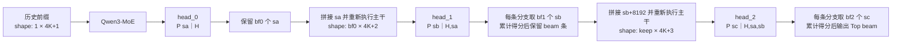

# RECIF 层级 SID 预测模型

本文介绍 [`vllm_gr/models/recif_beam_search.py`](../vllm_gr/models/recif_beam_search.py)
中实现的独立 RECIF 推理流程。该模型接收用户的历史交互物品 SID（Semantic ID），
预测下一个物品最可能的若干个 SID，并返回按联合对数概率排序的 Top-K 候选。

本文只描述源码能够确认的模型结构和推理行为。当前仓库没有给出 SID 的训练或聚类生成方法、
训练数据、训练损失细节以及离线评测指标，因此不对这些内容作额外假设。

## 1. 模型概览

RECIF 将“预测下一个物品”建模为三步自回归分类，而不是直接在完整物品集合上做一次分类。
一个物品 SID 被拆成三个层级分量 `(sa, sb, sc)`，模型依次预测它们：

$$
P(sa, sb, sc \mid H)
= P(sa \mid H)
  P(sb \mid H, sa)
  P(sc \mid H, sa, sb),
$$

其中 $H$ 表示用户历史交互序列。

模型由两部分组成：

- **Qwen3-MoE 主干网络**：把历史 SID token 序列编码为隐藏状态。
- **三个外置预测头**：每个预测头都是 `Linear(hidden_size, 8192, bias=False)`，分别预测
  `sa`、`sb` 和 `sc`。


增加三个预测头后的架构


三个 SID 层级各自拥有 8192 个取值，但在主干网络的输入emb表中使用互不重叠的 token
区间，因此主干词表大小固定为：

$$
3 \times 8192 = 24576.
$$

这里加载的是不带语言模型输出头的 Qwen3-MoE 主干；三个 SID 预测头从独立检查点文件
加载。它不是通用文本生成模型，也不会输出自然语言 token，而是生成id。

```python
def load_model_and_heads(ckpt_dir, config_json, device, dtype=torch.bfloat16):
    ......
    cfg = Qwen3MoeConfig(**base)
    cfg.vocab_size = 3 * VOCAB
    model = Qwen3MoeModel(cfg).to(dtype)
    model = model.to(device).eval()


    ......
    # 3 external SID heads: Linear(hidden, 8192, bias=False) per byte level.
    ext = torch.load(os.path.join(ckpt_dir, 'external_rank0.pt'),
                     map_location='cpu', weights_only=False)
    head_sd = ext['lm_heads']
    H = base['hidden_size']
    heads = torch.nn.ModuleList([torch.nn.Linear(H, VOCAB, bias=False) for _ in range(3)])
    for k in range(3):
        heads[k].weight.data.copy_(head_sd[f'heads.{k}.weight'])
    heads = heads.to(device, dtype=dtype).eval()
    return model, heads
```


## 2. SID 表示与输入序列

### 2.1 SID 的三个分量

每个分量都位于 `[0, 8191]`，对应 13 位有效值。整数 SID 与三元组之间的转换为：

```text
（sa，sb，sc）->sid
sid = sa | (sb << 14) | (sc << 28)

sid->（sa，sb，sc）
sa = sid & 0x1FFF
sb = (sid >> 14) & 0x1FFF
sc = (sid >> 28) & 0x1FFF
```

这里每个分量只读取 13 位，但相邻分量相隔 14 位。因此位 `13` 和位 `27` 不属于三个
分量中的任何一个；`bytes_to_sid()` 生成的 SID 会在这两个位置写入 `0`。当前源码没有说明
保留这些间隔位的原因，调用方应直接遵循上述编码约定，不要改用连续的 13 位打包。

尽管源码沿用了 `byte`、`sid_to_bytes()` 等命名，这里的每个“byte”实际有 8192 个取值，
并不是通常意义上的 8 位字节。

### 2.2 输入 token 布局

每个历史物品占用四个 token：

```text
[ctx, sid0, sid1, sid2]
```

具体映射如下：

| 位置 | token ID | 取值范围 | 含义 |
| --- | ---: | ---: | --- |
| `ctx` | `0` | `0` |表示不同场景、体裁 |
| `sid0` | `sa` | `0..8191` | 第一层 SID |
| `sid1` | `sb + 8192` | `8192..16383` | 第二层 SID |
| `sid2` | `sc + 16384` | `16384..24575` | 第三层 SID |

对于包含 $K$ 个物品的历史序列，`build_prefix()` 会构造形状为 `[1, 4K+1]` 的张量：

```text
[ctx, sa₁, sb₁+8192, sc₁+16384,
 ctx, sa₂, sb₂+8192, sc₂+16384,
 ...,
 ctx, saₖ, sbₖ+8192, scₖ+16384,
 ctx]
```

末尾额外的 `ctx` 是待预测物品的起始位置。当前检查点按 `use_sideinfo=false` 训练，代码中
没有向 `ctx` 注入侧信息；它只是 token `0` 对应的普通嵌入 `embed_tokens(0)`。

通过给不同层加上 8192 的数值偏移，模型在无需额外位置编码的情况下，仅凭 token ID 所在的数值区间就能自动识别当前输入属于哪一层。
这种“数值分层”策略让语言模型能够按照“由粗到细”的顺序，自然生成高质量的序列。末尾额外的 ctx 则作为生成终止标记，提示模型开始预测下一个新物品。

## 3. 三阶段层级束搜索



### 3.1 第一层：预测 `sa`

主干网络处理 `[1, 4K+1]` 的历史前缀，取最后一个 `ctx` 位置的隐藏状态 `[1, H]`。
`head_0` 产生 `[1, 8192]` 的 logits，经过 FP32 `log_softmax` 后保留概率最高的 `bf[0]`
个 `sa` 候选。

### 3.2 第二层：预测 `sb`

程序为每个 `sa` 候选复制历史前缀并追加 `sa`，得到 `[bf[0], 4K+2]`。主干网络重新
处理这些完整序列，`head_1` 为每条分支产生 8192 个 `sb` 的对数概率，并分别保留
`bf[1]` 个候选。

此时共有 `bf[0] × bf[1]` 个 `(sa, sb)` 组合。程序将前两步的对数概率相加并进行全局
排序，最多保留 `beam` 条：

```text
keep = min(beam, bf[0] * bf[1])
```

注意：`sb` 是预测头输出的局部类别编号 `0..8191`。只有在把它追加到主干输入时，才加上
词表偏移 `8192`。

### 3.3 第三层：预测 `sc`

程序为保留的 `(sa, sb)` 分支构造 `[keep, 4K+3]` 的输入，其中追加的两个 token 是
`sa` 和 `sb + 8192`。主干再次处理完整序列，`head_2` 为每条分支保留 `bf[2]` 个
`sc` 候选。

最终最多有 `keep × bf[2]` 个三元组。程序按累计对数概率排序并输出最多 `beam` 条：

```text
final = min(beam, keep * bf[2])
```

单个候选的最终得分为：

$$
\mathrm{score}(sa,sb,sc)
= \log P(sa \mid H) + \log P(sb \mid H,sa) + \log P(sc \mid H,sa,sb).
$$

该分数是三步条件概率乘积的对数值。它不是经过候选集合重新归一化后的概率，也没有长度
惩罚；因为所有候选都固定包含三个 SID 分量，所以可直接用于候选间排序。

默认 `bf=(8, 8, 8)`、`beam=64`：第一层产生 8 条分支，第二层产生最多 64 个组合并全部
保留，第三层产生最多 512 个三元组，再从中选出 64 个结果。

## 4. 检查点加载与权重转换

### 4.1 文件布局

运行时需要一个检查点目录和一份 Hugging Face 模型配置：

```text
<ckpt>/
├── _model_rank0.pt       # Megatron 格式的无输出头主干权重
└── external_rank0.pt     # 三个外置 SID 预测头

<config_json>             # Qwen3-MoE 架构 config.json
```

`external_rank0.pt` 需要包含以下结构：

```text
lm_heads.heads.0.weight
lm_heads.heads.1.weight
lm_heads.heads.2.weight
```

三个权重的预期形状均为 `[8192, hidden_size]`。

### 4.2 架构配置

加载器从 `config.json` 读取以下字段，用于构建模型和转换权重：

- `num_hidden_layers`
- `num_attention_heads`
- `num_key_value_heads`
- `head_dim`
- `hidden_size`
- `num_experts`

随后通过 `Qwen3MoeConfig` 创建 `Qwen3MoeModel`，并强制把 `vocab_size` 设置为 24576。
因此，配置中的其他 Qwen3-MoE 参数仍会生效，但输入嵌入词表必须与检查点中的替换词表一致。

### 4.3 Megatron 到 Hugging Face 的映射

`megatron_to_hf()` 对每一层执行以下主要转换：

- 将 Megatron 交错存储的 QKV 权重按 GQA 分组拆成 `q_proj`、`k_proj` 和 `v_proj`。
- 将注意力输出投影映射到 `o_proj`。
- 映射 Q/K Norm、输入 LayerNorm 和注意力后的 LayerNorm。
- 将 MoE router 权重映射到 `mlp.gate`。
- 将每个专家的合并 `linear_fc1` 沿输出维度均分为 `gate_proj` 和 `up_proj`。
- 将每个专家的 `linear_fc2` 映射到 `down_proj`。
- 映射输入嵌入和模型最终归一化权重。

加载时会过滤 Megatron 的 `_extra_state` 项。Hugging Face 模型允许缺少 rotary embedding 的
非持久化缓冲区，但其他缺失权重或意外权重都会触发 `RuntimeError`。

当前转换逻辑只面向 `_model_rank0.pt` 和 `external_rank0.pt`，即单 rank、专家并行度
`EP=1` 的检查点。它没有合并 Tensor Parallel、Pipeline Parallel 或多 rank Expert
Parallel 分片的逻辑。

## 5. 运行方式

### 5.1 依赖

脚本不导入仓库内的其他模块，直接依赖：

- PyTorch
- Transformers（版本需提供 `Qwen3MoeConfig` 和 `Qwen3MoeModel`）
- NumPy

### 5.2 命令示例

在仓库根目录运行：

```bash
python -m vllm_gr.models.recif_beam_search \
  --ckpt /path/to/checkpoint/iter_0001000 \
  --config /path/to/qwen3-moe/config.json \
  --history 598080194427,628177754964,755993681678 \
  --bf 8,8,8 \
  --beam 64 \
  --device cuda:0 \
  --out recif_predictions.json
```

也可以直接执行实际文件：

```bash
python vllm_gr/models/recif_beam_search.py --ckpt <ckpt> --config <config_json>
```

不建议照搬源码文件头中 `recif_beam_search_standalone.py` 的旧示例名，因为仓库中的实际文件
路径是 `vllm_gr/models/recif_beam_search.py`。

### 5.3 参数

| 参数 | 默认值 | 说明 |
| --- | --- | --- |
| `--ckpt` | 源码内的示例检查点路径 | 包含两个 rank-0 权重文件的目录 |
| `--config` | 源码内的示例配置路径 | Qwen3-MoE 的 Hugging Face `config.json` |
| `--history` | 空字符串 | 逗号分隔的十进制 int64 SID；省略时使用内置演示历史 |
| `--bf` | `8,8,8` | 三个 SID 层级的分支因子 |
| `--beam` | `64` | 第二层裁剪上限和最终返回数量上限 |
| `--device` | 有 CUDA 时为 `cuda:0`，否则为 `cpu` | 模型和输入所在设备 |
| `--out` | 空字符串 | 非空时把结果写入指定 JSON 文件 |

`--bf` 必须能解析为三个整数；每个分支因子应处于 `1..8192`，`--beam` 应为正整数。源码
当前没有显式参数校验，格式错误、元素数量不为 3、值为 0 或超过 8192 时，会在解析、索引或
`torch.topk()` 阶段失败。

### 5.4 输出

标准输出首先打印运行配置，然后按分数从高到低打印候选：

```text
[info] history=3 items, prefix tokens=13, bf=(8, 8, 8), beam=64, device=cuda:0

Top-64 predicted SID triples (sorted by log-prob):
rank          (sa, sb, sc)         sid_int64    log_prob
   0        (123, 456, 789)     211803046011     -1.2345
...
```

上面的数值仅用于展示格式，不代表真实模型输出。`sid_int64` 由三元组按第 2 节的规则重新
打包，`log_prob` 是三步对数概率之和。

指定 `--out` 后，JSON 是对象数组：

```json
[
  {
    "rank": 0,
    "sid": [123, 456, 789],
    "sid_int64": 211803046011,
    "log_prob": -1.2345
  }
]
```

## 6. 运行特性与限制

### 6.1 精度与设备

- 当 `--device` 字符串以 `cuda` 开头时，主干和三个预测头使用 BF16。
- 其他设备使用 FP32，主要用于规避 CPU 上不完整的 BF16 kernel 支持。
- 三个预测头的 logits 会在计算 `log_softmax` 前转为 FP32，以提高概率计算和累计排序的
  数值稳定性。

### 6.2 不使用 KV Cache

三次预测均以 `use_cache=False` 调用主干。第二、三阶段会复制前缀并重新计算整条序列，
没有复用前一阶段的 KV Cache。这样避免了不同 Transformers 版本下缓存扩展和 beam 重排
接口的差异，但计算量和显存占用会随历史长度与活跃分支数增加。

主要影响关系如下：

- 历史物品数为 $K$ 时，基础序列长度为 $4K+1$。
- `bf[0]` 决定第二次主干前向的 batch 大小。
- `min(beam, bf[0] × bf[1])` 决定第三次主干前向的 batch 大小。
- `bf[2]` 主要增加第三阶段 logits 后的候选展开与排序数量。
- 增大 `beam`、前两层分支因子或历史长度，通常都会增加计算时间和峰值显存；具体上限还受
  Qwen3-MoE 配置、设备容量和注意力实现影响。

### 6.3 候选约束

搜索只依据三个预测头的概率，不读取物品目录，也不检查 `(sa, sb, sc)` 是否对应真实物品。
因此结果中可能出现目录里不存在、已经下线或业务上不可推荐的 SID。若部署场景需要目录约束、
去重、库存过滤或其他业务规则，需要在本脚本之外增加候选约束或后处理。

## 7. 优化方向

### 7.1 复用 KV Cache

当前三个 SID 层级都会重新计算完整历史前缀，历史越长，重复计算越明显。可以在第一轮前向后
保留 KV Cache，后续只输入新增的 `sa` 和 `sb + 8192`。beam 扩展时复制父分支缓存，裁剪后再按
保留分支的索引重排缓存。该方案能够显著降低长历史场景的计算量，但需要正确处理 batch 扩展、
beam 重排以及不同 Transformers 或 vLLM 版本的缓存格式。

### 7.2 优化批处理与设备端算子

可以将三个预测头、FP32 `log_softmax`、`topk`、累计分数和 beam 裁剪尽量保留在 GPU/NPU 上，
避免搜索过程中频繁同步 CPU。对于并发请求，可将处于相同 SID 层级的分支合并成批次，并结合
vLLM 的连续批处理、PagedAttention 和张量并行能力，提高设备利用率。进一步还可以融合
`log_softmax + topk`，只计算搜索真正需要的候选及其归一化分数，减少中间 logits 占用。

### 7.3 加入合法 SID 目录约束

当前搜索空间包含全部 $8192^3$ 个组合，模型可能生成目录中不存在的 SID。可以使用线上合法 SID
构建三层前缀树：第一层保存合法 `sa`，第二层保存每个 `sa` 对应的 `sb`，第三层保存合法 `sc`。
每一步只在当前前缀允许的 token 中执行 `topk`，既能过滤无效组合，也能减少实际候选数量。
在此基础上还可叠加已下线物品、库存、地域和历史去重等动态业务约束。

### 7.4 自适应 beam 与提前终止

固定的 `bf=(8,8,8)` 和 `beam=64` 对所有请求使用相同计算预算。可以根据各层候选的概率差距、
熵或累计分数动态调整分支因子：分布集中时缩小 beam，分布较平坦时保留更多候选。若剩余分支
不可能超过当前 Top-K 的最低分，还可以提前终止扩展。该策略需要通过离线召回指标和线上延迟
共同确定阈值，避免为了降低计算量而明显损失推荐质量。

### 7.5 工程稳定性与评测

建议补充 `bf`、`beam`、SID 范围、检查点文件和权重形状的前置校验，并为权重转换、SID 编解码、
前缀构造和三级 beam 裁剪增加单元测试。性能评测应至少覆盖不同历史长度、并发量和 beam 配置，
同时记录吞吐、首候选延迟、峰值显存以及 Recall@K、NDCG@K 等效果指标，避免只优化单一维度。
