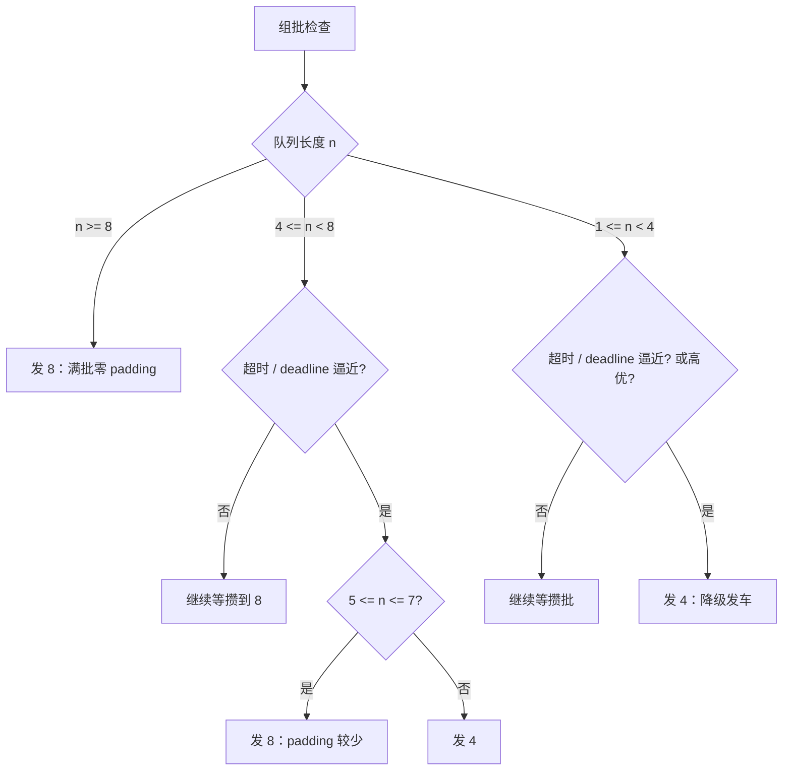
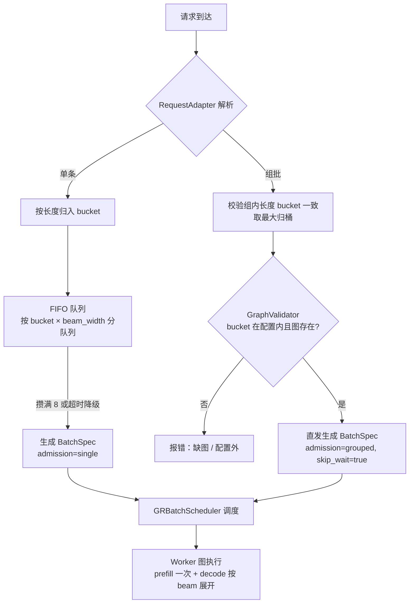
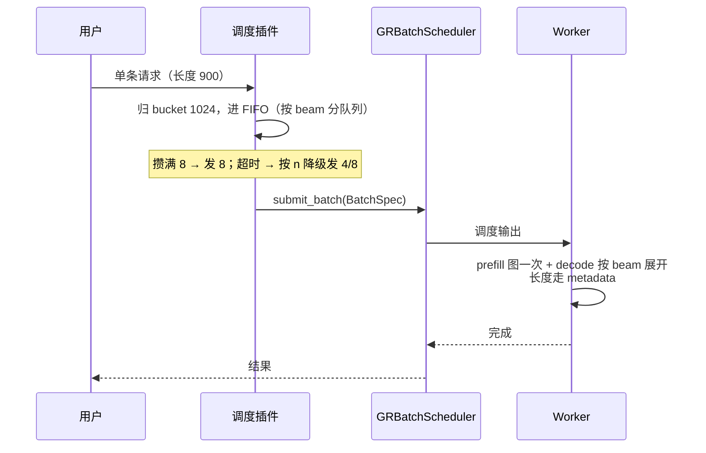
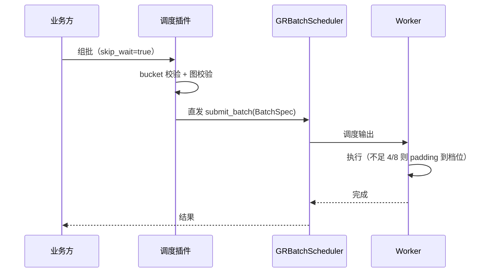
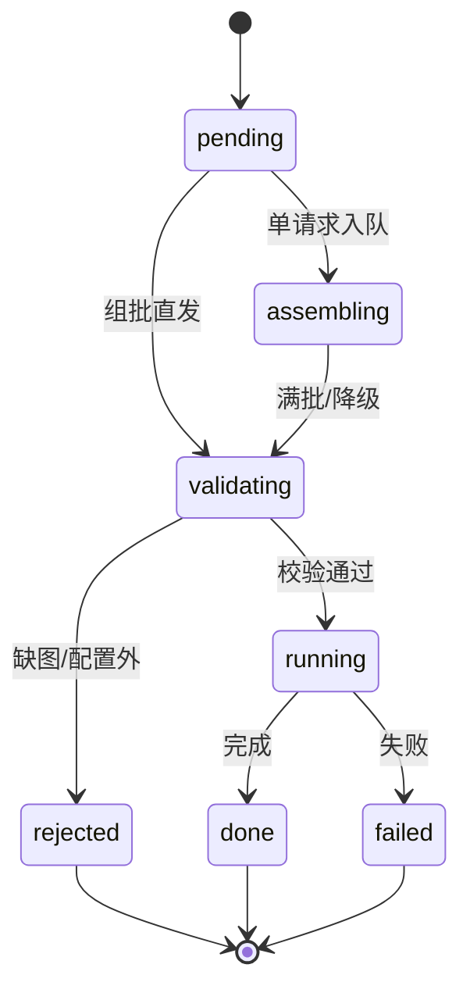

# vllm-gr 调度设计
> 前置说明：本文讨论的调度均以 **batch 为基本单位**——请求先归入 batch（攒批或组批直发），跑图之后的发车、执行、padding、状态流转与统计等各类调度都按 batch 整体进行，而非按单个 request 调度。

> 关联：现有调度 patch 机制见 `vllm_gr/v1/engine/engine_core_patch.py`（`apply_scheduler_patch` 模式）。

---

## 1. 设计目标与固定决策

1. **图固定**：warmup 全量捕获，运行时不捕获、不缓存、不 eager 回退，**缺图报错**；
2. **长度用 bucket**：长度档位与数量由用户配置；
3. **batch 多级，不固定单一档**：8 常态、4 降级（见第 2 节）；
4. **双路径（两种模式）**：默认组 batch 模式（单请求 FIFO、batch 可 `skip_wait` 直发）；`assume_grouped=true` 时全部直发、不等待；
5. **beam 按档**：beam width 动态，配置档位（如 128/256），批内统一；
6. **padding 时机**：worker 图输入准备阶段，长度走 metadata；
7. **接入方式**：沿用现有 `apply_scheduler_patch()` 机制，不改类、不引入新插件框架。

---

## 2. 多级 batch 策略（batch 不完全固定）

### 2.1 为什么不能完全固定

固定单档（如 batch=8）在稀疏流量下 padding 浪费严重：

- 1 个请求占 8 槽 → 浪费 87.5%；
- 2 个请求占 8 槽 → 浪费 75%。

图按固定 batch 捕获后，每次 replay 都是 8 槽一起算，空槽同样消耗算力。所以 batch 需要**多级**：常态档保证吞吐，降级档降低稀疏浪费。

### 2.2 两级设计（8 常态 / 4 降级）

| 档位 | 用途 | 说明 |
|---|---|---|
| 8（常态档） | 满批吞吐 | 队列攒满 8 个请求发车，零 padding |
| 4（降级档） | 稀疏 / 超时 / 高优 | 1–4 个请求时发 4，padding ≤ 75% |

**发车决策表**（n = 队列长度）：

| 状态 | n | 目标 batch | 理由 |
|---|---|---|---|
| 常态（未超时） | n ≥ 8 | 8 | 满批，零 padding |
| 常态 | 4 ≤ n < 8 | 等攒到 8 | 吞吐优先 |
| 常态 | 1 ≤ n < 4 | 等攒到 4 或 8 | 避免过早小批 |
| 超时 / deadline 逼近 | 1 ≤ n ≤ 4 | 4 | 降级发车 |
| 超时 / deadline 逼近 | 5 ≤ n ≤ 7 | 8 | 比拆两个 4 更省 padding |
| 高优请求 | 1 ≤ n ≤ 7 | 4 | 立即发车（可单发） |

**决策流程**：



### 2.3 多级 batch 的图要求

- **4 和 8 各一套完整图集**：prefill 图（batch 4/8 × 长度档 L）+ decode 图（step S × beam 档 W × batch 档 B × 长度档 L）；
- 降级发车前确认 4 的图已存在（warmup 全量捕获，运行时必然存在，缺图即配置错误直接报错）；
- **KV 池按档预留**：batch 4 和 8 各一组稳定池切片，互不侵占；
- **padding 分档记账**：分别统计 4 档和 8 档的浪费，用于调降级阈值；
- **最多 3 级**：再多一级图数量线性涨、收益边际递减（1/4/8 仅当需要单请求极速路径时启用）。

### 2.4 图数量预算

```text
G = L × (1 + S × W × B)
```

例：L=3（长度档）、S=3（decode 步）、W=2（beam 档）、B=2（batch 档 4/8）：

```text
prefill 图 = L = 3
decode 图 = S × W × B × L = 3 × 2 × 2 × 3 = 36
合计     = 39 张逻辑图
```

---

## 3. 双路径：单请求 vs 业务方组批

### 3.1 判定规则

| 输入 | 判定 | 路径 |
|---|---|---|
| 普通请求（无 `skip_wait`） | 默认 | FIFO 攒批 |
| batch 请求（带 `skip_wait`） | bucket 校验通过 | 直发：自动归 bucket，按多级规则选档（6 → 8） |
| batch 请求（不带 `skip_wait`） | 默认 | 与单请求一样进 FIFO |
| batch 请求（带 `skip_wait`） | bucket 校验失败 | 报错拒绝 |

> `assume_grouped=true` 时，**所有请求（含单条）全部直接转，不等待**。

### 3.2 决策流程



> `assume_grouped=true` 时跳过 FIFO 分支，全部走组批直发。

### 3.3 配置（两种模式）

```yaml
assume_grouped: false       # false（默认）：组 batch 模式；true：全部直发不等待
```

- **`assume_grouped: false`（默认，组 batch 模式）**：
  - 单请求 → FIFO 攒批（满 8 发车，超时按 n 降级发 4/8）；
  - batch 带 `skip_wait` → 直发：自动归 bucket，按多级规则选档（1–4 → 4，5–8 → 8，6 个 → 8）；
  - batch 不带 `skip_wait` → 与单请求一样进 FIFO；
- **`assume_grouped: true`（全部直转）**：所有请求（含单条）直接发车，不等待；同样自动归 bucket 选档。

---

## 4. 核心模块与接口
### 4.1 包结构

```text
vllm_gr/scheduling/
├── types.py             # BatchSpec / Admission / BucketInfo
├── adapter.py           # RequestAdapter：单/批解析
├── router.py            # BucketRouter：长度 / beam 归桶
├── assembler.py         # BatchAssembler：FIFO 攒批 / 降级 / 直发
├── validator.py         # GraphValidator：bucket → 图存在性
├── registry.py          # GraphRegistry：warmup 图注册表
├── graph.py             # PrefillGraphProvider / DecodeGraphProvider 接口
├── scheduler.py         # GRBatchScheduler 逻辑（挂到 apply_scheduler_patch）
└── config.py            # 配置加载与校验
```

### 4.2 接口定义

#### RequestAdapter

```python
class RequestAdapter:
    def parse(self, req) -> Admission:
        """SINGLE 或 GROUPED；assume_grouped=true 时恒返回 GROUPED。"""
    def is_grouped(self, req) -> bool: ...
    def extract_beam_width(self, req) -> int: ...
```

#### BucketRouter

```python
@dataclass(frozen=True)
class BucketInfo:
    length_bucket: int
    beam_bucket: int
    graph_keys: tuple[str, ...]

class BucketRouter:
    def __init__(self, length_buckets, beam_buckets): ...
    def resolve_length_bucket(self, length: int) -> int: ...   # 第一个 ≥ length；无档抛错
    def resolve_beam_bucket(self, beam_width: int) -> int: ... # 同上
    def route(self, req) -> BucketInfo: ...
```

#### BatchAssembler（多级 batch 核心）

```python
class BatchAssembler:
    def __init__(self, batch_buckets=(4, 8), normal_bucket=8,
                 degraded_bucket=4, max_wait_ms=10.0,
                 assume_grouped=False): ...

    def enqueue(self, req, bucket: int) -> None:
        """单请求进 FIFO（按 bucket × beam_width 分队列）。"""

    def dispatch_group(self, group, bucket: int) -> BatchSpec:
        """组批直发（skip_wait=True）。"""

    def next_batch(self, now: float) -> BatchSpec | None:
        """按 2.2 决策表：满 8 发 8；超时按 n 降级发 4 或发 8；否则 None。"""

    def on_tick(self, now: float) -> None:
        """周期检查超时，触发降级发车。"""

    def stats(self) -> dict:
        """队列长度 / 等待时间 / 4 档与 8 档 padding 记账。"""
```

#### GraphValidator / GraphRegistry

```python
class GraphValidator:
    def validate(self, spec: BatchSpec) -> bool: ...
    def ensure_configured(self, bucket: int) -> None: ...   # 抛错

class GraphRegistry:
    def warmup_all(self, cfg) -> None: ...                  # 启动全量捕获
    def has(self, bucket: int, step: int) -> bool: ...
    def get(self, bucket: int, step: int) -> Graph: ...     # 缺图抛错
    def static_input(self, bucket: int) -> Tensor: ...
    def static_metadata(self, bucket: int) -> AttentionMetadata: ...
    def kv_slice(self, bucket: int) -> KVSlice: ...
```

#### GRBatchScheduler（调度核心）

```python
class GRBatchScheduler:
    """逻辑挂在现有 apply_scheduler_patch() 上，不换类。"""

    def schedule(self) -> SchedulerOutput:
        """1. 消费 BatchSpec 队列；2. 调原版 schedule()；3. 附加 bucket 分组信息。"""

    def consume_batch(self, spec: BatchSpec) -> None: ...
    def _validate_batch_graphs(self, spec: BatchSpec) -> None: ...
```

### 4.3 BatchSpec

```python
@dataclass(frozen=True)
class BatchSpec:
    batch_id: str
    request_ids: tuple[str, ...]
    lengths: dict[str, int]        # request_id -> 实际长度
    beam_width: int                # 批内统一 beam width
    bucket: int                    # 长度 bucket
    batch_slot: int                # 4 或 8（多级 batch 选中的档位）
    admission: str                 # "single" | "grouped"
    skip_wait: bool = False
    created_at: float
```

### 4.4 覆盖 vs 新增 vs 继承（原版 Scheduler）

| 函数 | 类型 | 说明 |
|---|---|---|
| `schedule()` | 覆盖 | 消费 BatchSpec → 调父类 → 附加分组信息 |
| `consume_batch()` | 新增 | BatchSpec 入队 |
| `_validate_batch_graphs()` | 新增 | 图存在性前置校验 |
| `add_request()` / `update_from_output()` / `has_requests()` | 继承 | 原版不动 |

---

## 5. 图设计

### 5.1 图集合

| 图 | 数量 |
|---|---|
| prefill 图 | `L` 张（长度档，batch 4/8 各自） |
| decode 图 | `S × W × B × L` 张（step × beam 档 × batch 档 × 长度档） |

### 5.2 捕获与缺图

- warmup 全量捕获（batch 档 4/8 × 长度档 × beam 档 × step），运行时不捕获；
- 运行时 `GraphRegistry.get()` 缺图 → 直接报错（配置与流量不匹配）。

### 5.3 padding：worker 输入准备阶段

- 调度器不 pad，预算按真实长度计；
- worker 把真实输入拷进固定形状静态 buffer，`seq_lens` / `slot_mapping` / `query_lens` 记录真实长度；
- 图按（batch 档 × 长度档）形状 replay，pad 槽位被掩码，输出切回真实部分；
- 物理 pad（把 900 补成 1024）仅在 kernel 不支持变长时使用，时机在发车时。

### 5.4 成图对接接口

```python
class PrefillGraphProvider:
    def capture(self, bucket: int, batch_slot: int) -> Graph: ...
    def replay(self, graph: Graph, inputs, metadata) -> Tensor: ...

class DecodeGraphProvider:
    def capture(self, bucket: int, step: int, batch_slot: int,
                beam_bucket: int) -> Graph: ...
    def replay(self, graph: Graph, inputs, metadata) -> Tensor: ...
```

成图按接口实现并注册进 `GraphRegistry`；调度侧只依赖 `GraphRegistry`。

---

## 6. 关键流程

### 6.1 单请求时序



### 6.2 组批时序



### 6.3 Batch 状态机



---

## 7. 配置示例（per-model）

```yaml
scheduler_plugin:
  assume_grouped: false       # true：默认全部按业务方组批
  batch_buckets: [4, 8]       # 多级 batch：8 常态、4 降级
  normal_bucket: 8
  degraded_bucket: 4
  length_buckets: [512, 1024, 2048]
  beam_buckets: [128, 256]
  max_wait_ms: 10
  warmup_on_start: true
  graph_missing: error
```

**预期图数量**（L=3、S=3、W=2、B=2）：`G = 3 × (1 + 3 × 2 × 2) = 39` 张逻辑图。

---

## 8. 实施步骤

1. **数据契约**：`BatchSpec`（含 `lengths` / 统一 `beam_width` / `batch_slot`）与协议字段（`skip_wait`）；
2. **多级 batch**：`BatchAssembler` 实现 2.2 决策表（满 8 / 超时降级 4 或 8 / 高优直发 4）；
3. **调度 patch**：`engine_core_patch.py` 新增调度逻辑，挂到现有 `apply_scheduler_patch()`；
4. **成图接口**：`PrefillGraphProvider` / `DecodeGraphProvider` 实现并注册 `GraphRegistry`；
5. **双路径**：adapter / router / assembler 落地，`assume_grouped` 生效；
6. **验证**：图命中率 100%（配置内）、padding 分档记账、FTT/TBT、图数量 39 内存预算。

---

## 9. 风险与对策（仅我们的）

| 风险 | 对策 |
|---|---|
| 多级 batch 导致图数量翻倍 | 最多 3 级；按 2.4 公式启动预检 |
| 降级档（4）图缺失 | warmup 全量捕获 + 发车前 `_validate_batch_graphs` 报错 |
| 稀疏流量 padding 浪费 | 降级阈值可调；分档记账驱动 |
| 批内 beam 不一致 | 组批混 beam 拒绝；FIFO 按 (bucket, beam_width) 分队列 |
| 长度 bucket 覆盖不全 | 配置外请求报错；上线前按流量统计配置 |
| 物理 pad 占 token 预算 | 默认图级 padding（metadata）；物理 pad 仅 kernel 不支持变长时用 |
