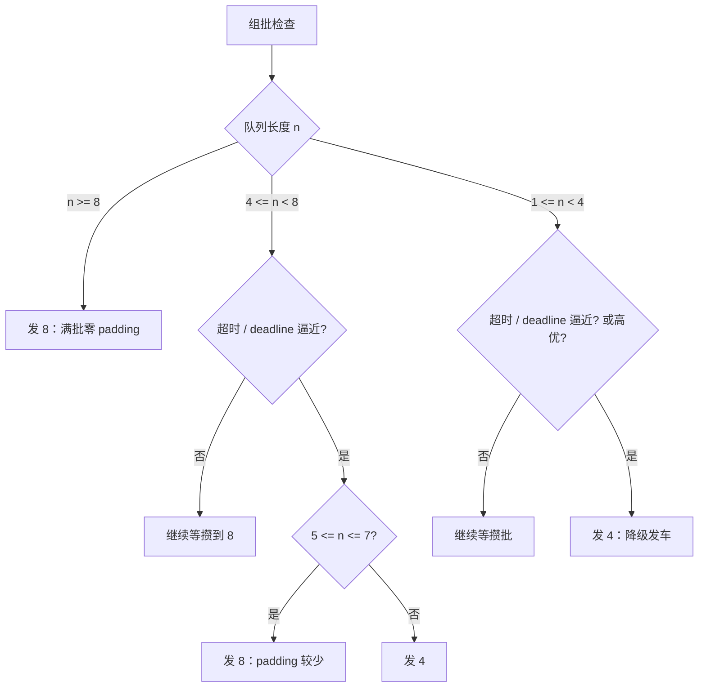
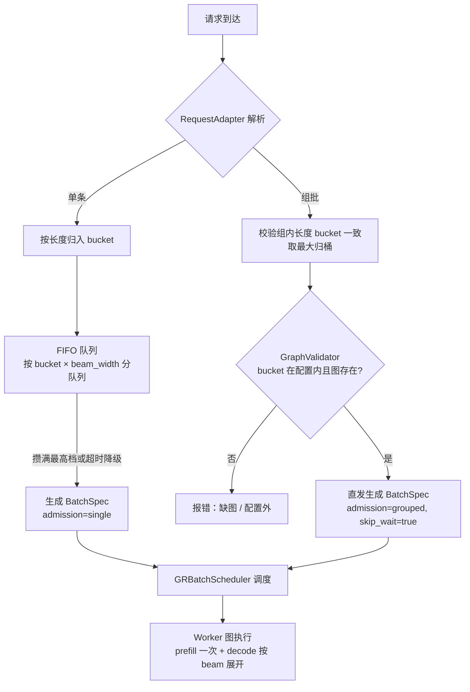
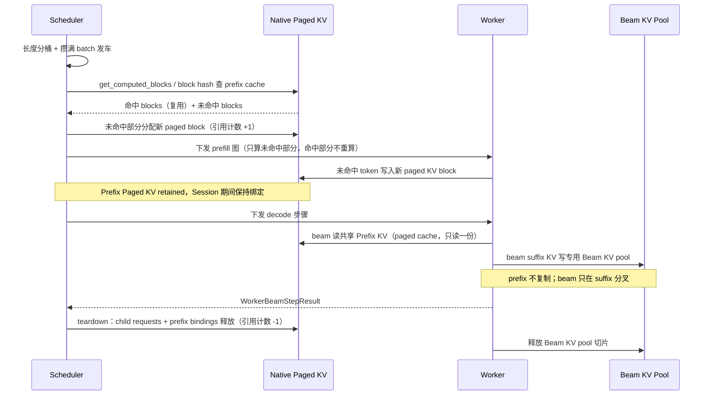
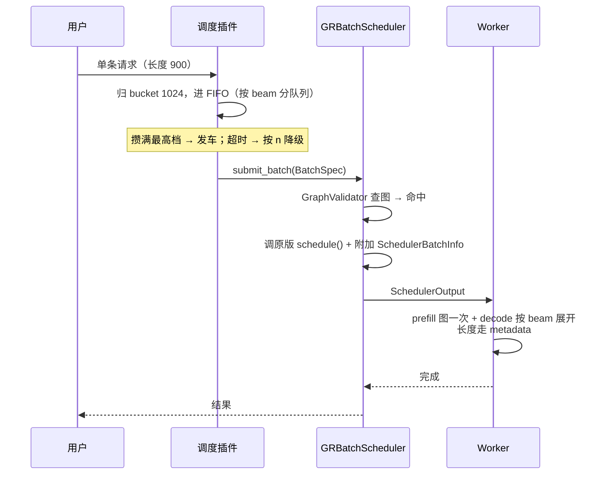
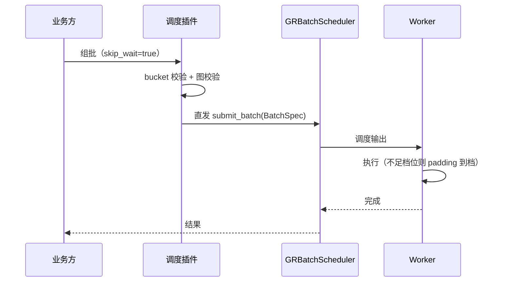
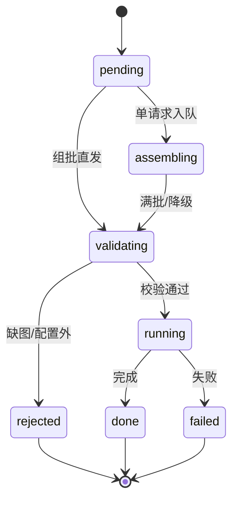

# vllm-gr 调度设计

> 前置说明：本文讨论的调度均以 **batch 为基本单位**——请求先归入 batch（攒批或组批直发），跑图之后的发车、执行、padding、状态流转与统计等各类调度都按 batch 整体进行，而非按单个 request 调度。

> 一句话设计：**能固定就固定，能预先做就预先做，跑的时候不做动态决策**——图固定、长度分桶、batch 多级、双路径、beam 分档，全部由用户配置，运行时只查图、缺图报错。

> **本文范围与分层**：本文只讨论 **physical execution batch 层**——`BatchSpec` 组装、发车、图形状、padding 与 KV 分工。业务批（BatchBeamSession）到 B 个 child request 的映射、epoch/终态协调属于 EngineCore 层，见 `docs/issue37_enginecore_beam_api_design.md`，本文不展开。
>
> 三个概念不要混：
> - **BatchBeamSession**：业务批，一次提交 B 个输入，是业务/算法生命周期单位；
> - **child Request**：业务批里每个输入映射出的原生 vLLM Request，是 Prefill / Paged KV / prefix cache 的管理单位（本文的“请求”在 beam 场景下即指它）；
> - **physical execution batch**：某个调度 tick 实际组装出的执行批，即本文的 `BatchSpec`。

---

## 1. 配置总览（先看配置）

所有配置都属于**引擎启动配置**，用户通过 CLI / `additional_config`（`vllm_gr_scheduler_*`）传入；缺省即默认，纯 vLLM 配置不受影响。

| 配置项 | 默认值 | 含义 | 影响 |
|---|---|---|---|
| `enabled` | `true` | 是否启用本调度（`false` 时完全走原版） | 开关 |
| `assume_grouped` | `false` | `true` 时所有请求（含单条）全部直发、不等待 | 双路径行为 |
| `batch_buckets` | `(8,)` | 多级 batch 档位（用户可配，如 `[8]` / `[4,8]` / `[4,8,16]`） | 发车档位 + 图数量 |
| `length_buckets` | `[512, 1024, 2048]` | 长度分档，请求归入第一个 ≥ 实际长度的档 | 超档报错（缺图） |
| `beam_width_buckets` | `[128, 256]` | beam 宽度分档，批内统一 | 图数量 + 批内一致性 |
| `beam_decode_steps` | `3` | decode 步数（RECIF 默认 3，引擎启动固定） | 图数量 S |
| `max_wait_ms` | `10` | 攒批超时，超时降级发车 | 时延 vs padding 权衡 |
| `high_priority_threshold` | `null` | 高优请求直发阈值（`null` = 不启用） | 可选降级路径 |
| `warmup_on_start` | `true` | 启动时全量捕获图 | 启动耗时 vs 运行时零捕获 |
| `graph_missing` | `error` | 运行时缺图策略：`error` 报错 / `warn` 告警放行 | 缺图行为 |
| `prefill_policy` | `error` | 超长 prefill 处理策略：`error` 报错 / `single` 不 batch 单独执行（本文新增，待落地） | 长 prompt 准入 |
| `max_prefill_len` | `null` | 允许的最大 prompt 长度；`null` 取 `length_buckets` 最大档（本文新增，待落地） | 报错 / 单独执行的边界 |

**per-model 配置示例**：

```yaml
scheduler_plugin:
  enabled: true
  assume_grouped: false
  batch_buckets: [4, 8]            # 多级 batch：8 常态、4 降级（默认 [8]）
  length_buckets: [512, 1024, 2048]
  beam_width_buckets: [128, 256]
  beam_decode_steps: 3
  max_wait_ms: 10
  high_priority_threshold: null
  warmup_on_start: true
  graph_missing: error
  prefill_policy: error
  max_prefill_len: null
```

**预期图数量**（以 `length_buckets` 3 档、`beam_decode_steps` 3 步、`beam_width_buckets` 2 档、`batch_buckets` 2 档为例）：`G = L × (1 + S × W × B) = 3 × (1 + 3×2×2) = 39` 张逻辑图；默认 `batch_buckets=(8,)` 时 B=1，图数量相应减半。

---

## 2. 设计目标与固定决策

1. **图固定**：warmup 全量捕获，运行时不捕获、不缓存、不 eager 回退，**缺图报错**；
2. **长度用 bucket**：长度档位与数量由用户配置（`length_buckets`）；
3. **batch 多级**：档位由用户配置（`batch_buckets`），不固定单一档；
4. **双路径**：单请求 FIFO 攒批；业务方组批（`skip_wait`）直发；`assume_grouped=true` 时全部直发；
5. **beam 按档**：beam 宽度分档（`beam_width_buckets`），批内统一；
6. **padding 时机**：worker 图输入准备阶段，长度走 metadata，GPU/NPU 各自实现；
7. **接入方式**：沿用现有 `apply_scheduler_patch()` 机制，不替换 vLLM `Scheduler` 类、不引入新插件框架。
8. **不做 Prefill barrier**：不同长度输入按 `length_buckets` 分桶、攒满 batch 发车、算子对变长输入 padding 后同时计算同时出；不存在跨 item 的“所有 prefill 就绪”等待。
9. **不做 chunk prefill**：一个请求的 prompt 在一次 prefill 里整体算完，不跨 tick 分块；超长按 `prefill_policy` 处理（`error` / `single`）。
10. **prefill 复用 vLLM 原生 paged KV cache**：Prefix KV 由 Scheduler 持有并复用原生 prefix cache；beam 只在 suffix 分叉，suffix KV 才走专用池。

---

## 3. 多级 batch 与发车决策

### 3.1 为什么不能完全固定

固定单档（如 batch=8）在稀疏流量下 padding 浪费严重：

- 1 个请求占 8 槽 → 浪费 87.5%；
- 2 个请求占 8 槽 → 浪费 75%。

图按固定 batch 捕获后，每次 replay 都是整档一起算，空槽同样消耗算力。所以 batch 需要**多级**：常态档保证吞吐，降级档降低稀疏浪费。档位由 `batch_buckets` 配置。

### 3.2 发车决策（以 `batch_buckets=[4, 8]` 为例）

| 档位 | 用途 | 说明 |
|---|---|---|
| 8（常态档） | 满批吞吐 | 队列攒满 8 个请求发车，零 padding |
| 4（降级档） | 稀疏 / 超时 / 高优 | 1–4 个请求时发 4，padding ≤ 75% |

**决策表**（n = 队列长度）：

| 状态 | n | 目标 batch | 理由 |
|---|---|---|---|
| 常态（未超时） | n ≥ 8 | 8 | 满批，零 padding |
| 常态 | 4 ≤ n < 8 | 等攒到 8 | 吞吐优先 |
| 常态 | 1 ≤ n < 4 | 等攒到 4 或 8 | 避免过早小批 |
| 超时 / deadline 逼近 | 1 ≤ n ≤ 4 | 4 | 降级发车 |
| 超时 / deadline 逼近 | 5 ≤ n ≤ 7 | 8 | 比拆两个 4 更省 padding |
| 高优请求 | 1 ≤ n ≤ 7 | 4 | 立即发车（可单发） |

> 通用规则一句话：**满最高档直接发；没满就先攒；超时/高优时发“第一个装得下 n 的档”**。档位和阈值全部来自配置，代码不写死。

**决策流程**：



### 3.3 多级 batch 的图要求

- 每个档位一套完整图集：prefill 图（batch 档 × 长度档）+ decode 图（step × beam 档 × batch 档 × 长度档）；
- 降级发车前确认对应档位的图已存在（warmup 全量捕获，运行时必然存在，缺图即配置错误直接报错）；
- **KV 池按档预留**：每个 batch 档各一组稳定池切片，互不侵占；
- **padding 分档记账**：分别统计各档浪费，用于调降级阈值；
- **最多 3 级**：再多一级图数量线性涨、收益边际递减（1/4/8 仅当需要单请求极速路径时启用）。

---

## 4. 双路径：单请求 vs 业务方组批

### 4.1 判定规则

| 输入 | 判定 | 路径 |
|---|---|---|
| 普通请求（无 `skip_wait`） | 默认 | FIFO 攒批 |
| batch 请求（带 `skip_wait`） | bucket 校验通过 | 直发：自动归 bucket，按多级规则选档 |
| batch 请求（不带 `skip_wait`） | 默认 | 与单请求一样进 FIFO |
| batch 请求（带 `skip_wait`） | bucket 校验失败 | 报错拒绝 |

> `assume_grouped=true` 时，**所有请求（含单条）全部直接转，不等待**。

### 4.2 决策流程



### 4.3 两种模式

- **`assume_grouped: false`（默认，组 batch 模式）**：
  - 单请求 → FIFO 攒批（满最高档发车，超时按 n 降级）；
  - batch 带 `skip_wait` → 直发：自动归 bucket，按多级规则选档；
  - batch 不带 `skip_wait` → 与单请求一样进 FIFO；
- **`assume_grouped: true`（全部直转）**：所有请求（含单条）直接发车，不等待；同样自动归 bucket 选档。

---

## 5. Prefill 策略与 Prefix KV Cache 复用

### 5.1 不做 Prefill barrier

本设计不采用“等 B 个 item 全部 prefill 完成再进入 decode”的跨 item barrier。不同长度的输入统一按 `length_buckets` 分桶，攒满 batch 档位发车，算子对变长输入做 padding 后同时计算、同时出结果。prefill 完成后自然进入 decode，不存在逐 item 汇总 readiness 的同步点。

这带来的直接好处是：prefill 阶段和 decode 阶段一样，都是“按 batch 整体调度”，没有额外的跨请求等待；不同长度带来的形状差异由 padding + metadata 消化，而不是靠 barrier 串行化。

### 5.2 不做 chunk prefill（长 prompt 一次算完）

本设计完全不做 chunk prefill：一个 child request 的 prompt 在一次 prefill 执行里整体算完，不跨多个调度 tick 分块推进。

这带来一个硬约束：prefill 的执行形状必须固定，因此 prompt 长度必须被限制在某个档位内：

- 长度靠 `length_buckets` 分桶，一次 prefill 只跑对应长度档的固定 prefill 图；
- `max_prefill_len` 封顶，超过即按 `prefill_policy` 处理（`error` / `single`）；
- 不存在 chunk 状态，也不需要跨 tick 保存中间 prefill 进度；
- 不同请求之间仍走 vLLM continuous batching 共享 token budget，但单个请求自身不分块。

### 5.3 超长 prefill：不 batch 或直接报错

长度超过 `max_prefill_len`（缺省取 `length_buckets` 最大档）的请求，按 `prefill_policy` 处理：

| `prefill_policy` | 行为 |
|---|---|
| `error`（默认） | 直接报错拒绝，防止打爆固定图 / 静态 buffer / KV 预算 |
| `single` | 不进 batch、不参与成图，单独走原生路径执行 |

原则：图按长度档固定捕获，所以**超档必须 fail-fast**，运行时绝不为超长请求动态捕获新图。`single` 只解决“偶发超长请求不想拒绝”的问题，它走的是非成图路径，不享受本调度的固定图加速。

### 5.4 Prefill 复用 vLLM 原生 paged KV cache

Prefill 阶段的 KV 完全复用 vLLM 原生 paged KV cache + prefix cache，不额外建 KV 层：

- 每个 child request 使用原生 `get_computed_blocks` 与 Prefix Cache 命中、Paged KV block 分配与引用计数、continuous batching；
- Prefix 复用只采用原生内容匹配，不改变原生 Prefix Cache 的匹配与逐出策略；
- **Prefix KV 由 Scheduler 持有**：native prefill 写进 paged KV，Session 期间保持绑定，decode 阶段 beam 只读共享的 prefix KV，Worker 不复制 Prompt Paged KV、也不自行释放原生 block；
- beam 分叉只发生在 suffix：decode 新增的 token 写进专用的 Beam KV（图 / 静态 buffer 池），与原生 prefix KV 分离。

生命周期：

```text
Native Prefill
  → Prefix Paged KV retained（Scheduler 持有，复用 prefix cache）
  → Beam Decode 读共享 Prefix KV
  → Beam suffix 写进专用 Beam KV
  → Worker teardown acknowledged
  → child Requests 与 Prefix bindings 释放
```

一句话：**prefill 用 vLLM 原生 paged KV cache（保证 prefix cache 复用），decode 的 beam suffix 才落专用池**；两者边界清晰，Scheduler 始终是 Prefix KV 的唯一所有者。

### 5.5 Paged KV Cache 使用流程（时序）

下图以一个 child request 从 prefill 到 beam decode 再到释放为例，说明调度器如何复用 vLLM 原生 paged KV cache，以及 beam suffix KV 何时切到专用池：



关键点：

- **prefill 命中即复用**：`get_computed_blocks` / block hash 命中前缀，paged block 只增引用计数，不重新分配、不重算；
- **prefix 只读一份**：decode 阶段 W 条 beam 共享同一份 prefix KV，只有 suffix 部分按 lane 写入专用 Beam KV；
- **所有权不变**：Prefix KV 的分配与释放始终由 Scheduler 掌控，Worker 不复制 Prompt Paged KV、不自行释放原生 block。

---

## 6. 数据契约

### 6.1 AdmissionKind（入队方式）

```python
class AdmissionKind(str, Enum):
    SINGLE = "single"      # 普通请求，FIFO 攒批
    GROUPED = "grouped"    # 业务方已组批（skip_wait），直发
```

### 6.2 BatchSpec（发车单：调度器消费）

```python
@dataclass(frozen=True)
class BatchSpec:
    batch_id: str
    request_ids: tuple[str, ...]
    lengths: dict[str, int]      # request_id -> 实际长度
    beam_width: int              # 批内统一
    bucket: int                  # 长度 bucket
    batch_slot: int              # 选中的 batch 档位（如 4/8/16）
    admission: AdmissionKind
    skip_wait: bool = False
    priority: int = 0
    created_at: float = field(default_factory=time.time)
```

### 6.3 BucketInfo（路由结果）

```python
@dataclass(frozen=True)
class BucketInfo:
    length_bucket: int
    beam_width: int
```

> `graph_keys` 不在 `BucketInfo` 里：它是在 `build_batch_info` 阶段按 `(长度桶, batch 档, beam 档)` 拼出来的，见 6.5。

### 6.4 BeamRequestMeta（每请求 beam 执行元数据）

```python
@dataclass(frozen=True)
class BeamRequestMeta:
    beam_width: int
    is_beam_decode: bool = True
    beam_decode_steps: int = 0
    prefix_len: int = 0
    cache_len: int = 0
```

### 6.5 RequestBatchInfo（每请求批次信息）

```python
@dataclass(frozen=True)
class RequestBatchInfo:
    batch_id: str
    bucket: int
    batch_slot: int
    beam_width: int
    admission: AdmissionKind
    length: int
    padded_slots: int
    graph_keys: tuple[str, ...]
```

### 6.6 SchedulerBatchInfo（调度层输出，挂在 `SchedulerOutput`）

```python
@dataclass(frozen=True)
class SchedulerBatchInfo:
    requests: dict[str, RequestBatchInfo] = field(default_factory=dict)
    beam_requests: dict[str, BeamRequestMeta] = field(default_factory=dict)
```

> `beam_decode_steps` 不在批间传递：它是引擎启动配置（`SchedulerPluginConfig.beam_decode_steps`）固定的值；`BeamRequestMeta.beam_decode_steps` 仅为 worker 旧管线兼容保留。

---

## 7. 模块与接口

### 7.1 包结构

```text
vllm_gr/scheduling/
├── types.py             # BatchSpec / SchedulerBatchInfo / AdmissionKind / BucketInfo
├── config.py            # SchedulerPluginConfig（引擎启动配置）
├── adapter.py           # RequestAdapter：单/批解析
├── router.py            # BucketRouter：长度 / beam 归桶
├── assembler.py         # BatchAssembler：FIFO 攒批 / 降级 / 直发
├── validator.py         # GraphValidator：bucket → 图存在性
├── graph_store.py       # GraphStore：图 key 存在性索引（不存图对象）
├── graph.py             # PrefillGraphProvider / DecodeGraphProvider 接口
└── scheduler.py         # GRBatchScheduler（挂到 apply_scheduler_patch）
```

### 7.2 模块职责与接口

#### RequestAdapter

```python
class RequestAdapter:
    def parse(self, req) -> AdmissionKind:
        """SINGLE 或 GROUPED；assume_grouped=true 时恒返回 GROUPED。"""
    def is_grouped(self, req) -> bool: ...
    def extract_beam_width(self, req) -> int: ...
```

#### BucketRouter

```python
class BucketRouter:
    def __init__(self, length_buckets, beam_width_buckets): ...
    def resolve_length_bucket(self, length: int) -> int: ...   # 第一个 ≥ length；无档抛错
    def resolve_beam_width(self, beam_width: int) -> int: ...  # 同上
    def route(self, req) -> BucketInfo: ...
```

#### BatchAssembler（多级 batch 核心）

```python
class BatchAssembler:
    def __init__(self, batch_buckets, max_wait_ms=10.0,
                 assume_grouped=False, high_priority_threshold=None): ...
    def enqueue(self, req, bucket: int, beam_width: int) -> None:
        """单请求进 FIFO（按 bucket × beam_width 分队列）。"""
    def dispatch_group(self, group, bucket: int, beam_width: int) -> BatchSpec:
        """组批直发（skip_wait=True）。"""
    def next_batch(self, now: float) -> BatchSpec | None:
        """按 3.2 决策表发车；否则 None。"""
    def on_tick(self, now: float) -> None:
        """周期检查超时，触发降级发车（可由 step 循环驱动）。"""
    def stats(self) -> dict:
        """队列长度 / 等待时间 / 各档 padding 记账。"""
```

#### GraphValidator / GraphStore

```python
class GraphValidator:
    def validate(self, spec: BatchSpec) -> bool: ...
    def ensure_configured(self, bucket: int) -> None: ...   # 抛错

class GraphStore:
    def add_graph_bucket(self, bucket: int) -> None: ...
    def has_graph_bucket(self, bucket: int) -> bool: ...
    def has_prefill_graph(self, bucket: int, batch_slot: int) -> bool: ...
    def has_decode_graph(self, bucket: int, step: int, batch_slot: int, beam_width: int) -> bool: ...
    def warmup_all_graphs(self, cfg) -> None: ...
```

> GraphStore 只是**图 key 存在性索引**：调度层发车前查“有没有”，不存图对象；真实图、静态 buffer、KV 切片由 Worker 侧的 Provider 持有。

#### GRBatchScheduler（调度核心）

```python
class GRBatchScheduler:
    """逻辑挂在现有 apply_scheduler_patch() 上，不换 vLLM Scheduler 类。"""
    def submit_request(self, req) -> BatchSpec | None: ...
    def submit_group(self, requests) -> BatchSpec: ...
    def drain(self, now) -> list[BatchSpec]: ...
    def requests_for(self, spec) -> tuple[Any, ...]: ...
    def finalize_output(self, scheduled_ids, beam_requests) -> SchedulerBatchInfo: ...
    def consume_batch(self, spec) -> None: ...
```

### 7.3 覆盖 vs 新增 vs 继承（原版 Scheduler）

| 函数 | 类型 | 说明 |
|---|---|---|
| `schedule()` | 包装 | `drain()` 发车 → 调原版 → 附加 `SchedulerBatchInfo` |
| `consume_batch()` / `submit_*` / `drain()` | 新增 | BatchSpec 生命周期 |
| `_validate_batch_graphs()` | 新增 | 图存在性前置校验 |
| `add_request()` / `update_from_output()` / `has_requests()` | 继承 | 原版不动 |

---

## 8. 图设计

### 8.1 图集合

| 图 | 数量 |
|---|---|
| prefill 图 | `L × B` 张（长度档 × batch 档） |
| decode 图 | `S × W × B × L` 张（step × beam 档 × batch 档 × 长度档） |

### 8.2 捕获与缺图

- warmup 全量捕获（batch 档 × 长度档 × beam 档 × step），运行时不捕获；
- 运行时只查 `GraphStore` 的 key，缺图直接报错（配置与流量不匹配）；
- 成图由 `PrefillGraphProvider` / `DecodeGraphProvider` 实现并登记 key；图对象留在 Worker 侧。

### 8.3 padding：worker 输入准备阶段

- 调度器不 pad，预算按真实长度计；
- worker 把真实输入写进固定形状静态 buffer，`seq_lens` / `slot_mapping` / `query_lens` 记录真实长度；
- 图按（batch 档 × 长度档）形状 replay，pad 槽位被掩码，输出切回真实部分；
- GPU 和 NPU 在静态 buffer 布局、mask、metadata 构造上可能不同，各自实现；
- 物理 pad（把 900 补成 1024）仅在 kernel 不支持变长时使用，时机在发车时。

### 8.4 KV 与内存

- **Prefix KV**：走 vLLM 原生 paged KV cache（见 5.4），不占本图的专用池；
- **Beam suffix KV**：decode 阶段写进专用池（图 / 静态 buffer），按 batch 档 × 长度档预留稳定切片，warmup 后地址固定；
- 内存预算 = 图总数 × 每图私有池/静态 buffer（不含原生 paged KV），启动时可预计算。

---

## 9. 关键流程

### 9.1 单请求时序



### 9.2 组批时序



### 9.3 Batch 状态机



---

## 10. 实施顺序（三个 PR）

1. **基础模块**：数据契约（`types.py` / `config.py`）+ 路由（`adapter.py` / `router.py`）+ 攒批（`assembler.py`）+ 图索引（`graph_store.py` / `validator.py` / `graph.py`）——纯模块，不动引擎；
2. **EngineCore 接线**：`GRBatchScheduler` + `process_input_sockets` 事件入口 + `patched_schedule` 的 drain/finalize_output + EngineCore 计划注册；
3. **图/运维**：GPU/NPU 成图 Provider、EngineArgs CLI 参数、配置文件加载、padding 记账。

---

## 11. 风险与对策

| 风险 | 对策 |
|---|---|
| 多级 batch 导致图数量翻倍 | 最多 3 级；按图数量公式启动预检 |
| 降级档图缺失 | warmup 全量捕获 + 发车前 `GraphValidator` 报错 |
| 稀疏流量 padding 浪费 | 降级阈值可调；分档记账驱动 |
| 批内 beam 不一致 | 组批混 beam 拒绝；FIFO 按 (bucket, beam_width) 分队列 |
| 长度 bucket 覆盖不全 | 配置外请求报错；上线前按流量统计配置 |
| 物理 pad 占 token 预算 | 默认图级 padding（metadata）；物理 pad 仅 kernel 不支持变长时用 |
| 超长 / 长 prompt 打爆图与 KV、拉高 padding | 长度分桶 + 固定档位图；超过 `max_prefill_len` 按 `prefill_policy`（`error`/`single`）fail-fast |
