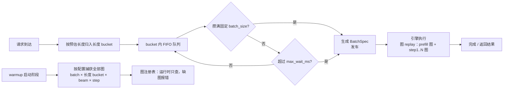
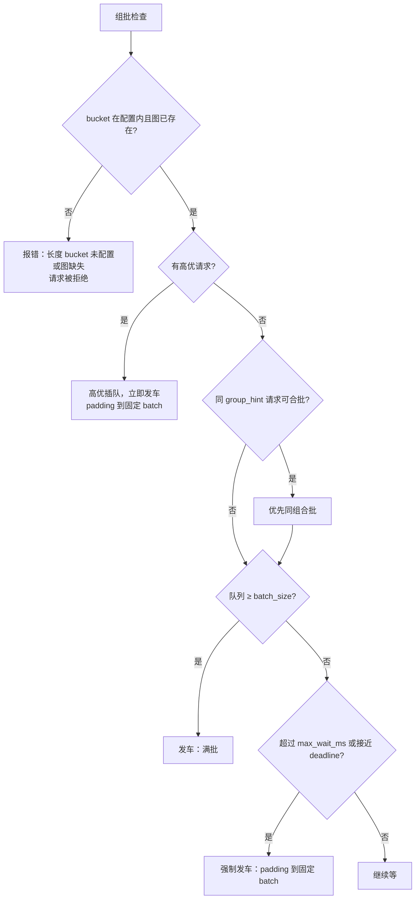
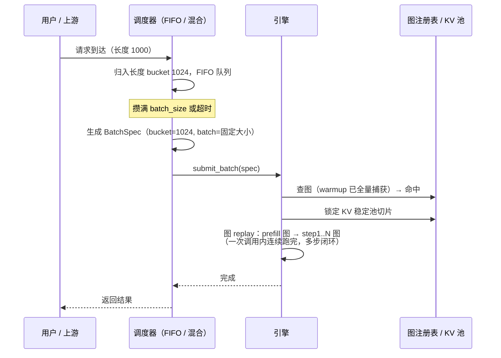

# vllm-gr 在线调度终版方案

> 状态：终版（讨论收敛后的实施基线）
> 关联文档：
> - [调度策略调研与设计](scheduler_strategy_design.md)（三库调研、成图可行性，背景参考）
> - [调度策略插件设计方案](scheduler_plugin_design.md)（可插拔中间态，本方案为其简化收敛）

---

## 1. 设计原则（一句话）

**能固定就固定，能预先做就预先做，跑的时候不做任何动态决策**：

1. **batch 大小固定为一个**（如 8），不做多档、不做降级；
2. **图是固定的**：warmup 阶段按配置把所有图全部捕获并存下来，**运行时不缓存、不懒捕获、不 eager 回退，缺图直接报错**；
3. **长度用 bucket**：不同长度需要不同 bucket，bucket 数量与档位由用户配置；
4. **调度默认 FIFO**，并提供简单混合策略（FIFO + 长度聚类 + 优先级 + 图检查 + 超时发车）。

---

## 2. 总体架构



---

## 3. 固定 batch 与长度 bucket

### 3.1 batch 大小：固定一个

- `batch_size` 固定（默认 8，用户配置），不做 4/8 两级、不做降级档；
- 请求不满 `batch_size` 时，**padding 到固定 batch 大小**再执行（图按固定 batch 捕获，padding 用 KV 池空槽位）；
- 攒批等待超过 `max_wait_ms` 时强制发车（仍然是固定 batch 大小，padding 多一些）。

### 3.2 长度 bucket：由用户配置

- 不同长度的输入需要不同形状的图，所以长度必须分桶；
- bucket 档位与数量由用户根据线上流量分布配置，例如 `[512, 1024, 2048]`；
- 请求按预估长度归入**第一个 ≥ 实际长度的 bucket**（900/1000 → 1024）；
- 实际长度超过最大 bucket：**拒绝/报错**（图没有，不会临时捕获）；
- 预估与实际误差：按 bucket 长度执行，padding 浪费由用户选的档位决定。

---

## 4. 图设计（固定 + 全量预捕获）

### 4.1 图集合

每个 (batch × 长度 bucket × beam × step) 组合一套图：

| 图 | 数量 |
|---|---|
| prefill 图 | `L` 张（每个长度 bucket 一张，batch 固定） |
| decode 图 | `S × W × L` 张（阶段 × beam 档 × 长度档） |
| **合计（逻辑图）** | `G = L × (1 + S × W)` |

beam 固定时 `W = 1`，则 `G = L × (1 + S)`。

示例：`length_buckets=[512,1024,2048]`（L=3）、`decode_steps=3`（S=3）、beam 固定（W=1）：

```text
prefill 图 = 3
decode 图 = 3 × 1 × 3 = 9
合计     = 12 张逻辑图
```

> 注：若采用逐层成图（ACS 风格）或 prefill piecewise，每张逻辑图会拆成多张物理图，实际数量 = 逻辑图数 × 每图物理段数。

### 4.2 捕获时机：warmup 全量预捕获

- **启动 warmup 时一次性捕获全部组合**，之后不再捕获任何新图；
- 捕获时同时建立：图本身、静态输入/输出 buffer、每 bucket 一份静态 attention metadata、KV 稳定池切片；
- 图注册表：`(batch, length_bucket, beam, step) → 图`，运行时只做**查询**；
- 运行时缺图：**直接报错**（说明配置与流量不匹配），不缓存、不懒捕获、不 eager 回退。

### 4.3 KV 与内存

- KV 池按长度 bucket 预留稳定切片，地址在 warmup 后固定；
- 图私有池在 warmup 时一次性建立，运行时无新分配；
- 内存预算 = 图总数 × 每图私有池/静态 buffer，启动时可预计算。

---

## 5. 调度策略

### 5.1 默认策略：FIFO

**规则**：

1. 请求到达 → 按长度归入对应 bucket 队列；
2. 队列内严格按到达顺序（FIFO）；
3. 某个 bucket 队列攒满 `batch_size` 个请求 → 立即发车；
4. 未攒满但超过 `max_wait_ms` → 强制发车（padding 到固定 batch）；
5. 发车 = 生成 BatchSpec 交给引擎，引擎按图执行。

**伪代码**：

```python
def on_request_arrive(req):
    bucket = first_bucket_ge(req.prompt_len_est)
    queues[bucket].append(req)
    if len(queues[bucket]) >= batch_size:
        dispatch(bucket)

def on_tick(now):
    for bucket, queue in queues.items():
        if queue and now - queue[0].arrived_at >= max_wait_ms:
            dispatch(bucket)

def dispatch(bucket):
    batch = queues[bucket][:batch_size]
    del queues[bucket][:batch_size]
    engine.submit(BatchSpec(bucket=bucket, request_ids=[r.id for r in batch]))
```

### 5.2 混合策略（推荐，默认）

在 FIFO 基础上组合以下规则，**优先级从高到低**：

| 优先级 | 规则 | 说明 |
|---|---|---|
| 1 | 图/配置检查 | 发车前校验 bucket 在配置内且图已存在；不在配置内直接报错，不发车 |
| 2 | 优先级插队 | 高优请求插到同 bucket 队列头部，可不满批提前发车（padding 到固定 batch） |
| 3 | 业务分组 | 有 `group_hint` 的请求优先与同组请求合批；无 hint 走 FIFO |
| 4 | 超时强制发车 | 队列头部等待超过 `max_wait_ms` 或接近 deadline 时，不满批也发（padding） |
| 5 | 攒满即发 | 队列长度 ≥ `batch_size` 立即发车 |
| 6 | FIFO 主序 | 其余情况严格按到达顺序排队 |

**决策流程**：



**混合策略的关键点**：

- **主体仍是 FIFO**：只有高优、同组、超时三种情况会改变顺序或提前发车；
- **图检查永远第一**：因为图是 warmup 全量固定的，发车唯一不能做的事就是“遇到没图的形状”——所以检查必须前置，配置外直接拒绝；
- **padding 是常态**：固定 batch 下，不满批发车就是 padding 到固定大小，混合策略只是控制“什么时候发”，不改变“发多大”；
- **优先级带老化（可选）**：等待越久的低优请求权重越高，避免饿死。

### 5.3 其他策略（终版不做，仅保留演进空间）

- SLO/Deadline 感知、图感知组批、多级 batch 降级（4/8）等，后续按需加入；
- 终版只实现 FIFO 与上述混合策略。

---

## 6. 请求执行流程



---

## 7. 多步闭环（保留）

- 一次引擎调用内跑完 prefill + 全部 decode step（RECIF = 3）；
- step 间结果不回到最外层，气泡优化按主文档 2.5 的三级路径推进；
- 与固定 batch + 固定图的方案天然兼容：同一 batch 的图序列在 warmup 时一起捕获。

---

## 8. 配置示例

```yaml
scheduler:
  batch_size: 8              # 固定 batch，单档
  length_buckets: [512, 1024, 2048]   # 长度 bucket，由用户按流量分布配置
  beam_width: 4              # 固定 beam 档（W=1）
  decode_steps: 3            # RECIF 默认 3
  policy: hybrid             # fifo | hybrid
  max_wait_ms: 10            # 攒批超时，强制发车（padding）
  warmup_on_start: true      # 启动全量预捕获
  graph_missing: error       # 运行时缺图：报错（不缓存/不 eager）
```

**预期图数量**（上面配置）：`G = 3 × (1 + 3) = 12` 张逻辑图。

---

## 9. 优点

1. **简单确定**：只有一套 batch、一套图，无运行时决策，代码量小、易调试；
2. **零运行时捕获**：warmup 全量预捕获，线上没有 capture 抖动；
3. **图命中率恒为 100%**（配置内）：发车前只查注册表，不存在“没图”的意外；
4. **显存可预算**：图数量有公式，warmup 时可一次性确认内存是否够；
5. **策略可替换**：FIFO / 混合只影响“谁先走”，不碰引擎执行；
6. **多步闭环兼容**：固定 batch + 固定图是图序列连续 replay 的最简形态。

---

## 10. 局限与边界（必须接受）

| 局限 | 影响 | 对策 |
|---|---|---|
| 长度 bucket 必须覆盖线上分布 | 超出配置的长度会被拒绝/报错 | 上线前按流量统计配置 bucket；预留最大档 |
| 固定 batch 稀疏流量 padding 浪费 | 低负载时利用率低 | 调小 batch_size 或接受；后续可加降级档（终版不做） |
| 无任何回退 | 图缺失即失败 | warmup 全量 + 配置校验保证，测试环境先验证 |
| 请求长度预估不准 | padding 浪费 | 用历史分布/调用方提供预估 |

---

## 11. 与之前文档的关系

- **调研文档**（scheduler_strategy_design.md）：三库策略分析、成图可行性，回答“为什么这么设计”；
- **插件设计文档**（scheduler_plugin_design.md）：可插拔中间态（多策略转接、两级 batch、懒捕获等），作为扩展方向；
- **本终版**：收敛为“固定 batch + 固定图 + warmup 全量捕获 + FIFO/混合策略”，是**第一版实施基线**；若后续出现 padding 浪费大、需要多级 batch 等问题，再从插件设计文档中取回对应机制。
