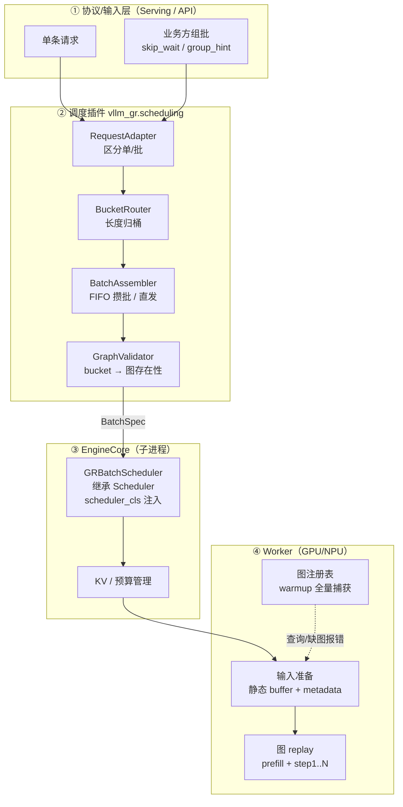
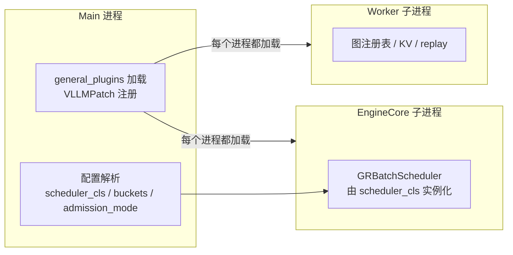
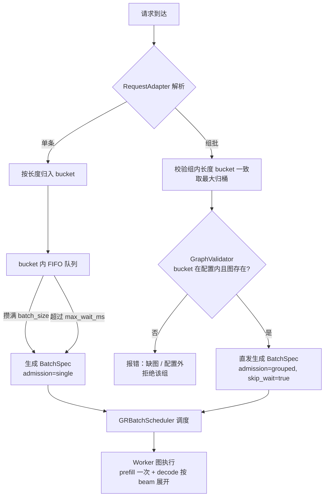
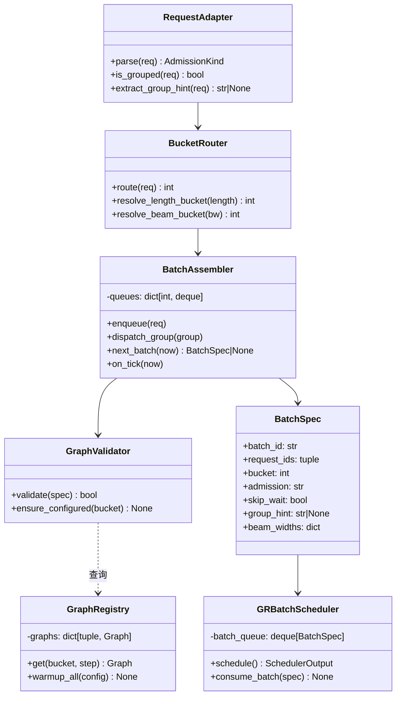
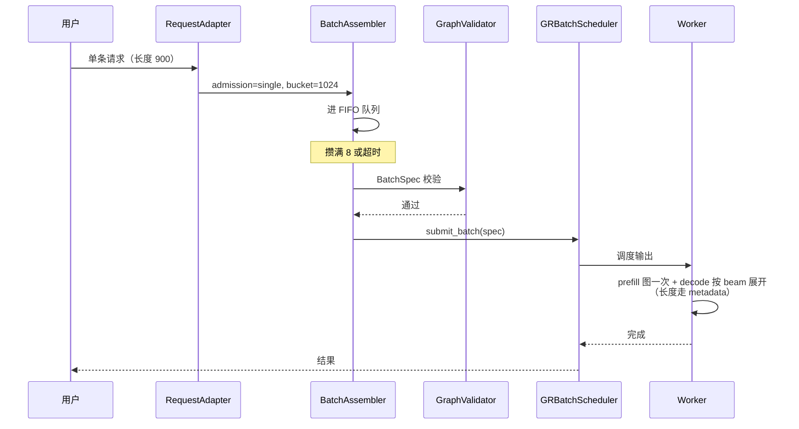
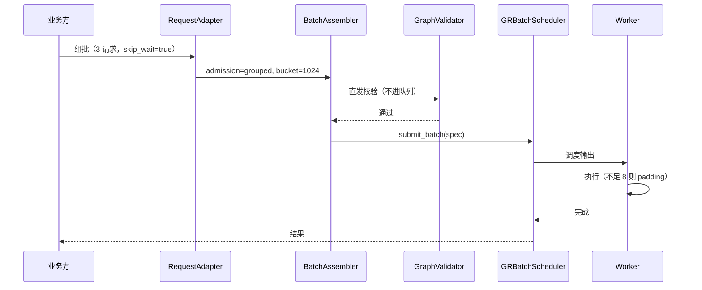
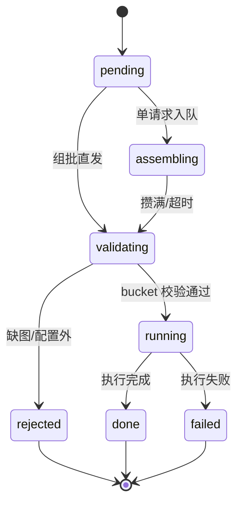
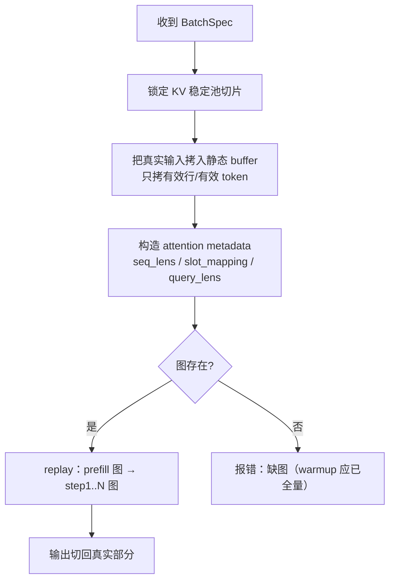
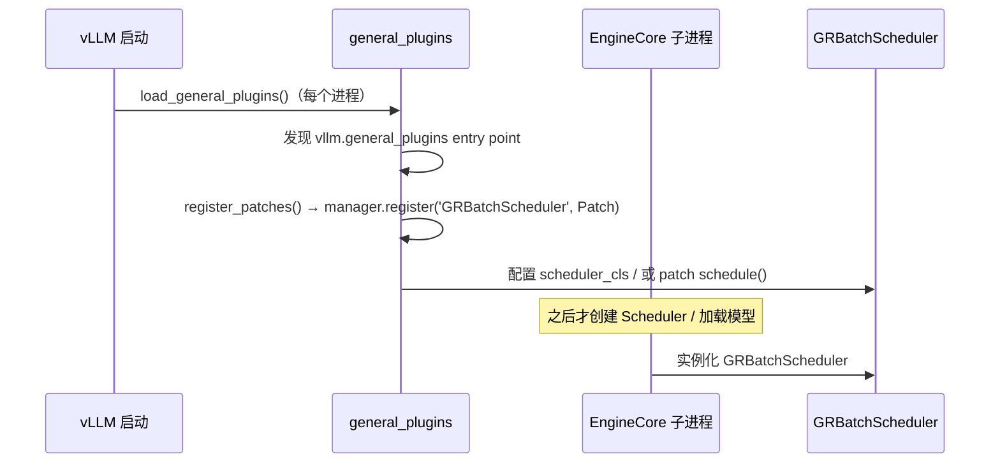

# vllm-gr 调度插件架构设计（单请求 vs 组批输入）

> 状态：架构设计（v0.2，扩展版）
> 关联文档：
> - [调度终版方案](scheduler_final_design.md)（实施基线：固定 batch + 固定图 + FIFO）
> - [调度策略插件设计方案](scheduler_plugin_design.md)（策略转接中间态）
> - vLLM 官方参考：[SchedulerConfig](https://docs.vllm.ai/en/latest/api/vllm/config/scheduler/)、[Plugin System](https://vllm.ai/blog/2025-11-20-vllm-plugin-system)

---

## 0. 两个前置结论（先定死的设计决策）

> 这两个结论来自方案讨论，后续所有架构都建立在其上，不再反复权衡。

### 0.1 padding 时机：发生在 worker 的图输入准备阶段

**结论：调度器不 pad，长度一律用 metadata 记录；真正的“padding”是图形状自带的，发生在 worker 图 replay 前。**

| 层 | 做什么 | 是否 pad |
|---|---|---|
| 业务/输入层 | 标记 bucket（900/1000 → 1024） | 否 |
| 调度器 | 按 bucket 分组，预算按**真实长度**计 | 否 |
| Worker 输入准备 | 把真实输入拷进固定形状静态 buffer；`seq_lens` / `slot_mapping` / `query_lens` 记录真实长度 | 图级自动 pad（空槽不参与 attention） |
| Worker 图 replay | 按固定形状（如 8×1024）执行 | — |


**要点**：

- 物理 pad（把 900 改成 1024）只在“kernel 不支持变长/掩码”时才需要，且时机在发车时；
- 图级 pad 下，调度预算、KV 分配都按真实长度，只有图内计算按 bucket 形状；
- decode 阶段长度是数据（每步 1 token），不需要按长度 pad，长度只影响 KV 容量档。

### 0.2 图数量估算与缓存对比

**结论：我们的图数量最少（30~52 张），一定能放下；NVIDIA 卡在 128 张 LRU 上限边缘；ACS 数量最多但靠共享内存池消化，超配置会报错。**

参数假设：batch 固定 1 档（B=1，batch=8）、长度 bucket L=3~4、beam 档 W=3~4、decode 步数 S=3。

**我们**：`G = L × (1 + S × W × B)`，B=1

| L | W | decode 图 S×W×B×L | prefill 图 L | 合计 |
|---|---|---|---|---|
| 3 | 3 | 27 | 3 | **30** |
| 3 | 4 | 36 | 3 | **39** |
| 4 | 3 | 36 | 4 | **40** |
| 4 | 4 | 48 | 4 | **52** |

**NVIDIA（GPU）**：`G = S × W × B × L`，batch 默认 4 档（B=4），decode LRU 上限 128、prefill 上限 32

| L | W | 图数 | ≤128? |
|---|---|---|---|
| 3 | 3 | 3×3×4×3 = 108 | ✅ 能放下 |
| 3 | 4 | 144 | ❌ 淘汰重捕获 |
| 4 | 3 | 144 | ❌ 淘汰重捕获 |
| 4 | 4 | 192 | ❌ 淘汰重捕获 |

**ACS（NPU）**：`G = #bs档 × #seq档 × 每组合图数`（N=4 非逐层 prefill 时每组合 10 张），启动全预捕获、无缓存上限

| 配置 | 组合数 | 图数 | 能否放下 |
|---|---|---|---|
| demo 默认（max_batch=1, max_model_len=10240, step=500） | 22×1 | 220 | ✅ 共享 pool，内存受控 |
| max_batch=8（对应我们 batch=8） | 16×1 | 160 | ✅ 同上 |
| beam 展开后总行数超 max_batch_size | — | — | ❌ 缺图报错 |

**对比结论**：

| | 图数量 | 能否放下 |
|---|---|---|
| 我们 | 30~52 | ✅ 完全没问题 |
| NVIDIA | 108（L3W3）~ 192（L4W4） | ⚠️ 仅 L=3、W=3 时 ≤128 |
| ACS | 160~220 | ✅ 全预捕获 + 共享池；超配置报错 |

> 注：若采用逐层成图（ACS 风格）或 prefill piecewise，每张“逻辑图”会拆成多张物理图，实际数量 = 逻辑图数 × 每图物理段数。

---

## 1. 背景与目标

### 1.1 要解决的问题

同一个服务必须同时支持两种输入方式：

1. **单条请求**：业务方一个一个发，引擎自己攒批（FIFO）；
2. **组批输入**：业务方自己组好 batch 一起发，引擎**跳过等待**直接执行。

两种方式可能出现在不同模型上，也可能出现在同一模型的不同流量上，所以需要统一架构，而不是两套执行链。

### 1.2 设计目标

- **双路径入口、单一执行出口**：单请求和组批最终都变成同一个 `BatchSpec`，引擎/图执行完全共用；
- **插件化接入 vLLM**：用 `vllm.general_plugins`（方案 B）打包分发，`SchedulerConfig.scheduler_cls` 作为内部注入手段；
- **图保持固定**：warmup 全量捕获、bucket 标记、缺图报错，不引入运行时捕获；
- **padding 时机固定**：worker 图输入准备阶段，长度走 metadata（见 0.1）；
- **图数量可预算**：按 0.2 的公式在启动时确认，内存可提前规划。

---

## 2. 总体架构

### 2.1 分层架构



### 2.2 进程视图（插件在哪里加载）



**关键点**：`general_plugins` 在 **main / EngineCore / worker 每个进程**启动前加载（vLLM 官方保证），所以 patch 在调度器创建前生效——这是 monkey patch 做不到的。

### 2.3 职责边界

| 组件 | 职责 | 不做什么 |
|---|---|---|
| 输入层 | 协议解析、单/批识别 | 不做调度决策 |
| 调度插件 | 选批（谁、何时、哪个 bucket） | 不碰 KV/图/执行 |
| EngineCore | 调度输出、预算管理 | 不解析业务策略 |
| Worker | 图执行、输入准备 | 不感知单/批来源 |

---

## 3. 单请求 vs 组批：双路径设计

### 3.1 判定规则

| 输入 | 判定 | 路径 |
|---|---|---|
| 普通请求（无标记） | `admission_mode` 允许 single | FIFO 攒批 |
| 组批请求（`skip_wait` / `group_hint`） | bucket 校验通过 | 直发 |
| 组批请求 | bucket 校验失败 | 报错拒绝 |

### 3.2 决策流程



### 3.3 混合规则与配置

- 组批请求是“显式契约”，**不进 FIFO 队列**，不与单请求混拼；
- FIFO 队列只收单请求（终版不做组批拆开补队的合并逻辑）；
- `admission_mode` 按模型配置：`auto`（默认，两种都支持）/ `single_only` / `grouped_only`。

---

## 4. 模块设计

### 4.1 模块包结构

```text
vllm_gr/scheduling/
├── __init__.py          # 插件入口：register_patches()
├── types.py             # BatchSpec / AdmissionKind / 协议扩展字段
├── adapter.py           # RequestAdapter：单/批解析
├── router.py            # BucketRouter：长度归桶、beam 信息
├── assembler.py         # BatchAssembler：FIFO / 直发状态机
├── validator.py         # GraphValidator：bucket → 图存在性
├── registry.py          # GraphRegistry：warmup 图注册表（Worker 侧）
├── scheduler.py         # GRBatchScheduler(Scheduler)：EngineCore 侧
├── config.py            # per-model 配置加载与校验
└── plugin.py            # general_plugins 注册与 VLLMPatch 定义
```

### 4.2 模块职责

| 模块 | 输入 | 输出 | 关键逻辑 |
|---|---|---|---|
| `adapter.py` | 原始请求 | `AdmissionKind`（single/grouped） | 读 `skip_wait` / `group_hint` |
| `router.py` | 请求/组 | bucket + beam 信息 | 第一个 ≥ 实际长度的 bucket |
| `assembler.py` | bucket 队列 / 组 | `BatchSpec` | FIFO 攒批、超时发车、直发 |
| `validator.py` | BatchSpec | 通过/拒绝 | bucket ∈ 配置 ∧ 图存在 |
| `registry.py` | bucket/step | 图句柄 | warmup 全量捕获后的查询表 |
| `scheduler.py` | BatchSpec 流 | SchedulerOutput | 按 (bucket, step) 分组输出 |
| `plugin.py` | — | VLLMPatch 注册 | entry point 加载 |

### 4.3 类图



### 4.4 核心数据结构：BatchSpec

```python
@dataclass(frozen=True)
class BatchSpec:
    batch_id: str
    request_ids: tuple[str, ...]
    bucket: int                       # 长度 bucket
    admission: str                    # "single" | "grouped"
    skip_wait: bool = False
    group_hint: str | None = None
    beam_widths: dict[str, int] = field(default_factory=dict)
    expected_len: int
    created_at: float
```

JSON 示例（组批）：

```json
{
  "batch_id": "grp-1723-1024",
  "request_ids": ["r1", "r2", "r3"],
  "bucket": 1024,
  "admission": "grouped",
  "skip_wait": true,
  "group_hint": "recall-1",
  "beam_widths": {"r1": 128, "r2": 256, "r3": 128},
  "expected_len": 1000,
  "created_at": 1723000000.0
}
```

---

## 5. 关键流程

### 5.1 单请求时序



### 5.2 组批时序



### 5.3 Batch 状态机



---

## 6. 图注册表与 KV / metadata

### 6.1 图注册表结构

```text
GraphRegistry
├── prefill:  { bucket → prefill 图 }                # L 张
├── decode:   { (bucket, step) → decode 图 }          # S × L 张（batch-1，beam 展开）
├── static_buffers: { bucket → 输入/输出静态 buffer }
├── metadata:  { bucket → 静态 AscendMetadata / attention metadata }
└── kv_pool:   { bucket → 稳定池切片 }
```

### 6.2 Worker 输入准备（padding + metadata 流程）



### 6.3 图数量预算（物理图拆分说明）

- 逻辑图数见 0.2（我们 30~52）；
- 若采用逐层成图（ACS 风格）或 prefill piecewise，物理图数 = 逻辑图数 × 每图物理段数（例如 decode 逐层 = 层数+1）；
- 终版默认**每张逻辑图一张物理图**（不做逐层拆分），图数量即 30~52，内存可预算。

---

## 7. 与 vLLM 的接入（方案对比与插件化）

### 7.1 插件机制简介（先搞懂 VLLMPatch）

**vLLM 官方的契约只有一个**：`vllm.general_plugins` entry point。插件包在 `setup.py` 里注册这个 entry point，vLLM 在**每个进程**（main / EngineCore / worker）启动早期自动调用指向的注册函数。

**VLLMPatch 是博客在其上自建的小框架**，核心思想是“外科手术式替换”：

```python
class PrioritySchedulerPatch(VLLMPatch[Scheduler]):
    @min_vllm_version("0.8.0")
    def apply(self, target_cls):
        target_cls.schedule = priority_schedule   # 只替换这一个方法
```

- **只实现某个方法 → 就只替换这一个方法**，目标类（`Scheduler`）的其他方法原样保留；
- 不复制整个类、不复制整文件，只有修改部分；
- 通过 `manager.register('PriorityScheduler', PrioritySchedulerPatch)` 注册，`manager.apply_from_env()` 按环境变量选择性启用。

**回答你的问题**：对，`class XxxPatch(VLLMPatch[Scheduler])` 里只写要改的方法，`apply()` 里只给目标类换掉/新增那一个方法——这就是“单个方法替换，不复制整个类”。

### 7.2 我们需要哪些类、替换原版调度哪些函数

| 我们的类（Patch） | 目标类（原版） | 替换/新增的函数 | 做什么 |
|---|---|---|---|
| `GRBatchSchedulerPatch` | `Scheduler` | 替换 `schedule()` | 消费 BatchSpec；按 (bucket, step) 分组输出；bucket 不在配置内报错；其余原版调度逻辑保留 |
| `RequestPatch`（可选） | `Request` | 新增属性 `skip_wait` / `group_hint` / `bucket` | 协议字段透传到调度器 |
| `KVReservePatch`（可选） | `KVCacheManager` | 新增 `reserve_bucket_slots()` | KV 池按长度 bucket 预留稳定切片 |
| EngineCore 协议扩展 | `EngineCore` / `EngineCoreProc` | 扩展 `process_input_sockets()` / ADD_BATCH 解码 | 单/批协议（skip_wait/group_hint/bucket）进入引擎（本地已有先例） |
| `GraphRegistry` / `GraphValidator` / `BatchAssembler` / `BucketRouter` | — | **新增模块，不替换任何原版函数** | 图注册表、bucket 校验、组批逻辑 |

**最小集合（第一版）**：只替换 `Scheduler.schedule()` + 扩展 EngineCore 协议；其余都是新增模块。

> Worker 侧若需要 hook 输入准备（把真实长度写进 metadata），可参考本地已有先例替换 `ModelRunner._prepare_inputs()`（可选，第二版）。

### 7.3 我们现在的 monkey patch 与插件系统：一样吗？区别？

#### 7.3.1 我们 fork 的 monkey patch：源码与逻辑

**核心逻辑**：保存原方法 → 包装 → 重新赋值 → 打标记防重复 → 在子进程入口重新应用。

源码证据（`vllm_gr/v1/engine/engine_core_patch.py`）：

```python
# ① 保存原方法，包装后重新赋值（Scheduler.schedule）
_original_schedule = Scheduler.schedule

@wraps(_original_schedule)
def patched_schedule(self):
    ...
    output = _original_schedule(self)          # 先调原版
    output.beam_data = build_beam_request_metadata(...)  # 再附加 beam 信息
    return output

Scheduler.schedule = patched_schedule          # 重新赋值
setattr(Scheduler.schedule, _SCHEDULER_PATCH_MARKER, True)  # 标记防重复
```

```python
# ② 子进程入口 wrapper：spawn 出的 EngineCore 子进程里模块全新，
#    Scheduler 是原版，所以必须在子进程启动时重新打一遍 patch
def run_engine_core(*args, **kwargs):
    """...In the spawned child process, all modules are freshly imported, so
    EngineCoreProc.run_engine_core is the original unpatched version.
    We apply our patches first, then delegate to the original."""
    apply_engine_core_child_patches()   # 请求 patch + 调度 patch + worker patch
    return original_run(*args, **kwargs)
```

```python
# ③ 集中注册表 + 校验（vllm_gr/patch.py）
def _required_beam_patches():
    return (
        BeamPatch(name="flat_logprobs", apply=..., verify=_validate_flat_logprobs_patch),
        BeamPatch(name="batch_and_fork", apply=..., verify=_validate_batch_and_fork_patch),
        ...
    )
_initialize_beam_patch_plan(_required_beam_patches())   # 逐个 apply + verify
```

**逻辑要点**：

- **替换方式**：保存原方法 → 包装 → 重新赋值（与插件系统相同）；
- **防重复**：用 `setattr(marker)` 标记 + `_run_engine_core_active` 重入守卫；
- **子进程生效**：靠 fork 自己 patch 了 `run_engine_core` 子进程入口，在子进程里重新 apply——这是 vllm_gr 能用的根本原因；
- **校验**：每个 patch 有 `verify` 函数，启动后输出 `BeamPatchReport`。

#### 7.3.2 vLLM general_plugins：源码与逻辑

**核心逻辑**：patch 定义为 `VLLMPatch[Target]` 子类 → `manager.register(name, PatchClass)` 注册 → 每进程启动早期自动加载。

源码证据（博客原样）：

```python
# ① patch 定义：只替换目标类的某一个方法
class PrioritySchedulerPatch(VLLMPatch[Scheduler]):
    @min_vllm_version("0.8.0")
    def apply(self, target_cls):
        target_cls.schedule = priority_schedule   # 只替换 schedule

# ② 注册与启用
def register_patches():
    manager.register('PriorityScheduler', PrioritySchedulerPatch)
    manager.apply_from_env()                      # 按环境变量选择启用

# ③ setup.py 注册 entry point
entry_points={
    'vllm.general_plugins': ['custom_patches = vllm_custom_patches:register_patches']
}
```

```text
# ④ vLLM 生命周期：每个进程（main / EngineCore / worker）启动早期
load_general_plugins() → 发现 entry point → 调用 register_patches()
→ manager.apply_from_env() → VLLMPatch.apply() → 替换方法
→ 之后才创建 Scheduler / 加载模型
```

**逻辑要点**：

- **替换方式**：`apply()` 里 `target_cls.schedule = ...`（与我们的重新赋值相同）；
- **子进程生效**：由 vLLM 官方 `load_general_plugins()` 在**每个进程**保证，不需要自己 patch 子进程入口；
- **版本守卫**：`@min_vllm_version`；
- **选择性启用**：环境变量按 patch 名。

#### 7.3.3 源码级逐行对比

| 动作 | 我们（fork monkey patch） | vLLM general_plugins |
|---|---|---|
| 替换方法 | `Scheduler.schedule = patched_schedule` | `target_cls.schedule = priority_schedule`（`apply()` 内） |
| 保存原方法 | `_original_schedule = Scheduler.schedule`（包装后调用） | 博客示例直接替换；如需调用原版需自行保存 |
| 注册 | `BeamPatch(name, apply, verify)` 元组表 | `manager.register('PriorityScheduler', PrioritySchedulerPatch)` |
| 应用入口 | `_initialize_beam_patch_plan(...)` 手动调用 | `manager.apply_from_env()` |
| 子进程生效 | `run_engine_core` wrapper 里重新 apply（fork 自己写） | `load_general_plugins()` 每进程自动调用 |
| 防重复 | `setattr(marker)` + 重入守卫 | manager 注册一次；vLLM 每进程只 load 一次 |
| 校验/守卫 | 每个 patch 的 `verify()` + `BeamPatchReport` | `@min_vllm_version` 版本守卫 |

#### 7.3.4 逻辑级对比

| 维度 | 我们（fork monkey patch） | vLLM general_plugins |
|---|---|---|
| 生效机制 | fork 改子进程入口，spawn 后子进程里重打 | 官方每进程启动早期自动加载 |
| patch 载体 | 散落在 `vllm_gr/*.py` + `BeamPatch` 注册表 | 独立 pip 包 + `setup.py` entry point |
| 子进程 | 自己处理（wrapper 重打） | 官方保证 |
| 版本管理 | 无，升级 vLLM 手工同步 | `@min_vllm_version` |
| 选择性启用 | 按进程分工两套 patch 表（required / engine_core） | 环境变量按 patch 名 |
| 升级 vLLM | rebase fork、核对散落 patch、回归 | `pip install --upgrade vllm`，插件不动 |
| 分发 | 整个 fork | 独立小 pip 包 |
| 官方支持 | 无（黑盒绕开 API） | `vllm.general_plugins` 官方扩展点 |

#### 7.3.5 结论

**机制等价**：两种方式都是“运行时替换类的个别方法、不复制整个类”，本质相同。

**差异只在三件事**：① 谁保证子进程生效（fork 自己写 wrapper vs 官方每进程加载）；② 版本与启用管理（无 vs `@min_vllm_version` + 环境变量）；③ 分发形态（整个 fork vs 独立 pip 包）。

**建议**：把 `patch.py` 里**调度相关的 patch**（`Scheduler.schedule` 等）收拢成 `vllm.general_plugins` 包，用 `VLLMPatch` 写法重写；模型/推理类 patch 可继续留在 fork 内。

#### 7.3.6 现状核对：我们其实已经接入 general_plugins，子进程生效已做到

**结论：✅ 子进程生效已经做到。但机制是两层配合，不是“插件在子进程里直接 patch Scheduler”。**

证据：

```toml
# pyproject.toml L60-61
[project.entry-points."vllm.general_plugins"]
vllm_gr = "vllm_gr.plugin:register"
```

```python
# vllm_gr/plugin.py —— 每个进程（main / EngineCore / worker）都会执行
def register():
    state = initialize_runtime()   # re_apply_patches() + _register_models()
```

```python
# vllm_gr/v1/engine/engine_core_patch.py —— 子进程生效的真正落点
def apply_engine_core_child_patches():
    apply_engine_core_request_patches()
    apply_scheduler_patch()        # ← 这里才替换 Scheduler.schedule
    apply_worker_patches()

def run_engine_core(*args, **kwargs):
    """...In the spawned child process, all modules are freshly imported, so
    EngineCoreProc.run_engine_core is the original unpatched version.
    We apply our patches first, then delegate to the original."""
    apply_engine_core_child_patches()
    return original_run(*args, **kwargs)
```

**机制拆解**：

1. `general_plugins` 每进程加载 `register()` → `initialize_runtime()` → `re_apply_patches()`，保证 **wrapper 被安装**、patch 状态可验证；
2. `batch_and_fork` patch 把 `EngineCoreProc.run_engine_core` 换成我们的 wrapper；
3. EngineCore **子进程 spawn 后**（模块全新、Scheduler 是原版），wrapper 调用 `apply_engine_core_child_patches()`，**在这里** `Scheduler.schedule` 才被替换。

所以准确表述是：**“子进程生效”是我们 fork 自己用 wrapper 实现的**；插件系统只保证了 wrapper 被装上。Scheduler 在插件加载时往往还没被 import，插件本身并没有直接 patch 它。

#### 7.3.7 那我们现在的代码也能精准替换，VLLMPatch 的意义是什么？

**功能层：等价。** 我们的 `Scheduler.schedule = patched_schedule` 就是精准替换单个方法、不复制整类，和 VLLMPatch `apply()` 里的 `target_cls.schedule = priority_schedule` 本质相同。

**工程层：有明确差异。** VLLMPatch 的意义不是“能不能替换”，而是把“替换什么、怎么管理、怎么分发”声明化：

| 需求 | 我们现状（函数式 patch） | VLLMPatch 声明式类 |
|---|---|---|
| 精准替换单个方法 | ✅ 已做到 | ✅ |
| 版本守卫（`@min_vllm_version`） | ❌ 无 | ✅ |
| 按名启用（`apply_from_env`） | ❌ 启动即全打 | ✅ |
| 注册集中管理 | ⚠️ `BeamPatch` 注册表（半集中） | ✅ 类 + manager |
| 独立分发（pip 包） | ❌ 依赖 fork | ✅ |
| 子进程生效 | ⚠️ 自己写 wrapper（fork 私有，升级易碎） | ✅ 官方保证 |

**分析结论**：

- 我们的代码在功能上**已经等价**（都能精准替换、都能子进程生效），所以“引入 VLLMPatch”不是“从不能做到能做”，而是**工程升级**；
- 真正值得做的三件事：① 给 patch 加版本守卫；② 支持按名选择性启用（多模型一个 build）；③ 把“子进程生效”从 fork 私有 wrapper 换成官方机制，降低升级成本；
- 迁移方式：保留 `initialize_runtime()` 作为总入口，把 `patch.py` 里的调度类 patch 逐条改写成 `class GRBatchSchedulerPatch(VLLMPatch[Scheduler])` 并注册到 manager；`run_engine_core` wrapper 逐步退化为兜底。

### 7.4 三种方案对比

| 方案 | 机制 | 适合场景 | 结论 |
|---|---|---|---|
| A | `SchedulerConfig.scheduler_cls` 配置注入 | fork 内/单机配置 | 作为 B 的内部手段 |
| **B** | `vllm.general_plugins` + `VLLMPatch` | 插件化分发、跟随上游 | **采用** |
| C | Serving 层协议插件 | 只改业务层 | 单/批解析可放这里，调度仍走 B |

### 7.5 方案 B：插件加载时序



**真实注册写法（对齐博客原文，`manager.register(name, PatchClass)`）**：

```python
# patches/gr_scheduler.py —— patch 定义为 VLLMPatch 子类
from vllm_gr.scheduling.core import VLLMPatch, min_vllm_version

class GRBatchSchedulerPatch(VLLMPatch[Scheduler]):
    @min_vllm_version("0.8.0")          # 版本守卫
    def apply(self, target_cls):
        target_cls.schedule = gr_schedule   # 外科手术式替换 schedule


# plugin.py —— entry point 指向的函数
def register_patches():
    manager.register('GRBatchScheduler', GRBatchSchedulerPatch)
    manager.apply_from_env()            # 按环境变量启用（如 VLLM_CUSTOM_PATCHES）
```

```python
# setup.py —— 注册 vllm.general_plugins entry point
entry_points={
    'vllm.general_plugins': [
        'vllm_gr_sched = vllm_gr.scheduling.plugin:register_patches'
    ],
}
```

> 注意：博客里的 `VLLMPatch` / `PatchManager` / `VLLM_CUSTOM_PATCHES` 是**作者自建的小框架**（博客原文也注明 `VLLM_CUSTOM_PATCHES` 不是官方环境变量）；vLLM 官方的契约只有 `vllm.general_plugins` entry point 指向注册函数。我们落地时可以用自己的 `VLLMPatch` 实现，或直接复用博客框架。

### 7.6 推荐组合

- **调度注入**：插件内按博客方式注册 `GRBatchSchedulerPatch`（`manager.register('GRBatchScheduler', ...)`）；需要显式换类时再设置 `scheduler_cls="vllm_gr.scheduling.GRBatchScheduler"`；
- **协议扩展**：单/批解析在 Serving 层（方案 C 的思想），协议字段进入 EngineCore；
- **不做**：传统 monkey patch。

---

## 8. SchedulerConfig 参数映射

| 参数 | 默认 | 我们的用法 | 说明 |
|---|---|---|---|
| `scheduler_cls` | `Scheduler` | `vllm_gr.scheduling.GRBatchScheduler` | 自定义调度器注入点 |
| `policy` | `fcfs` | `fcfs` | 与 FIFO 一致，不改 |
| `max_num_seqs` | 128 | 固定 batch 容量（如 8） | 每步最多序列数 |
| `max_num_batched_tokens` | 2048 | 按真实长度预算 | 图级 padding 不占预算 |
| `enable_chunked_prefill` | True | 保持默认或按 bucket 关闭 | 与固定长度图冲突时关闭 |
| `scheduler_reserve_full_isl` | True | 保持 | 准入前检查全长 KV 放得下 |
| `watermark` | 0.0 | 按需 | KV 余量 |
| `async_scheduling` | None | 不启用 | 自定义 Scheduler 会禁用 async，接受 |

---

## 9. 配置示例（per-model）

```yaml
scheduler_plugin:
  scheduler_cls: "vllm_gr.scheduling.GRBatchScheduler"
  admission_mode: auto            # auto | single_only | grouped_only
  batch_size: 8
  length_buckets: [512, 1024, 2048]
  beam_buckets: [128, 256]        # 3~4 种时扩展
  max_wait_ms: 10
  warmup_on_start: true
  graph_missing: error
```

---

## 10. 实施步骤

1. **协议层**：扩展 `ADD_BATCH` / `BEAM_REQUEST_STEP_UPDATE`，增加 `skip_wait` / `group_hint` / `bucket`；Serving 层实现 adapter/router/assembler；
2. **插件骨架**：`vllm.general_plugins` entry point + `register_patches()` + `VLLMPatch[Scheduler]`；
3. **调度器**：`GRBatchScheduler(Scheduler)`，FIFO 攒批、超时发车、组批直发、缺图报错；
4. **图校验**：GraphValidator + GraphRegistry（warmup 全量捕获）打通；
5. **混合压测**：单/批混合负载，验证图命中率 100%、padding 记账、FTT/TBT、图数量 30~52 内存预算；
6. **插件分发验证**：`pip install` vLLM + 插件包，脱离 fork 跑通。

---

## 11. 风险与对策

| 风险 | 对策 |
|---|---|
| `scheduler_cls` 接口非公开、升级不兼容 | 版本守卫（`@min_vllm_version`）；薄适配层 |
| 自定义 Scheduler 禁用 async scheduling | 压测对比；不达标再评估 AsyncScheduler 子类化 |
| general_plugins 每进程加载依赖 entry point 注册 | 插件包安装正确性纳入 CI |
| 单/批协议解析分散 | 统一到 `vllm_gr/scheduling/adapter.py` |
| 组批与 FIFO 混排复杂 | 终版规则：组批不进队列；合并后置 |
| bucket 配置与流量不匹配 | GraphValidator 前置报错 + 上线前统计配置 |
| 图数量超内存预算 | 按 0.2 公式启动预检；物理图拆分时乘段数 |

---

## 附录：一句话总结

**单请求走 FIFO 攒批、组批走 skip_wait 直发，在 BatchSpec 处汇合；padding 发生在 worker 图输入准备（长度走 metadata）；图数量 30~52 可预算、warmup 全量捕获、缺图报错；调度器通过 general_plugins + scheduler_cls 接入 vLLM，输入方式不同，执行链完全共用。**
