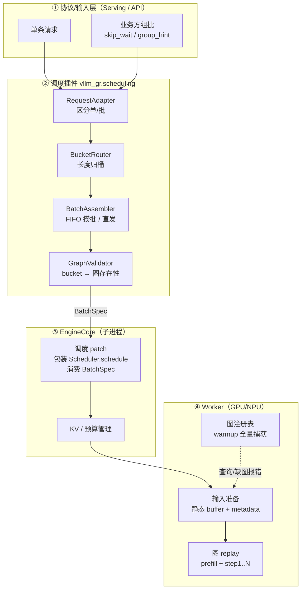
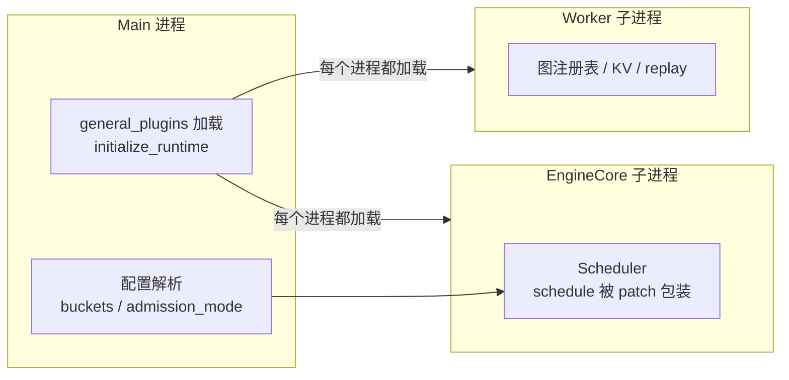
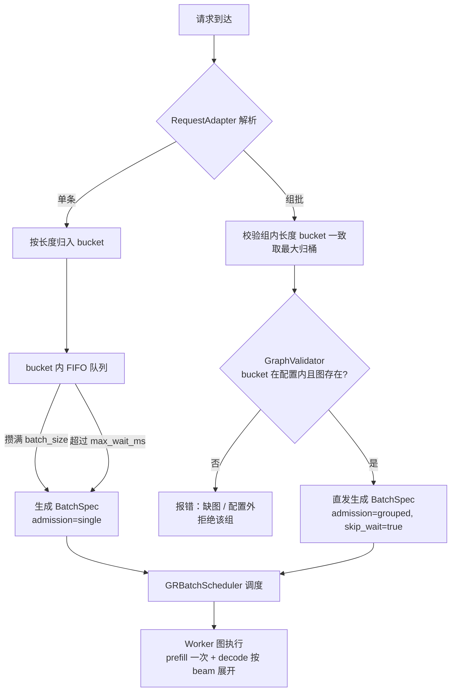
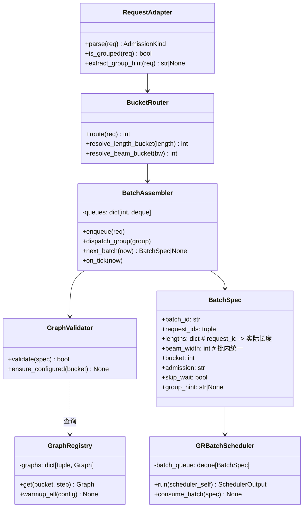
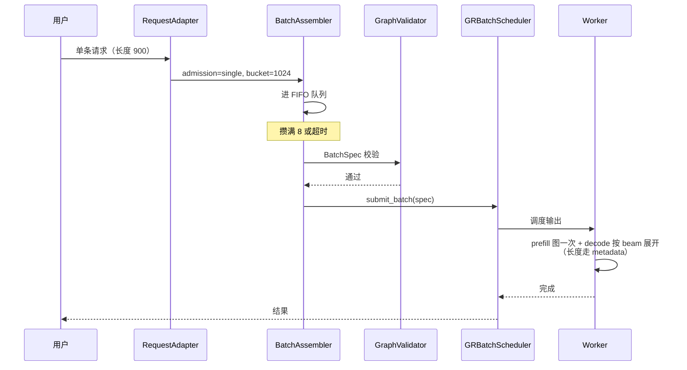
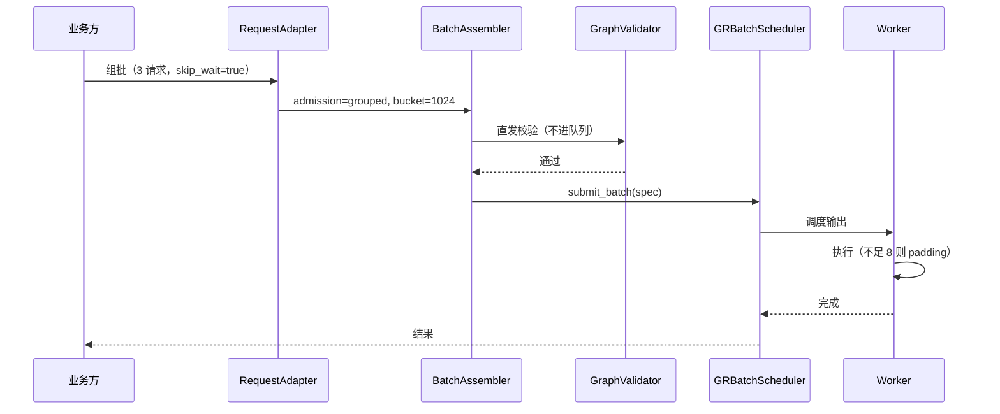
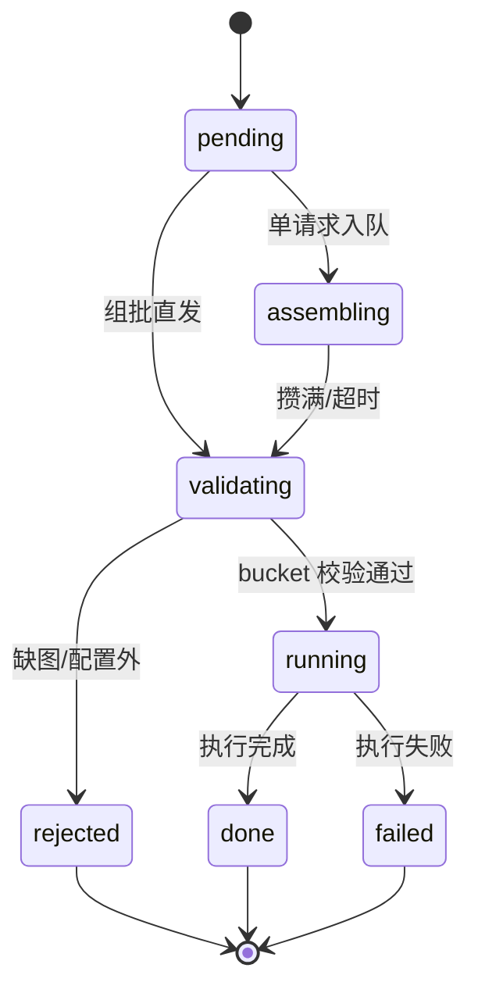
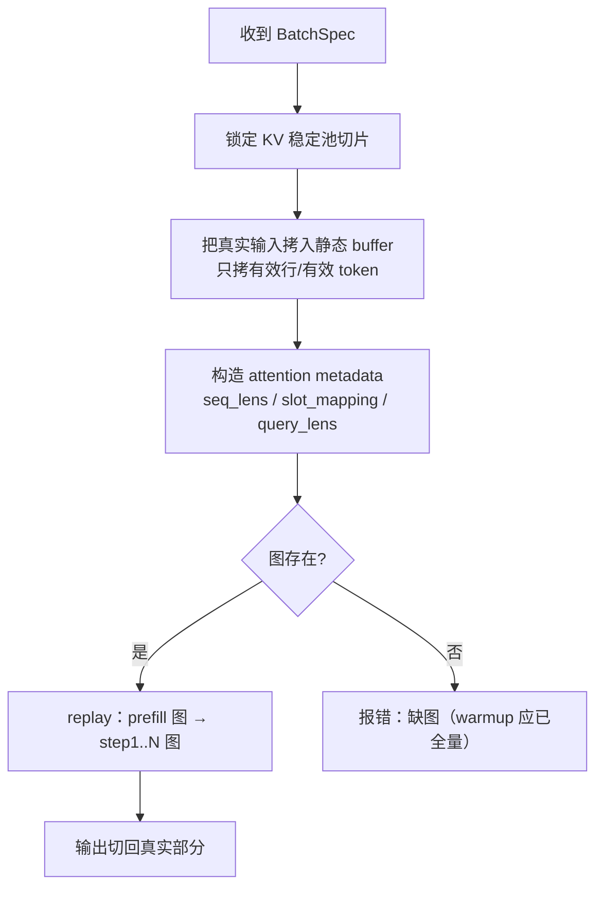

# vllm-gr 调度插件架构设计（单请求 vs 组批输入）

> 状态：架构设计（v0.2，扩展版）
> 关联文档：
> - [调度终版方案](scheduler_final_design.md)（实施基线：固定 batch + 固定图 + FIFO）
> - [调度策略插件设计方案](scheduler_plugin_design.md)（策略转接中间态）
> - vLLM 官方参考：[SchedulerConfig](https://docs.vllm.ai/en/latest/api/vllm/config/scheduler/)、[Plugin System](https://vllm.ai/blog/2025-11-20-vllm-plugin-system)

---

## 0. 两个前置结论（先定死的设计决策）

> 这两个结论来自方案讨论，后续所有架构都建立在其上，不再反复权衡。

### 0.1 padding 时机：发生在 worker 的图输入准备阶段

**结论：调度器不 pad，长度一律用 metadata 记录；真正的“padding”是图形状自带的，发生在 worker 图 replay 前。**

| 层 | 做什么 | 是否 pad |
|---|---|---|
| 业务/输入层 | 标记 bucket（900/1000 → 1024） | 否 |
| 调度器 | 按 bucket 分组，预算按**真实长度**计 | 否 |
| Worker 输入准备 | 把真实输入拷进固定形状静态 buffer；`seq_lens` / `slot_mapping` / `query_lens` 记录真实长度 | 图级自动 pad（空槽不参与 attention） |
| Worker 图 replay | 按固定形状（如 8×1024）执行 | — |


**要点**：

- 物理 pad（把 900 改成 1024）只在“kernel 不支持变长/掩码”时才需要，且时机在发车时；
- 图级 pad 下，调度预算、KV 分配都按真实长度，只有图内计算按 bucket 形状；
- decode 阶段长度是数据（每步 1 token），不需要按长度 pad，长度只影响 KV 容量档。

### 0.2 图数量估算与缓存对比

**结论：我们的图数量最少（30~52 张），一定能放下；NVIDIA 卡在 128 张 LRU 上限边缘；ACS 数量最多但靠共享内存池消化，超配置会报错。**

参数假设：batch 固定 1 档（B=1，batch=8）、长度 bucket L=3~4、beam 档 W=3~4、decode 步数 S=3。

**我们**：`G = L × (1 + S × W × B)`，B=1

| L | W | decode 图 S×W×B×L | prefill 图 L | 合计 |
|---|---|---|---|---|
| 3 | 3 | 27 | 3 | **30** |
| 3 | 4 | 36 | 3 | **39** |
| 4 | 3 | 36 | 4 | **40** |
| 4 | 4 | 48 | 4 | **52** |

**NVIDIA（GPU）**：`G = S × W × B × L`，batch 默认 4 档（B=4），decode LRU 上限 128、prefill 上限 32

| L | W | 图数 | ≤128? |
|---|---|---|---|
| 3 | 3 | 3×3×4×3 = 108 | ✅ 能放下 |
| 3 | 4 | 144 | ❌ 淘汰重捕获 |
| 4 | 3 | 144 | ❌ 淘汰重捕获 |
| 4 | 4 | 192 | ❌ 淘汰重捕获 |

**ACS（NPU）**：`G = #bs档 × #seq档 × 每组合图数`（N=4 非逐层 prefill 时每组合 10 张），启动全预捕获、无缓存上限

| 配置 | 组合数 | 图数 | 能否放下 |
|---|---|---|---|
| demo 默认（max_batch=1, max_model_len=10240, step=500） | 22×1 | 220 | ✅ 共享 pool，内存受控 |
| max_batch=8（对应我们 batch=8） | 16×1 | 160 | ✅ 同上 |
| beam 展开后总行数超 max_batch_size | — | — | ❌ 缺图报错 |

**对比结论**：

| | 图数量 | 能否放下 |
|---|---|---|
| 我们 | 30~52 | ✅ 完全没问题 |
| NVIDIA | 108（L3W3）~ 192（L4W4） | ⚠️ 仅 L=3、W=3 时 ≤128 |
| ACS | 160~220 | ✅ 全预捕获 + 共享池；超配置报错 |

> 注：若采用逐层成图（ACS 风格）或 prefill piecewise，每张“逻辑图”会拆成多张物理图，实际数量 = 逻辑图数 × 每图物理段数。

---

## 1. 背景与目标

### 1.1 要解决的问题

同一个服务必须同时支持两种输入方式：

1. **单条请求**：业务方一个一个发，引擎自己攒批（FIFO）；
2. **组批输入**：业务方自己组好 batch 一起发，引擎**跳过等待**直接执行。

两种方式可能出现在不同模型上，也可能出现在同一模型的不同流量上，所以需要统一架构，而不是两套执行链。

### 1.2 设计目标

- **双路径入口、单一执行出口**：单请求和组批最终都变成同一个 `BatchSpec`，引擎/图执行完全共用；
- **最小改动接入**：复用现有 `apply_scheduler_patch()` / `initialize_runtime()` 机制，不引入新框架、不换调度类；
- **成图对接接口**：给 prefill / decode 成图提供明确接口（Provider），同事按接口实现即可接入；
- **图保持固定**：warmup 全量捕获、bucket 标记、缺图报错，不引入运行时捕获；
- **padding 时机固定**：worker 图输入准备阶段，长度走 metadata（见 0.1）；
- **图数量可预算**：按 0.2 的公式在启动时确认，内存可提前规划。

---

## 2. 总体架构

### 2.1 分层架构



### 2.2 进程视图（插件在哪里加载）



**关键点**：`general_plugins` 在 **main / EngineCore / worker 每个进程**启动前加载（vLLM 官方保证），所以 patch 在调度器创建前生效——这是 monkey patch 做不到的。

### 2.3 职责边界

| 组件 | 职责 | 不做什么 |
|---|---|---|
| 输入层 | 协议解析、单/批识别 | 不做调度决策 |
| 调度插件 | 选批（谁、何时、哪个 bucket） | 不碰 KV/图/执行 |
| EngineCore | 调度输出、预算管理 | 不解析业务策略 |
| Worker | 图执行、输入准备 | 不感知单/批来源 |

---

## 3. 单请求 vs 组批：双路径设计

### 3.1 判定规则

| 输入 | 判定 | 路径 |
|---|---|---|
| 普通请求（无标记） | `admission_mode` 允许 single | FIFO 攒批 |
| 组批请求（`skip_wait` / `group_hint`） | bucket 校验通过 | 直发 |
| 组批请求 | bucket 校验失败 | 报错拒绝 |

### 3.2 决策流程



### 3.3 混合规则与配置

- 组批请求是“显式契约”，**不进 FIFO 队列**，不与单请求混拼；
- FIFO 队列只收单请求（终版不做组批拆开补队的合并逻辑）；
- `admission_mode` 按模型配置：`auto`（默认，两种都支持）/ `single_only` / `grouped_only`。

---

## 4. 模块设计

### 4.1 模块包结构

```text
vllm_gr/scheduling/
├── __init__.py          # 插件入口：register_patches()
├── types.py             # BatchSpec / AdmissionKind / 协议扩展字段
├── adapter.py           # RequestAdapter：单/批解析
├── router.py            # BucketRouter：长度归桶、beam 信息
├── assembler.py         # BatchAssembler：FIFO / 直发状态机
├── validator.py         # GraphValidator：bucket → 图存在性
├── registry.py          # GraphRegistry：warmup 图注册表（Worker 侧）
├── graph.py             # 成图对接接口：PrefillGraphProvider / DecodeGraphProvider
├── scheduler.py         # GRBatchScheduler：调度逻辑（由 patch 挂接 schedule）
├── config.py            # per-model 配置加载与校验
└── plugin.py            # 现有 general_plugins 入口（initialize_runtime 机制）
```

### 4.2 模块职责

| 模块 | 输入 | 输出 | 关键逻辑 |
|---|---|---|---|
| `adapter.py` | 原始请求 | `AdmissionKind`（single/grouped） | 读 `skip_wait` / `group_hint` |
| `router.py` | 请求/组 | bucket + beam 信息 | 第一个 ≥ 实际长度的 bucket |
| `assembler.py` | bucket 队列 / 组 | `BatchSpec` | FIFO 攒批、超时发车、直发 |
| `validator.py` | BatchSpec | 通过/拒绝 | bucket ∈ 配置 ∧ 图存在 |
| `registry.py` | bucket/step | 图句柄 | warmup 全量捕获后的查询表 |
| `graph.py` | — | Provider 接口 | 成图同事按接口实现 prefill/decode 图 |
| `scheduler.py` | BatchSpec 流 | SchedulerOutput | 按 (bucket, step) 分组输出 |
| `plugin.py` | — | 运行时初始化 | 现有 `register()` → `initialize_runtime()` |

### 4.3 类图



### 4.4 核心数据结构：BatchSpec

```python
@dataclass(frozen=True)
class BatchSpec:
    batch_id: str
    request_ids: tuple[str, ...]
    lengths: dict[str, int]           # request_id -> 实际长度（prefill 用）
    beam_width: int                   # 批内统一 beam width（混批校验失败则拒绝）
    bucket: int                       # 长度 bucket
    admission: str                    # "single" | "grouped"
    skip_wait: bool = False
    group_hint: str | None = None
    created_at: float
```

JSON 示例（组批）：

```json
{
  "batch_id": "grp-1723-1024",
  "request_ids": ["r1", "r2", "r3"],
  "lengths": {"r1": 900, "r2": 1000, "r3": 980},
  "beam_width": 128,
  "bucket": 1024,
  "admission": "grouped",
  "skip_wait": true,
  "group_hint": "recall-1",
  "created_at": 1723000000.0
}
```

**约束**：

- `lengths` 必须覆盖所有 `request_ids`（每个请求的实际长度，prefill 图输入准备按它走 metadata）；
- **同一 BatchSpec 内 `beam_width` 必须一致**：组批时若发现 beam width 混批 → 拒绝该组（图无法按多种 beam 宽跑）；单请求 FIFO 攒批时只把同 beam width 的请求攒进同一 batch；
- `bucket` = 组内最大长度归桶的结果（如 `max(900, 1000, 980)=1000 → 1024`）。

### 4.5 接口定义（详细）

> 本节给出每个类需要实现的函数签名与行为约束，是实现的第一手规格。

#### 4.5.1 RequestAdapter（协议层：单/批区分）

```python
class RequestAdapter:
    """把原始请求解析成 admission 类型，透传协议字段。"""

    def parse(self, req) -> Admission:
        """返回 Admission.SINGLE 或 Admission.GROUPED。
        判定依据：请求是否携带 skip_wait / group_hint。"""

    def is_grouped(self, req) -> bool: ...
    def extract_group_hint(self, req) -> str | None: ...
    def extract_beam_width(self, req) -> int:
        """每个请求的 beam_width，用于 beam 展开信息。"""
```

#### 4.5.2 BucketRouter（长度/beam 归桶）

```python
@dataclass(frozen=True)
class BucketInfo:
    length_bucket: int
    beam_bucket: int
    graph_keys: tuple[str, ...]      # 如 ("prefill:1024", "decode:step1:1024", ...)

class BucketRouter:
    def __init__(self, length_buckets: tuple[int, ...],
                 beam_buckets: tuple[int, ...]) -> None: ...

    def resolve_length_bucket(self, length: int) -> int:
        """返回第一个 ≥ length 的档位；无档可归时抛 ConfigError。"""

    def resolve_beam_bucket(self, beam_width: int) -> int:
        """返回第一个 ≥ beam_width 的档位；无档可归时抛 ConfigError。"""

    def route(self, req) -> BucketInfo:
        """组合 length + beam 归桶，并生成图 key 列表。"""
```

#### 4.5.3 BatchAssembler（FIFO 攒批 / 组批直发）

```python
class BatchAssembler:
    def __init__(self, batch_size: int, max_wait_ms: float,
                 admission_mode: str = "auto") -> None: ...

    def enqueue(self, req, bucket: int) -> None:
        """单请求进入对应 bucket 的 FIFO 队列。
        队列按 (bucket, beam_width) 分桶：只有相同 beam width 才可攒进同一 batch。"""

    def dispatch_group(self, group, bucket: int) -> BatchSpec:
        """组批直发：不进队列，直接生成 BatchSpec（skip_wait=True）。"""

    def next_batch(self, now: float) -> BatchSpec | None:
        """攒满 batch_size 或超时 → 生成 BatchSpec；否则 None。"""

    def on_tick(self, now: float) -> None:
        """周期检查各队列超时，触发强制发车。"""

    def stats(self) -> dict:
        """队列长度 / 等待时间 / padding 记账。"""
```

#### 4.5.4 GraphValidator / GraphRegistry（图检查与查询）

```python
class GraphValidator:
    def validate(self, spec: BatchSpec) -> bool:
        """bucket 在配置内且图存在。"""

    def ensure_configured(self, bucket: int) -> None:
        """bucket 不在配置内 → 抛 GraphConfigError（缺图报错）。"""

class GraphRegistry:
    def warmup_all(self, cfg) -> None:
        """启动时按 (长度 bucket × step × beam 档) 全量捕获。"""

    def has(self, bucket: int, step: int) -> bool: ...
    def get(self, bucket: int, step: int) -> Graph:
        """缺图抛 GraphMissingError。"""

    def static_input(self, bucket: int) -> Tensor: ...
    def static_metadata(self, bucket: int) -> AttentionMetadata: ...
    def kv_slice(self, bucket: int) -> KVSlice: ...
```

#### 4.5.5 GRBatchScheduler（核心：调度逻辑，由 patch 挂接到 Scheduler.schedule）

```python
class GRBatchScheduler:
    """调度逻辑主体。不替换 Scheduler 类——
    由 apply_gr_batch_scheduler_patch() 包装 Scheduler.schedule，
    在包装函数内调用本类的逻辑，原版连续调度语义保持不变。"""

    def __init__(self, batch_queue=None, config=None):
        self.batch_queue = batch_queue      # BatchSpec 队列（由插件/引擎填充）
        self.gr_config = config

    def run(self, scheduler_self) -> SchedulerOutput:
        """被 patched Scheduler.schedule 调用。流程：
        1. 先消费 batch_queue 里的 BatchSpec，把请求放入 running/waiting；
        2. 调用原版 Scheduler.schedule（token 预算 / KV 分配逻辑不变）；
        3. 输出前附加 bucket 分组信息（复用现有 beam_data 机制）。"""

    def consume_batch(self, spec: BatchSpec) -> None:
        """新增：BatchSpec 进入调度器（由引擎/插件调用）。"""

    def _validate_batch_graphs(self, spec: BatchSpec) -> None:
        """新增：发车前校验（bucket 在配置内、图存在、beam_width 批内一致），缺图抛错。"""
```

#### 4.5.6 包装 vs 新增

| 函数 | 类型 | 说明 |
|---|---|---|
| `Scheduler.schedule`（被包装） | **包装** | 消费 BatchSpec → 调原版 → 附加 bucket 分组 |
| `GRBatchScheduler.run()` | **新增** | patched schedule 里调用的调度逻辑 |
| `consume_batch()` | **新增** | BatchSpec 入队入口 |
| `_validate_batch_graphs()` | **新增** | 图存在性前置校验 |
| `add_request()` / `update_from_output()` / `has_requests()` | **不动** | 原版逻辑保持 |
| EngineCore `process_input_sockets()`（协议扩展） | 覆盖（已有先例） | 解析 `skip_wait` / `group_hint` / `bucket` 字段 |

#### 4.5.7 调用链

```text
请求 → RequestAdapter.parse → BucketRouter.route → BatchAssembler
  → GraphValidator.validate → BatchSpec → GRBatchScheduler.consume_batch
  → GRBatchScheduler.schedule() → SchedulerOutput → Worker 图执行
```

---

## 5. 关键流程

### 5.1 单请求时序



### 5.2 组批时序



### 5.3 Batch 状态机



---

## 6. 图注册表与 KV / metadata

### 6.1 图注册表结构

```text
GraphRegistry
├── prefill:  { bucket → prefill 图 }                # L 张
├── decode:   { (bucket, step) → decode 图 }          # S × L 张（batch-1，beam 展开）
├── static_buffers: { bucket → 输入/输出静态 buffer }
├── metadata:  { bucket → 静态 AscendMetadata / attention metadata }
└── kv_pool:   { bucket → 稳定池切片 }
```

### 6.2 Worker 输入准备（padding + metadata 流程）



### 6.3 图数量预算（物理图拆分说明）

- 逻辑图数见 0.2（我们 30~52）；
- 若采用逐层成图（ACS 风格）或 prefill piecewise，物理图数 = 逻辑图数 × 每图物理段数（例如 decode 逐层 = 层数+1）；
- 终版默认**每张逻辑图一张物理图**（不做逐层拆分），图数量即 30~52，内存可预算。

### 6.4 成图接口
分工：调度 / 组批 / 校验由本架构负责；**成图（warmup 捕获、静态 buffer、metadata、replay）接口**，注册进 `GraphRegistry` 即可对接，双方互不阻塞。

```python
class PrefillGraphProvider(Protocol):
    """prefill 成图实现方需要提供的接口。"""

    def warmup(self, bucket: int, batch_size: int) -> None:
        """按长度 bucket 捕获 prefill 图（含静态输入/输出 buffer、metadata、KV 切片）。"""

    def forward_prefill(self, bucket: int, input_ids, lengths, kv_slice) -> Logits:
        """真实长度走 metadata，pad 槽位掩码；返回 logits。"""

    def metadata(self, bucket: int) -> AttentionMetadata:
        """该 bucket 的静态 attention metadata（每步拷贝真实长度）。"""


class DecodeGraphProvider(Protocol):
    """decode 成图实现方需要提供的接口。"""

    def warmup(self, bucket: int, step: int, beam_width: int) -> None:
        """按 (长度 bucket, step, beam_width) 捕获 decode 图。"""

    def forward_decode(self, bucket: int, step: int, beam_inputs, kv_slice) -> Logits:
        """decode 图 replay（batch-1 或按 beam 档合批）。"""

    def metadata(self, bucket: int, step: int) -> AttentionMetadata:
        """该 (bucket, step) 的静态 metadata。"""
```

`GraphRegistry` 对接：

```python
class GraphRegistry:
    def register_prefill_provider(self, name: str, provider: PrefillGraphProvider) -> None: ...
    def register_decode_provider(self, name: str, provider: DecodeGraphProvider) -> None: ...
    # warmup_all() 遍历配置组合，逐个调 provider.warmup()
    # get(bucket, step) 返回对应 provider 的图句柄；缺图抛 GraphMissingError
```

**对接约定**：

1. 实现 `PrefillGraphProvider` / `DecodeGraphProvider`（各自 backend：CUDA / ACL）；
2. 在 `initialize_runtime()` 或注册阶段调用 `registry.register_*_provider(...)`；
3. 调度 / 组批 / 校验只与 `GraphRegistry` 交互，不感知具体 backend；
4. 接口约束：形状由 (bucket, step, beam_width) 决定；真实长度只走 metadata（见 0.1）；warmup 全量、缺图报错。

---

## 7.  vLLM 的接入

### 7.1 插件机制简介（先搞懂 VLLMPatch）

**vLLM 官方的契约只有一个**：`vllm.general_plugins` entry point。插件包在 `setup.py` 里注册这个 entry point，vLLM 在**每个进程**（main / EngineCore / worker）启动早期自动调用指向的注册函数。

**VLLMPatch 是博客在其上自建的小框架**，核心思想是“外科手术式替换”：

```python
class PrioritySchedulerPatch(VLLMPatch[Scheduler]):
    @min_vllm_version("0.8.0")
    def apply(self, target_cls):
        target_cls.schedule = priority_schedule   # 只替换这一个方法
```

- **只实现某个方法 → 就只替换这一个方法**，目标类（`Scheduler`）的其他方法原样保留；
- 不复制整个类、不复制整文件，只有修改部分；
- 通过 `manager.register('PriorityScheduler', PrioritySchedulerPatch)` 注册，`manager.apply_from_env()` 按环境变量选择性启用。

**回答你的问题**：对，`class XxxPatch(VLLMPatch[Scheduler])` 里只写要改的方法，`apply()` 里只给目标类换掉/新增那一个方法——这就是“单个方法替换，不复制整个类”。

### 7.2 替换原版调度函数

| 改动 | 目标类（原版） | 替换/新增的函数 | 做什么 |
|---|---|---|---|
| 新增 `apply_gr_batch_scheduler_patch()` | `Scheduler` | 包装 `schedule()`（仿现有 `apply_scheduler_patch()`） | 消费 BatchSpec；按 (bucket, step) 分组输出；bucket 不在配置内报错；原版调度逻辑保留 |
| 注册表加一项 | `vllm_gr/patch.py` | `_engine_core_beam_patches()` 加 `gr_batch_scheduler` 项 | 跟随现有 re-apply / verify 机制，子进程生效 |
| 协议扩展（可选） | `Request` | 新增属性 `skip_wait` / `group_hint` / `lengths` / `beam_width` | 协议字段透传到调度器 |
| EngineCore 协议扩展 | `EngineCore` / `EngineCoreProc` | 扩展 `process_input_sockets()` / ADD_BATCH 解码 | 单/批协议进入引擎（本地已有先例） |
| `GraphRegistry` / `GraphValidator` / `BatchAssembler` / `BucketRouter` / `graph.py` | — | **新增模块，不替换任何原版函数** | 图注册表、成图 Provider 接口、bucket 校验、组批逻辑 |

**最小集合（第一版）**：新增 `apply_gr_batch_scheduler_patch()`（包装 `schedule()`）+ 注册表加一项 + 扩展 EngineCore 协议；其余都是新增模块。

> Worker 侧若需要 hook 输入准备（把真实长度写进 metadata），可参考本地已有先例替换 `ModelRunner._prepare_inputs()`（可选，第二版）。

### 7.3 我们现在的 monkey patch 与插件系统：一样吗？区别？

**结论：两种方式最后都能实现，差别只在“谁保证每进程生效、怎么分发升级”。**

**我们的调用流程（现在）**：

```text
pyproject.toml 注册 vllm_gr = "vllm_gr.plugin:register"（general_plugins entry point）；
插件在每个进程加载 register() → initialize_runtime() → re_apply_patches()，保证 wrapper 被安装；
真正替换 Scheduler.schedule 的是 run_engine_core wrapper——它在 EngineCore 子进程 spawn 后
调用 apply_engine_core_child_patches()（含 apply_scheduler_patch() + apply_worker_patches()）。
```

**插件的调用流程（VLLMPatch）**：

```text
setup.py 注册 vllm.general_plugins → 每个进程 load_general_plugins()
→ register_patches() → manager.register('PriorityScheduler', PatchClass)
→ manager.apply_from_env() → VLLMPatch.apply() → 替换目标方法（如 Scheduler.schedule）。
```

**一句话**：机制等价（都是运行时替换个别方法）；我们靠 fork 自己写的 `run_engine_core` wrapper 保证子进程生效，插件靠官方每进程加载保证；插件额外提供版本守卫、按名启用、独立分发。功能上两者都能做到，引入 VLLMPatch 属于工程升级而非能力补齐。

### 7.4 最小改动接入方案（基于现有 `apply_scheduler_patch()` 机制）

**原则**：不换调度类、不引入新框架；现有 `initialize_runtime()` → `re_apply_patches()` → `run_engine_core` wrapper 的每进程生效链路全部保留，只新增一个调度 patch。

**改动点 1：`engine_core_patch.py` 新增 `apply_gr_batch_scheduler_patch()`**

```python
_GR_BATCH_SCHEDULER_MARKER = "_vllm_gr_gr_batch_scheduler_patch"

def apply_gr_batch_scheduler_patch():
    """仿照 apply_scheduler_patch()：包装 Scheduler.schedule，消费 BatchSpec。"""
    from vllm.v1.core.sched.scheduler import Scheduler
    if getattr(Scheduler.schedule, _GR_BATCH_SCHEDULER_MARKER, False):
        return
    _original_schedule = Scheduler.schedule

    @wraps(_original_schedule)
    def patched_schedule(self):
        self._drain_batch_queue()          # 消费 BatchSpec → 请求入队
        self._validate_batch_graphs()      # bucket 图存在性校验，缺图报错
        output = _original_schedule(self)  # 原版调度逻辑
        output.batch_grouping = self._group_by_bucket(output)  # 附加分组
        return output

    Scheduler.schedule = patched_schedule
    setattr(Scheduler.schedule, _GR_BATCH_SCHEDULER_MARKER, True)
```

**改动点 2：注册表加一项（`patch.py` 的 `_engine_core_beam_patches()`）**

```python
patch(
    "gr_batch_scheduler",
    "vllm_gr.scheduling.scheduler_patch",
    "apply_gr_batch_scheduler_patch",
    _validate_gr_batch_scheduler_patch,
),
```

这样它会自动跟随现有 `re_apply_patches()` / `run_engine_core` wrapper 链路，在 EngineCore 子进程生效，并带 verify 校验。

**改动点 3：协议字段进入 EngineCore**

- `BatchSpec`（含 `lengths` / 统一 `beam_width` / `skip_wait` / `group_hint`）通过扩展 `ADD_BATCH` / `BEAM_REQUEST_STEP_UPDATE` 传入（本地已有协议扩展先例）。

**改动点 4：GraphRegistry + Provider 注册（见 6.4）**

- 成图同事实现 Provider 并注册；调度侧只依赖 `GraphRegistry`。

**不需要做的事**：

- ❌ 不用 `SchedulerConfig.scheduler_cls` 换类（patch 方式即可）；
- ❌ 不用引入 VLLMPatch / 新插件框架（现有 general_plugins 入口已具备每进程加载）；
- ❌ 不用改分发方式（现有 `vllm_gr.plugin:register` 已注册）。

---

## 8. SchedulerConfig 参数映射

| 参数 | 默认 | 我们的用法 | 说明 |
|---|---|---|---|
| `scheduler_cls` | `Scheduler` | **不使用**（沿用 patch 方式） | 不换类，只包装 `schedule()` |
| `policy` | `fcfs` | `fcfs` | 与 FIFO 一致，不改 |
| `max_num_seqs` | 128 | 固定 batch 容量（如 8） | 每步最多序列数 |
| `max_num_batched_tokens` | 2048 | 按真实长度预算 | 图级 padding 不占预算 |
| `enable_chunked_prefill` | True | 保持默认或按 bucket 关闭 | 与固定长度图冲突时关闭 |
| `scheduler_reserve_full_isl` | True | 保持 | 准入前检查全长 KV 放得下 |
| `watermark` | 0.0 | 按需 | KV 余量 |
| `async_scheduling` | None | 保持原样 | patch 不改类，不影响 async 配置 |

---

## 9. 配置示例（per-model）

```yaml
scheduler_plugin:
  admission_mode: auto            # auto | single_only | grouped_only
  batch_size: 8
  length_buckets: [512, 1024, 2048]
  beam_buckets: [128, 256]        # 3~4 种时扩展
  max_wait_ms: 10
  warmup_on_start: true
  graph_missing: error
```

> 约束：同一 BatchSpec 内 `beam_width` 必须一致（组批混 beam 宽会被拒绝；FIFO 按 (bucket, beam_width) 分队列攒批）。

---

## 10. 实施步骤

1. **数据契约**：`BatchSpec`（含 `lengths` / 统一 `beam_width`）与协议字段（`skip_wait` / `group_hint`）；
2. **调度 patch**：`engine_core_patch.py` 新增 `apply_gr_batch_scheduler_patch()`，`_engine_core_beam_patches()` 注册表加一项；
3. **成图接口**：`graph.py` 定义 `PrefillGraphProvider` / `DecodeGraphProvider`，`GraphRegistry` 支持注册与 warmup；
4. **单/批双路径**：adapter/router/assembler 落地，FIFO 按 (bucket, beam_width) 攒批、组批直发；
5. **混合压测**：单/批混合负载，验证图命中率 100%、padding 记账、FTT/TBT、图数量 30~52 内存预算。

---

## 11. 风险与对策

| 风险 | 对策 |
|---|---|
| 包装 `schedule()` 与上游签名不兼容 | 复用现有 marker + verify 机制；升级时只改适配层 |
| 单/批协议解析分散 | 统一到 `vllm_gr/scheduling/adapter.py` |
| 组批 beam width 混批 | BatchAssembler / Validator 校验：不一致拒绝该组 |
| 成图 Provider 未注册或缺图 | GraphRegistry 启动校验；`graph_missing: error` |
| 组批与 FIFO 混排复杂 | 终版规则：组批不进队列；合并后置 |
| bucket 配置与流量不匹配 | GraphValidator 前置报错 + 上线前统计配置 |
| 图数量超内存预算 | 按 0.2 公式启动预检；物理图拆分时乘段数 |

---

## 附录：一句话总结

**单请求走 FIFO 攒批、组批走 skip_wait 直发，在 BatchSpec（带每个请求长度、批内统一 beam_width）处汇合；padding 发生在 worker 图输入准备（长度走 metadata）；图数量 30~52 可预算、warmup 全量捕获、缺图报错；接入采用最小改动——在现有 `apply_scheduler_patch()` 机制上新增一个调度 patch，成图同事按 Provider 接口对接，输入方式不同，执行链完全共用。**
