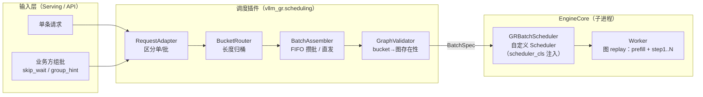
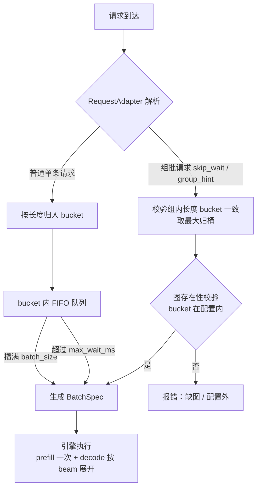
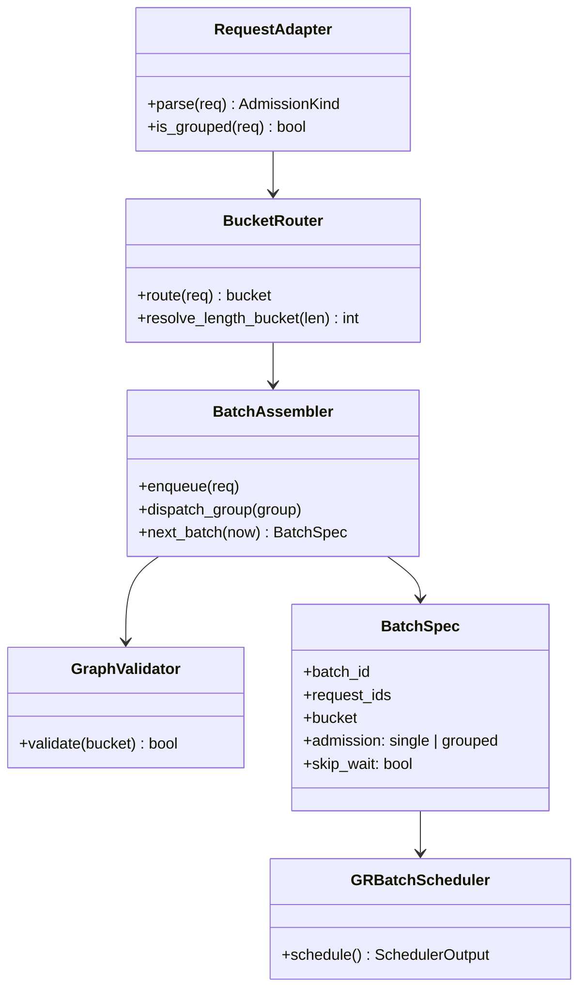
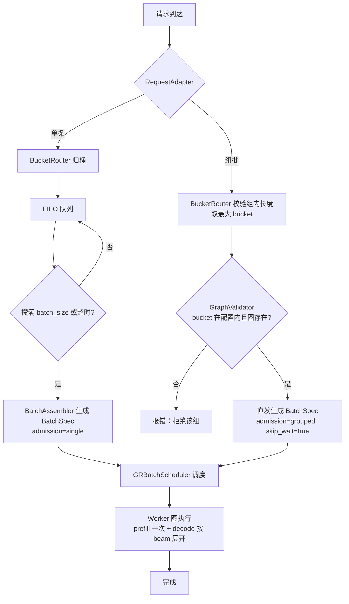

# vllm-gr 调度插件架构设计（单请求 vs 组批输入）

> 状态：架构设计（v0.1）
> 关联文档：
> - [调度终版方案](scheduler_final_design.md)（实施基线：固定 batch + 固定图 + FIFO）
> - [调度策略插件设计方案](scheduler_plugin_design.md)（策略转接中间态）
> - vLLM 官方参考：[SchedulerConfig](https://docs.vllm.ai/en/latest/api/vllm/config/scheduler/)、[Plugin System](https://vllm.ai/blog/2025-11-20-vllm-plugin-system)

---

## 1. 背景与目标

### 1.1 要解决的问题

同一个服务必须同时支持两种输入方式：

1. **单条请求**：业务方一个一个发，引擎自己攒批（FIFO）；
2. **组批输入**：业务方自己组好 batch 一起发，引擎**跳过等待**直接执行。

两种方式可能出现在不同模型上，也可能出现在同一模型的不同流量上，所以需要统一架构，而不是两套执行链。

### 1.2 设计目标

- **双路径入口、单一执行出口**：单请求和组批最终都变成同一个 `BatchSpec`，引擎/图执行完全共用；
- **接入 vLLM 的官方扩展点**：优先用 `SchedulerConfig.scheduler_cls` 注入自定义调度器，其次用 `general_plugins` 机制做插件化；
- **图保持固定**：warmup 全量捕获、bucket 标记、缺图报错，不引入运行时捕获；
- **协议可扩展**：单/批区分通过请求协议字段表达，不改变 vLLM 核心执行语义。

---

## 2. 总体架构



**分层原则**：

- **输入层**只做协议解析（这是单/批区分发生的地方）；
- **调度插件**只做“选批”（谁、什么时候、归哪个 bucket），不碰图执行；
- **EngineCore** 通过 `scheduler_cls` 运行我们的自定义 Scheduler，输出标准调度结果；
- **Worker** 按固定图执行，全程不知道请求是单发还是组批来的。

---

## 3. 单请求 vs 组批：双路径设计

### 3.1 统一入口与分叉点



### 3.2 两条路径的职责

| 路径 | 触发条件 | 行为 | 延迟特征 |
|---|---|---|---|
| 单请求（FIFO） | 无 `skip_wait` / `group_hint` | 进 bucket 队列；攒满 `batch_size` 或超时发车 | 有攒批等待 |
| 组批（直发） | 带 `skip_wait` / `group_hint` | 校验后直接生成 BatchSpec，不排队；不足 `batch_size` 则 padding | 无等待，立即执行 |

### 3.3 混合规则

- 组批请求是“显式契约”，**不进 FIFO 队列**，不与单请求混拼；
- FIFO 队列只收单请求（终版不做“组批拆开补进队列”的合并逻辑）；
- 同一时间两种流量可以并存：各自走各自路径，最终都到同一个 `BatchSpec` 出口；
- 通过 `admission_mode` 配置控制默认行为：

```yaml
admission_mode: auto        # auto | single_only | grouped_only
```

- `auto`：两种都支持（推荐默认）；
- `single_only`：组批请求按普通请求处理（进队列）；
- `grouped_only`：单请求也要求业务方给出组批标记，否则按 bucket 单独直发（等价于 min_batch=1 的 FIFO）。

### 3.4 不同模型的处理

- 模型级配置决定默认模式，例如模型 A 业务方总组批 → `grouped_only`；模型 B 单发 → `single_only`；
- 图、bucket、beam 展开逻辑与输入方式无关，全部复用。

---

## 4. 与 vLLM 的接入点（三种方案）

### 4.1 方案 A：`SchedulerConfig.scheduler_cls` 注入自定义 Scheduler（推荐）

vLLM 官方配置字段（[SchedulerConfig 文档](https://docs.vllm.ai/en/latest/api/vllm/config/scheduler/)）：

```text
scheduler_cls: "The scheduler class to use. 'vllm.v1.core.sched.scheduler.Scheduler' is
the default scheduler. Can be a class directly or the path to a class of form 'mod.custom_class'."
```

做法：

```yaml
scheduler_cls: "vllm_gr.scheduling.GRBatchScheduler"
```

`GRBatchScheduler` 继承 `Scheduler`，在 `schedule()` 中：

1. 消费我们协议扩展带来的 `BatchSpec` 组（单/批都已折叠成批）；
2. 按 `(length_bucket, step)` 分组输出调度结果；
3. 图存在性校验前置（bucket 不在配置内 → 拒绝/报错）；
4. 其余预算逻辑（`max_num_batched_tokens` / `max_num_seqs`）沿用父类。

**注意事项（官方已警告）**：

- 自定义 scheduler 接口**不是公开 API**，升级可能不兼容（需要版本守卫）；
- 子类化 `Scheduler` 会**禁用 async scheduling**（对我们无影响，终版不依赖异步）；
- 与 `AsyncScheduler` 相比性能路径不同，压测时要对比确认。

### 4.2 方案 B：`vllm.general_plugins` 插件化（脱离 fork 的路径）

vLLM 插件系统（[Plugin System 博客](https://vllm.ai/blog/2025-11-20-vllm-plugin-system)）：

- 通过 `vllm.general_plugins` entry point 注册插件包；
- vLLM 在**每个进程**（main、EngineCore、worker）启动前加载插件，再创建 scheduler——这解决了“monkey patch Scheduler 在 EngineCore 子进程不生效”的问题；
- 用 `VLLMPatch[TargetClass]` 做外科手术式修改，可带 `@min_vllm_version` 版本守卫。

做法：

```python
# setup.py 注册
entry_points={"vllm.general_plugins": ["vllm_gr_sched = vllm_gr_sched.plugin:register_patches"]}

# plugin.py
def register_patches(manager):
    manager.register(
        VLLMPatch[Scheduler]
        .replace_method("schedule", gr_schedule)
        .when_configured_by("scheduler_cls", "vllm_gr.scheduling.GRBatchScheduler")
    )
```

**适用场景**：未来不想长期维护 fork，想直接 `pip install` vLLM + 插件包部署时使用。

### 4.3 方案 C：Serving 层插件（协议层，第一版推荐先做）

- 单/批的解析、`skip_wait`/`group_hint` 识别、bucket 归组全部放在 **Serving 与 EngineCore 之间**（`vllm_gr/entrypoints/recif/serving_engine.py` / `openai/serving_engine.py` 现有扩展协议基础）；
- EngineCore 侧的 `ADD_BATCH` / `BEAM_REQUEST_STEP_UPDATE` 协议扩展字段（`skip_wait`、`group_hint`、`bucket`），不改变 vLLM 执行语义；
- 优点：不动 Scheduler，先验证业务路径；缺点：攒批逻辑在 Serving 进程，EngineCore 空闲时无法主动拉批（可用现有 `step_with_batch_queue` / Pull 模式补）。

### 4.4 推荐组合

| 阶段 | 用哪个方案 | 理由 |
|---|---|---|
| 第一版 | **C（协议层）+ A（scheduler_cls）** | 业务路径先通，调度器按官方配置注入，不碰 vLLM 源码 |
| 第二版 | B（general_plugins） | 验证脱离 fork；插件包内同时含协议解析与 Scheduler patch |
| 不做 | 传统 monkey patch | EngineCore 子进程不生效 + 升级必碎 |

---

## 5. 模块划分与接口

```text
vllm_gr/scheduling/
├── types.py            # BatchSpec / 单批协议扩展 / 配置
├── adapter.py          # RequestAdapter：解析单条 / 组批
├── router.py           # BucketRouter：长度归桶、beam 展开信息
├── assembler.py        # BatchAssembler：FIFO 攒批 / 直发
├── validator.py        # GraphValidator：bucket → 图存在性
├── scheduler.py        # GRBatchScheduler(Scheduler)：engine 侧调度
└── config.py           # per-model 配置加载与校验
```



**核心数据契约：BatchSpec（扩展字段）**

```python
@dataclass(frozen=True)
class BatchSpec:
    batch_id: str
    request_ids: tuple[str, ...]
    bucket: int                      # 长度 bucket
    admission: str                   # "single" | "grouped"
    skip_wait: bool = False          # 组批直发标记
    group_hint: str | None = None
    beam_widths: dict[str, int] = field(default_factory=dict)  # request_id -> bw
    expected_len: int
```

---

## 6. SchedulerConfig 参数映射

我们复用/覆盖 vLLM 的哪些调度参数：

| 参数 | 默认 | 我们的用法 | 说明 |
|---|---|---|---|
| `scheduler_cls` | `Scheduler` | `vllm_gr.scheduling.GRBatchScheduler` | 自定义调度器注入点（方案 A） |
| `policy` | `fcfs` | `fcfs` | 与我们 FIFO 一致，不改 |
| `max_num_seqs` | 128 | 设为固定 batch 容量（如 8） | 控制每步最多序列数 |
| `max_num_batched_tokens` | 2048 | 按真实长度预算 | 图级 padding 不占预算；若物理 pad 则要按 pad 后长度计 |
| `enable_chunked_prefill` | True | 保持默认或按 bucket 关闭 | 长 prefill 若与固定长度图冲突，关闭 chunked、按 bucket 截断 |
| `scheduler_reserve_full_isl` | True | 保持 | 准入前检查全长是否放得下 KV |
| `watermark` | 0.0 | 按需 | KV 余量，避免抢占抖动 |
| `async_scheduling` | None | 不启用 | 自定义 Scheduler 会禁用 async，接受 |

**原则**：**凡是不影响“固定图”的语义，全部沿用 vLLM 默认；只有三处必须动——`scheduler_cls`（注入）、`max_num_seqs`（固定 batch）、协议扩展（单/批区分）。**

---

## 7. 单/批请求的调度决策流程



---

## 8. 与图的关系

- **bucket 标记**：单/批路径最终都在 `BatchSpec.bucket` 上统一，图注册表只认 bucket；
- **warmup 全量捕获**：启动时按（batch × 长度 bucket × beam 档 × step）捕获全部图；
- **缺图报错**：`GraphValidator` 前置校验，配置外直接拒绝，不缓存、不懒捕获、不 eager；
- **beam 展开**：decode 阶段每条 beam 作为 batch-1 输入（或按 beam 档合批），prefill 只算一次，与输入方式是单发还是组批无关；
- **padding**：不足固定 batch 时由 Worker 图输入准备阶段处理（拷入静态 buffer + 真实长度 metadata），调度预算仍按真实长度计。

---

## 9. 配置示例（per-model）

```yaml
scheduler_plugin:
  scheduler_cls: "vllm_gr.scheduling.GRBatchScheduler"
  admission_mode: auto            # auto | single_only | grouped_only
  batch_size: 8                   # 固定 batch，单档
  length_buckets: [512, 1024, 2048]
  beam_buckets: [128, 256]        # 3~4 种时扩展
  max_wait_ms: 10                 # FIFO 攒批超时
  warmup_on_start: true
  graph_missing: error
```

---

## 10. 实施步骤

1. **Step 1（协议层，方案 C）**：扩展 `ADD_BATCH` / `BEAM_REQUEST_STEP_UPDATE` 协议，增加 `skip_wait` / `group_hint` / `bucket`；Serving 层实现 RequestAdapter + BucketRouter + BatchAssembler；
2. **Step 2（调度器，方案 A）**：实现 `GRBatchScheduler(Scheduler)`，通过 `scheduler_cls` 注入；单测覆盖 FIFO 攒批、超时发车、组批直发、缺图报错；
3. **Step 3（图校验）**：GraphValidator 与 warmup 图注册表打通，缺图报错路径闭环；
4. **Step 4（混合流量压测）**：单/批混合负载，验证图命中率 100%、padding 记账、FTT/TBT；
5. **Step 5（可选，方案 B）**：打包成 `vllm.general_plugins` 插件，验证脱离 fork 部署。

---

## 11. 风险与对策

| 风险 | 对策 |
|---|---|
| `scheduler_cls` 接口非公开、升级不兼容 | 版本守卫；封装薄适配层；升级时只改 adapter |
| 自定义 Scheduler 禁用 async scheduling | 压测对比；若吞吐不达标再评估 AsyncScheduler 子类化 |
| 单/批协议解析分散在 Serving 与 Engine 两侧 | 统一到 `vllm_gr/scheduling/adapter.py`，协议字段集中定义 |
| 组批请求与 FIFO 队列混排逻辑复杂 | 终版规则：组批不进队列；合并逻辑后置 |
| EngineCore 子进程加载不到 patch | 用 `scheduler_cls` 或 general_plugins（每进程加载），不做 monkey patch |
| bucket 配置与流量不匹配 | GraphValidator 前置报错 + 上线前按流量统计配置 |

---

## 附录：一句话总结

**单请求走 FIFO 攒批、组批走 skip_wait 直发，两条路径在 `BatchSpec` 处汇合；调度器用 `scheduler_cls` 注入、协议扩展放在 Serving 层，图保持固定，缺图报错——输入方式不同，执行链完全共用。**
