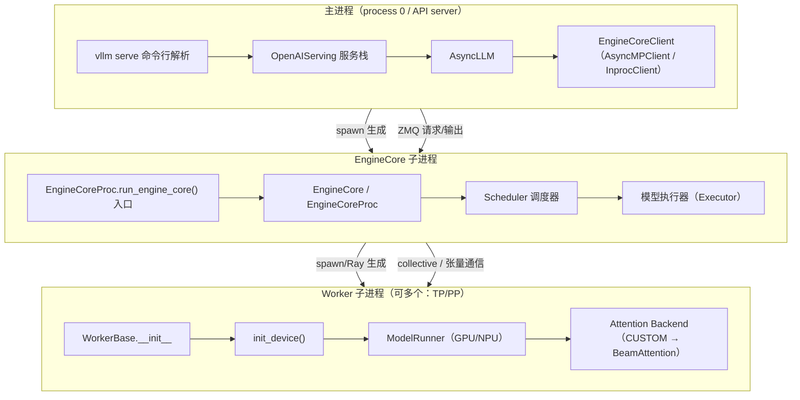

# vLLM-GR 插件补丁与调度流程全景图

> 本文目标：用大白话讲清楚 vLLM 是怎么启动的、有哪几个进程、每个进程按什么顺序执行，以及 vllm-gr 的所有补丁分别在什么时机、用什么方式、替换了哪些东西。
> 适用版本：`vllm==0.22.1`、`vllm-ascend==0.22.1rc1`。

---

## 0. 先记住三句话

1. **vLLM 有 3 类进程**：主进程（API server / LLM 入口）、EngineCore 子进程（调度 + 引擎循环）、Worker 子进程（真正跑模型）。
2. **vLLM 的插件（general_plugins）在每类进程里都会执行**，但执行时机不同：主进程在命令行解析时，EngineCore 在 `EngineCore.__init__` 内部，Worker 在 `WorkerBase.__init__` 内部。
3. **vllm-gr 的补丁分三批装**：frontend 计划（主进程侧 7 个）、engine_core 计划（EngineCore 侧 3 个）、可选/平台补丁（NPU、LMCache、sliced logits）。同一批补丁按注册顺序安装，安装顺序 = 注册顺序。

---

## 1. vLLM 进程大图



进程之间的关系一句话：

- **主进程**负责接 HTTP 请求、做 serving、把请求发给 EngineCore；
- **EngineCore** 负责调度、KV cache 管理、请求循环，并把执行任务分给 Worker；
- **Worker** 负责真正的模型前向（prefill / decode / beam 展开），把结果送回 EngineCore。

如果开了数据并行（DP），会有多个 EngineCore（`DPEngineCoreProc`）；如果开了张量并行/流水线并行（TP/PP），Worker 会有多个。

---

## 2. 每个进程的启动顺序（插件插在哪里）

### 2.1 主进程

```text
1. vllm serve 启动
2. 解析命令行：AsyncEngineArgs.add_cli_args()
3. vLLM 调用 load_general_plugins()        ← vllm-gr 插件第一次在这里跑
4. EngineArgs.add_cli_args / from_cli_args / create_engine_config（已被我们替换）
5. 创建 AsyncLLM
6. 创建 EngineCoreClient，spawn EngineCore 子进程
7. 创建 OpenAIServing / OpenAIServingModels 等服务对象（构造器已被我们替换）
8. 开始接收 HTTP 请求
```

### 2.2 EngineCore 子进程

```text
1. multiprocessing spawn 进入 EngineCoreProc.run_engine_core()
   └─ 这里已经是我们的 wrapper（父进程提前换好的）
2. wrapper 先 apply_engine_core_patches()   ← engine_core 计划在这里装
3. wrapper 再调用原版 run_engine_core()
4. 原版创建 EngineCoreProc(...)
   └─ EngineCoreProc.__init__ = EngineCore.__init__（已被我们包装）
        ├─ 我们的包装：先 _ensure_beam_state()
        ├─ 原版 __init__ 继续
        │    └─ 内部调用 load_general_plugins()  ← vllm-gr 插件第二次在这里跑
        ├─ 创建模型执行器，spawn Worker 子进程
        ├─ 初始化 KV cache
        ├─ 创建 Scheduler（schedule 已被我们替换）
        └─ 进入 process_input_sockets 输入循环（已被我们替换）
```

### 2.3 Worker 子进程

```text
1. multiprocessing/Ray 进入 Worker 类 __init__
2. WorkerBase.__init__()
   └─ 内部调用 load_general_plugins()       ← vllm-gr 插件第三次在这里跑
3. init_device()（NPU 时：我们的 hook 会先 re_apply 一次再执行原版）
4. 创建 ModelRunner（GPUModelRunner / NPUModelRunner，已被我们替换 3 个方法）
5. 选择 Attention Backend：CUSTOM → BeamAttentionBackend
6. CUDA graph 捕获 / 预热
7. 进入执行循环：execute_model()（已被我们替换）
```

---

## 3. vllm-gr 补丁全家桶

### 3.1 一张总表

| # | 补丁名 | 角色/进程 | 目标（类.方法） | 替换成 | 安装器 | 时机 |
|---|---|---|---|---|---|---|
| 1 | `flat_logprobs` | frontend | `FlatLogprobs.append_fast` | `vllm_gr.logprobs.append_fast` | `logprobs_patch.patch_flat_logprobs` | 插件加载 |
| 2 | `openai_beam_search` | frontend | `OpenAIServing.beam_search` | `serving_engine.beam_search` | `beam_search_patch.patch_beam_search` | 插件加载 |
| 3 | `recif_completion_handler` | frontend | `OpenAIServingCompletion._create_completion` | RECIF 分发包装（带 `_vllm_gr_recif` 标记） | `completion_handler.patch_recif_completion_handler` | 插件加载 |
| 4 | `chat_sampling_conversion` | frontend | `ChatCompletionRequest.to_beam_search_params` | `protocol.to_beam_search_params` | `beam_search_patch.patch_sampling` | 插件加载 |
| 5 | `engine_args` | frontend | `EngineArgs.add_cli_args` / `from_cli_args` / `create_engine_config` | `arg_utils_gr` 的 3 个函数（classmethod 保留 descriptor） | `arg_utils_gr.patch_add_cli_args` | 插件加载 |
| 6 | `serving_models` | frontend | `OpenAIServingModels.__init__` | `serving_models.init_gr`（挂 Catalog） | `serving_models.patch_OpenAIServingModels_init` | 插件加载 |
| 7 | `batch_and_fork` | frontend | 一组：EngineCoreRequestType 枚举 + 3 个 client + AsyncLLM + EngineCore 侧 | 见 3.4 | `beam_search_patch.patch_batch_and_fork` | 插件加载 |
| 8 | `engine_core_requests` | engine_core | `EngineCore.__init__` / `EngineCoreProc.__init__` / `process_input_sockets` | beam state 包装 + 自定义 socket 循环 | `engine_core_patch.apply_engine_core_request_patches` | EngineCore wrapper |
| 9 | `scheduler` | engine_core | `Scheduler.schedule` | `patched_schedule`（带 `_SCHEDULER_PATCH_MARKER`） | `engine_core_patch.apply_scheduler_patch` | EngineCore wrapper |
| 10 | `model_runner` | engine_core | 平台 ModelRunner 的 `execute_model` / `_prepare_inputs` / `_bookkeeping_sync` | GPU/NPU 各自的包装 | `model_runner_patch.apply_worker_patches` | EngineCore wrapper / Worker |
| 11 | `ascend_attention`（平台） | 所有进程 | `vllm.v1.attention.selector._cached_get_attn_backend` | CUSTOM 分支恢复 | `ascend_compat.apply_ascend_attention_backend_patch` | `apply_all` 第一步 |
| 12 | `npu_worker_init`（平台） | Worker(NPU) | `NPUWorker.init_device` | 先 `re_apply_patches()` 再原版 | `ascend_compat.patch_npu_worker_init_device` | 插件加载时装 hook，init_device 时触发 |
| 13 | `beam_attn` 注册（平台） | EngineCore/Worker | `AttentionBackendEnum.CUSTOM` | 注册 `BeamAttentionBackend` | `beam_attn` 模块 `@register_backend` | 模块 import 时 |
| 14 | `sliced_logits`（可选） | Worker | `LogitsProcessor.__init__` / `_get_logits`、`Sampler.gather_logprobs` | 分片投影包装 | `sliced_logits_patch.apply_sliced_logits_patch` | `_apply_optional_patches` |
| 15 | `lmcache`（可选） | Worker | LMCache adapter 的多个方法 | 适配器实现 | `lmcache_patch.apply_lmcache_adapter` | `_apply_optional_patches` |

> 13~15 不在 `patches/definitions.py` 的注册表里：13 是 import 时自动注册，14/15 由 runner 直接调用。它们是“补丁”，但不是“注册表补丁”。

### 3.2 补丁安装入口（runner 的固定顺序）

每个进程执行插件时，`re_apply_patches()` 实际按这个顺序跑：

```text
re_apply_patches()
  └─ apply_all(force=True)
       ├─ 1. apply_ascend_attention_backend_patch()   # NPU：修 attention selector
       ├─ 2. patch_npu_worker_init_device()           # NPU：给 NPUWorker.init_device 装 hook
       ├─ 3. _apply_gr_patches()
       │      ├─ 3.1 apply_frontend_patches()         # 注册表 frontend 计划（7 个，按注册顺序）
       │      └─ 3.2 _apply_optional_patches()        # sliced_logits + lmcache（可选）
       └─ 4. 生成 per-patch 报告（PatchReport）
```

EngineCore 子进程额外走一条路：`run_engine_core` wrapper 里调用 `apply_engine_core_patches()`，装注册表的 engine_core 计划（3 个）。

### 3.3 frontend 计划（7 个）各自做了什么

#### flat_logprobs

- 目标：`vllm.logprobs.FlatLogprobs.append_fast`
- 替换成：`vllm_gr.logprobs.append_fast`（用 extend 批量追加，比原版逐元素 append 快）
- 校验：`FlatLogprobs.append_fast is append_fast`（身份校验）
- 幂等：替换后身份一致，verify 返回 None，不会重复装。

#### openai_beam_search

- 目标：`OpenAIServing.beam_search`
- 替换成：`vllm_gr.entrypoints.openai.serving_engine.beam_search`（完整的分组 beam 搜索流：请求分组、logprob 处理、EOS/长度惩罚、输出重建）
- 校验：`OpenAIServing.beam_search is beam_search`

#### recif_completion_handler

- 目标：`OpenAIServingCompletion._create_completion`
- 替换成：一个闭包包装：如果是 RECIF 模型就走 RECIF 专属 beam 逻辑，否则调原版；包装函数带 `_vllm_gr_recif = True` 标记
- 校验：检查 `_create_completion` 是否带标记

#### chat_sampling_conversion

- 目标：`ChatCompletionRequest.to_beam_search_params`
- 替换成：`vllm_gr.entrypoints.openai.protocol.to_beam_search_params`（把请求转成 beam 采样参数）

#### engine_args

- 目标：`EngineArgs` 的 3 个方法：
  - `add_cli_args`（原版 staticmethod → 替换为 `arg_utils_gr.add_cli_args`，增加 `--catalog-path` 等 GR 参数）
  - `from_cli_args`（原版 classmethod → 替换为 `classmethod(arg_utils_gr.from_cli_args)`，保留 descriptor 语义）
  - `create_engine_config`（替换为 `arg_utils_gr.create_engine_config`，写入 GR 配置、NPU block size 默认值等）
- 校验：`EngineArgs.from_cli_args.__func__ is from_cli_args` 等

#### serving_models

- 目标：`OpenAIServingModels.__init__`
- 替换成：`serving_models.init_gr`：先调原版构造，再挂 `self.catalog`（如果配置了 catalog path 就加载 Catalog）

#### batch_and_fork（最复杂的一个）

这是“一个补丁改一堆东西”的复合补丁，实际拆成 4 层：

1. **请求类型（wire）**：给 `EngineCoreRequestType` 动态加两个枚举成员：
   - `ADD_BATCH = b"\x06"`
   - `BEAM_REQUEST_STEP_UPDATE = b"\x07"`
   实现是直接操作 Enum 内部 `_value2member_map_` / `_member_map_` / `_member_names_`（见 `vllm_gr/v1/engine/wire.py`）。
2. **EngineCore client**：给三个 client 类加方法：
   - `AsyncMPClient.add_requests_async` / `beam_request_step_update_async`
   - `SyncMPClient.add_requests` / `beam_request_step_update`
   - `InprocClient.add_requests` / `beam_request_step_update`
3. **AsyncLLM**：加 `prepare_request`、`_add_requests_batch`、`register_beam_output`、`beam_request_step_update`，支持“先准备、攒一批、再一起发”的分组请求流程。
4. **EngineCore 侧 + 入口**：
   - 调 `apply_engine_core_child_patches()`（即 engine_core 计划的内容，保证 InprocClient 模式下主进程内嵌 EngineCore 也被修好）；
   - 把 `EngineCoreProc.run_engine_core` 换成我们的模块级 wrapper（见 4.2）。

### 3.4 engine_core 计划（3 个）各自做了什么

#### engine_core_requests

一次装 4 类东西：

- 包装 `EngineCore.__init__` 和 `EngineCoreProc.__init__`：调用原版前先 `_ensure_beam_state(self)`（初始化 `beam_cache` / `beam_cache_lock`）；
- 在 `EngineCore` 和 `EngineCoreProc` 上都绑定 `_cache_beam_request`、`_handle_beam_request_step_update`；
- 把 `EngineCoreProc.process_input_sockets` 替换成我们自己的版本（能解码 `ADD_BATCH`、`BEAM_REQUEST_STEP_UPDATE`）；
- 确保 `EngineCoreRequestType` 枚举成员已注册。

校验：`_validate_engine_core_request_group()`（检查两个构造器标记 + 方法身份 + 枚举 wire 值）。

#### scheduler

- 目标：`Scheduler.schedule`
- 替换成：`patched_schedule`：
  - 调用原版前，临时替换 `kv_cache_manager.get_computed_blocks` 和 `coordinator.cache_blocks`（处理 beam 请求的 partial block）；
  - 调用原版后，把请求里的 beam 元数据收集进 `output.beam_data`；
  - `finally` 里恢复原版 cache 方法。
- 标记：`_SCHEDULER_PATCH_MARKER`，幂等。

#### model_runner

- 目标：当前平台对应的 ModelRunner：
  - GPU：`GPUModelRunner.execute_model` / `_prepare_inputs` / `_bookkeeping_sync`
  - NPU：`NPUModelRunner.execute_model` / `_prepare_inputs` / `_bookkeeping_sync`
- 替换成：GPU/NPU 各自的包装（共享 `model_runner_common.py` 的逻辑：输入 remap、beam 输出 collapse、logprob remux 等）。
- 安装器：`model_runner_patch.apply_worker_patches()`，按 `vllm.platforms.current_platform.device_type` 选 GPU/NPU 模块，只 patch 当前平台。
- 幂等：每个包装带 marker（`_WORKER_EXECUTE_PATCH_MARKER` 等），`is_worker_runner_patched()` 判断。

### 3.5 平台/可选补丁

#### ascend_attention（NPU）

- 目标：`vllm.v1.attention.selector._cached_get_attn_backend`
- 行为：当请求 `CUSTOM` 或 GR 配置要求 CUSTOM 时，返回 `BeamAttentionBackend`；否则走原版。
- 时机：`apply_all` 第一步，每个进程都尝试；非 NPU 或 CUSTOM 未覆盖时直接返回 0。

#### npu_worker_init（NPU）

- 目标：`vllm_ascend.worker.worker.NPUWorker.init_device`
- 行为：包装成“先 `re_apply_patches()` 再执行原版”，确保 NPU 的 ModelRunner / attention 依赖在设备初始化前就绪。
- 时机：插件加载时只装 hook；真正触发是在 Worker 的 `init_device()` 时。

#### beam_attn 注册

- `vllm_gr.v1.attention.backends.beam_attn` 模块被 import 时，`@register_backend(AttentionBackendEnum.CUSTOM)` 把 `BeamAttentionBackend` 注册到 vLLM 的 CUSTOM 槽位。
- 之后 EngineCore/Worker 选择 `CUSTOM` 时，就会用到我们的 attention 实现（GPU/NPU 各自执行模块）。

#### sliced_logits（可选）

- 替换 `LogitsProcessor.__init__` / `_get_logits` 和 `Sampler.gather_logprobs`，支持 vocabulary 分片投影。
- 激活条件：始终尝试安装；只有配置了 vocab offset/slice 时才实际生效。

#### lmcache（可选）

- 替换 LMCache V1 adapter 的若干方法（`RequestTracker.from_new_request`、`ReqMeta.from_request_tracker`、`LMCacheConnectorV1Impl.start_load_kv` 等），让 LMCache 感知 beam 元数据。
- 激活条件：`VLLM_GR_LMCACHE_PATCH=1` 或命令行出现 `LMCacheConnectorV1`。

---

## 4. 关键机制：补丁是怎么“提前”装上的

### 4.1 为什么 EngineCore 构造器补丁要靠 wrapper

vLLM 0.22.1 的调用点：

```python
class EngineCore:
    def __init__(self, ...):
        load_general_plugins()   # 插件在这里才跑
        ...
```

插件在 `EngineCore.__init__` **内部**才执行。而我们恰恰要包装这个 `__init__`（先 `_ensure_beam_state`）。如果只在插件加载时替换 `EngineCore.__init__`，对“当前正在执行的这一次构造”是无效的——替换只影响下一次实例化，而这次实例化正是唯一关键的一次。

所以必须有一个“构造器之前”的挂点，也就是：

```python
EngineCoreProc.run_engine_core = run_engine_core  # 我们的模块级 wrapper
```

在父进程里把子进程入口换成我们的 wrapper；子进程一启动，第一件事就是 `apply_engine_core_patches()`，把构造器包装好，然后才实例化 `EngineCoreProc`。

### 4.2 wrapper 的完整流程

```text
主进程：
  patch_batch_and_fork()
    └─ patch_engine_core_process_entrypoint()
         ├─ 保存原版 run_engine_core 到 _original_run_engine_core
         └─ EngineCoreProc.run_engine_core = vllm_gr...engine_core_patch.run_engine_core

EngineCore 子进程（spawn）：
  入口 = 我们的 run_engine_core
    ├─ apply_engine_core_patches()      # 装 engine_core 计划
    ├─ original_run_engine_core(...)    # 原版流程
    │    └─ EngineCoreProc(...)
    │         └─ 我们的 patched __init__
    │              ├─ _ensure_beam_state(self)
    │              └─ 原版 __init__（内部再触发 load_general_plugins，幂等）
```

这个 wrapper 是模块级函数（不在类里定义），是为了让 multiprocessing **spawn** 能按 `vllm_gr.v1.engine.engine_core_patch.run_engine_core` 的 qualname 在子进程里重新找到它。

---

## 5. 一条 beam 请求的完整生命周期（补丁都在哪里起作用）

以 OpenAI 接口收到一个 RECIF/beam 请求为例：

```text
1. HTTP 请求进入 OpenAIServing
2. OpenAIServing.beam_search（被 openai_beam_search 补丁替换）
   └─ 调用 ChatCompletionRequest.to_beam_search_params（被 chat_sampling_conversion 替换）
3. AsyncLLM.prepare_request（被 batch_and_fork 替换）
   └─ 预处理好请求，但不立即发送
4. AsyncLLM._add_requests_batch（被 batch_and_fork 替换）
   └─ 把一组请求一起发出去
5. AsyncMPClient.add_requests_async（被 batch_and_fork 替换）
   └─ 发送 ADD_BATCH 消息（wire 枚举被 engine_core_requests/wire 补丁新增）
6. EngineCore 输入循环 process_input_sockets（被 engine_core_requests 替换）
   ├─ 解码 ADD_BATCH
   ├─ preprocess_add_request
   └─ _cache_beam_request（绑定到 EngineCore，缓存 prompt 状态）
7. Scheduler.schedule（被 scheduler 补丁替换）
   └─ 生成 output.beam_data
8. Worker execute_model（被 model_runner 补丁替换）
   ├─ _prepare_inputs：beam remap
   ├─ BeamAttentionBackend（CUSTOM，被 beam_attn 注册）
   └─ _bookkeeping_sync：beam collapse
9. 输出回到 EngineCore，再回到 AsyncMPClient 的输出队列
10. beam 每一步通过 BEAM_REQUEST_STEP_UPDATE 发回
    └─ EngineCore._handle_beam_request_step_update（被 engine_core_requests 绑定）
         ├─ 裁剪/分叉 beam
         └─ 终止时 aborts_queue 清理
```

---

## 6. 补丁的校验、幂等与失败处理

每个注册表补丁都有 `verify()`：

- 返回 `None` = 已经装好（本次跳过，报告记为 `already_applied`）；
- 返回字符串 = 没装好，执行 `apply()`，装完再 `verify()` 一次；
- `apply()` 或第二次 `verify()` 抛错 = 记录 `failed`，立刻停止整批（fail-fast），抛 `PatchError`，报告保留。

`plugin.initialize_runtime()` 最后返回：

```python
{
  "patch_count": 9,                # 示例值（随平台/可选补丁激活情况变化）
  "patches": {"flat_logprobs": "applied", ...},   # 每个补丁的状态
}
```

幂等靠两件事：verify 的身份/标记检查 + 各安装器自己的全局标记（如 `_SCHEDULER_PATCH_MARKER`、`_WORKER_EXECUTE_PATCH_MARKER`、`_LMCACHE_ADAPTER_PATCHED`）。

---

## 7. 常见疑问

### Q1：为什么插件在 EngineCore/Worker 里也跑，还是要 wrapper？

插件会跑 ≠ 时机足够早。`EngineCore.__init__` 自己就是插件调用点，要包装它只能靠“构造器之前”的入口 hook，也就是 wrapper。Worker 侧没有这个问题（`NPUWorker.init_device` 比插件调用点晚）。

### Q2：frontend 计划为什么看起来在每个进程都会跑？

目前 `re_apply_patches()` 里的 `apply_frontend_patches()` 是无条件执行的，所以主进程、EngineCore、Worker 都会尝试装 frontend 计划。这在主进程是必须的；在 EngineCore/Worker 里大多数补丁 verify 会发现目标模块已存在/已装，但 `batch_and_fork` 是复合补丁，它顺带保证 InprocClient 模式下主进程内嵌 EngineCore 也正确。这也是启动时延优化的主要候选点：如果按进程角色裁剪，EngineCore/Worker 就不用导入 OpenAI serving 模块。

### Q3：为什么 EngineCore 里会有两次插件执行？

第一次是 wrapper 里显式 `apply_engine_core_patches()`；第二次是原版 `EngineCore.__init__` 内部 `load_general_plugins()`。第二次是幂等的（verify 全部 already_applied），不会重复打补丁。

### Q4：为什么不把 `EngineCore.__init__` 整个重写？

能写，但没必要：`__init__` 有几百行、深度绑定 vLLM 版本，全量重写等于复制上游代码，每次升级都会断。我们只差“开头初始化 beam state”这一步，用包装（先 `_ensure_beam_state` 再调原版）是最小、最抗升级的做法。而且重写也解决不了时机问题——仍然必须在 wrapper 里提前装。

### Q5：怎么知道现在装没装好？

看日志：每个补丁安装成功会打 `✓ PatchName replaced/added Target.method`；看报告：`plugin.initialize_runtime()` 的返回里有每个补丁的状态；或者直接看 `get_last_patch_report()`。

---

## 8. 补丁与 GR-PATCH 编号对照

机器可读清单在 `docs/patch_inventory.yaml`，编号对照：

| 补丁 | GR-PATCH 编号 |
|---|---|
| 插件入口 register / initialize_runtime | GR-PATCH-000 |
| ascend_attention | GR-PATCH-001 |
| npu_worker_init | GR-PATCH-002 |
| flat_logprobs | GR-PATCH-003 |
| openai_beam_search + chat_sampling_conversion | GR-PATCH-004 |
| engine_args | GR-PATCH-005 |
| serving_models | GR-PATCH-006 |
| batch_and_fork（client + AsyncLLM） | GR-PATCH-007 |
| EngineCoreRequestType wire | GR-PATCH-008 |
| engine_core_requests | GR-PATCH-009 |
| scheduler | GR-PATCH-010 |
| model_runner（GPU） | GR-PATCH-011 |
| model_runner（NPU） | GR-PATCH-012 |
| beam_attn CUSTOM 注册 | GR-PATCH-013 |
| lmcache | GR-PATCH-014 |
| sliced_logits | GR-PATCH-015 |

---

## 9. 相关代码位置速查

| 文件 | 作用 |
|---|---|
| `vllm_gr/plugin.py` | vLLM general_plugins 入口，`initialize_runtime()` |
| `vllm_gr/patches/core.py` | `Patch` / `PatchRegistry` / 报告类型 |
| `vllm_gr/patches/definitions.py` | 10 个注册表补丁 + `patch_registry` |
| `vllm_gr/patches/runner.py` | 安装顺序：`apply_all` / `re_apply_patches` |
| `vllm_gr/patches/validators.py` | 每个补丁的 verify |
| `vllm_gr/v1/engine/engine_core_patch.py` | EngineCore 构造器包装、socket 循环、调度器补丁、run_engine_core wrapper |
| `vllm_gr/v1/engine/core.py` | `_ensure_beam_state` / `_cache_beam_request` / `_handle_beam_request_step_update` / `process_input_sockets` |
| `vllm_gr/v1/engine/wire.py` | `EngineCoreRequestType` 枚举扩展 |
| `vllm_gr/v1/engine/core_client_patch.py` | client + AsyncLLM 方法安装 |
| `vllm_gr/v1/worker/model_runner_patch.py` | GPU/NPU ModelRunner 分派 |
| `vllm_gr/v1/worker/model_runner_common.py` | beam remap / collapse / logprob 逻辑 |
| `vllm_gr/v1/ascend_compat.py` | NPU attention selector + NPUWorker hook |
| `vllm_gr/v1/attention/backends/beam_attn.py` | CUSTOM attention backend 注册 |
| `vllm_gr/ops/sliced_logits_patch.py` | 分片 logits |
| `vllm_gr/lmcache_patch.py` | LMCache adapter |
