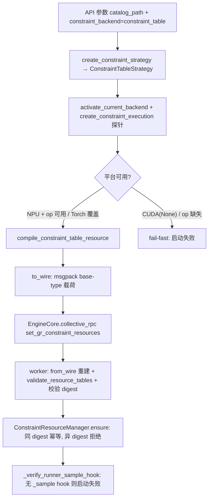
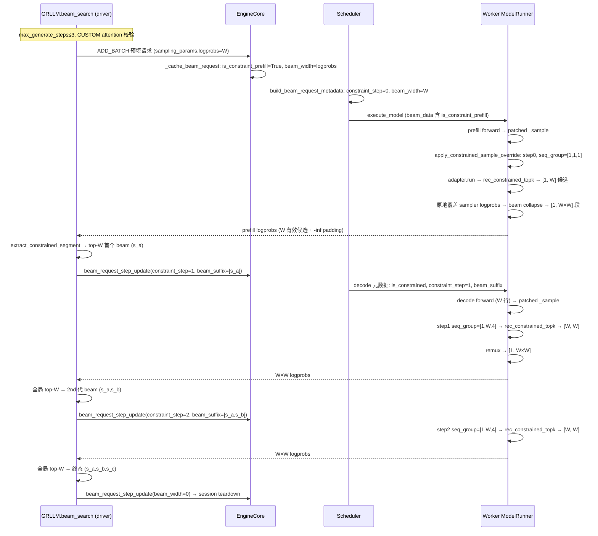
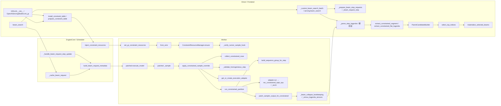

# PR #287 深度拆解：Constraint Tables Runtime End-to-End

> 分析对象：JiusiServe/vllm-gr PR #287 `feat: wire Constraint Tables runtime end to end`（作者 KristinaYuan，基分支 `decode_graph`，状态 OPEN，+3445/−76，37 个文件）
> 配套上下文：#251 策略统一 → #261 triples 编译器 → #264 xllm-ops/rec_constrained_topk → #276 Constraint Table runtime（执行协议/资源管理/RPC 注入/provider 访问）→ #277 增量 beam decode + worker session registry → **#287（本 PR）**
> 后续：#296（OPEN）"sink constrained topk into worker flow" 把输入组装与决策进一步下沉到 worker

---

## 0. 总体评价

**一句话：这个 PR 把 constraint_table 从"编译器、执行器、注入通道都已存在但没接线"的零件状态，接成了"API 参数 → EngineCore → Scheduler 元数据 → Worker raw-logits hook → 前端解析"一整条可运行的链路，并在每一处都坚持 fail-fast、绝不静默降级到 Trie。**

做得好的地方：

1. **Fail-closed 纪律贯穿全链**：平台无 adapter、`is_available()=False`、`constraint_step` 越界、digest 不匹配、混批、catalog_strategy 显式值、缺少 beam 协议、vocab slicing 组合——全部启动期或协议层硬失败，没有任何"偷偷退回非约束采样"的路径。
2. **资源注入幂等且可验证**：driver 编译一次，digest 广播，worker 按 digest 缓存，同 digest 复用、异 digest 拒绝；每个 worker 的 ack 都要核对 digest（TP/DP 一致性）。
3. **平台抽象干净**：`ConstrainedTopKExecution` 协议统一 Torch/NPU 两套 adapter，provider 决定创建与否；新增 `VLLM_GR_CONSTRAINT_EXECUTION=torch` 只作 CI/dev 覆盖。
4. **与既有 beam 架构的侵入度小**：只包一层 `_sample` + 元数据透传，`_beam_collapse_bookkeeping` / `_remux_logprobs_tensors` 零改动（靠"logprob tensor 宽度 = beam_width"这个不变量复用现有 remux）。
5. **输入输出契约文档化**：`sequence_group` 几何、`[rows, W]` 算子输出、`-1e20` 有限 padding 哨兵、`[1, W×W]` wire 契约都写得很清楚。

主要局限（详见第 5 节）：

- **固定 3 级 FSM**（1 次约束 prefill + 2 次 decode），任何超过 3 个生成步的请求直接拒绝——这是 OneRec triples 的结构决定的，但也是硬编码的上限。
- **CUDA 生产路径仍是 `None`**：GPU 上的 Torch fallback 只通过环境变量走，和 #285 RFC "CUDA → Torch 成为正式执行路径"的期望有出入。
- **决策仍在前端**：worker 只负责"约束候选生成"，每步仍把 W×W 个 logprobs 回传 driver 做全局 beam 选择——这与 #35/#38 的 worker run-to-completion / final-only 方向存在张力。
- **混批是运行时报错而非准入隔离**：一个约束 step 旁边出现任何非约束 logprobs 行就直接抛异常，服务端并发场景下这是个上线前必须解决的问题。

---

## 1. 整条链路长什么样

### 1.1 概念分层

```text
┌────────────────────────────────────────────────────────────────────┐
│ Driver / Frontend（API 进程）                                        │
│  · GRLLM / OpenAI serving：编译 triples → ConstraintTableResource     │
│  · beam 主循环：prefill 提交、beam_request_step_update、全局 top-W     │
│  · 解析 worker 回传的 W×W 段（阈值过滤 padding）                       │
├────────────────────────────────────────────────────────────────────┤
│ EngineCore / Scheduler（engine 进程）                                 │
│  · 读进程级 VllmConfig 判断 constraint_backend                        │
│  · ADD_BATCH 缓存钩子：标记 is_constraint_prefill + beam_width         │
│  · 分组 decode 更新：标记 is_constrained / constraint_step / beam_suffix│
│  · build_beam_request_metadata → worker 每步元数据                     │
│  · collective_rpc：把编译好的资源广播到所有 worker                      │
├────────────────────────────────────────────────────────────────────┤
│ Worker / ModelRunner（设备进程）                                      │
│  · 进程内 ConstraintResourceManager（按 digest 缓存 CPU 表）            │
│  · 平台 adapter（NPU custom op / Torch fallback）懒加载表到设备          │
│  · patched _sample：采样后原地覆盖约束行 → rec_constrained_topk        │
│  · beam collapse / remux：把 [rows, W] 摊平成每 session 一行 W×W        │
└────────────────────────────────────────────────────────────────────┘
```

### 1.2 资源编译与注入（一次，启动期）



离线 `GRLLM.__init__` 同步完成编译+注入；OpenAI serving 只在 `__init__` 里编译（顺带启动期探针），广播推迟到第一个 `beam_search`（`asyncio.Lock` 保证只注入一次）。

### 1.3 一次约束 beam search 的完整时序（离线路径，B=1，W=beam_width）



### 1.4 函数调用图



---

## 2. 核心机制与 Wire Contract

### 2.1 资源：`ConstraintTableResource`（6 张表 + digest）

由 triples JSON（`tools/build_constraint_triples.py` 产物）编译而来，六张 NumPy 表：

| 表 | 语义 | dtype |
| --- | --- | --- |
| `first_token_ids` | 合法首 token 集合（step 0） | int32 |
| `prefix1_offsets` / `prefix1_values` / `prefix1_pair_keys` | 1 级前缀 CSR（s_a → s_b 候选） | int32 / int32 / int64 |
| `prefix2_value_offsets` / `prefix2_values` | 2 级前缀 CSR（s_a,s_b → s_c 候选） | int32 / int32 |

- 数组冻结在只读 bytes buffer 上；`total_elements` / `total_bytes` 只读，不参与 digest。
- 新增 `MAX_RESOURCE_BYTES = 512MB` 上限，编译路径和 `from_wire` 重建路径都校验，防止病理 catalog 编译出多 GiB 资源并广播到每个 worker。
- digest 校验与 `validate_resource_tables` 在 `from_wire` / `load_tables` 两处都执行。

### 2.2 注入通道

- 载荷必须是 **base-type dict**（`to_wire`），因为 vLLM v1 用无类型 msgpack 解码 collective RPC payload。
- `collective_rpc("set_gr_constraint_resources", args=(payload,))`，worker 侧 `from_wire` 重建资源、`ensure` 进 `ConstraintResourceManager`（单 digest，异 digest 抛错）。
- 注入后立即 `_verify_runner_sample_hook`：worker 的 runner 没有打过 `_sample` patch（如缺 hook 的 Ascend 构建）就在注入时报错，而不是等第一个约束请求。
- driver 侧 `_verify_injected` 逐个核对 ack digest，空 ack / 非 dict / digest 不符全部硬失败。

### 2.3 算子输入：`sequence_group`

- step 0（约束 prefill）：`[B, 1, 1]` 全零——算子不看内容，只取 `first_token_ids`。
- step 1/2（约束 decode）：`[B, W, max_step]` int32；每个 beam 把自己的**最后 step 个生成 token** 写到 `[b, :step]`。`max_step = max(step+1, max_decode_steps+1)`，保证算子内部 `max_step > current_step` 检查通过。
- 跨查 `beam_suffix[b]` 长度必须 ≥ step；`constraint_step` 以请求元数据为准，不能靠全局计数器推断。
- 同一 step 混 beam_width 直接报错（P8 范围）。

### 2.4 算子输出与 padding

- 输出固定 `[rows, W]`：`top_tokens` int32、`top_logprobs` float32。
- 不足 W 的 padding 槽位填**有限哨兵 `INVALID_LOGIT = -1e20`**——所以下游必须用阈值 `> INVALID_LOGIT/2` 过滤，不能用 `isfinite`。
- `ConstrainedTopKExecution.run` 前后都有严格校验：dtype、shape、device、contiguity、温度 shape `[0]/[1]/[rows]`、logits vocab == 表 vocab_size。

### 2.5 采样 hook 与 remux（本 PR 最核心的不变量）

1. `patched _sample` 先跑原始采样（拿到 sampler output），再调 `apply_constrained_sample_override`。
2. hook 用与 `_remux_logprobs_tensors` 相同的 `gpu_row_cursor` 遍历定位约束行（`collect_constrained_rows`），逐请求独立跑算子，输出按全局行号收集。
3. `patch_sampler_output_for_constrained` **先把 logprobs / logprob_token_ids 原地 `resize_` 到宽 W，再 scatter 算子结果**——顺序很关键：先 resize 保证存储前 `rows×W` 个元素正好是行对齐的 `[:, :W]` 切片，`_beam_collapse_bookkeeping` 读 tensor 宽度得到 `actual_K = W`，于是现有 remux 零改动。
4. `sampled_token_ids[行, 0]` 写算子最优 token；`selected_token_ranks` 清 0。
5. 之后 `_beam_collapse_bookkeeping` / `_remux_logprobs_tensors` 把每 session 摊平成一行：
   - decode：`[W rows, W]` → `[1, W×W]`（W 个父 × W 个候选，按父 stride W）；
   - prefill：`[1 row, W]` → `[1, W×W]`（W 个有效候选 + `(W²−W)` 个 `-inf` remux padding）。
6. 前端 `extract_constrained_segment` 按阈值过滤 padding、**不去重**（没有 sampler 的重复 token slot），每个父最多保留 `logprobs_num = W` 个，按算子降序进入 `ParentCandidateBuilder` → 全局 top-W。

---

## 3. 逐文件详细分析（非测试）

### 3.1 `vllm_gr/constraints/`（资源与注入）

#### `compiler.py`（+36）
- `MAX_RESOURCE_BYTES = 512MB` 上限；
- `ConstraintTableResource` 新增 `total_elements` / `total_bytes`（六张设备表元素/字节，只读，不参与 digest）；
- `validate_resource_tables` 末尾追加总字节数校验（覆盖编译与 `from_wire` 两条路径）。

#### `strategies.py`（+64/−12）
- `MAX_CONSTRAINT_GENERATION_STEPS = 3`、`MAX_CONSTRAINT_BEAM_WIDTH = 256`；
- `validate_constraint_generation_limits`：beam_width ≤ 256、生成步 ≤ 3，超限即请求级 ValueError；
- `validate_constraint_table_protocol`：约束表必须走 beam-request 协议路径（offline 的 CUSTOM attention、serving 的 `beam_request_step_update`），否则 fail-fast；
- `ConstraintTableStrategy` 从"占位 + NotImplementedError"变成真策略：`execution_site = "worker"`、携带 `constraint_data_path` 与注入后填充的 `digest`、前端 `valid_next_token_ids` 不产生任何过滤；
- `create_constraint_strategy` 的 constraint_table 分支不再抛 NotImplementedError。

#### `coordinator.py`（+27/−1）
- `resolve_catalog_strategy`：Trie 后端 `None → "fill"`（保持历史默认）；Constraint Table 后端显式传 `"fill"/"null"` 直接拒绝（候选合法性已在 worker 强制，前端再过滤是自相矛盾）。

#### `startup.py`（+221，新增）
- `create_constraint_execution`：平台 adapter 工厂。`VLLM_GR_CONSTRAINT_EXECUTION=torch` 只允许测试覆盖；生产路径 `activate_current_backend()` → `provider.create_constrained_topk_execution()`，返回 `None` 或 `is_available()=False` 都硬失败；
- `validate_constraint_table_platform`：`vocab_offset` / `vocab_slice_size` 与 constraint_table 组合被拒绝（logits vocab 切片会破坏按完整 vocab 编译的表）；
- `compile_constraint_table_resource`：读 triples JSON、校验顶层键与 `FORMAT_VERSION`、调 `ConstraintTableCompiler.compile`；
- `prepare_constraint_table`：激活后端 + 平台校验 + **启动期探针 adapter**（探测即弃，worker 才懒加载自己的）+ 编译；
- `install_constraint_table`：prepare + `inject_constraint_resources`（离线同步路径）。

#### `worker_inject.py`（+28/−1）
- `set_gr_constraint_resources`：worker 侧 RPC 方法，`from_wire` 重建 → `manager.ensure`（幂等/拒绝替换）→ `_verify_runner_sample_hook` → 返回 `{"digest", "cached"}`；
- `_verify_runner_sample_hook`：worker 已建 model_runner 时检查 `_sample` 是否带 patch 标记，没有就报错；
- `install_worker_resource_hook`：把 RPC 方法挂到 worker 类（幂等，worker `init_device` 时机执行）。

#### 依赖的既有件（#276，本 PR 直接使用）
- `execution.py`：`ConstrainedTopKExecution` 协议、`TorchConstrainedTopKExecution` / `NPUConstrainedTopKExecution`、`_tables_to_device`（read-only 数组先拷成 writable）、`valid_candidate_mask`、运行时输入/输出校验全家桶；
- `driver_inject.py`：`inject_constraint_resources` / `_async`、`_verify_injected`；
- `resource_manager.py`：单 digest 幂等缓存、`clear()`（配合 `ResettableConstrainedTopKExecution.reset()`）。

### 3.2 `vllm_gr/v1/worker/`（worker 侧执行）

#### `constraint_hook.py`（+395，本 PR 的核心新文件）

| 函数 | 职责 |
| --- | --- |
| `validate_constraint_step` | `operator.index` 归一化，只接受 0/1/2，bool/float/越界报错 |
| `collect_constrained_rows` | 按 remux 相同的 row cursor 遍历，返回 `(req_id, row_start, W_logits, mdata)`；缺 `constraint_step` 是协议错误；`W_logits==0`（中间 chunk）不跑算子但照常校验 step |
| `build_sequence_group_for_step` | step 0 全零 `[1,1,1]`；decode 从 `beam_suffix` 取最后 step 个 token 构 `[1,W,max_step]`；混宽度/长度不足报错 |
| `_temperatures_for_rows` | 优先取 `InputBatchProxy` 映射的每行温度；缺失时**静默回退 1.0** |
| `run_constrained_partition` | 逐请求独立调 `adapter.run`（不同 FSM step 可同批），按全局行号收集结果 |
| `patch_sampler_output_for_constrained` | 先 `resize_` 到宽 W 再 scatter；写 `sampled_token_ids[:,0]`；ranks 清 0；`logprob_token_ids` 可空 |
| `get_or_create_execution_adapter` | 懒建 adapter + `load_tables`（worker manager 无 digest / digest 不符都报错），缓存在 `runner._gr_constraint_execution` |
| `_validate_homogeneous_step` | 约束行与任何非约束 logprobs 行同批即报错（P8 未支持） |
| `apply_constrained_sample_override` | 总入口：无 beam data / 无 constrained 行时短路；否则校验 → 取 adapter → 跑算子 → 覆盖输出 |

#### `model_runner_common.py`（+10）
- 新增 `_WORKER_SAMPLE_PATCH_MARKER`（可选 hook，`is_worker_runner_patched()` 不强制要求它）；
- `make_patched_execute_model` 在进入原 `execute_model` 前发布 `self._current_scheduler_output`（`_gr_request_row_configs` 是 hook 定位 logits 行的来源），`finally` 里连同 `_current_beam_data` 一起清空，防止脏数据泄漏到下一步。

#### `model_runner_patch.py`（+5）
- `apply_worker_patches` 只在 runner 有 `_sample` 时安装 sample hook；没有 hook 的构建由注入期 `_verify_runner_sample_hook` 兜底失败。

#### `gpu_model_runner_patch.py`（+24）/ `npu_model_runner_patch.py`（+25）
- 各自 `make_patched_sample`：原采样先跑 → `apply_constrained_sample_override` → 返回；带幂等 marker。
- NPU 版本用 `*args/**kwargs` 签名无关透传（Ascend `_sample` 元数据参数可能不同），但硬取 `args[0]` 当 logits。

### 3.3 `vllm_gr/v1/engine/`（EngineCore / Scheduler 元数据）

#### `core.py`（+40）
- `_constraint_table_backend_active()`：读进程级 `VllmConfig`（`get_current_vllm_config_or_none` + `GRConfig.from_vllm_config`），driver 与 EngineCore 进程无需在请求路径传 flag；
- `_cache_beam_request`（ADD_BATCH 缓存钩子）：backend 激活时给每个走到 beam 缓存的请求打 `is_constraint_prefill=True`，`beam_width` **从 `sampling_params.logprobs` 推导**（内部不变量：beam 搜索预填请求的 logprobs == beam_width）；
- `_handle_beam_request_step_update`：decode 更新打 `is_constrained=True`、`constraint_step = update.constraint_step (>0 时)`、`beam_suffix = update.beam_tokens` 的列表拷贝，并清掉 `is_constraint_prefill`。

#### `scheduler_metadata.py`（+54/−1）
- `build_beam_request_metadata` 新增约束 prefill 分支：`is_constraint_prefill → is_constrained=True, constraint_step=0, beam_width`（非法宽度协议错误），`cache_len = num_computed_tokens - num_scheduled_tokens`；
- decode 分支追加：`is_constrained` 时 `constraint_step` 必须为 1/2（0 只属于 prefill），否则协议错误；带 `beam_suffix`。

#### `types.py`（+4）
- `BeamRequestStepUpdate.constraint_step: int = 0`（0 = 非约束 decode；`omit_defaults` 保证旧流字节不变）。

### 3.4 配置与 API 层

#### `engine/arg_utils_gr.py`（+37）
- `_init_engine_args`：patch `EngineArgs.__init__` 接受 `catalog_path` / `constraint_backend` kwargs 并存为实例属性——离线 `GRLLM` 通过 `LLM.__init__ → EngineArgs(**kwargs)` 间接构造，只有这样才能让 `create_engine_config` 把后端写进 VllmConfig；
- `engine_args_accepts_gr_values()`：判断 patch 是否挂载（`EngineArgs.__init__ is _init_engine_args`），GRLLM 据此决定要不要把值穿进去；
- `patch_add_cli_args` 追加 `__init__` patch。

#### `patch.py`（+3/−1）
- `_validate_engine_args_patch` 增加 `EngineArgs.__init__` 的校验项。

#### `sampling_params.py`（+7/−4）
- `catalog_strategy: str | None = None`（默认值从 `"fill"` 改为 `None`），校验放宽为 `None/fill/null`；语义改为"按后端解析"。

#### `beam_search_decision_utils.py`（+63/−2）
- `extract_constrained_segment`：按 `INVALID_LOGIT/2` 阈值过滤 padding、**不 dedup**、每个父最多 `logprobs_num` 个、保持算子降序；
- `extract_constrained_flat_logprobs`：prefill 单段提取；
- `select_top_indices` 签名接受 `None`（解析为 "fill" 分支；约束路径的 padding 已在提取时移除，不会选到 `-inf`）。

### 3.5 前端入口

#### `entrypoints/gr.py`（+124/−20）
- `GRLLM.__init__`：条件线程化 `catalog_path`/`constraint_backend` 进 EngineArgs（patch 未挂且后端非 Trie 时直接报错）；构造后按策略分支——Trie 暴露 `catalog`，Constraint Table 调 `install_constraint_table` 同步注入并把 digest 记回策略；
- `beam_search`：`catalog_strategy` 默认取 `None`；Constraint Table 时校验 3-step/256 上限、校验 CUSTOM attention 协议（`validate_constraint_table_protocol`）；
- `_custom_beam_search_batch`：`resolve_catalog_strategy`、`_is_constrained` 判定、`_prepare_beam_step_requests` 传 `is_constrained`（decode 更新带 `constraint_step=len(beam_tokens[0])`）；
- `_parse_step_logprobs`：按 `is_constrained` 分流 constrained/standard 提取，约束路径跳过前端 Trie 过滤（`coordinator.enabled and not is_constrained`），`ParentCandidateBuilder(layout=CONSTRAINED_TOPK)`。

#### `entrypoints/openai/serving_models.py`（+50/−1）
- `init_gr`：Constraint Table 时同步 `prepare_constraint_table`（启动期探针 + 编译），存 `_constraint_resource`，初始化 `_constraint_tables_injected=False` + `asyncio.Lock`；
- `_ensure_constraint_tables_injected`：全局挂到 `OpenAIServingModels`，首次 `beam_search` 前 `inject_constraint_resources_async`，Lock + flag 保证幂等；Trie/无 catalog 实例是 no-op。

#### `entrypoints/openai/serving_engine.py`（+118/−17）
- `beam_search`：`resolve_catalog_strategy`（ValueError 转 `VLLMValidationError`）、`_is_constrained`、注入 gate、3-step 校验、`use_beam_request` 协议校验（无 `beam_request_step_update` 的 client 直接失败）；
- `_beam_request_step`：更新带 `constraint_step=len(beam_tokens[0])`；
- 解析路径与 gr.py 相同的双分支（constrained 提取 + `valid_token_ids=None` + `CandidateLayout.CONSTRAINED_TOPK`），Trie 过滤仅在非约束时启动。

#### `entrypoints/openai/protocol.py`（+3/−1）
- `to_beam_search_params` 的 `catalog_strategy` 缺省改 `None`（交给 coordinator 解析）。

---

## 4. 关键设计决策小结

1. **约束在 worker 的 raw-logits 边界生成**，而不是前端过滤——这是与 Trie 路径的本质区别；
2. **复用现有 remux/collapse 零改动**：靠"logprob tensor 宽度被 hook 缩到 W"这个不变量让 `actual_K == W` 自动成立；
3. **固定 3 级 FSM**：step0 约束 prefill + step1/2 约束 decode，与 OneRec triples（s_a/s_b/s_c）结构对齐，越界即失败；
4. **单 digest 服务生命周期**：资源不可热替换，换 catalog 必须重启；
5. **平台 fail-fast**：CUDA 生产路径返回 `None`，Torch fallback 仅限 env 覆盖；
6. **启动期探测 + 运行期懒加载**：driver 启动时探测 adapter 是否可用（fail early），worker 首个约束 step 才 `load_tables` 到设备。

---

## 5. Review：需要修改的地方与问题

### P0 — 上线前必须处理

1. **混批是运行时报错，不是准入隔离（最严重）**
   `_validate_homogeneous_step` 在采样那一刻发现约束行旁边有非约束 logprobs 行就直接抛异常。服务端场景下任意并发非约束请求都可能把整个 step 打崩。需要：admission/scheduler 级按 `constraint_backend` 分组隔离，或把约束请求调度到独立批/独立实例，至少是优雅排队而不是运行时崩。PR 里把它标成 P8，但作为"第一版可上线"这是缺口。

2. **beam 提前结束 / EOS 路径的边界未定义**
   `build_sequence_group_for_step` 要求每个 `beam_suffix[b]` 恰好 step 个 token。若某 beam 提前终止（catalog 含 EOS、`ignore_eos=False` 分支、或 beam 被剪掉），fork 列表会少于 W，hook 直接报错。需要明确"约束 session 中途终止"的语义（整 session 失败？补 padding？），并补端到端用例。

3. **`beam_width` 从 `sampling_params.logprobs` 推导是隐式契约**
   `_cache_beam_request` 里 `request.beam_width = params.logprobs`，没有任何显式 beam 参数校验；谁改了 logprobs 配置，约束 top-k 宽度就静默变化。建议在 request 上显式携带 beam_width（或从同一个 beam 协议对象取），并在 EngineCore 侧与 scheduler 元数据互相校验。

4. **温度回退 1.0 会静默产生错误概率**
   `_temperatures_for_rows` 在 sampling metadata 缺失/映射不足时回退 `1.0`。若请求真实温度是 0.6，约束候选的概率分布就错了，而且无日志无报错。约束路径的温度应要么显式传递并校验，要么 fail，不能静默默认。

### P1 — 正确性/健壮性风险

5. **in-place `resize_` + scatter 依赖若干未显式验证的前提**
   sampler logprobs 必须连续、宽度 ≥ W、`logprob_token_ids` 存在。`logprob_token_ids is None` 时 hook 允许继续，但前端 `extract_*` 需要 `raw_token_ids`——缺失时候选 token id 从哪来没有定义。建议：无 `logprob_token_ids` 直接 fail，或在 hook 用 `sampled_token_ids` 补全。

6. **CUDA 路径与 #285 期望不符**
   RFC #285 明确期望 CUDA → `TorchConstrainedTopKExecution` 成为正式执行路径；本 PR 的 CUDA provider 返回 `None`（Torch 只走 env 覆盖、定位为 CI/dev）。如果产品要求 GPU 支持 constraint_table，需要把 Torch fallback 提升为正式 adapter（可以保留性能告警，但不应被 env 开关挡住）。

7. **`VLLM_GR_CONSTRAINT_EXECUTION=torch` 是进程级静默开关**
   生产 NPU 环境误设该 env 会静默改用 Torch 路径（正确性一致但性能/行为不同）。建议：生产模式拒绝该 env，或至少打印醒目 WARN + 指标标记。

8. **前端每步传 `beam_suffix`（token 列表）到 worker，状态权威在 frontend**
   与 #277 的 worker `BeamSearchSession`（worker 已持有 beam 状态）存在重复与漂移风险：两边任何一边不一致就会在 `build_sequence_group_for_step` 报错。方向应该是 worker 从自己的 session/beam context 读 token（#296 正在做这件事），元数据里不要再传 token 序列。

9. **`runner._gr_constraint_execution` 缓存与模型重载/reset 未接线**
   `ResettableConstrainedTopKExecution.reset()` 与 `ConstraintResourceManager.clear()` 存在，但 hook 没有在模型 unload/reload 时调用；vocab 变化的模型重载会带着旧 adapter（digest 校验能挡一部分，但 reset 路径没接上）。

10. **EngineArgs.__init__ monkey-patch 强耦合 vLLM 0.22.1**
    `_init_engine_args(self, *args, catalog_path=..., constraint_backend=..., **kwargs)` 依赖上游 `EngineArgs.__init__` 的签名兼容；vLLM 升级时这是第一个会断的点。已有 `_validate_engine_args_patch` 兜底检测，但建议在 CI 里对目标 vLLM 版本显式验证。

11. **NPU `patched_sample` 硬取 `args[0]` 当 logits**
    如果 Ascend 的 `_sample` 以关键字传 logits，`args[0]` 就会错。既然做签名无关透传，就应显式从参数里解析 logits（或要求签名）。

### P2 — 设计债与功能缺口

12. **决策仍在前端，每步回传 W×W**
    本 PR 只下沉了"约束候选生成"，全局 beam 选择仍在 driver 循环，与 #35 的 worker run-to-completion / final-only 目标冲突。可接受的中间态，但要在架构文档里明确它与 #43/#296 的演进关系，避免在"worker 已持状态"和"frontend 每步传状态"两条路上重复建设。

13. **双前端重复实现**
    `gr.py` 与 `serving_engine.py` 各自实现了几乎相同的 constrained 提取/选择/策略解析（约 150 行重复）。建议抽公共模块，否则后续修 bug 要改两份。

14. **3-step 上限硬编码且与 triples 结构耦合**
    `MAX_CONSTRAINT_GENERATION_STEPS=3` 散落在 strategies/hook/engine 多处。若未来支持 2/4-token 的 catalog 结构，需要把 FSM 深度做成资源/配置属性并统一校验。

15. **算子与 CUDA graph / warmup 未集成**
    `rec_constrained_topk` 在 `_sample` 内 eager 调用；若后续 warmup 抓图覆盖到该路径，custom op 的 graph 兼容性需要专门验证（NPU 尤其）。

16. **serving 注入时机无 readiness gate**
    注入推迟到首个 `beam_search`，有 `asyncio.Lock` 防重入，但没有"worker 已 ready"的等待/重试；server 刚启动就进并发请求时 collective_rpc 可能失败。

17. **无服务端 admission 分组**（与 P0-1 同源）
    即便混批检查保留，也应该在 admission 层把约束/非约束请求分开排队，而不是靠 worker 运行时报错。

18. **没有结果宽度/最终选择的下沉**
    `result_width`、`onerec_final_beam_select`、NPU buffer 持久化与性能优化都按计划推迟（#285 第 6 点），可接受，但应在 PR 描述里明确这些不在验收范围。

### 测试覆盖盲区（简评，未逐条分析）

- 没有混批运行时的端到端用例（P0-1）；
- 没有约束 decode 中途 beam 提前终止 / EOS 的用例（P0-2）；
- 没有 B>1 多个约束请求同批、chunked prefill 多请求同 chunk 的用例；
- 没有 serving 并发首请求与注入竞争、worker 未 ready 的用例；
- 没有模型重载后 adapter reset 的用例；
- 没有温度映射缺失（fallback 1.0）的失败用例。

---

## 6. 与本地 #38（Constraint Resource）的关系

- **可借鉴**：#287/#276 的 `ConstraintResourceManager`（digest 幂等、只读共享）、`ConstrainedTopKExecution` 平台抽象、`validate_resource_tables` 启动校验、fail-fast 注入纪律，都是本地 #38 "Worker 启动期单一默认 Constraint Resource" 的现成参考。
- **不可照搬**：#38 / RFC #35 §9 冻结的模型是"配置声明、Worker 启动期自行加载常驻、不随 Request 传输、非 default resource_id 拒绝"，而 #287 是"driver 编译 + digest 广播 + worker 按 digest 缓存"；两者资源所有权与生命周期不同。
- **方向提醒**：如果本地要跟 #35 的 worker run-to-completion，那么 #287 的 per-step W×W 回传正是要消除的东西；本 PR 的价值在于"约束候选生成下沉 worker"的参考实现（hook 位置、sequence_group 组装、remux 复用），而不是最终形态。#296 已开始把输入组装/决策进一步下沉，方向上更接近 #35。
