# vLLM v0.22.1 架构详解：分层、调度与数据流

> 本文基于官方仓库 [vllm-project/vllm](https://github.com/vllm-project/vllm) 的 **v0.22.1** tag
> （commit `0decac0d96c42b49572498019f0a0e3600f50398`）源码逐行核对后整理。
> 本地克隆副本位于 `/tmp/vllm-upstream-0.22.1`，文中所有源码路径均可对照查看。
>
> 0.22.x 里 **v0 老引擎已被彻底删除**，`vllm/engine/llm_engine.py` 只是 V1 引擎的别名：
>
> ```python
> # vllm/engine/llm_engine.py
> from vllm.v1.engine.llm_engine import LLMEngine as V1LLMEngine
> LLMEngine = V1LLMEngine
> ```
>
> 所以本文全部围绕 **V1 多进程架构** 展开。

---

## 0. 一张图看懂总体分层

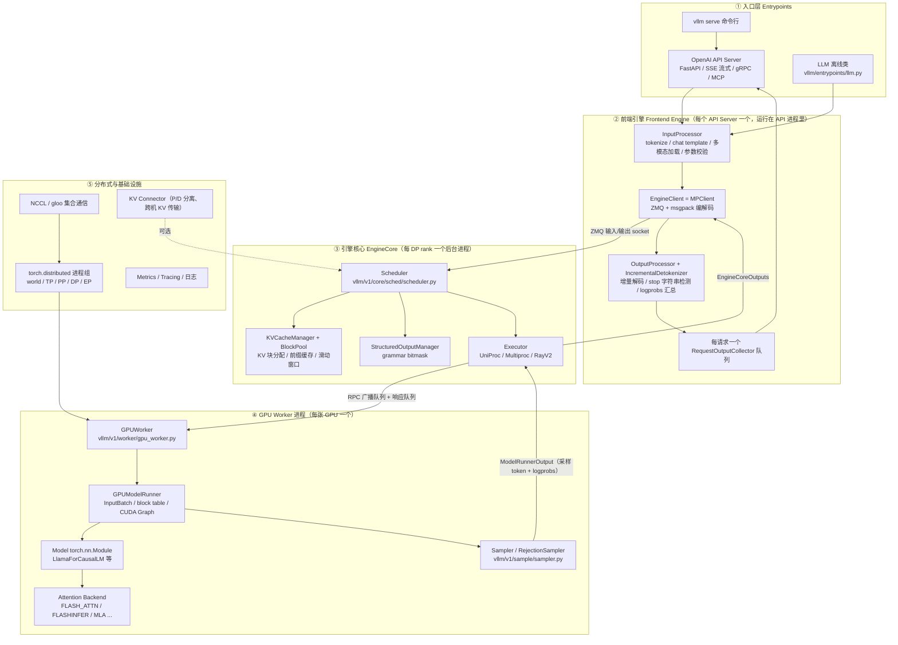

一句话概括：**API 进程负责"翻译"请求和输出，EngineCore 进程负责"决定每步跑什么"，Worker 进程负责"真的在 GPU 上算"**，三层之间分别用 ZMQ 和 multiprocessing 队列传递消息，GPU 之间的张量交换走 NCCL。

---

## 1. 进程模型：谁在哪个进程里跑

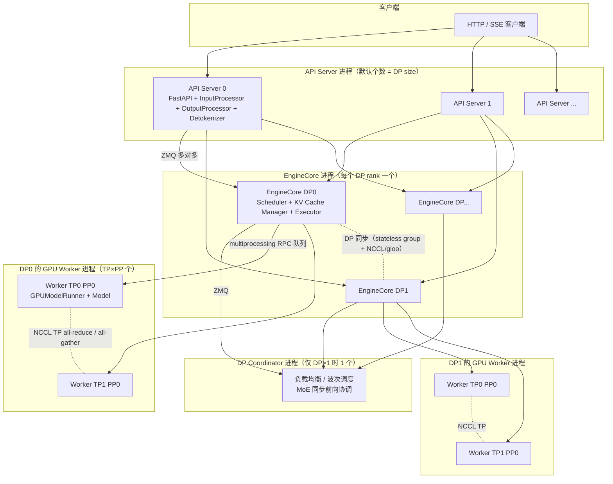

### 1.1 各进程职责

| 进程 | 数量 | 职责 | 关键代码 |
| --- | --- | --- | --- |
| API Server | `A`（默认 = DP size，可用 `--api-server-count` 覆盖） | HTTP/SSE、tokenize、多模态加载、detokenize、stop 检测、logprobs 组装、流式返回 | `vllm/entrypoints/openai/api_server.py`、`vllm/v1/engine/async_llm.py` |
| EngineCore | `DP`（默认 1） | 调度器、KV cache 管理、结构化输出、调用 Executor 执行模型、把采样结果汇总成输出 | `vllm/v1/engine/core.py` |
| GPU Worker | `N = DP × PP × TP`（每张 GPU 一个） | 加载权重、跑前向、采样、维护 GPU 上的 request states | `vllm/v1/worker/gpu_worker.py`、`vllm/v1/worker/gpu/model_runner.py` |
| DP Coordinator | `1`（仅 `DP > 1`） | DP 之间的负载均衡（波次）、MoE 同步前向协调 | `vllm/v1/engine/coordinator.py` |

例如 `vllm serve -tp 4`（单机 4 卡）→ **1 API + 1 EngineCore + 4 Worker = 6 个进程**。
`-tp 2 -dp 4`（8 卡）→ **4 API + 4 EngineCore + 8 Worker + 1 Coordinator = 17 个进程**。

官方仓库自带的对应图示（本目录 `vllm_0.22.1_arch_images/` 下有拷贝）：

- [TP=4 进程架构图](vllm_0.22.1_arch_images/v1_process_architecture_tp4.png)
- [TP=2 DP=4 进程架构图](vllm_0.22.1_arch_images/v1_process_architecture_tp2_dp4.png)

### 1.2 进程间通信方式

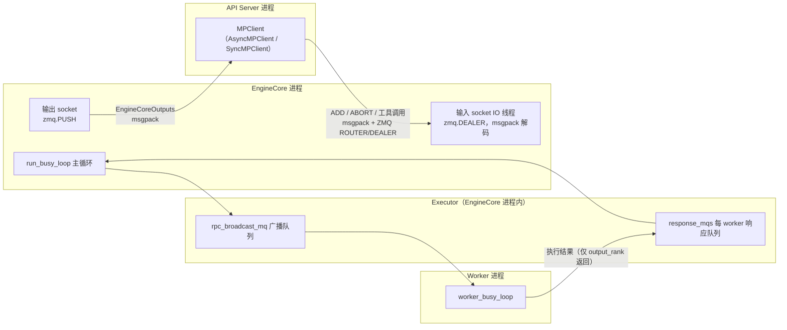

要点：

- **前端 ↔ EngineCore**：ZMQ。请求方向是 ROUTER/DEALER（`EngineCoreProc.process_input_sockets`），输出方向是 PUSH/PULL。消息体用 `msgspec.msgpack` 序列化；多模态大张量可以走共享内存 OOB 通道（`vllm/v1/engine/tensor_ipc.py` 的 `TensorIpcSender/Receiver`，`--mm-tensor-ipc torch_shm`）。
- **EngineCore ↔ Worker**：Python multiprocessing 队列。Executor 通过 `collective_rpc` 把方法名和参数广播给所有 worker（`rpc_broadcast_mq`），每个 worker 在 `worker_busy_loop` 里执行，结果只由 `output_rank` 一个 worker 写回 `response_mqs`，EngineCore 拿 `Future` 等结果。
- **Executor 选择**（`vllm/config/parallel.py:835-880`）：world_size=1 默认 `uni`（UniProcExecutor，同进程内直接调用）；多卡默认 `mp`（MultiprocExecutor，每 GPU 一个 WorkerProc）；Ray 已初始化或指定 `--distributed-executor-backend ray` 时用 RayExecutorV2。
- **Worker ↔ Worker**：GPU 之间走 `torch.distributed`（NCCL），进程组包括 world / TP / PP / DP / EP，见 `vllm/distributed/parallel_state.py`。
- **跨机 KV 传输**（P/D 分离、前缀迁移等）走 KV Connector（NIXL、Mooncake 等），见 `vllm/distributed/kv_transfer/`。

---

## 2. 启动流程：从 `vllm serve` 到可以接请求

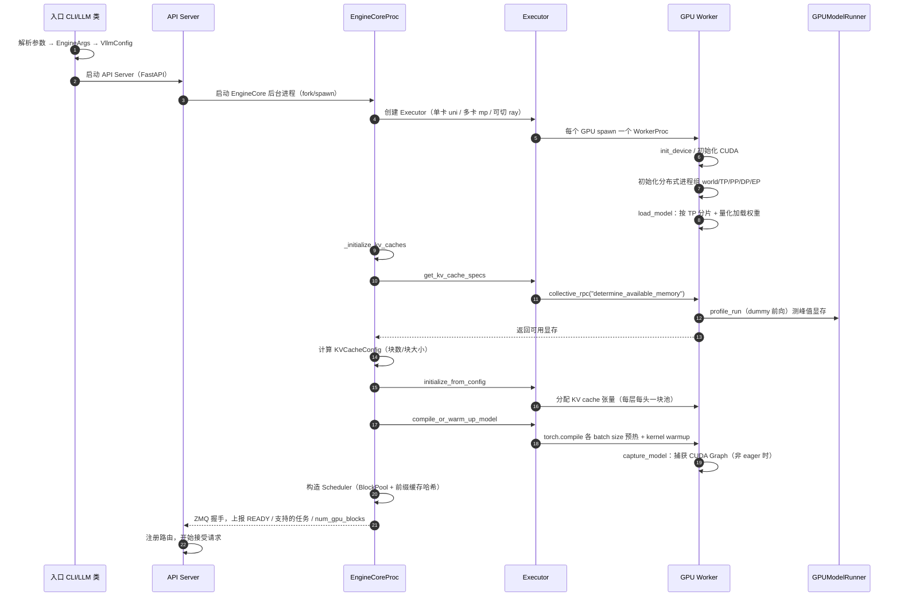

启动期最耗时的是三件事：

1. **权重加载 + TP 分片**：模型在构造时就按 tensor parallel 分片并量化（而不是先加载全量再切），避免内存翻倍。见 `vllm/model_executor/model_loader/`。
2. **显存 profile**：每个 worker 用 dummy batch 跑一次前向，测出模型峰值显存，剩下的显存才按 `gpu_memory_utilization` 分给 KV cache。见 `vllm/v1/worker/gpu_worker.py` 的 `determine_available_memory`。
3. **编译 + CUDA Graph 捕获**：`torch.compile` 按 `--compile-sizes` 预热，然后 `capture_model` 按 `--cudagraph-capture-sizes` 捕获一批固定形状的 CUDA Graph，运行时按 batch 形状 dispatch。见 `vllm/v1/worker/gpu/cudagraph_utils.py`。

---

## 3. 一次在线请求的完整生命周期（最关键）

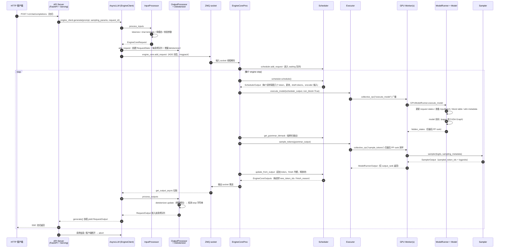

### 3.1 逐段拆解

**（1）入口 → 前端引擎**

`vllm serve` 启动的 OpenAI API Server 收到请求后，由各 Serving 类（chat/completion）调用 `engine_client.generate()`。`AsyncLLM.generate`（`vllm/v1/engine/async_llm.py:524`）是核心：

```python
q = await self.add_request(request_id, prompt, sampling_params, ...)
finished = False
while not finished:
    out = q.get_nowait() or await q.get()
    finished = out.finished
    yield out
```

`add_request` 干两件事：

- `InputProcessor.process_inputs`：把原始 prompt（文本 / token ids / 多模态）转成 `EngineCoreRequest`——tokenize、套 chat template、加载多模态、克隆并校验 SamplingParams、分配 request_id。
- `output_processor.add_request`：在前端进程创建 `RequestState`（含每请求的 `RequestOutputCollector` 队列和 `IncrementalDetokenizer`）。
- 然后 `engine_core.add_request(request)` 把消息通过 ZMQ 发给 EngineCore。

**（2）EngineCore 主循环**

`EngineCoreProc.run_busy_loop`（`vllm/v1/engine/core.py:1193`）：

```python
while self._handle_shutdown():
    self._process_input_queue()   # 1) 收请求，直到有活干
    self._process_engine_step()   # 2) step：调度 → 执行 → 采样 → 出输出
```

`_process_engine_step` 调用 `self.step_fn()`，即 `step()`（无 PP 批队列时）或 `step_with_batch_queue()`（PP 多 batch 流水时）。

**（3）一次 step 的三角色协作**

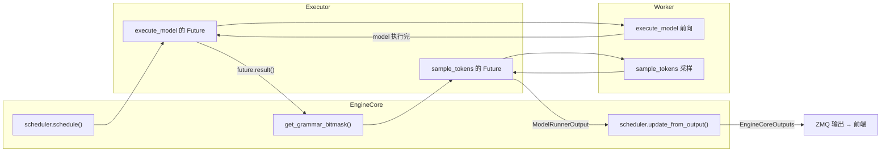

关键点：`execute_model` 和 `sample_tokens` 是**两次独立的 RPC**。模型前向和采样之间还插入了 grammar bitmask 计算（结构化输出），保证采样时 logits 已被约束。

**（4）前端输出处理**

EngineCore 把输出推到 ZMQ 后，`AsyncLLM._run_output_handler`（后台 asyncio 任务）调用 `OutputProcessor.process_outputs`（`vllm/v1/engine/output_processor.py:576`）：

1. 更新指标；
2. `detokenizer.update(new_token_ids, ...)` 增量解码成文本，并检测 stop 字符串；
3. `logprobs_processor.update_from_output` 汇总采样 logprobs；
4. 构造 `RequestOutput` 放入该请求的队列；
5. 请求 finish 时清理 `RequestState`，必要时向 EngineCore 发 ABORT（例如前端检测到 stop 字符串而 EngineCore 不知道）。

`generate()` 协程从队列取到 `RequestOutput` 后逐条 yield，API Server 转成 SSE/JSON 流回客户端。

---

## 4. EngineCore 单步执行细节（调度 → 执行 → 更新）

### 4.1 `step()` 的完整代码路径

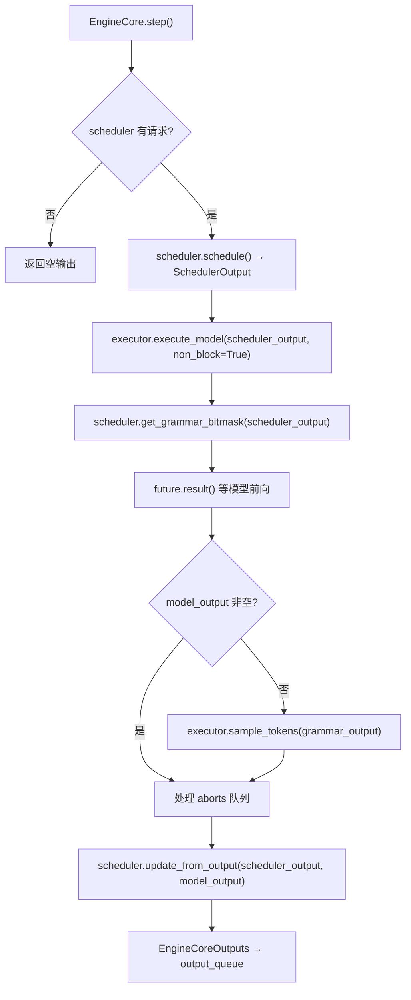

对应源码（`vllm/v1/engine/core.py:428`）：

```python
scheduler_output = self.scheduler.schedule()
future = self.model_executor.execute_model(scheduler_output, non_block=True)
grammar_output = self.scheduler.get_grammar_bitmask(scheduler_output)
model_output = future.result()
if model_output is None:
    model_output = self.model_executor.sample_tokens(grammar_output)
self._process_aborts_queue()
engine_core_outputs = self.scheduler.update_from_output(scheduler_output, model_output)
```

### 4.2 SchedulerOutput 里有什么

`SchedulerOutput`（`vllm/v1/core/sched/output.py:181`）是 EngineCore 和 Worker 之间传递的"执行指令书"：

| 字段 | 含义 |
| --- | --- |
| `num_scheduled_tokens: dict[str, int]` | 每个请求本次要计算几个 token |
| `total_num_scheduled_tokens` | 本次 batch 总 token 数 |
| `scheduled_spec_decode_tokens` | 投机解码的 draft tokens |
| `scheduled_encoder_inputs` | 多模态 encoder 输入（视觉/音频特征） |
| `new_blocks` | 每个请求新分配的 KV 块 |
| `finished_req_ids` | 本轮已结束的请求 id |

Worker 端 `GPUModelRunner.execute_model` 就是照着这份指令书，把 token 拼成 tensor 喂给模型。

---

## 5. 调度器详解（vllm/v1/core/sched/scheduler.py）

### 5.1 核心思想：没有独立的 prefill/decode 阶段

官方注释原话（`scheduler.py:329`）：

> There's no "decoding phase" nor "prefill phase" in the scheduler.
> Each request just has the `num_computed_tokens` and `num_tokens_with_spec`.
> At each step, the scheduler tries to assign tokens to the requests so that
> each request's `num_computed_tokens` can catch up its `num_tokens_with_spec`.

即每个请求维护两个数字：

- `num_tokens_with_spec = len(prompt) + len(output) + len(spec_draft_tokens)`：期望算到哪；
- `num_computed_tokens`：实际算到哪。

每步调度就是"给一批请求各分配几个 token 的算力"，让后者追赶前者。这一个统一模型同时覆盖：

- **chunked prefill**：长 prompt 每次只算一个 chunk；
- **prefix caching**：命中前缀的 token 不算，直接跳；
- **投机解码**：draft tokens 也算进 `num_tokens_with_spec`，被拒绝就回退 `num_computed_tokens`；
- **异步调度 / 跳变解码**：`num_output_placeholders` 让 decode 可以不等上一轮结果就预占算力。

### 5.2 调度流程

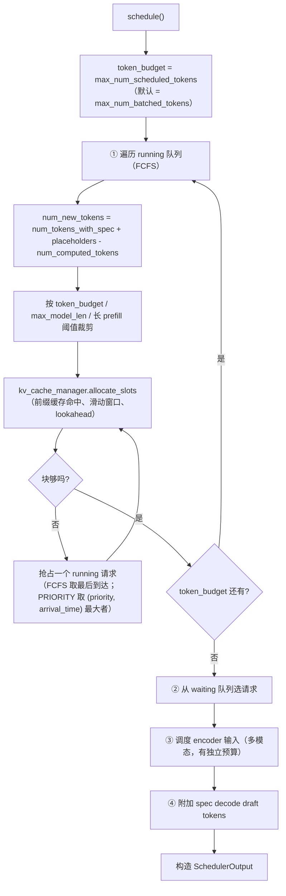

细节：

- **队列**：`running`（正在跑）、`waiting`（等待）、finished 集合；`RequestStatus` 状态机见 `vllm/v1/request.py`。
- **优先级**：默认 `fcfs`（按到达顺序）；`--scheduler-policy priority` 时按请求 `priority` 字段排序。抢占时：FCFS 策略下 `preempted_req = self.running.pop()`（取列表末尾，即最后到达的请求）；PRIORITY 策略下 `preempted_req = max(self.running, key=lambda r: (r.priority, r.arrival_time))`，即 `(priority, arrival_time)` 最大者（数值越大优先级越低）。
- **KV 分配**：`allocate_slots`（`vllm/v1/core/kv_cache_manager.py:236`）分三段：先算前缀命中（`new_computed_blocks`），再处理外部已计算 token（KV connector），最后为"本轮要算的 token + lookahead"分配新块。前缀缓存命中靠 `BlockPool` 里的哈希表 + 引用计数，见 `vllm/v1/core/block_pool.py`。
- **encoder 预算**：多模态输入有独立的 `max_num_encoder_input_tokens`，避免挤占文本 token 预算。
- **Mamba/混合模型**：`need_mamba_block_aligned_split` 要求块对齐切分。
- **PP 流水**：`batch_queue_size = executor.max_concurrent_batches`，PP>1 时用 `step_with_batch_queue` 让多个 batch 在 PP 各 stage 上流水执行，消除气泡。

### 5.3 执行后更新：`update_from_output`

`update_from_output`（`scheduler.py:1283`）做：

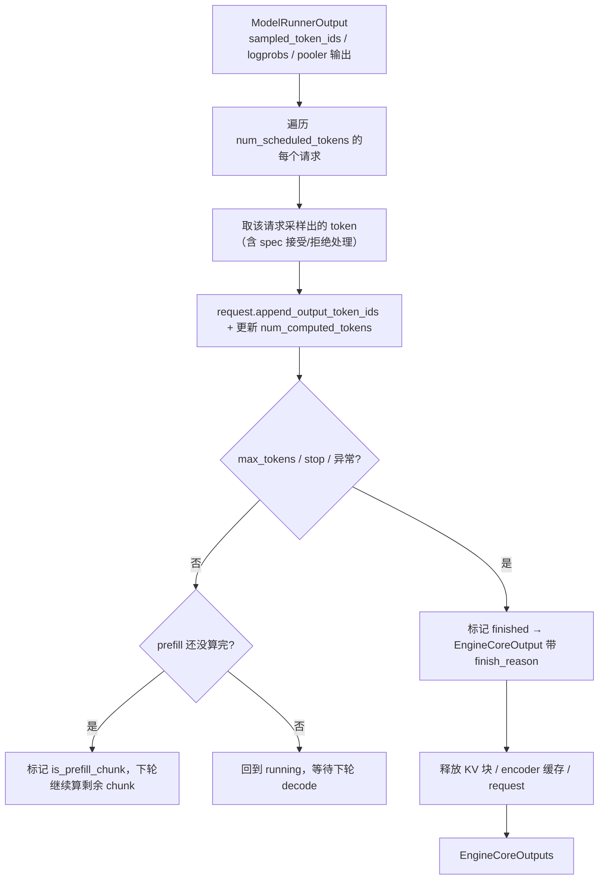

---

## 6. Worker 与 ModelRunner 数据流（GPU 上发生了什么）

### 6.1 一次前向的张量流

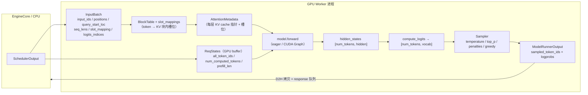

### 6.2 `GPUModelRunner.execute_model` 步骤拆解（`vllm/v1/worker/gpu/model_runner.py:1009`）

```python
# 1) 同步请求状态到 GPU
self.finish_requests(scheduler_output)
self.free_states(scheduler_output)
self.add_requests(scheduler_output)
self.update_requests(scheduler_output)
self.block_tables.apply_staged_writes()

# 2) DP 间同步 batch 形状（决定 CUDA Graph 模式与 padding）
batch_desc, num_tokens_across_dp = dispatch_cg_and_sync_dp(...)

# 3) 组装输入
input_batch = self.prepare_inputs(scheduler_output, batch_desc)
block_tables, slot_mappings = self.prepare_attn(input_batch)
attn_metadata = self.model_state.prepare_attn(...)
inputs_embeds = self.model_state.get_mm_embeddings(...)   # 多模态

# 4) 前向
if batch_desc.cg_mode == CUDAGraphMode.FULL:
    model_output = self.cudagraph_manager.run_fullgraph(batch_desc)
else:
    with set_forward_context(attn_metadata, ...):
        model_output = self.model(**model_inputs)
```

重要细节：

- **InputBatch 是预分配的静态 buffer**（`vllm/v1/worker/gpu/input_batch.py`）：`input_ids`、`positions`、`query_start_loc`、`seq_lens` 都是 `max_num_batched_tokens` 大小的固定 GPU tensor，每步只拷贝新数据，避免反复分配。`prepare_inputs` 里 decode 排在 prefill 前面（`req_ids = sorted(num_tokens_per_req, key=...)`）。
- **CUDA Graph 三种模式**：`NONE`（eager）、`PIECEWISE`（分段/请求级 padding）、`FULL`（整个 batch 一个图）。`dispatch_cg_and_sync_dp` 在 DP>1 时用 `all_reduce` 让所有 DP rank 用同一 batch 形状，保证 MoE/EP 同步。
- **PP rank 分工**：非首 PP rank 的 `input_ids=None`，接收上一 stage 的 `IntermediateTensors`；非末 PP rank 把 `IntermediateTensors` 通过 `isend_tensor_dict` 发给下一 stage，自己不采样。
- **KV connector**：`pre_forward` / `post_forward` 钩子用于 KV 传输（P/D 分离时 prefill 算完的 KV 异步发给 decode 实例）。

### 6.3 采样：`sample_tokens`（`model_runner.py:1230`）

```python
sampler_output, num_sampled, num_rejected = self.sample(hidden_states, input_batch, grammar_output)
if self.use_pp:
    pp_broadcast(sampler_output.sampled_token_ids, ...)   # 广播给其它 PP rank
model_runner_output = ModelRunnerOutput(req_ids=..., sampled_token_ids=..., ...)
self.postprocess(input_batch, sampled_token_ids, num_sampled, num_rejected)  # 更新 num_computed_tokens
if self.speculator is not None:
    draft_tokens = self.speculator.propose(...)  # EAGLE / MTP 等下一轮 draft
```

`sample()` 内部：

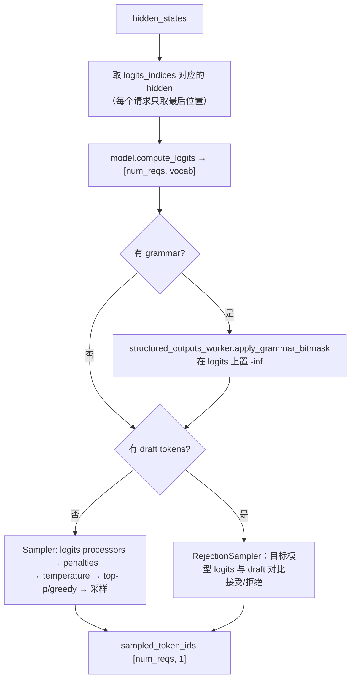

`Sampler.forward`（`vllm/v1/sample/sampler.py:67`）的顺序：先算 raw logprobs（用于返回 logprobs），然后 `apply_logits_processors` → `apply_penalties` → `sample`（temperature 缩放、top-k/top-p、greedy），最后 `gather_logprobs` 取 top-k。采样在 **GPU** 上完成，只把 `sampled_token_ids` 拷回 CPU（异步 D2H，见 `AsyncOutput`）。

---

## 7. 模型内部与注意力 / KV Cache

### 7.1 一个模型长什么样（以 Llama 为例）

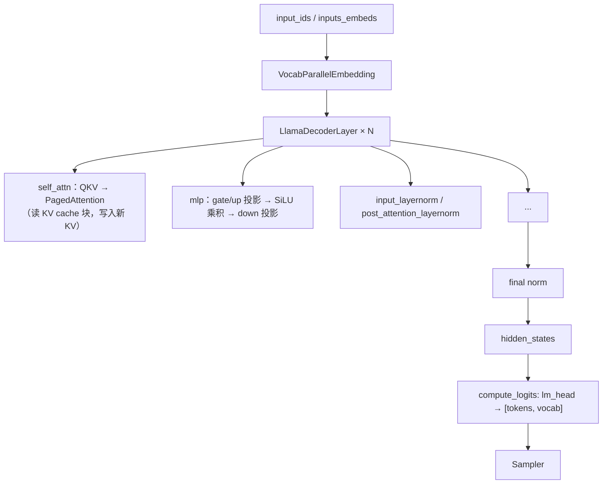

关键类（`vllm/model_executor/models/llama.py`）：

- `LlamaForCausalLM.forward` 只调用 `self.model(...)`，真正的 logits 由 `compute_logits` 通过 `logits_processor(lm_head, hidden_states)` 算；
- 所有模型统一构造签名 `__init__(*, vllm_config: VllmConfig, prefix: str = "")`，由 `_ModelRegistry` 按 HF architecture 名注册、加载；
- 权重在初始化阶段就按 TP 分片：`ColumnParallelLinear` / `RowParallelLinear`、`VocabParallelEmbedding` 等（`vllm/model_executor/layers/linear.py`）。

### 7.2 注意力后端与 KV cache

- 后端选择：`vllm/v1/attention/selector.py` 的 `get_attn_backend`，CUDA 上主要是 **FlashAttention（FA3）** 和 **FlashInfer**，MLA 模型有专门的 `FLASH_ATTN_MLA` / `FLASHINFER_MLA`（`vllm/platforms/cuda.py:94-143`）。
- 每个 KV 块：`block_size` 个 token 的 K/V（每层每头），KV cache 在 `initialize_kv_cache` 时一次性分配成一块连续池（`vllm/v1/worker/gpu/model_runner.py:360`）。
- 注意力元数据：`slot_mapping` 把"token 位置 → 块内槽位"；`block_tables` 是每请求的块列表；paged attention kernel 用这两个表直接读写 KV 池。PP 每层共享同一个 KV 池，TP 下每 rank 只存自己分到的头。
- 前缀缓存：CPU 端 `BlockPool` 用内容哈希（`--prefix-caching-hash-algo`）找相同块，命中的块在 GPU 上直接复用，调度器把这些 token 标为已计算（`new_computed_blocks`）。详见 `docs/design/prefix_caching.md`。

---

## 8. 分布式并行：TP / PP / DP / EP

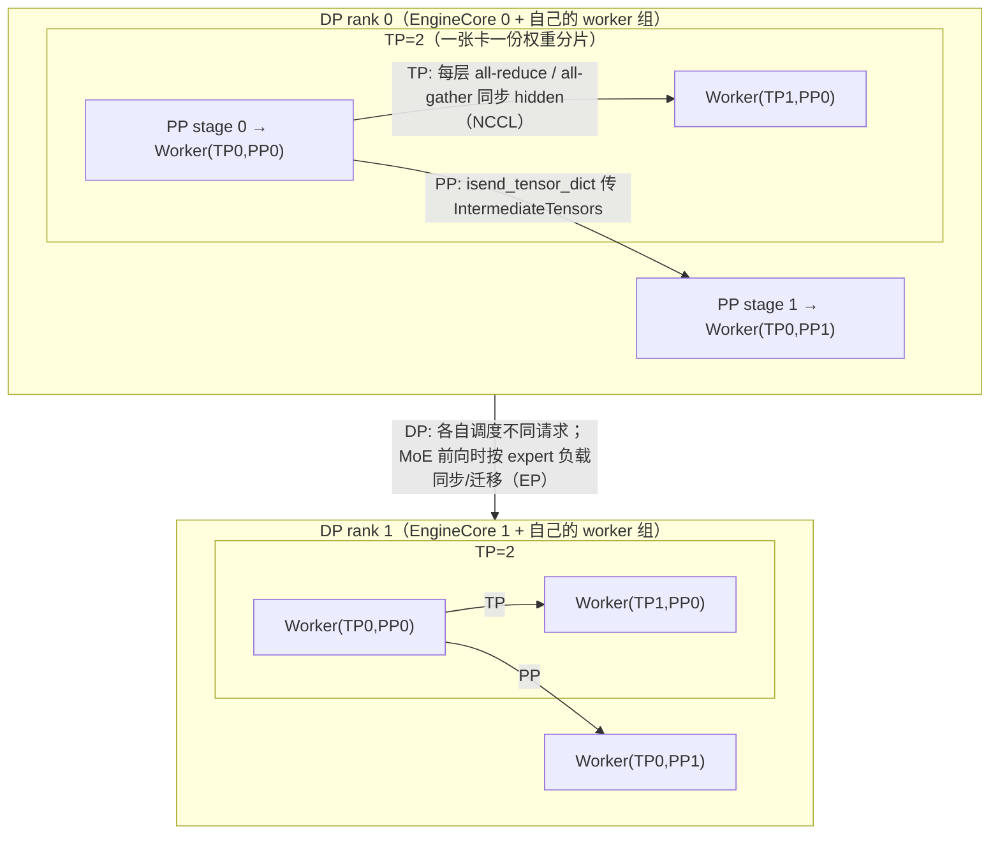

### 8.1 各种并行怎么分工

| 并行 | 切什么 | 通信 | 特点 |
| --- | --- | --- | --- |
| TP | 权重和激活按 head/神经元切 | 每层一次 NCCL all-reduce/all-gather（`get_tp_group()`） | 单步内部同步，延迟敏感 |
| PP | 模型按 layer stage 切 | 每 batch 传一次 `IntermediateTensors`（`isend_tensor_dict`/`irecv_tensor_dict`） | 可多 batch 流水（`step_with_batch_queue`） |
| DP | 请求切分 | 几乎不通信；仅 batch 形状同步 + MoE 时 EP | 每个 DP rank 一个独立 EngineCore + 调度器，吞吐翻倍 |
| EP（MoE） | expert 路由 | 按路由结果迁移 token 到对应 expert 所在 rank（all-to-all） | 与 DP 结合，弹性扩缩（`elastic_ep`） |

### 8.2 数据并行（DP）在 0.22.1 里的样子

- 每个 DP rank 一个独立的 EngineCore 进程，各自有完整的 Scheduler + KV cache + TP/PP worker 组（`run_engine_core(dp_rank=...)`，`core.py:1093`）。
- 前端（API Server）把请求发给任意 EngineCore；DP>1 时启动 **DP Coordinator**（`vllm/v1/engine/coordinator.py`）做负载均衡：请求按"波次"（wave）下发（`START_DP_WAVE`），Coordinator 统计各 rank 队列长度，把新请求路由到最闲的 rank。
- MoE 模型：DP 与 EP 结合，`stateless_init_dp_group` 建立跨 rank 的 stateless 进程组（`core.py:1708`），每步 `dispatch_cg_and_sync_dp` 通过 all-reduce 对齐 batch 形状和 CUDA Graph 模式，EP 按 expert 负载做 token 迁移（`vllm/distributed/elastic_ep/`）。
- 多 API Server 场景：`TensorIpcSender/Receiver`（共享内存）用于把多模态大张量从 API 进程传给 EngineCore，避免 ZMQ 拷贝（`core_client.py` 的 client_addresses + tensor_queue）。

### 8.3 跨机 KV 传输（P/D 分离、KV 迁移）

`kv_connector` 挂在 Scheduler 和 ModelRunner 两侧：

- prefill 实例算完的 KV 块异步推给 decode 实例（`KVConnectorBase_V1`，`vllm/distributed/kv_transfer/kv_connector/v1/`）；
- 调度时 `allocate_slots` 支持 `num_external_computed_tokens`，即"这些 token 的 KV 在远端已经算好"，命中就不用重算；
- `post_forward` / `pre_forward` 钩子处理传输时机；失败时 `_handle_invalid_blocks` 让请求回退重算。

---

## 9. 离线 `LLM` 路径（同步）

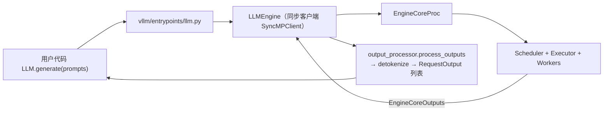

离线路径与在线路径的区别只是前端：`LLM` 用同步 `LLMEngine`（`vllm/v1/engine/llm_engine.py`），`step()` 里 `engine_core.get_output()` 阻塞取输出；在线用 `AsyncLLM` + 每请求 asyncio 队列。**EngineCore 及以后完全一样**。

---

## 10. 关键模块速查表（v0.22.1）

| 模块 | 文件（v0.22.1） | 作用 |
| --- | --- | --- |
| 离线 LLM | `vllm/entrypoints/llm.py` | 同步生成入口 |
| OpenAI API | `vllm/entrypoints/openai/api_server.py` | HTTP/SSE 服务 |
| 前端引擎 | `vllm/v1/engine/async_llm.py` | AsyncLLM：generate / add_request / output handler |
| 同步引擎 | `vllm/v1/engine/llm_engine.py` | LLMEngine（离线 step） |
| 输入处理 | `vllm/v1/engine/input_processor.py` | tokenize、多模态、参数校验 |
| 输出处理 | `vllm/v1/engine/output_processor.py` | RequestOutput、logprobs、abort |
| 增量解码 | `vllm/v1/engine/detokenizer.py` | 文本解码、stop 检测 |
| 引擎核心 | `vllm/v1/engine/core.py` | EngineCore / EngineCoreProc 主循环 |
| 客户端 | `vllm/v1/engine/core_client.py` | MPClient（ZMQ 收发） |
| 调度器 | `vllm/v1/core/sched/scheduler.py` | 每步调度 |
| 调度输出 | `vllm/v1/core/sched/output.py` | SchedulerOutput |
| KV 管理 | `vllm/v1/core/kv_cache_manager.py` | 块分配/释放 |
| 块池/前缀缓存 | `vllm/v1/core/block_pool.py` | 哈希缓存块 |
| 执行器 | `vllm/v1/executor/{uniproc,multiproc,ray_executor_v2}.py` | 进程编排 |
| Worker | `vllm/v1/worker/gpu_worker.py` | 设备初始化、KV、前向入口 |
| 模型运行器 | `vllm/v1/worker/gpu/model_runner.py` | InputBatch、前向、采样、CUDA Graph |
| 采样器 | `vllm/v1/sample/sampler.py` | logits 处理 + 采样 |
| 拒绝采样 | `vllm/v1/sample/rejection_sampler.py` | 投机解码接受/拒绝 |
| 注意力 | `vllm/v1/attention/{backend,selector}.py` | 后端接口与选择 |
| 模型注册 | `vllm/model_executor/models/registry.py` | 按架构注册模型 |
| 模型示例 | `vllm/model_executor/models/llama.py` | Llama 实现 |
| 分布式状态 | `vllm/distributed/parallel_state.py` | world/TP/PP/DP/EP 组 |
| DP 协调 | `vllm/v1/engine/coordinator.py` | 波次调度、负载均衡 |
| 张量 IPC | `vllm/v1/engine/tensor_ipc.py` | 共享内存传多模态张量 |
| 配置 | `vllm/config/vllm.py`、`vllm/config/scheduler.py` | VllmConfig / 调度配置 |

---

## 11. 常见问题速答

**Q：调度频率是多久一次？**
EngineCore 是连续 busy loop，每次 loop 就是一步（`schedule → execute → sample → update`），没有定时器；有活就立即调度，没活就阻塞等输入。

**Q：为什么采样是单独一次 RPC？**
因为结构化输出要在前向之后、采样之前给 logits 套 grammar bitmask；另外投机解码的 draft 提议也插在这里。把采样独立出来可以让"前向"和"采样"两个阶段重叠流水（async scheduling）。

**Q：一个请求的 token 在 GPU 上怎么"记住"上下文？**
每步把新 token 的 K/V 写进预先分配的 KV cache 块（`slot_mapping` 定位），不需要每步重算旧 token；前缀命中时直接复用已有块的 KV。

**Q：加卡怎么扩吞吐？**
- 单请求延迟敏感 → 加 TP（但通信成本随 TP 增大）；
- 并发吞吐 → 加 DP（每个 DP rank 独立调度，吞吐近似线性）；
- 超大模型装不下 → 加 PP 或 TP。

**Q：想看实际调度日志怎么开？**
`--enable-prefix-caching`、`VLLM_LOG_LEVEL=DEBUG`（EngineCore 会有 `schedule` 相关 debug），或用 `--scheduler-policy` 切换策略，`--max-num-batched-tokens` / `--max-num-seqs` 控制每步预算。

---

*文档生成时源码已 checkout 到 tag `v0.22.1`。所有路径基于该版本，若你看到更高版本结构不同，请以对应 tag 的源码为准。*
