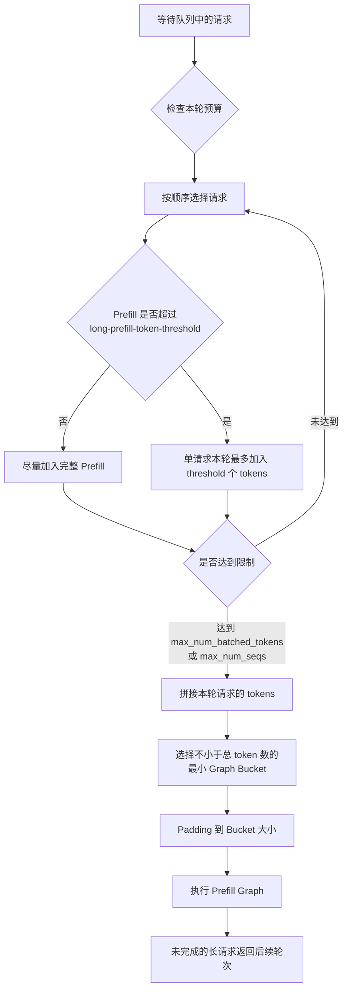

# vLLM Prefill 调度与 Graph Bucket 策略

## 1. 背景与目标

离线推理中，请求的输入长度通常差异较大。Prefill 调度需要同时考虑三个目标：

- 提高单轮计算的 token 利用率和设备吞吐；
- 避免单个长请求长期占满调度预算，阻塞其他请求；
- 控制 prefill graph 的 padding，减少无效计算。

因此，调度策略不应简单地把输入统一截成很小的块，而应通过 token 预算、序列数上限和长请求分块机制共同控制每轮计算规模。

## 2. 调度预算

每个调度轮次主要受以下两个参数限制：

### `max_num_batched_tokens`

表示单轮调度允许计算的最大 token 数。这里统计的是本轮实际参与计算的 token，而不是请求的完整长度。

例如，`max_num_batched_tokens=8192` 时，本轮可以调度：

- 一个 8192-token 的长请求；
- 四个各 2048-token 的请求；
- 或多个请求的其他组合，只要 token 总数不超过 8192。

### `max_num_seqs`

表示单轮最多同时调度的请求（sequence）数量。即使 token 预算尚未用完，请求数达到该上限后，也不能继续加入新请求。

因此，一轮调度需同时满足：

```text
本轮 token 总数 <= max_num_batched_tokens
本轮请求总数  <= max_num_seqs
```

## 3. 默认贪心调度的问题

默认调度顺序通常是 FCFS，并在约束范围内尽可能填满当前轮次的 token 预算。如果队首存在一个超长输入，它可能在单轮中占用全部 `max_num_batched_tokens`，使后续短请求无法进入本轮计算。

例如：

```text
max_num_batched_tokens = 8192

请求 A：输入 20000 tokens
请求 B：输入   800 tokens
请求 C：输入   500 tokens
```

如果请求 A 本轮直接获得 8192-token 的预算，则 B、C 需要等待下一轮。这虽然能减少 A 的调度轮次，但会增加短请求等待时间，也不利于多个请求共同组成合适的 graph bucket。

## 4. 长 Prefill 分块

在启用 chunked prefill 的前提下，可以使用 `long_prefill_token_threshold`（命令行参数为 `--long-prefill-token-threshold`）限制单个长 prefill 请求在一个调度轮次内获得的 token 数。例如：

```text
--enable-chunked-prefill \
--long-prefill-token-threshold 2048
```

当请求本轮剩余待计算 token 数超过 2048 时，本轮最多为它调度 2048 tokens；剩余部分留到后续轮次。`0` 表示关闭这一额外上限。最终实际调度量还会受到本轮剩余 token budget 的限制。

示意如下：

```text
未限制长请求： A[8192]                         -> B、C 等待
限制长请求后： A[2048] + B[800] + C[500] + ... -> 同轮执行
下一轮：       A[2048] + 其他请求               -> 继续执行
```

这样做的主要收益是：

- 防止单个长请求独占 token 预算；
- 提高短请求被及时调度的机会；
- 使每轮总 token 数更容易落入合适的 graph bucket；
- 可以通过参数调节 padding，而不必把所有请求的分块长度固定得很小。

需要注意，阈值越小，长请求被拆分得越细，公平性和调度灵活性通常越好，但调度轮次及相关开销也会增加；阈值越大，则更偏向长请求吞吐。不同 vLLM 版本对并发 partial prefill 还可能提供额外参数，因此上线前应以所用版本的参数定义为准。

## 5. Prefill Graph 与 Bucket

按照当前系统的 prefill graph 实现，先将本轮选中的多个请求在 token 维度拼接，再将总 token 数 padding 到最近的可用 bucket：

```text
[128, 256, 512, 1024, 2048]
```

假设本轮调度了三个请求：

```text
请求 A：700 tokens
请求 B：180 tokens
请求 C：100 tokens
总计：980 tokens
```

三个请求拼接后共有 980 tokens，因此选择 1024 bucket，并补齐 44 个 padding tokens：

```text
700 + 180 + 100 = 980 -> padding 到 1024
padding 数量 = 1024 - 980 = 44
```

若本轮总计为 1025 tokens，则需要进入 2048 bucket，产生 1023 个 padding tokens。可见，bucket 边界附近的调度结果会显著影响无效计算量。

## 6. 整体调度流程



也可以将核心关系简化为：

```text
请求队列
   │
   ├─ token 预算：max_num_batched_tokens
   ├─ 请求数预算：max_num_seqs
   └─ 长请求分块：long-prefill-token-threshold
   │
   ▼
本轮请求拼接
   │
   ▼
实际 token 数：N
   │
   ▼
选择最小可容纳 bucket：128 / 256 / 512 / 1024 / 2048
   │
   ▼
Padding 后执行 Prefill Graph
```

## 7. 参数调整思路

参数调整的重点不是单独追求最小 padding，而是在吞吐、公平性和 graph 复用之间取得平衡：

- `max_num_batched_tokens` 较大：单轮吞吐潜力更高，但长请求更容易占用大量预算，也可能跨入更大的 bucket；
- `max_num_seqs` 较大：允许更多短请求共同填充 token 预算，但会增加调度和请求管理开销；
- `long-prefill-token-threshold` 较小：长请求让出更多调度空间，短请求延迟更稳定，但长请求需要更多轮次完成；
- bucket 越密集：padding 浪费越少，但需要维护和编译更多 graph；
- bucket 越稀疏：graph 数量更少，但边界处可能产生较大 padding。

实践中可以先固定 graph bucket，根据典型输入长度分布调整 `max_num_batched_tokens` 和长 prefill 阈值，使多数轮次的实际 token 数接近某个 bucket 上界。例如 900～1024 tokens 尽量进入 1024 bucket，而不是略微超过 1024 后被迫 padding 到 2048。

## 8. 结论

该策略的核心是：使用 `max_num_batched_tokens` 控制单轮 token 总预算，使用 `max_num_seqs` 控制并发请求数，再通过 chunked prefill 和 `long_prefill_token_threshold` 限制单个长输入在每轮的份额，避免其独占计算资源。调度完成后，将多个请求的 token 拼接，并 padding 到最近的 prefill graph bucket。

因此，padding 大小可以通过调度参数和长请求分块策略间接控制，不需要为了减少 padding 而把所有请求的处理长度统一设置得很小。

## 参考

- [vLLM SchedulerConfig](https://docs.vllm.ai/en/stable/api/vllm/config/scheduler/)
- [vLLM `run-batch` 调度参数](https://docs.vllm.ai/en/stable/cli/run-batch/)
