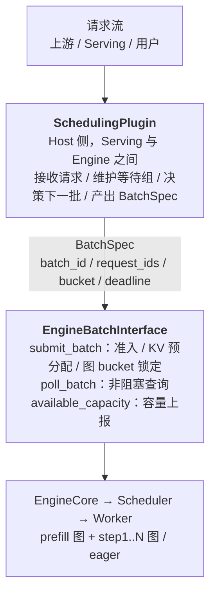
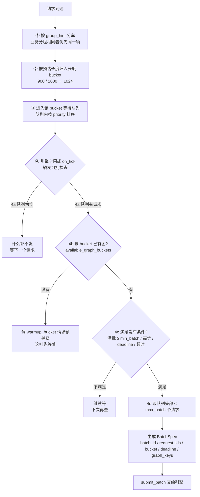
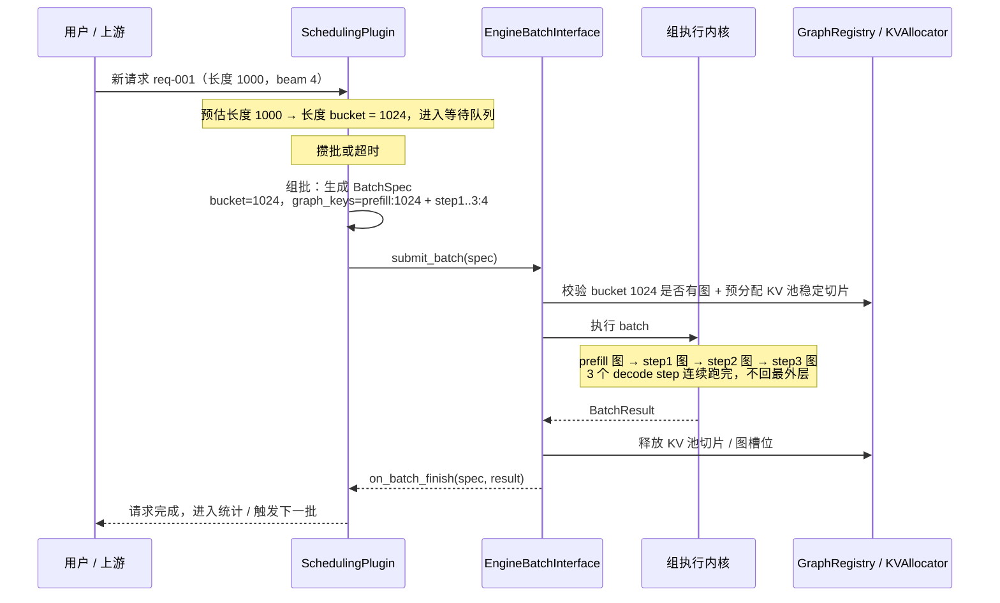
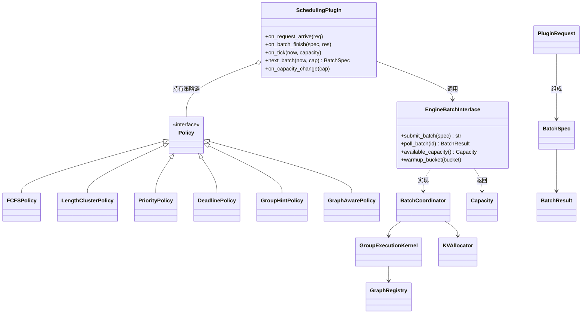
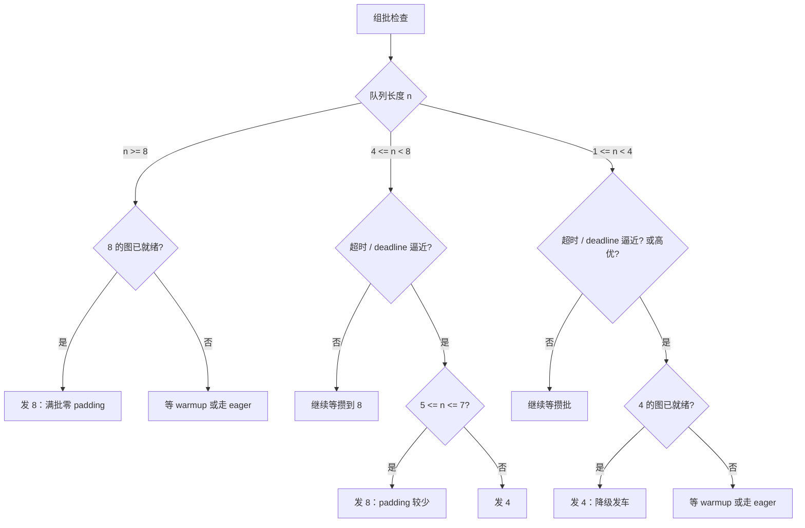
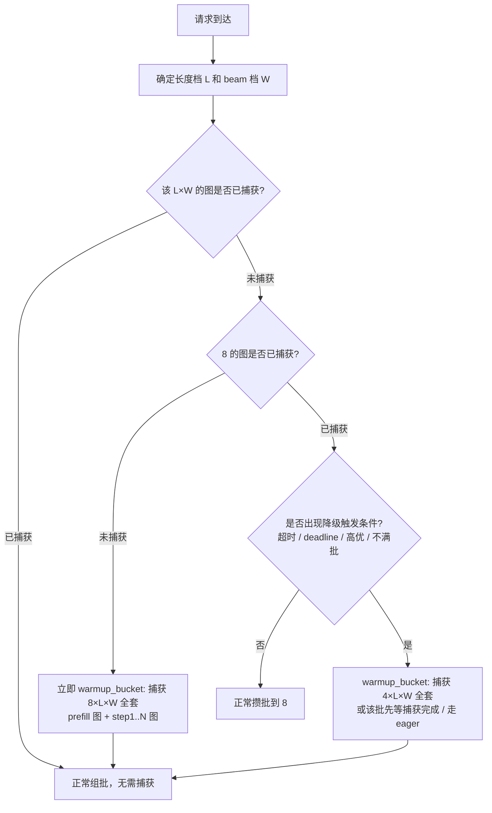
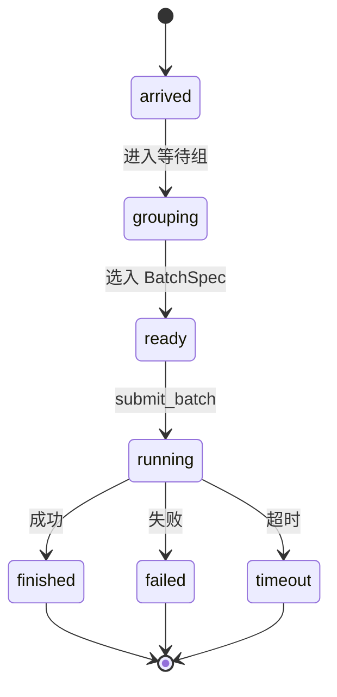
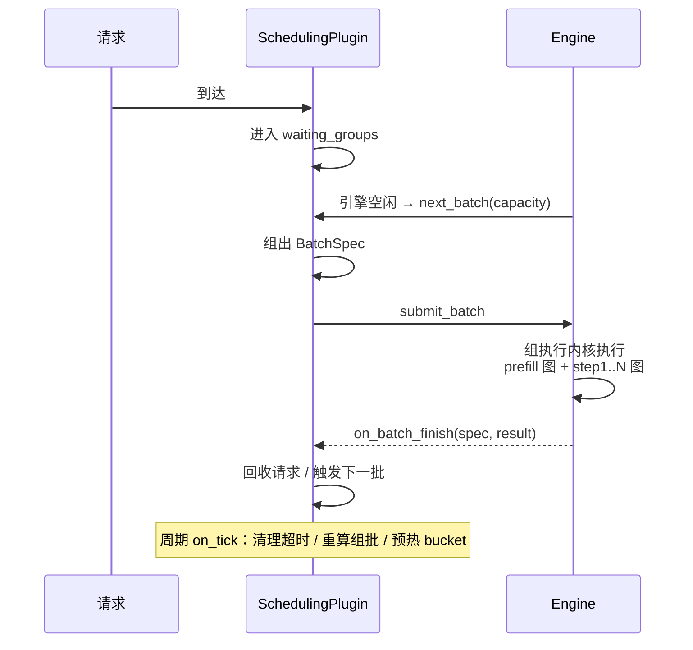

# vllm-gr 调度策略插件设计方案

> 状态：方案设计（v0.1）
> 关联文档：[调度策略调研与设计](scheduler_strategy_design.md)
> 目标：把“用户自己的调度策略”转接为统一的“组 batch（BatchSpec）”执行计划，引擎以 batch 为粒度调度，策略与执行解耦。

---

## 1. 背景与目标

### 1.1 为什么需要插件

策略一（调用方组 batch）的问题是：直接要求调用方组 batch 太严格——调用方必须懂长度分布、流量、bucket 和成图，否则组出来的 batch 形状发散，成图收益归零。

插件要解决的是：


### 1.2 设计目标

- **策略与执行解耦**：任意用户策略都可以翻译成 BatchSpec，引擎侧组执行内核不变；
- **最小契约**：插件与引擎只通过 `BatchSpec / BatchResult / Capacity` 通信；
- **图感知**：插件必须能感知“哪些 bucket 已有图”，避免运行时新 capture；
- **可组合**：一个插件内部可以组合多个策略（如 FCFS + 长度聚类 + 图感知）；
- **可回退**：插件关掉后回到引擎默认调度（策略二：连续接入 + 组 step）。

---

## 2. 总体架构



### 2.1 组件与职责

| 组件 | 职责 |
|---|---|
| `SchedulingPlugin` | 用户策略实现；只做“选批”，不做 KV/图/执行 |
| `EngineBatchInterface` | 引擎侧接口；批量提交、查询、容量上报 |
| `BatchCoordinator`（引擎内） | BatchSpec 生命周期：准入 → 预分配 → 执行 → 回收 |
| `GroupExecutionKernel` | 组执行内核（策略二的组 step 内核复用）：prefill 按长度 bucket、decode 按 (step, bucket) |
| `GraphRegistry` | bucket → 图集合（prefill 图 + step1..N 图）；pool_generation 失效管理 |
| `KVAllocator` | 按 bucket 预留稳定池切片 |

### 2.2 设计原则

1. **插件只选批，引擎只跑批**：插件不持有设备 Tensor，不直接分配 KV；
2. **契约最小化**：BatchSpec 是唯一的批描述，BatchResult 是唯一的结果描述；
3. **默认关闭**：未安装插件时，引擎走策略二（连续接入 + 组 step），行为与 v0.2 主文档一致；
4. **幂等与超时**：BatchSpec 可重发（同 batch_id），插件必须处理超时强制放行。

### 2.3 组 batch 逻辑（大白话 + 决策流程图）

**大白话**：插件就像一个“排班员”。请求来了先按长度放进不同的候车区；攒够一车就发车，等太久也发车；发车前先看哪条线路的车已经修好了（已有图），优先发有车的线路；高优乘客和快到 deadline 的乘客可以插队或单独发一辆小车。

**决策流程**：



要点：**先看有没有图，再决定发不发车**——这是插件与成图衔接的核心。

### 2.4 新请求的执行流程（流程图）

以 RECIF 一个请求（3 个 decode step）为例的完整生命周期：



注意第 4 步：**3 个 decode step 在引擎/worker 内连续跑完，结果不回到最外层**（对应主文档 2.5 多步闭环），这正是插件模式下 batch 粒度调度的优势。

### 2.5 核心类图（关系）



数据类在插件与引擎之间传递：`PluginRequest → BatchSpec → BatchResult`，`Capacity` 反向从引擎给插件。

关系一句话：**插件用一组 Policy 决策，产出 BatchSpec，通过 EngineBatchInterface 交给引擎；引擎内部的 BatchCoordinator 负责把 BatchSpec 变成真正的执行（KV 分配 + 图执行），插件全程不碰设备和图。**

---

## 3. 核心数据契约

### 3.1 插件视角的 Request

```python
@dataclass
class PluginRequest:
    request_id: str
    prompt_len_est: int | None        # 预估长度（可选，来自调用方或历史统计）
    beam_width: int
    priority: int = 0
    deadline: float | None = None     # 绝对时间戳
    group_hint: str | None = None     # 业务分组键
    arrived_at: float
    extra: dict = field(default_factory=dict)
```

### 3.2 BatchSpec

```python
@dataclass(frozen=True)
class BatchSpec:
    batch_id: str
    request_ids: tuple[str, ...]
    mode: str                        # "prefill_only" | "full_generation"
    expected_len: int                # 组内最大长度（用于 bucket 选择）
    bucket: int                      # 已选定的长度/形状 bucket
    beam_width_bucket: int
    priority: int
    deadline: float | None
    graph_keys: tuple[str, ...] = () # 可选：指定复用的图
    created_at: float
```

JSON 示例（附录 A）。

### 3.3 BatchResult

```python
@dataclass
class BatchResult:
    batch_id: str
    status: str                      # "ok" | "partial" | "failed" | "timeout"
    request_results: dict[str, RequestResult]
    metrics: dict[str, float]        # 图命中/回退、padding 比例、耗时等
```

### 3.4 Capacity（引擎上报给插件）

```python
@dataclass
class Capacity:
    free_kv_slots: dict[int, int]            # bucket -> 空闲 slot 数
    available_graph_buckets: tuple[int, ...] # 已有图的 bucket
    capturing_buckets: tuple[int, ...]       # 正在 capture 的 bucket
    max_running_batches: int
    current_running_batches: int
    pool_generation: int
```

---

## 4. 插件接口设计（Python 草案）

### 4.1 SchedulingPlugin 基类

```python
class SchedulingPlugin:
    """用户调度策略 → BatchSpec 流。所有方法默认线程安全。"""

    def on_request_arrive(self, req: PluginRequest) -> None:
        """新请求到达：放入对应等待组，可能触发组批。"""

    def on_batch_finish(self, spec: BatchSpec, result: BatchResult) -> None:
        """一批结束：回收请求、释放资源，可能触发下一批。"""

    def on_tick(self, now: float, capacity: Capacity) -> None:
        """引擎空闲/周期回调：插件有机会主动发射 batch。"""

    def next_batch(self, now: float, capacity: Capacity) -> BatchSpec | None:
        """引擎空闲时询问下一批；None 表示暂无可发。"""

    def on_capacity_change(self, capacity: Capacity) -> None:
        """KV/图可用性变化（如 pool_generation 失效）时通知。"""
```

### 4.2 EngineBatchInterface

```python
class EngineBatchInterface:
    def submit_batch(self, spec: BatchSpec) -> str:
        """准入并开始执行；返回 batch_id。失败抛异常或返回 rejected。"""

    def poll_batch(self, batch_id: str) -> BatchResult | None:
        """非阻塞查询；未完成返回 None。"""

    def available_capacity(self) -> Capacity:
        """当前剩余 KV/图/批预算。"""

    def warmup_bucket(self, bucket: int, count: int = 1) -> None:
        """请求引擎预捕获/预热某个 bucket 的图。"""
```

### 4.3 最小骨架

```python
class FCBatchingPlugin(SchedulingPlugin):
    """示例：FCFS + 长度聚类 + 图感知。"""

    def __init__(self, buckets=(1, 2, 4, 8, 16), max_wait_ms=10.0,
                 min_batch=2, max_batch=8):
        self.buckets = buckets
        self.max_wait_ms = max_wait_ms
        self.min_batch = min_batch
        self.max_batch = max_batch
        self.waiting: dict[int, list[PluginRequest]] = {b: [] for b in buckets}

    def _bucket_for(self, req: PluginRequest) -> int:
        # 取第一个 >= 预估长度/beam 的 bucket
        for b in self.buckets:
            if max(req.prompt_len_est or 0, req.beam_width) <= b:
                return b
        return self.buckets[-1]

    def on_request_arrive(self, req: PluginRequest) -> None:
        self.waiting[self._bucket_for(req)].append(req)

    def next_batch(self, now: float, cap: Capacity) -> BatchSpec | None:
        for bucket in sorted(cap.available_graph_buckets):
            queue = self.waiting[bucket]
            if len(queue) >= self.min_batch:
                batch = queue[: self.max_batch]
                del queue[: self.max_batch]
                return BatchSpec(
                    batch_id=f"b-{now}-{bucket}",
                    request_ids=tuple(r.request_id for r in batch),
                    mode="full_generation",
                    expected_len=bucket,
                    bucket=bucket,
                    beam_width_bucket=bucket,
                    priority=0,
                    deadline=None,
                    created_at=now,
                )
            # 超时强制放行
            if queue and now - queue[0].arrived_at > self.max_wait_ms:
                batch = queue[: self.max_batch]
                del queue[: self.max_batch]
                return BatchSpec(...)
        return None
```

---

## 5. 当前支持的调度策略 → 组 batch 转接清单

> 这是本设计的重点：明确“当前要支持哪些用户策略”，以及每种策略如何翻译成 BatchSpec。

### 5.1 FCFS（先来先服务）

- **输入**：请求到达顺序。
- **转接规则**：按到达顺序填入 bucket 队列；同 bucket 攒满 `max_batch` 即发；队列头部等待超过 `max_wait_ms` 强制放行（不满批也发）。
- **输出 BatchSpec**：同 bucket 的连续请求 + 窗口内到达者。
- **伪代码**：
  ```python
  # 每个 bucket 一个 FIFO 队列；next_batch() 时取非空队列的头部切片
  ```

### 5.2 长度聚类（similar-length grouping）

- **输入**：`prompt_len_est`（调用方提供，或插件用历史分布/前缀估计）。
- **转接规则**：长度向上取整到 bucket（900/1000 → 1024）；同 bucket 的请求合批；bucket 内按 FCFS。
- **目的**：让 batch 形状稳定，命中已捕获图。
- **注意**：预估不准会导致 padding 浪费，插件应记录“实际长度 vs bucket”误差用于调参。

### 5.3 优先级（Priority）

- **输入**：`priority`（越大越优先）。
- **转接规则**：
  - 高优请求“插队”：加入目标 bucket 队列头部，且可**打破满批条件**（不足 `min_batch` 也发）；
  - 高优请求可跨 bucket 合并（若 bucket 兼容）或单发；
  - 低优请求让位，等待高优批结束后再组。
- **输出示例**：高优 1 个请求 → 直接发 `batch_id="prio-..."`，`request_ids=(高优,)`。

### 5.4 SLO / Deadline 感知

- **输入**：`deadline`（绝对时间）。
- **转接规则**：
  - 在 deadline 之前尽量攒批（等更多同 bucket 请求）；
  - `deadline - now < 安全余量` 时强制放行（哪怕 1 个请求）；
  - 超 deadline 的请求标记 `status="timeout"` 或丢弃（策略可选）。
- **与 FCFS 组合**：正常走 FCFS，deadline 逼近时插队。

### 5.5 业务分组（batch_hint）

- **输入**：`group_hint`（调用方声明的可组性键，如业务线/推荐场景）。
- **转接规则**：同 `group_hint` 的请求必须同批（或强偏好同批）；不同 `group_hint` 不混批，除非长度/bucket 完全兼容且策略允许。
- **目的**：调用方只表达“谁适合一起走”，不负责具体形状——把形状决策留给插件。

### 5.6 图感知组批（graph-aware）

- **输入**：`Capacity.available_graph_buckets`（已有图的 bucket）。
- **转接规则**：
  - 优先凑“已有图”的 bucket；
  - 需要新形状时先调 `warmup_bucket()` 触发预捕获，捕获期间该 bucket 请求继续等待或走 eager；
  - `capturing_buckets` 中的 bucket 不作为首选。
- **目的**：把 capture 次数作为调度指标，避免运行时新形状抖动。

### 5.7 固定步长 / 满批即发

- **输入**：`min_batch / max_batch / max_wait_ms` 配置。
- **转接规则**：攒满 `max_batch` 立即发；到达 `max_wait_ms` 不管满不满都发。
- **与策略一的关系**：这是策略一的最小可行版（无业务分组时的默认模式）。
- **batch 档位**：推荐两级桶（4/8），发车与降级规则见 5.8。

### 5.8 batch 大小策略：两级桶（4/8）与降级发车（含图要求）

**核心思想（采纳你的思路）**：batch 不固定为单一档位，也不搞很多档；**两级就够：8 是常态档，4 是降级档**。

**为什么两级而不是一级或多级**：

| 方案 | 优点 | 缺点 |
|---|---|---|
| 单档 8 | 图数量最少、命中率最高 | 稀疏时 padding 浪费大（1 个请求占 8 槽，浪费 87.5%） |
| **两级 4/8** | 8 管常态吞吐，4 管降级（1–4 个请求、强制发车、高优单发）；padding 减半 | 图数量 ×2、capture 内存增加（但 4 的图小，增量有限） |
| 三级以上（1/2/4/8/16） | 更灵活 | 图数量/内存线性涨，收益边际递减 |

**发车决策表**（n = 队列长度）：

| 状态 | n | 目标 bucket | 理由 |
|---|---|---|---|
| 常态（图已就绪、未超时） | n ≥ 8 | 8 | 满批，零 padding |
| 常态 | 4 ≤ n < 8 | 等攒到 8 | 吞吐优先，避免中途拆批 |
| 常态 | 1 ≤ n < 4 | 等攒到 4 或 8 | 避免过早小批 |
| 超时 / deadline 逼近 | 1 ≤ n ≤ 4 | 4 | 降级发车，padding ≤ 75% |
| 超时 / deadline 逼近 | 5 ≤ n ≤ 7 | 8 | 比拆成两个 4 更省 padding（拆批要 8 个槽位） |
| 高优请求 | 1 ≤ n ≤ 7 | 4 | 立即发车（可单发），不等批 |
| 高优请求 | n ≥ 8 | 8 | 满批高优 |

**决策流程（含图检查）**：



**对图的要求（必须写进调度策略）**：

1. **两级各一套完整图集**：prefill 图（batch 4/8 × 长度档 L）+ decode 图（step S × beam W × batch 4/8 × 长度档 L）；`B=2` 时 `G_decode = S × W × 2 × L`；
2. **降级前先查图**：发 4 之前必须确认 bucket 4 的图已捕获（`available_graph_buckets`），否则先 `warmup_bucket(4)` 或走 eager，不能为了降级而临时新 capture；
3. **两级预捕获建议**：启动/低峰期把 bucket 4 和 8 的常用长度档都捕获（4 的激活规模约为 8 的一半，内存增量有限），保证降级路径零 capture 抖动；
4. **KV 池按档预留**：bucket 4 和 8 各一组稳定池切片；降级发车时使用 4 的切片，互不侵占；
5. **padding 记账**：分别统计 4 档和 8 档的 padding 浪费，用于判断“降级阈值”是否需要调整。

**配置建议**：

```yaml
batch_buckets: [4, 8]      # 两级即可
normal_bucket: 8           # 常态满批发车档位
degraded_bucket: 4         # 降级发车档位（超时 / deadline / 高优）
```

### 5.9 混合策略（推荐默认）

组合顺序：


实现方式：插件内部是一个策略链（`List[Policy]`），每个 Policy 输出“候选 BatchSpec 列表”，由 `Combiner` 决策最终发射。

### 5.10 图数量估算（batch 固定 × 长度多档）

不同长度的输入需要不同的长度 bucket；batch 固定为一组档位时，图数量 = 各维度 bucket 数的乘积。这不是插件决定的，但插件必须知道这个数量级，才能设计 `available_graph_buckets` 查询和组批约束。

**公式**：

```text
decode 图数量   G_decode  = S × W × B × L
prefill 图数量  G_prefill = P_B × L
总图数量        G_total   = G_decode + G_prefill
```

其中：

- `S` = decode 步数（RECIF = 3）；
- `W` = beam 宽档位数（如 4/8 → 2）；
- `B` = decode batch 档位数（**推荐两级 4/8 → 2**，见 5.8；最多 3 级）；
- `L` = 长度档位数（如 512/1024/2048/4096 → 4）；
- `P_B` = prefill batch 档位数（可复用 B，或独立如 1/2/4/8 → 4）。

**数值示例**：

| 场景 | S | W | B | L | G_decode | G_prefill | G_total |
|---|---|---|---|---|---|---|---|
| RECIF 固定 3 步、单 beam 档 | 3 | 1 | 5 | 4 | 60 | 20 | 80 |
| RECIF 固定 3 步、beam 两档 | 3 | 2 | 5 | 4 | 120 | 20 | 140 |
| RECIF 固定 3 步、beam 两档、**两级 batch** | 3 | 2 | 2 | 4 | 48 | 8 | 56 |
| 更长 decode（如 8 步） | 8 | 2 | 5 | 4 | 320 | 20 | 340 |
| 长度档翻倍（8 档） | 3 | 2 | 5 | 8 | 240 | 40 | 280 |

**注意事项**：

1. 若 decode 的 context 长度只是数据（attention metadata 变长、KV 池按 L 档预分配），decode 图 key 仍含 KV shape，`L` 仍计入；只有实现为“decode 形状与长度无关”（如统一 max KV 池）时，`G_decode = S × W × B`；
2. 若采用逐层成图（ACS 风格），每张“逻辑图”对应 `层数+1` 张物理图（decode），embedding/dense 另计；prefill piecewise 会把 1 张 prefill 图拆成 embed + 层块 + output 多张。物理图数量 = 逻辑图数 × 每图物理段数；
3. capture 内存 ≈ 每张图的私有池 + 静态 buffer，随图数量近似线性增长；每加一档 bucket，都要评估显存与捕获时间预算。

**对插件的含义**：

- 插件只面向 bucket 集合（`available_graph_buckets`），**不决定 lazy 还是预捕获**；
- 插件的组批约束 = 只产出 bucket 集合内的 BatchSpec；新 bucket 必须先走 `warmup_bucket()` 或等引擎完成 capture；
- bucket 集合规模（B × L × W）由**调度策略**决定（主文档 1.6.4：常用形状预捕获 + 罕见形状懒捕获 + eager 回退），插件不参与该决策。

### 5.11 图捕获时机：请求到达即捕获 vs 组批后捕获（含回退概率）

**核心观点（采纳你的思路并修正一点）**：

1. 请求到达时，**长度档 L 和 beam 档 W 就已经确定**，这两类图“必然被需要”（请求不会被丢弃）——所以捕获时机应该是**请求到达**，而不是组完 batch 之后；捕获时间可以藏在攒批等待里；
2. **batch 档（4 还是 8）在请求到达时还未知**，它取决于后续的满批/降级决策：**8 是常态档，首个请求到达即捕获 8 全套；4 是降级档，出现降级触发条件时捕获（或低峰期提前预捕获）**；
3. **batch 完全固定（单档）时**：图只有一套，首个请求到达（或启动）捕获一次后永不再捕获，图是“固定”的；
4. **batch 不完全固定（4/8）时**：捕获顺序 = 先 8（首个请求到达即触发），后 4（降级触发或空闲预热）。

**捕获时机决策流程**：



**回退（eager）概率分析**：

```text
P(eager) ≈ P(发车时目标 bucket 的图未就绪)
        = P(capture 时间 > 攒批等待时间) + P(意外形状)
```

| 场景 | P(eager) | 说明 |
|---|---|---|
| 8 常态档（首个请求到达即捕获） | 很低 | 攒批等待（凑满 8 或超时窗口）通常远大于一次 capture 时间，capture 藏在等待里 |
| 4 降级档（未预捕获、降级时才捕获） | 首次降级 ≈ 1 | 要么等 capture 完成，要么该批走 eager；建议提前预捕获 4 |
| 4 降级档（启动/低峰预捕获） | ≈ 0 | 预捕获后降级路径零 capture 抖动 |
| 意外形状（长度档之外） | 取决于长度分布 | 靠长度 bucket 覆盖流量分布来压低；发生即 eager 或临时 capture |

**对实现的要求（插件 + 引擎协作）**：

1. 插件在 `on_request_arrive` 时立即向引擎发 `warmup_bucket(8 × L × W)`（未捕获时），不等到组批；
2. 引擎维护 capture 队列与状态（`capturing_buckets`），捕获在后台/独立流进行，不阻塞正常执行；
3. 发车前检查目标 bucket 图就绪；未就绪时二选一：等 capture 完成（本批延迟一次 capture）或 eager 回退（记录回退次数）；
4. **监控两个数**：capture 时长 vs 攒批等待时长、eager 回退概率；若回退概率超过阈值（如 5%），把对应 bucket 提前到启动/低峰预捕获；
5. 空闲期自动预热 4 档（`warmup_on_idle`），让降级路径也接近零回退。

---

## 6. 插件状态机与生命周期

### 6.1 请求状态



### 6.2 插件内部队列

| 队列 | 内容 |
|---|---|
| `waiting_groups` | `(bucket, group_hint)` → `deque[PluginRequest]` |
| `ready_batches` | 已组好、待提交的 BatchSpec |
| `running` | 已提交未完成的 batch_id → BatchSpec |
| `done` | 已完成批（保留最近 N 个用于统计） |

### 6.3 事件流



---

## 7. 与引擎的交互模式

### 7.1 Push 模式（插件主动）

插件组好 BatchSpec 主动 `submit_batch`。适合满负载、策略自主的场景。

### 7.2 Pull 模式（引擎主动）

引擎空闲时调 `next_batch()`，由插件决定发不发。适合稀疏流量、避免引擎空转。

### 7.3 混合（推荐）

- 默认 Push：插件在 `on_request_arrive` / `on_batch_finish` 时尝试发射；
- 引擎空闲且插件没发时，引擎调 `next_batch()` 询问；
- 引擎侧提供 `max_running_batches` 背压：插件提交前检查 `Capacity`，超限排队等待。

---

## 8. 图相关设计（插件视角）

1. **图注册表查询**：插件只读 `Capacity.available_graph_buckets`，不管理图；
2. **图感知决策**：优先已有图 bucket；新 bucket 需先 `warmup_bucket`；
3. **KV 预分配**：BatchSpec 提交时，引擎按 bucket 锁定稳定池切片；插件在组批时预留 `free_kv_slots` 配额；
4. **预热**：低峰期插件可主动发射“预热批”（`mode="warmup"`）或调 `warmup_bucket()`，把常用形状的图全部捕获好；
5. **图失效**：`pool_generation` 变化时引擎通知 `on_capacity_change`，插件把该 bucket 从“可用”移到“需重捕获”，避免提交后才发现没图。
6. **capture 策略边界**：lazy / 预捕获 / eager 回退由**调度策略**决定（见主文档 1.6.4），插件只消费 `available_graph_buckets` / `capturing_buckets` 并发出 `warmup_bucket()` 请求，不持有任何 capture 决策。
7. **捕获时机**：插件在 `on_request_arrive` 时立即对“必然被用到”的形状（8 × L × W）发 `warmup_bucket()`，捕获藏在攒批等待里；降级档（4）在触发条件出现或空闲期预热，详见 5.11。

---

## 9. 与 vllm-gr 现有代码的接入点

按改动从小到大排序：

1. **Serving 层驱动（推荐先做）**
   - 接入位置：`vllm_gr/entrypoints/recif/serving_engine.py`、`vllm_gr/entrypoints/openai/serving_engine.py` 的 `run_beam_search_steps_async()`（L198）；
   - 方式：把“按 level 逐 token 提交”改为“插件先组批，批内请求一起提交”；`BEAM_REQUEST_STEP_UPDATE` / `ADD_BATCH` 协议不变；
   - 优点：不动 EngineCore，验证插件逻辑最快。
2. **Engine 层 batch queue**
   - 接入位置：`vllm_gr/v1/engine/core.py` 的 input 队列 / batch queue 模式；
   - 方式：引擎空闲时向插件询问 `next_batch()`，插件返回 BatchSpec 后引擎直接按组执行。
3. **Scheduler 层改造（后置）**
   - 接入位置：`vllm_gr/v1/core/sched/scheduler.py`（本地 fork 的调度器）；
   - 方式：插件作为调度策略后端，直接决定 scheduler 的批次组成；改动最大，等前两级验证后再做。

---

## 10. 配置项

```yaml
scheduler_plugin:
  enabled: true
  policy_chain: ["group_hint", "length_cluster", "priority", "graph_aware", "deadline"]
  buckets: [4, 8]                     # decode batch bucket：8 常态、4 降级（见 5.8）
  normal_bucket: 8                    # 常态满批发车档位
  degraded_bucket: 4                  # 降级发车档位（超时 / deadline / 高优）
  prefill_buckets: [512, 1024, 2048] # prefill 长度 bucket
  min_batch: 2
  max_batch: 8
  max_wait_ms: 10
  warmup_on_idle: true
  fallback_to_eager: true            # 缺图时允许 eager 回退
  max_running_batches: 4
```

---

## 11. 实施步骤

### Step 1：契约与骨架（约 1 周）

- 定义 `PluginRequest / BatchSpec / BatchResult / Capacity`；
- 定义 `SchedulingPlugin` 基类与 `EngineBatchInterface`；
- 写单测：BatchSpec 序列化/校验、状态机。

### Step 2：Serving 层接入 + 最小插件（约 2 周）

- 接入 `run_beam_search_steps_async()`；
- 实现 FCFS + 长度聚类 + 满批/超时插件；
- 与基线输出做正确性对比。

### Step 3：图感知与预热（约 1–2 周）

- 引擎上报 `available_graph_buckets / capturing_buckets / pool_generation`；
- 插件决策优先已有图；`warmup_bucket()` 落地。

### Step 4：优先级 / SLO / 业务分组（约 1–2 周）

- 策略链框架；
- 每个策略的单测与压测。

### Step 5：Engine 层接入（约 2–3 周）

- 引擎空闲时 Pull 模式；混合交互与背压；
- 与策略二（组 step）共享组执行内核。

---

## 12. 测试与验收

### 正确性

- 插件开/关输出一致（同输入、同随机种子）；
- BatchSpec 重发幂等；
- 超时强制放行后结果不丢。

### 性能

- 图命中率 ≥ 90%（典型负载）；
- padding 浪费 ≤ 15%；
- FTT / TBT 不劣于策略二基线；
- capture 次数收敛（稳定负载下不再新增）。

### 健壮性

- 引擎重启后插件状态可重建（batch 状态持久化或允许丢批）；
- pool_generation 变化后不提交失效 batch。

---

## 13. 风险与对策

| 风险 | 对策 |
|---|---|
| 插件组批形状发散 → 图命中率下降 | 图感知策略；引擎校验 bucket 合法性 |
| 攒批等待过长 → FTT 劣化 | max_wait_ms / deadline 强制放行 |
| 插件与引擎状态不一致 | 以 BatchSpec 为唯一事实；batch_id 幂等；状态机单测 |
| 高优请求饿死低优 | 优先级带老化（等待越久权重越高） |
| 预热 batch 抢占资源 | 仅低峰期预热；warmup 批使用最小 KV 配额 |
| 与策略二冲突 | 插件关闭即回退策略二；两套路径共享组执行内核 |

---

## 14. 参考资料：NVIDIA 与 vllm-ACS 的调度与图设计

> 本节是插件设计的对照参考，详细分析见主文档 [调度策略调研与设计](scheduler_strategy_design.md) 第 1 节。

### 14.1 NVIDIA（recsys-examples）：连续接入 + 阶段分组 + 图桶

**调度设计**：

- 连续接入：`GRContinuousScheduler.tick()` 每周期接入最多 `max_prefill_batch_size` 个请求，不等待凑批；
- 阶段分组：`_plan_decode_batches()` 按 `(current_decode_step, beam_width, next_beam_width, context_len)` 把同阶段请求聚成 microbatch，不同 step 不混批。

**decode 图（`GRDecodeCudaGraphRunner`）**：

- 图 key = device / dtype / `beam_token_ids.shape` / `context_len` / KV shape 与 view key（地址+偏移）/ `step` / `active_beam_width` / `decode_nums`；
- **懒捕获 + LRU 缓存**（默认 128 张）：首次见到某个形状才捕获；
- **batch bucket padding**：实际 batch 不足时用预分配 KV 池切片补到 `decode_cuda_graph_batch_buckets`，replay 后把 logits 切回实际大小；
- **稳定 KV 池切片**：复用要求 `data_ptr + storage_offset` 一致，否则 pointer miss → 重捕获或**回退 eager**；
- 多张同形状图共享 logits 输出 buffer，控制捕获内存。

**prefill 图（`GRPrefillCudaGraphRunner`）**：

- 图 key = `input_ids.shape` + context KV shape/view + `last_token_logits_only`；
- **piecewise 捕获**（embed 一张 + 每若干层一张 + output 一张）或整网 full 模式。

**源码位置**：`continuous.py`（`_plan_decode_batches` L547、`_forward_decode_step` L2292）、`decode_cuda_graph.py`（`_key` L401）、`prefill_cuda_graph.py`。

### 14.2 vllm-ACS：vLLM V1 连续调度 + uid 用户 KV + 调用方组 step + ACL 全形状预捕获

**调度设计**：

- vLLM V1 原版连续调度（即来即接），无自定义阶段分组调度器；
- `request_stage`（additional_information）：`0=prefill / 1=decode / 2=pd_merge / 3=beam decode`；
- uid 用户级 KV：`find_user_cache_hit(uid)` 命中历史、decode 用占位前缀、用户级 LRU 淘汰、Mooncake offload；
- 调用方组 step：`beam_search_parallel()`（L907）每个 decode 步把所有 beam 合并成一次 `generate(max_tokens=1)`，beam 选择在设备侧完成。

**ACL 图（HSTU 模型内建）**：

- **启动/首次 forward 全形状预捕获**：`bs_list`（2 的幂）× `seqlen_list`（`captured_tokens_list` = 从 2^8 起按 `graph_step` 递增）一次性全部捕获，运行时无新 capture；
- 每个形状捕获一组图：embedding 图（prefill/decode 两版）、dense 图、pd 一体图、prefill 逐层图、decode 逐层图（`num_layers+1` 张）；小图共享最大形状图的 memory pool；
- 静态 metadata replay：每个（bs, seq）预建静态 `AscendMetadata`，replay 前 `_copy_replay_data` 拷入真实 metadata；
- KV 分层搬运：prefill 后按层 offload、decode 前按层 onload（connector/Mooncake）；
- **无回退**：运行时缺形状直接 `raise ValueError`。

**源码位置**：`/tmp/vllm-ACS/vllm-ascend/vllm_ascend/models/hstu/hstu.py`（`forward_aclgraph` L577、`_capture_model` L864、`capture_model` L1038）、`/tmp/vllm-ACS/vllm/vllm/v1/core/kv_cache_manager.py`（`KVCacheManagerForGR` L403）、`/tmp/vllm-ACS/vllm/vllm/entrypoints/llm.py`（`beam_search_parallel` L907）。

### 14.3 与插件设计的对应关系

| 插件概念 | NVIDIA 对应 | vllm-ACS 对应 |
|---|---|---|
| `available_graph_buckets` | 已捕获的 batch bucket（懒捕获缓存） | 启动预捕获的 `bs_list × seqlen_list` 组合 |
| `warmup_bucket()` / 捕获时机（5.11） | 首次见到形状才捕获（lazy） | 启动全形状预捕获（无回退） |
| eager 回退 | 支持（pointer miss / capture 失败回退 eager） | 不支持（缺形状报错） |
| KV 稳定池 | `data_ptr + storage_offset` 一致 | 固定 slot / 共享 pool / `pool_generation` |
| 两级 batch（4/8，5.8） | batch bucket 1/2/4/8/16 + padding | batch 取 2 的幂档 |
| 图数量估算（5.10） | 图 key 各维度乘积 | `bs × seq` 组合数 |

### 14.4 一句话

NVIDIA 提供“懒捕获 + 回退”的灵活基线，vllm-ACS 提供“全预捕获 + 无回退”的刚性基线；本插件设计取中间路线——**常用形状（8×L×W）请求到达即捕获、降级档（4）空闲预热、缺图 eager 回退**，与两者的对应关系如上表。

---

## 附录 A：BatchSpec JSON 示例

```json
{
  "batch_id": "b-1723-1024-1",
  "request_ids": ["req-900", "req-950", "req-1000"],
  "mode": "full_generation",
  "expected_len": 1000,
  "bucket": 1024,
  "beam_width_bucket": 4,
  "priority": 0,
  "deadline": 1723000000.0,
  "graph_keys": ["prefill:1024", "decode:step1:4", "decode:step2:4", "decode:step3:4"],
  "created_at": 1722999990.0
}
```

## 附录 B：一句话总结

**插件 = 用户策略 → BatchSpec 的翻译层：用户只表达业务意图（长度/优先级/SLO/分组），插件负责凑出“形状可控、图可复用”的 batch，引擎只按 BatchSpec 执行，策略可以随时换，执行内核永远不变。**
